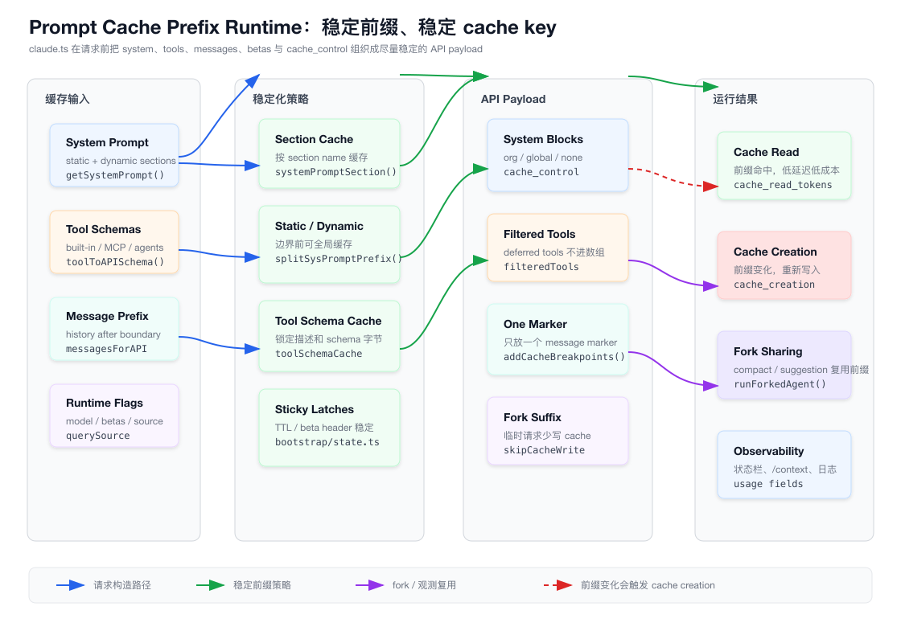
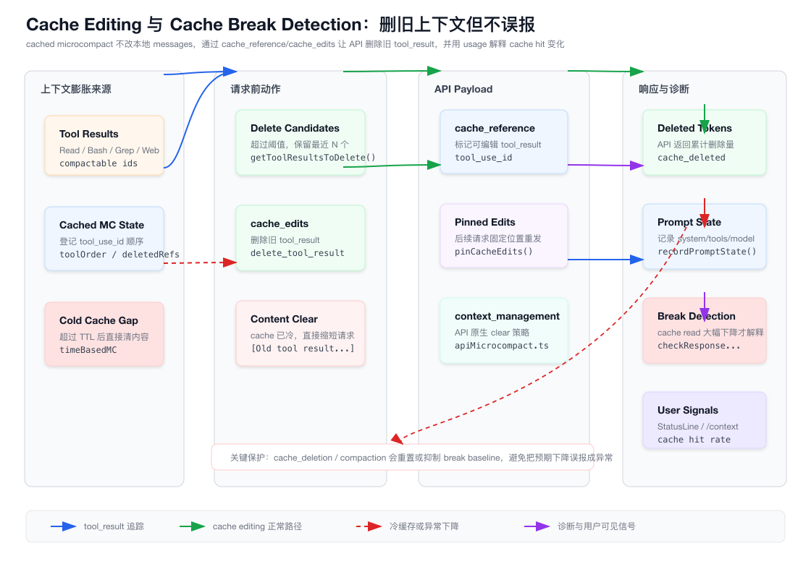

# 第 16 章：Prompt Cache、Cache Editing 与请求前缀稳定性

> 本章只分析 `claude-code/` 子目录下的实现。所有源码路径都以 `claude-code/` 为根，文档与图表落在 `tech-docs/new/`。

上一章讲的是上下文预算、Token、压缩与成本控制 Runtime。

那一章回答的是：

```text
上下文太大怎么办？
什么时候 compact？
tool_result 怎么落盘或裁剪？
usage 怎么变成成本和状态栏数据？
```

这一章继续拆一个更细但极其关键的问题：

```text
为什么同样 100k token 的上下文，有时很快很便宜，有时却像第一次请求一样慢又贵？
```

答案是 Prompt Cache。

在 Coding Agent 里，Prompt Cache 不是一个“优化小功能”。

它是长会话能不能工业化运行的基础设施。

Claude Code 每轮请求都会携带大量稳定前缀：

- system prompt。
- 工具 schema。
- CLAUDE.md / memory / user context。
- 历史 messages。
- 最近读过的文件、plan、skills、MCP instructions。

如果这些前缀每轮都重新写入缓存，成本和延迟都会快速放大。

真正难的是：Coding Agent 又不是静态 prompt。

它每轮都可能变化：

- 工具列表变了。
- MCP reconnect 了。
- beta header 变了。
- fast mode 或 auto mode toggled。
- overage 状态变了。
- output style 变了。
- system prompt 某个 section 动态刷新。
- tool_result 越积越多，需要删旧内容。

所以本章的核心不是“如何打开 prompt caching”，而是：

> 如何让一个高度动态的 Agent Runtime 仍然产生稳定、可复用、可诊断的 API 请求前缀。

## 16.1 源码入口总览

Prompt Cache 相关逻辑横跨 API 参数构造、system prompt、tool schema、microcompact、forked agent 和 UI 可观测。

核心文件如下：

| 模块 | 职责 |
| --- | --- |
| `src/services/api/claude.ts` | `cache_control`、message cache marker、cached microcompact body、usage 采集 |
| `src/utils/api.ts` | tool schema 渲染缓存、system prompt 静态/动态切分、cache scope 分块 |
| `src/utils/betas.ts` | first-party beta、global cache scope、prompt caching scope header |
| `src/constants/systemPromptSections.ts` | system prompt section memoize、危险动态 section、清理 beta latches |
| `src/context.ts` | `getSystemContext()`、`getUserContext()` 会话级 memoize 和 cache breaker injection |
| `src/utils/toolSchemaCache.ts` | 会话级 tool schema 字节稳定化 |
| `src/services/compact/microCompact.ts` | time-based microcompact、cached microcompact 调度 |
| `src/services/compact/cachedMicrocompact.ts` | cached microcompact 状态机和 `cache_edits` block 生成 |
| `src/services/compact/apiMicrocompact.ts` | API 原生 `context_management` 清理策略 |
| `src/services/api/promptCacheBreakDetection.ts` | cache break 两阶段检测、原因解释、diff 写入 |
| `src/utils/cacheWarning.ts` | cache hit rate 低于阈值时生成 warning message |
| `src/utils/cacheStats.ts` | 状态栏 cache hit rate、TTL 倒计时状态文件 |
| `src/utils/cacheStatsState.ts` | cache stats 内存单例和持久化 |
| `src/components/StatusLine.tsx` | CachePill、context/cost/rate limit statusline 输入 |
| `src/components/ContextVisualization.tsx` | `/context` 中展示 cache hit rate |
| `src/utils/forkedAgent.ts` | forked agent 复用父请求 cache-safe 参数 |
| `src/services/compact/compact.ts` | compact summary 优先走 forked agent 复用主线程 prompt cache |
| `src/services/AgentSummary/agentSummary.ts` | agent progress summary 复用 prompt cache |
| `src/services/PromptSuggestion/promptSuggestion.ts` | prompt suggestion 的 cache-safe fork |
| `src/utils/sideQuestion.ts` | side question 不破坏主线程缓存的 fork 策略 |

本章两张图先建立全局地图。

第一张图展示 Claude Code 如何构造稳定的请求前缀：



第二张图展示 cached microcompact、cache editing 和 cache break detection 如何配合：



## 16.2 Prompt Cache 缓存的不是“语义”，而是请求前缀

前端工程师很容易把 Prompt Cache 类比成：

```text
React Query cache
SWR cache
HTTP cache
CDN cache
```

这个类比只能对一半。

Prompt Cache 更接近：

```text
V8 hidden class / webpack chunk hash / CDN immutable asset hash
```

它缓存的是模型服务端已经处理过的一段请求前缀。

所以它关心的不是：

```text
这段 prompt 语义上差不多
```

而是：

```text
这段 API payload 在 cache key 相关字段上是否稳定
```

只要 key 相关内容发生变化，就可能从：

```text
cache_read_input_tokens 很高
```

变成：

```text
cache_creation_input_tokens 很高
```

对用户来说，表现就是：

- 请求变慢。
- 成本上升。
- 状态栏 cache hit 下降。
- `/context` 里 cache hit rate 变低。

对 Claude Code 来说，这意味着所有动态能力都要围绕一个约束设计：

```text
不要无意义改变请求前缀。
```

## 16.3 cache_control 是提示服务端哪里可以缓存

`src/services/api/claude.ts` 里的 `getCacheControl()` 返回：

```ts
{
  type: 'ephemeral',
  ttl?: '1h',
  scope?: 'global',
}
```

核心字段是：

| 字段 | 含义 |
| --- | --- |
| `type: 'ephemeral'` | 使用临时 prompt cache |
| `ttl: '1h'` | 满足条件时使用 1 小时 TTL |
| `scope: 'global'` | first-party 全局 scope，复用更大范围的稳定系统前缀 |

是否启用 prompt caching 由 `getPromptCachingEnabled(model)` 决定。

它支持这些 kill switch：

```text
DISABLE_PROMPT_CACHING
DISABLE_PROMPT_CACHING_HAIKU
DISABLE_PROMPT_CACHING_SONNET
DISABLE_PROMPT_CACHING_OPUS
```

这说明 Claude Code 把 prompt cache 当成运行时能力，而不是硬编码行为。

不同模型、不同 Provider、不同调试场景都可能需要关掉缓存。

## 16.4 1 小时 TTL 需要会话级 latch

`should1hCacheTTL(querySource)` 的逻辑很谨慎。

它不是简单地说“用户符合条件就用 1h TTL”。

它会先处理 Bedrock 特例：

```text
getAPIProvider() === 'bedrock'
  && ENABLE_PROMPT_CACHING_1H_BEDROCK
```

然后对 first-party / subscriber 路径做两层 session-stable 缓存：

```text
promptCache1hEligible
promptCache1hAllowlist
```

这些状态放在 `src/bootstrap/state.ts`。

原因是：中途变更 TTL 本身会破坏 cache key。

例如用户会话进行到一半，overage 状态变了，如果 TTL 从 1h 变回默认，服务端看到的是不同 `cache_control`，前缀可能重新写入。

所以代码把 eligibility latch 在会话里：

```text
第一次判断是什么，后续保持稳定。
```

这是一种典型的 Agent Runtime 取舍：

> 宁愿短时间内不追逐最新策略，也要保持长会话的请求前缀稳定。

## 16.5 global cache scope 只在 first-party 路径启用

`src/utils/betas.ts` 里的 `shouldUseGlobalCacheScope()` 条件很窄：

```text
getAPIProvider() === 'firstParty'
  && !CLAUDE_CODE_DISABLE_EXPERIMENTAL_BETAS
```

Foundry 被明确排除。

Bedrock、Vertex、OpenAI、Gemini、Grok 也不会走这套 global scope。

这点很重要。

Prompt Cache 的一些高级能力不是跨 Provider 的通用抽象。

Claude Code 在设计上分成两层：

| 层 | 能力 |
| --- | --- |
| 标准 prompt cache | 通过 `cache_control: { type: 'ephemeral' }` 标记可缓存块 |
| first-party 扩展 | global scope、1h TTL、cache editing、context management 等 |

如果你从 0 实现一个多 Provider Agent，不应该把 first-party 的缓存语义强行套到所有模型服务。

更稳妥的做法是：

```text
内部统一表示缓存意图
  -> Provider adapter 决定哪些字段能发送
  -> 不支持的 Provider 降级为普通请求
```

## 16.6 system prompt 被切成 cache scope block

`src/utils/api.ts` 的 `splitSysPromptPrefix()` 是本章最关键的函数之一。

它把 system prompt 切成多个 block，并给每个 block 标注 cache scope。

默认路径大致是：

```text
attribution header     -> cacheScope = null
CLI system prefix      -> cacheScope = org
其他 system prompt      -> cacheScope = org
```

first-party global cache 开启且存在 dynamic boundary 时，变成：

```text
attribution header        -> null
system prompt prefix      -> null
boundary 前 static content -> global
boundary 后 dynamic content -> null
```

如果有 MCP tools，`skipGlobalCacheForSystemPrompt=true`，则回退到 org-level caching。

原因是 MCP tools 是 per-user、per-workspace、per-server 的动态能力。

把它们影响到的系统前缀放进 global cache，既不安全，也容易造成错误复用。

## 16.7 dynamic boundary 是缓存稳定性的分水岭

`src/constants/prompts.ts` 中有一个非常醒目的注释：

```text
BOUNDARY MARKER - DO NOT MOVE OR REMOVE
```

它对应 `SYSTEM_PROMPT_DYNAMIC_BOUNDARY`。

这个 boundary 之前是静态内容，之后是 session-specific guidance。

为什么要这么做？

因为 session-specific guidance 可能受到很多运行时 bit 影响：

- 某个 tool 是否启用。
- skill search 是否启用。
- AgentTool 是否存在。
- AskUserQuestionTool 是否存在。
- search tools 用的是哪组工具。

如果这些条件放在 global cache prefix 里，变体数量会指数级膨胀。

源码注释直接指出这类问题：

```text
2^N variants
```

这就是前端里常见的“缓存 key 维度爆炸”。

一个 CDN URL 如果把用户态、实验态、设备态、权限态都拼进去，就几乎没有命中。

Prompt Cache 也是一样。

## 16.8 systemPromptSection 默认会话级缓存

`src/constants/systemPromptSections.ts` 提供两个构造函数：

```ts
systemPromptSection(name, compute)
DANGEROUS_uncachedSystemPromptSection(name, compute, reason)
```

默认 section 会通过 `getSystemPromptSectionCache()` 缓存。

也就是说，一个 section 在会话里计算一次，后面复用同一份文本。

只有明确使用 `DANGEROUS_uncachedSystemPromptSection()`，才会每轮 recompute。

这个名字取得很直接：

```text
DANGEROUS
```

因为 volatile section 一旦输出变化，就会破坏 prompt cache。

源码要求传入 reason，目的不是类型需要，而是工程治理需要：

```text
你必须解释为什么这个 section 值得破坏缓存。
```

`clearSystemPromptSections()` 会在 `/clear` 和 `/compact` 场景清掉 section cache，同时重置 beta header latches。

这等于声明了一个边界：

```text
清会话或 compact 后，可以重新评估缓存前缀。
普通 turn 中，不要随便变。
```

## 16.9 getSystemContext 和 getUserContext 也被 memoize

`src/context.ts` 里的 `getSystemContext()` 和 `getUserContext()` 都用了 memoize。

注释写得很明确：

```text
This context is prepended to each conversation, and cached for the duration of the conversation.
```

`getSystemContext()` 会取：

- git status。
- cache breaker injection。

`getUserContext()` 会取：

- CLAUDE.md。
- 当前日期。

这些内容如果每轮都重新读取和重排，就会让请求前缀频繁变化。

所以 Claude Code 把它们视为会话启动时的上下文快照。

注意这里不是说“git status 永远准确”。

源码里的 git status 文本本身也说这是 conversation start snapshot。

这又是一个典型取舍：

```text
准确反映每一秒的工作区变化
  vs
保持 prompt cache prefix 稳定
```

Claude Code 在 system/user context 层选择了稳定。

实时变化应该通过工具读取，而不是每轮刷新 system context。

## 16.10 cache breaker 是故意破坏缓存的调试工具

`context.ts` 里还有：

```ts
setSystemPromptInjection(value)
```

它会设置：

```text
[CACHE_BREAKER: ...]
```

并清空 `getUserContext.cache` 和 `getSystemContext.cache`。

这不是普通业务逻辑，而是 ant-only 的 cache breaking 调试状态。

它的存在说明两点：

第一，有些问题必须通过强制改变前缀来验证。

第二，破坏缓存应该是显式动作，而不是顺手改一段 dynamic prompt。

工程上要把“故意 bust cache”和“无意 bust cache”分开。

## 16.11 tool schema 是最容易被忽略的 cache key

很多人只盯着 messages。

但在 Claude Code 里，工具 schema 同样是大块稳定前缀。

`src/utils/toolSchemaCache.ts` 的注释说得很清楚：

```text
Tool schemas render at server position 2,
so any byte-level change busts the entire tool block AND everything downstream.
```

工具 schema 的变化来源很多：

- GrowthBook gate 变化。
- strict tool use 开关变化。
- fine-grained tool streaming 开关变化。
- MCP reconnect。
- tool.prompt() 中有动态内容。
- AgentTool / SkillTool 嵌入动态 agent/command 列表。

所以 `toolToAPISchema()` 不会每次都从头渲染。

它把基础 schema 放进 `toolSchemaCache`：

```text
name
description
input_schema
strict
eager_input_streaming
```

然后每次请求只叠加 per-request overlay：

```text
defer_loading
cache_control
```

这和前端里 memoize expensive component props 很像。

基础结构稳定，少量请求态字段单独处理。

## 16.12 tool schema cache key 不能只用 tool.name

`toolToAPISchema()` 的 cache key 有一个重要细节。

如果工具带 `inputJSONSchema`，cache key 会包含 schema JSON：

```text
tool.name + jsonStringify(inputJSONSchema)
```

原因是有些 workflow tool 可能共享同一个 name，但每次调用带不同 structured output schema。

如果只用 name 缓存，会拿到旧 schema。

源码注释提到过这种 bug 会显著提升错误率。

这是一类经典缓存问题：

```text
为了稳定 cache key，不能欠包含真实变体；
为了提高命中率，也不能过包含无关运行态。
```

好的 cache key 设计不是越短越好，而是刚好覆盖语义差异。

## 16.13 deferred tools 让工具数组更稳定

`src/services/api/claude.ts` 在构造工具列表时，会处理 `filteredTools`。

当 self-built tool search 开启时：

- 核心工具始终保留。
- `SearchExtraToolsTool` 始终保留。
- 其他 deferred tools 不直接进入 API tools 数组。

这样做的目的不是让模型“不知道”这些工具。

源码注释说明：

```text
SearchExtraToolsTool 的 prompt 可以列出所有可用 MCP tools。
真正 API tools 数组只保留稳定核心工具。
```

模型需要更多工具时，通过 `ExecuteExtraTool` 按需调用。

这让工具 schema 大块前缀更稳定。

如果每次 MCP reconnect、工具发现、插件状态变化都把完整 tools JSON 改一遍，prompt cache 命中会很差。

## 16.14 advisor tool 被追加在缓存标记之后

`claude.ts` 对 advisor server tool 有一个细节：

```text
extraToolSchemas.push(advisor)
```

并且注释说明：

```text
Appended after toolSchemas (which carries the cache_control marker)
so toggling /advisor only churns the small suffix, not the cached prefix.
```

这就是缓存前缀设计。

不是所有动态内容都必须禁止。

关键是让动态内容尽量出现在缓存前缀之后。

前端构建里也有类似原则：

```text
把稳定 vendor chunk 和变化频繁的 app chunk 拆开。
```

Prompt Cache 里也是：

```text
稳定 system/tools 前缀先缓存；
动态 advisor 或本轮消息尽量放在后缀。
```

## 16.15 addCacheBreakpoints 只放一个 message-level marker

`claude.ts` 的 `addCacheBreakpoints()` 负责给 messages 加 cache marker。

它的注释非常关键：

```text
Exactly one message-level cache_control marker per request.
```

普通请求：

```text
markerIndex = messages.length - 1
```

也就是最后一条消息。

fire-and-forget fork 或 `skipCacheWrite` 场景：

```text
markerIndex = messages.length - 2
```

也就是倒数第二条消息。

为什么？

因为 forked agent 的临时 suffix 没必要写入服务端 cache。

例如 prompt suggestion、side question、compact summary fork，它们只是临时问一个问题，不会有后续请求从这个 suffix 继续。

如果也写 cache，会污染缓存、占用服务端资源，并可能影响主线程前缀。

所以 `skipCacheWrite` 不是“不使用 cache”。

更准确地说是：

```text
复用共享前缀，但不把临时尾巴写成新的 cache entry。
```

## 16.16 assistant message 的 cache marker 会避开 thinking

`assistantMessageToMessageParam()` 在给 assistant message 添加 cache marker 时，会避开：

- `thinking`。
- `redacted_thinking`。
- connector text block。

它只在合适的最后一个 content block 上加 `cache_control`。

这不是 UI 细节，而是 API payload 合法性和缓存语义问题。

thinking block 有自己的模型内部语义，不能随意作为缓存 marker 承载块。

这说明 cache marker 的位置不是“随便找最后一个 block”。

它必须理解 message content 的 block 类型。

## 16.17 message content 要 clone，避免 cache_edits 污染原始消息

`userMessageToMessageParam()` 里有一个注释：

```text
Clone array content to prevent in-place mutations
```

原因是 `addCacheBreakpoints()` 后续可能会插入 `cache_edits` block。

如果不 clone，API 参数构造对 content array 的修改会污染原始 message。

然后下一次调用 `addCacheBreakpoints()` 时，就可能重复 splice 同一批 `cache_edits`。

这个 bug 很典型：

```text
为了构造请求临时改了对象
  -> 对象其实是会话状态的一部分
  -> 下一轮请求看到被污染的状态
```

Prompt Cache 系统尤其怕这种 bug，因为它会让前缀在每轮无意义变化。

## 16.18 beta header 也会破坏 cache key

很多人以为 prompt cache 只看 prompt 文本。

但源码里明确把 beta header 作为 cache break detection 的一部分。

`claude.ts` 对动态 beta header 做 sticky-on latch：

- AFK mode header。
- fast mode header。
- cache editing header。

这些 latch 存在 `bootstrap/state.ts`。

设计原则是：

```text
一旦本会话发送过某个动态 header，后续继续发送。
```

否则用户 Shift+Tab 切换 auto mode、fast mode 进入或退出 cooldown、cached microcompact 开关变化，都可能改变 cache key。

源码注释里直接写了这些 toggle 会 bust 大约几十 K token 的 prompt cache。

这说明请求参数也属于“prompt prefix”。

从缓存视角看：

```text
system/tools/messages/model/thinking/betas/extra body 都可能是 key 的一部分。
```

## 16.19 effort 和 extra body 也被纳入 break detection

`promptCacheBreakDetection.ts` 的 `PromptStateSnapshot` 包含：

- model。
- fastMode。
- globalCacheStrategy。
- betas。
- autoModeActive。
- isUsingOverage。
- cachedMCEnabled。
- effortValue。
- extraBodyParams。

这说明 Claude Code 的经验是：

```text
导致 cache miss 的不只是 prompt 文本。
```

`CLAUDE_CODE_EXTRA_BODY` 这种用户注入参数也会改变请求形态。

如果 break detection 只比较 system prompt hash，就会误判很多问题为“unknown cause”。

## 16.20 forked agent 复用 cache 的核心是“不要改变 API key params”

`src/utils/forkedAgent.ts` 接收 `cacheSafeParams`：

```text
systemPrompt
userContext
systemContext
toolUseContext
forkContextMessages
```

forked agent 会把父上下文消息作为 prefix，再追加自己的 prompt message。

这让很多后台任务可以复用主线程 prompt cache：

- compact summary。
- prompt suggestion。
- side question。
- agent progress summary。
- recap。

但复用有一个硬约束：

```text
fork 请求不能随便改 API 参数。
```

`PromptSuggestion` 的注释非常直白：

```text
不要设置 effortValue。
不要设置 maxOutputTokens。
不要改 tools/thinking。
```

否则 fork 虽然语义上只是“问个小问题”，但 API cache key 变了，服务端不能复用父前缀。

这就是为什么很多 forked agent “不用工具”时，也不是传 `tools: []`。

它们会保留同样的 tools array，然后通过 `canUseTool` 回调在客户端 deny tool use。

从 cache 角度看：

```text
保留 tools array = 复用 key；
客户端 deny = 行为上不让它真用工具。
```

## 16.21 compact summary 也优先走 cache sharing

第 15 章讲过 compact。

从本章视角看，`src/services/compact/compact.ts` 的重要点是：

```text
streamCompactSummary() 优先用 runForkedAgent()
```

源码注释说明：

```text
forked-agent path reuses main conversation's prompt cache
```

它还特意不设置 `maxOutputTokens`。

原因是 max output token 会影响 thinking budget clamp，从而造成 thinking config mismatch，破坏 cache key。

fallback streaming path 可以设置 compact 的输出上限，因为 fallback 不再尝试共享主线程 cache。

这说明 compact 的成本优化不是“少发点内容”这么简单。

真正的优化是：

```text
summary 请求复用主线程已经缓存的 system/tools/messages prefix。
```

源码注释提到，禁用这条路径会带来非常高的 cache miss。

## 16.22 cached microcompact 不改本地 messages

第 15 章提到 microcompact。

这一章要更细看 cached microcompact。

`src/services/compact/microCompact.ts` 的 cached path 明确说：

```text
Does NOT modify local message content.
cache_reference and cache_edits are added at API layer.
```

它的流程是：

```text
收集 compactable tool_use_id
  -> registerToolResult()
  -> getToolResultsToDelete()
  -> createCacheEditsBlock()
  -> pendingCacheEdits
  -> 下一次 API payload 插入 cache_edits
```

本地 transcript 仍然保留原始 messages。

服务端 cache 里则通过 cache editing 删除旧 tool_result。

这比直接把历史消息改成 `[Old tool result content cleared]` 更适合热缓存场景。

因为本地 prompt bytes 不需要重写，cache editing 语义告诉 API：

```text
请在已缓存前缀里删除这些 tool result。
```

## 16.23 cached microcompact 的触发条件很窄

`microcompactMessages()` 里 cached microcompact 需要：

- feature `CACHED_MICROCOMPACT` 编译存在。
- `isCachedMicrocompactEnabled()` 返回 true。
- 模型支持 cache editing。
- querySource 是主线程。

`cachedMicrocompact.ts` 里：

```ts
isCachedMicrocompactEnabled()
```

当前看的是：

```text
CLAUDE_CACHED_MICROCOMPACT === '1'
```

模型支持判断是：

```text
claude-[a-z]+-4[-\d]
```

`claude.ts` 里还有更严格的一层：

- first-party。
- querySource 是 `repl_main_thread`。
- cache editing beta header 非空。

当前源码还注释说，在这个 fork 里 `CACHE_EDITING_BETA_HEADER` 可能是空字符串；没有 header 时不会启用，因为请求体里的 `cache_reference` / `cache_edits` 可能被 API 拒绝。

所以教程里要把它讲成：

```text
已接入的实验能力和架构插槽
```

而不是所有构建里默认可用的稳定能力。

## 16.24 cached microcompact 的状态机

`src/services/compact/cachedMicrocompact.ts` 的状态很小：

```ts
type CachedMCState = {
  registeredTools: Set<string>
  toolOrder: string[]
  deletedRefs: Set<string>
  pinnedEdits: PinnedCacheEdits[]
  toolsSentToAPI: boolean
}
```

默认配置：

```text
TRIGGER_THRESHOLD = 10
KEEP_RECENT = 5
```

当 active tool result 数量超过阈值：

```text
删除最老的一批
保留最近 5 个
已经删除过的不再重复删除
```

这和普通 LRU 很像，但它不是删除本地内存对象，而是生成一个服务端 cache edit 指令。

`pinnedEdits` 也很关键。

已发送过的 edit block 会被固定在原来的 user message 位置，后续请求继续重发。

这保证服务端看到的是稳定的编辑历史，而不是每轮把 edit block 移到不同位置。

## 16.25 cache_reference 必须位于 cache_control 之前

`addCacheBreakpoints()` 在 cached microcompact 路径里会做两件事。

第一，把 pending 和 pinned 的 `cache_edits` 插入 user message。

第二，给位于最后一个 `cache_control` 之前的 `tool_result` 增加 `cache_reference`。

源码注释说明：

```text
The API requires cache_reference to appear before or on the last cache_control.
```

实现选择更保守：

```text
strictly before last cache_control
```

这样可以避开 splicing 后 block index 变化造成的边界问题。

这说明 cache editing 不只是“发一个删除 id”。

它要求 API payload 里：

- 哪些 tool_result 可引用。
- 哪些 edit 删除哪些 reference。
- edit block 出现在哪个位置。
- cache marker 在哪里。

这些位置关系都要稳定。

## 16.26 当前源码里 cache_edits 类型有实验痕迹

这里要指出一个源码细节。

`cachedMicrocompact.ts` 生成的 `CacheEditsBlock` 形态是：

```ts
{
  type: 'cache_edits',
  edits: [{ type: 'delete_tool_result', tool_use_id }]
}
```

而 `claude.ts` 里 `addCacheBreakpoints()` 的本地类型写的是：

```ts
{
  type: 'cache_edits',
  edits: [{ type: 'delete', cache_reference }]
}
```

调用处使用了 `as any` 穿透。

同时，`claude.ts` 又会在 beta header 不可用时禁用 cached MC，避免 API 400。

这说明这段代码处在实验接口或上游能力未完全公开的接入状态。

如果你从 0 实现，不要直接照抄这个 any 形态。

更好的做法是：

```ts
type CacheEditDeleteToolResult = {
  type: 'delete_tool_result'
  tool_use_id: string
}

type CacheEditDeleteReference = {
  type: 'delete'
  cache_reference: string
}

type CacheEditsBlock =
  | { type: 'cache_edits'; edits: CacheEditDeleteToolResult[] }
  | { type: 'cache_edits'; edits: CacheEditDeleteReference[] }
```

然后由 Provider adapter 明确选择真实 API 需要的形态。

这属于 Claude Code 源码里很有价值的妥协设计：架构插槽已经在，但接口形态还有历史包袱。

## 16.27 time-based microcompact 适合冷缓存

cached microcompact 假设服务端 cache 仍然是热的。

如果距离上次 assistant message 已经超过 TTL，cache 大概率冷了。

这时再用 cache editing 没有意义。

`src/services/compact/timeBasedMCConfig.ts` 的注释说明：

```text
server-side prompt cache has almost certainly expired,
so the full prefix will be rewritten anyway.
```

所以 time-based microcompact 先运行，并且 short-circuit cached microcompact。

它会：

```text
保留最近 N 个 compactable tool results
旧的 tool_result content 替换成 [Old tool result content cleared]
reset cached MC state
notifyCacheDeletion()
```

这条路径会改变本地 messages。

但因为 cache 已经冷了，下一次请求本来就要重写前缀。

此时提前缩短 prompt，比维护旧前缀更重要。

## 16.28 API context_management 是另一层清理

`src/services/compact/apiMicrocompact.ts` 生成 API 原生 `context_management`。

它不是本地 messages 变换，也不是 cached microcompact 的 `cache_edits`。

它是随请求发送给 API 的上下文管理策略。

默认策略里有：

```text
clear_tool_uses_20250919
clear_thinking_20251015
```

默认阈值：

```text
API_MAX_INPUT_TOKENS = 180_000
API_TARGET_INPUT_TOKENS = 40_000
```

可以通过环境变量覆盖：

```text
USE_API_CLEAR_TOOL_RESULTS
USE_API_CLEAR_TOOL_USES
API_MAX_INPUT_TOKENS
API_TARGET_INPUT_TOKENS
```

这说明 Claude Code 同时有三类清理：

| 清理 | 位置 | 适用场景 |
| --- | --- | --- |
| 本地 content clear | 客户端改 messages | cache 冷了，重写前缀前先缩短 |
| cache editing | API payload edit block | cache 热，删除旧 tool_result 不破坏前缀 |
| context_management | API 原生策略 | 让服务端按 input token 策略清理 tool/thinking |

这三类机制目标相近，但层级不同。

## 16.29 prompt cache break detection 是两阶段

`src/services/api/promptCacheBreakDetection.ts` 分成两阶段。

第一阶段，pre-call：

```text
recordPromptState(snapshot)
```

它记录当前请求可能影响 cache key 的字段：

- system hash。
- tools hash。
- cache_control hash。
- per-tool hash。
- model。
- fast mode。
- global cache strategy。
- betas。
- auto mode。
- overage。
- cached microcompact。
- effort。
- extra body。

第二阶段，post-call：

```text
checkResponseForCacheBreak(...)
```

它拿 API response 的：

```text
cache_read_input_tokens
cache_creation_input_tokens
```

和上一次 response 比较。

只有 cache read 明显下降时，才结合 pending changes 解释原因。

这比“请求前发现字段变化就报警”更准确。

因为字段变化不一定造成实际 cache miss。

反过来，没有字段变化也可能因为服务端路由、TTL、eviction 造成 cache read 下降。

## 16.30 break detection 有最小阈值和 TTL 判断

cache break 检测不会对小波动报警。

它要求：

```text
cache read 下降超过 5%
并且绝对下降超过 2000 tokens
```

源码常量：

```text
MIN_CACHE_MISS_TOKENS = 2_000
CACHE_TTL_5MIN_MS = 5 * 60 * 1000
CACHE_TTL_1HOUR_MS = 60 * 60 * 1000
```

如果没有明显客户端变化，它会根据距离上次 assistant message 的时间解释为：

- possible 1h TTL expiry。
- possible 5min TTL expiry。
- likely server-side。
- unknown cause。

这很工程化。

它没有把所有 cache miss 都归因给 Claude Code 客户端。

当 prompt unchanged 且间隔小于 TTL，仍然可能是服务端路由或缓存淘汰。

## 16.31 break detection 会保护隐私

`promptCacheBreakDetection.ts` 会记录 tool names、diffable content，并在 debug 时写 diff 文件。

但它对 MCP tool name 做了 sanitize：

```text
mcp__xxx -> mcp
```

原因是 MCP tool name 来自用户配置，可能泄漏路径或私有服务名。

内置工具名是固定词表，所以可以记录。

这体现了诊断系统的边界：

```text
要能解释问题，但不能把用户私有路径、服务名、配置泄漏进 analytics。
```

## 16.32 notifyCacheDeletion 和 notifyCompaction 防误报

cache read token 下降不一定是坏事。

两类下降是预期行为：

| 场景 | 处理 |
| --- | --- |
| cached microcompact 删除旧 tool_result | `notifyCacheDeletion()` |
| compact 后消息数合法减少 | `notifyCompaction()` |

`notifyCacheDeletion()` 会设置：

```text
cacheDeletionsPending = true
```

下一次 response 如果 cache read 降低，检测器会认为这是预期下降，并重置状态。

`notifyCompaction()` 则会把 `prevCacheReadTokens` 设为 null。

因为 compact 后上下文形态已经变了，不能继续拿 compact 前的 cache read 当 baseline。

这就是为什么第 15 章的 compact 和本章的 cache break detection 必须互相通知。

否则系统会把自己主动清理上下文的行为误报成 cache break。

## 16.33 cache warning 是用户可见的低命中率提示

`src/utils/cacheWarning.ts` 计算 cache hit rate：

```text
cache_read_input_tokens
/
(input_tokens + cache_creation_input_tokens + cache_read_input_tokens)
```

如果没有 cache 字段，或者 cache read / creation 都为 0，返回 null。

它还有几个保护：

- 每个 querySource 单独跟踪。
- 最多跟踪 50 个 source，防止 Map 无限增长。
- 首次请求不警告。
- 阈值来自 settings，默认 80。

如果 hit rate 低于阈值，生成 system message：

```text
subtype: cache_warning
level: warning
```

这和 break detection 不同。

| 机制 | 面向谁 | 目标 |
| --- | --- | --- |
| break detection | 开发者和 telemetry | 解释为什么 cache read 掉了 |
| cache warning | 用户和 transcript | 告知当前 cache 命中率低 |

一个偏诊断，一个偏产品体验。

## 16.34 StatusLine 的 CachePill 是轻量可观测

`src/components/StatusLine.tsx` 有一个 `CachePill`。

它显示：

```text
Cache hit rate
1h TTL countdown
```

数据来自：

- `getCurrentUsage(messages)`。
- `computeHitRate()`。
- `cacheStatsState.onResponse()`。
- session id 对应的本地状态文件。

`src/utils/cacheStats.ts` 会把 session id hash 成短文件名：

```text
~/.claude/cache-stats/<hash>.json
```

这样做的目的：

- 不把 raw session id 写进文件名。
- session 之间不冲突。
- 重启后仍能显示最近一次 cache 状态。

TTL 倒计时不是 API 真实服务端状态查询，而是基于最近 response signature 变化时刻的本地近似。

它是 UI 指示器，不是强一致协议。

## 16.35 /context 也展示 cache hit rate

`src/components/ContextVisualization.tsx` 会在 `cacheHitRate` 和 `cacheThreshold` 存在时展示：

```text
Cache hit rate: XX%
```

如果低于阈值，会用 warning 颜色。

`/context` 的价值在于它把 cache hit rate 和上下文分类放在一起。

当 cache hit 变低时，你可以同时看到：

- tool results 是否过大。
- MCP tools 是否加载过多。
- skills 是否注入变化。
- system prompt sections 是否增加。
- messages 占比是否异常。

这比单独看状态栏更适合排查。

## 16.36 prompt cache 稳定性和第 15 章预算系统互相制约

第 15 章说过：

```text
上下文太大，需要裁剪和 compact。
```

本章补充另一半：

```text
裁剪方式如果不稳定，会破坏 prompt cache。
```

例如，大 tool_result 替换 preview 时，`ContentReplacementState` 会固定替换决策，避免同一段历史每轮生成不同 preview。

cached microcompact 不直接改本地 messages，是为了在热缓存场景中避免重写前缀。

time-based microcompact 只在 cache 大概率冷了之后做本地 content clear。

compact 后调用 `notifyCompaction()`，避免把合法下降误报成 break。

所以预算系统和缓存系统的关系是：

```text
预算系统负责让上下文可发送；
缓存系统负责让可发送上下文尽量稳定。
```

只做前者，成本会高。

只做后者，上下文会爆。

## 16.37 从 0 实现：最小 Prompt Cache Runtime

如果你自己实现一个 Coding Agent，可以先做最小版。

第一步，给 system prompt 和最后一条 message 加缓存标记：

```ts
type CacheControl = {
  type: 'ephemeral'
  ttl?: '1h'
}

function cacheControl(): CacheControl {
  return { type: 'ephemeral' }
}

function markLastMessage(messages: MessageParam[]): MessageParam[] {
  const copy = messages.map(m => ({
    ...m,
    content: Array.isArray(m.content) ? [...m.content] : m.content,
  }))

  const last = copy[copy.length - 1]
  if (!last || typeof last.content === 'string') return copy

  const blocks = [...last.content]
  const lastBlock = blocks[blocks.length - 1]
  blocks[blocks.length - 1] = {
    ...lastBlock,
    cache_control: cacheControl(),
  }
  last.content = blocks
  return copy
}
```

第二步，缓存 system prompt section：

```ts
const sectionCache = new Map<string, string | null>()

async function section(name: string, compute: () => Promise<string | null>) {
  if (sectionCache.has(name)) return sectionCache.get(name) ?? null
  const value = await compute()
  sectionCache.set(name, value)
  return value
}
```

第三步，缓存工具 schema：

```ts
const toolSchemaCache = new Map<string, ToolSchema>()

async function renderToolSchema(tool: Tool): Promise<ToolSchema> {
  const key = tool.schema
    ? `${tool.name}:${JSON.stringify(tool.schema)}`
    : tool.name

  const cached = toolSchemaCache.get(key)
  if (cached) return cached

  const schema = {
    name: tool.name,
    description: await tool.prompt(),
    input_schema: tool.schema,
  }

  toolSchemaCache.set(key, schema)
  return schema
}
```

第四步，记录 usage：

```ts
function hitRate(usage: Usage): number | null {
  const total =
    usage.input_tokens +
    usage.cache_creation_input_tokens +
    usage.cache_read_input_tokens
  if (total === 0) return null
  return Math.round((usage.cache_read_input_tokens / total) * 100)
}
```

这个最小版已经能解决 70% 的问题：

- system prompt 不乱变。
- tools 不乱变。
- message marker 可控。
- cache hit 可观测。

先别急着做 cache editing。

那是更后面的优化层。

## 16.38 从 0 实现：cache break detector

最小 break detector 可以这样做：

```ts
type PromptSnapshot = {
  systemHash: string
  toolsHash: string
  model: string
  betas: string[]
  prevCacheRead: number | null
  pendingReason: string | null
}

function hash(value: unknown): string {
  return createHash('sha256')
    .update(JSON.stringify(value))
    .digest('hex')
}

function record(snapshot: PromptSnapshot, next: {
  system: unknown
  tools: unknown
  model: string
  betas: string[]
}) {
  const systemHash = hash(next.system)
  const toolsHash = hash(next.tools)

  const reasons: string[] = []
  if (snapshot.systemHash && snapshot.systemHash !== systemHash) {
    reasons.push('system prompt changed')
  }
  if (snapshot.toolsHash && snapshot.toolsHash !== toolsHash) {
    reasons.push('tools changed')
  }
  if (snapshot.model && snapshot.model !== next.model) {
    reasons.push('model changed')
  }

  snapshot.systemHash = systemHash
  snapshot.toolsHash = toolsHash
  snapshot.model = next.model
  snapshot.betas = next.betas
  snapshot.pendingReason = reasons.join(', ') || null
}

function check(snapshot: PromptSnapshot, usage: Usage) {
  const prev = snapshot.prevCacheRead
  snapshot.prevCacheRead = usage.cache_read_input_tokens
  if (prev === null) return null

  const drop = prev - usage.cache_read_input_tokens
  if (drop < 2_000) return null
  if (usage.cache_read_input_tokens >= prev * 0.95) return null

  return snapshot.pendingReason || 'likely server-side or TTL'
}
```

工业版再逐步补：

- per-tool schema hash。
- cache_control hash。
- TTL 判断。
- source 维度隔离。
- agentId 维度隔离。
- known deletion/compaction suppression。
- 私有工具名 sanitize。
- debug diff 文件。

Claude Code 的实现基本就是这个方向逐步演进出来的。

## 16.39 工业实践：哪些改动最容易破坏 cache

实际开发 Claude Code 类产品时，最常见的 cache break 来源有这些。

第一，system prompt 每轮带时间、随机数、实时状态。

坏例子：

```text
Current timestamp: 2026-05-25 17:31:03
```

每秒都变，缓存几乎没有意义。

更好的做法：

```text
Conversation start date: 2026-05-25
需要实时信息时，让模型调用工具读取。
```

第二，tool.prompt() 里读取动态配置。

如果工具描述每轮都包含“当前可用 X 个文件”或“当前用户状态”，tools block 会频繁变化。

更好的做法：

```text
工具 schema 稳定；
动态信息放到工具调用结果或后缀消息。
```

第三，forked agent 为了省 token 传 `tools: []`。

这看起来省，但会破坏 cache key。

Claude Code 的策略是保留 tools，客户端 deny。

第四，后台小请求设置自己的 max tokens / effort / thinking。

这会让 fork 和主线程 key 不一致。

第五，实验 header 中途开关。

需要 sticky latch，或者按会话边界重新评估。

第六，裁剪 tool_result 时每轮生成不同 preview。

需要稳定替换决策和稳定 preview。

第七，MCP tool 名称或 schema 无边界变化。

需要 deferred loading、tool search、schema cache、sanitize 和 reconnect 策略。

## 16.40 调试 prompt cache 问题的顺序

遇到 cache hit 低时，可以按这个顺序排查。

第一，看 response usage：

```text
cache_read_input_tokens
cache_creation_input_tokens
input_tokens
```

如果 cache read 为 0，先确认 Provider 是否支持 prompt cache。

第二，看 `/context`：

- cache hit rate。
- messages 是否大幅增加。
- tool results 是否异常。
- MCP tools 是否从 deferred 变 loaded。
- skills 或 system prompt section 是否变化。

第三，看 debug log 中的 prompt cache break summary。

重点看：

- model changed。
- system prompt changed。
- tools changed。
- betas changed。
- cache_control changed。
- effort changed。
- extra body params changed。

第四，看时间间隔。

如果超过 1 小时，可能只是 TTL 到期。

如果小于 5 分钟且 prompt unchanged，更可能是服务端 routing/eviction 或计量差异。

第五，看是不是自己触发了合法下降。

例如：

- cached microcompact。
- time-based microcompact。
- compact。
- snip。

这类下降不应该当作 bug。

第六，看 forked agent 是否改了参数。

检查是否传了：

- `tools: []`。
- 自定义 `effortValue`。
- 自定义 `maxOutputTokens`。
- 不同 thinking config。
- 不同 system prompt。

这些都会让 cache sharing 失效。

## 16.41 测试应该覆盖什么

Prompt Cache 系统很容易出现跨轮 bug。

建议重点测这些行为：

| 行为 | 测试重点 |
| --- | --- |
| `splitSysPromptPrefix()` | global/org/null scope 分块正确，boundary 后动态内容不进 global |
| `systemPromptSection()` | 同名 section 只计算一次，clear 后重新计算 |
| `toolSchemaCache` | tool.prompt() 不因 GB 中途变化反复改变 schema |
| `addCacheBreakpoints()` | 每次请求只有一个 message-level cache marker |
| `skipCacheWrite` | marker 放在共享前缀末端，不写临时 fork suffix |
| cache editing | `cache_reference` 只加在 cache marker 前 |
| pinned edits | edit block 后续请求位置稳定且不重复删除 |
| time-based MC | 冷缓存时清内容并 reset cached MC state |
| break detection | 小波动不报警，TTL 能解释，known deletion 不误报 |
| cache warning | 首次请求不警告，querySource 维度隔离 |
| forked agent | 保留 cache-safe params，不因 deny tool 改 tools array |

已有测试可先看：

```text
src/services/compact/__tests__/cachedMicrocompact.test.ts
src/components/__tests__/StatusLine.test.tsx
```

如果继续补测试，建议优先补 `addCacheBreakpoints()` 和 `splitSysPromptPrefix()`。

这两个函数直接决定 API payload 形态，风险最大。

## 16.42 这套设计的核心取舍

Claude Code 的 Prompt Cache 设计有几个清晰取舍。

第一，稳定性优先于实时性。

git status、CLAUDE.md、日期、system prompt section 都倾向于会话级缓存。

实时信息通过工具拿，而不是每轮刷新前缀。

第二，动态能力后置。

advisor、prompt suggestion、side question、agent summary 都尽量作为后缀或 fork suffix，复用主线程前缀。

第三，参数也要稳定。

betas、TTL、effort、extra body、thinking、tools 都可能是 cache key 的一部分。

第四，清理上下文时优先保 cache。

热缓存用 cache editing，冷缓存才本地 content clear。

第五，诊断必须区分“真实 break”和“预期下降”。

compact、cache deletion、TTL 到期、服务端路由都不能混为一谈。

第六，实验能力需要有 kill switch。

cached microcompact、global scope、context management 都有 feature gate、env gate 或 header gate。

这不是保守，而是工业系统必须能快速回滚。

## 16.43 本章小结

本章拆的是 Claude Code 的 Prompt Cache、Cache Editing 与请求前缀稳定性。

主线可以压缩成一句话：

```text
Claude Code 通过 system prompt 分块、section memoize、tool schema cache、
sticky beta/TTL latch、单一 cache marker、cache-safe fork、cached microcompact
和两阶段 break detection，把一个高度动态的 Coding Agent 请求变成尽量稳定的缓存前缀。
```

读完本章后，你应该能解释这些现象：

- 为什么 system prompt 里不能随便放实时状态。
- 为什么 tool schema 需要会话级缓存。
- 为什么 forked agent 不应该传 `tools: []`。
- 为什么 prompt suggestion 不能随便设置低 effort。
- 为什么 cache editing 比直接改 messages 更适合热缓存。
- 为什么 compact 后 cache read 下降不一定是 bug。
- 为什么状态栏能显示 cache hit rate 和 TTL 倒计时。
- 为什么当前 cached microcompact 仍带有实验接口痕迹。

下一章建议进入：

```text
Diff、Patch、Edit Tool 与文件变更应用系统
```

前面几章已经讲了模型如何请求、上下文如何组织、缓存如何稳定。

下一步就该拆 Coding Agent 最终落地代码修改的核心路径：模型输出如何变成文件 diff、patch 如何应用、Edit/Write/MultiEdit 如何保证安全，以及 Claude Code 如何把“想改代码”变成“真的改对代码”。
