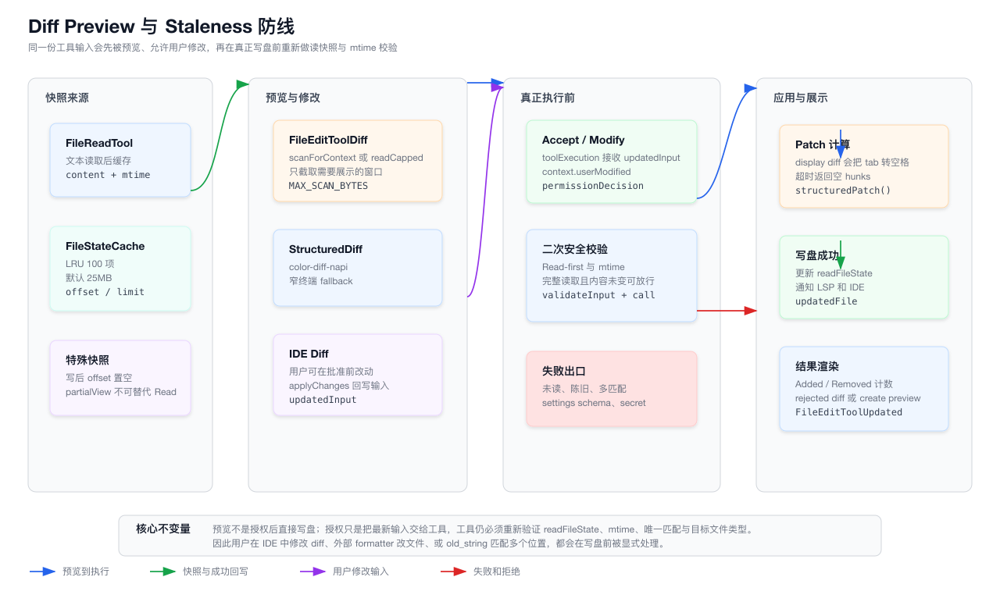

# 第 17 章：Diff、Patch、Edit Tool 与文件变更应用系统

> 本章只分析 `claude-code/` 子目录下的实现。所有源码路径都以 `claude-code/` 为根，文档与图表落在 `tech-docs/new/`。

上一章讲的是 Prompt Cache、Cache Editing 与请求前缀稳定性。

那一章回答的是：

```text
如何让一个高度动态的 Coding Agent 请求保持稳定前缀？
如何降低长会话成本和延迟？
cache editing 如何在不重写全部上下文的情况下清理旧内容？
```

这一章进入 Coding Agent 最终落地代码修改的核心路径：

```text
模型说要改文件之后，Claude Code 如何把它变成可预览、可批准、可校验、可写盘、可回显的真实文件变更？
```

这不是简单的 `fs.writeFile()`。

在 Claude Code 里，一次文件修改至少牵涉这些问题：

- 模型是否读过这个文件。
- 读到的内容是否已经陈旧。
- 用户是否批准这次修改。
- 用户是否在 IDE diff 里改过提案。
- `old_string` 是否唯一。
- 文件是不是 `.ipynb`。
- 文件是否过大。
- 是否会把 secret 写进 team memory。
- 设置文件改完后是否仍符合 schema。
- 写盘时如何避免并发 interleaving。
- 改完后如何通知 LSP、VSCode diff view、read cache、analytics、Git diff。

所以本章的主线是：

> Claude Code 把文件变更拆成“读快照、权限预览、输入校验、同步临界区写盘、副作用通知、结果回显”六个阶段，用一组不变量避免静默写错文件。

## 17.1 源码入口总览

文件变更链路主要分布在 built-in tools、权限弹窗、diff 渲染、文件状态缓存和 Git/LSP 旁路里。

核心文件如下：

| 模块 | 职责 |
| --- | --- |
| `packages/builtin-tools/src/tools/FileReadTool/FileReadTool.ts` | 读取文本、notebook、图片、PDF，并写入 `readFileState` |
| `src/utils/fileStateCache.ts` | `readFileState` 的 LRU 缓存实现，保存 content、timestamp、offset、limit |
| `packages/builtin-tools/src/tools/FileEditTool/FileEditTool.ts` | 精确字符串替换、校验、临界区写盘、结果输出 |
| `packages/builtin-tools/src/tools/FileEditTool/utils.ts` | quote/tab 归一化、替换应用、patch 生成、输入等价判断 |
| `packages/builtin-tools/src/tools/FileEditTool/prompt.ts` | Edit 工具给模型的使用规则 |
| `packages/builtin-tools/src/tools/FileWriteTool/FileWriteTool.ts` | 创建文件或整文件覆盖 |
| `packages/builtin-tools/src/tools/FileWriteTool/prompt.ts` | Write 工具给模型的使用规则 |
| `packages/builtin-tools/src/tools/NotebookEditTool/NotebookEditTool.ts` | `.ipynb` cell 级编辑 |
| `src/components/permissions/FileEditPermissionRequest/FileEditPermissionRequest.tsx` | Edit 权限弹窗入口 |
| `src/components/permissions/FileWritePermissionRequest/FileWritePermissionRequest.tsx` | Write 权限弹窗入口 |
| `src/components/permissions/FilePermissionDialog/FilePermissionDialog.tsx` | 文件权限确认、symlink 提示、IDE diff 接入 |
| `src/components/permissions/FilePermissionDialog/ideDiffConfig.ts` | 工具输入与 IDE diff edits 的转换协议 |
| `src/components/FileEditToolDiff.tsx` | Edit 权限预览 diff 的加载与裁剪 |
| `src/components/permissions/FileWritePermissionRequest/FileWriteToolDiff.tsx` | Write 权限预览 diff 或创建预览 |
| `src/components/StructuredDiff.tsx` | 结构化 diff 的终端渲染、高亮与 fallback |
| `src/components/StructuredDiffList.tsx` | 多 hunk diff 展示 |
| `src/components/FileEditToolUpdatedMessage.tsx` | 写盘成功后的 added/removed 结果展示 |
| `src/components/FileEditToolUseRejectedMessage.tsx` | 用户拒绝后的 diff 或创建预览 |
| `src/utils/diff.ts` | structured patch、行号修正、行数统计 |
| `src/utils/readEditContext.ts` | 大文件下按窗口扫描 old_string，避免为了预览读完整文件 |
| `src/utils/fileHistory.ts` | 文件 checkpoint/rewind 前置备份 |
| `src/utils/gitDiff.ts` | 工作区或单文件 Git diff 统计 |
| `src/utils/fileOperationAnalytics.ts` | 文件操作日志，路径和小内容 hash 化 |
| `src/utils/settings/validateEditTool.ts` | Claude settings 文件编辑后的 schema 保护 |
| `src/services/tools/toolExecution.ts` | 权限结果、updatedInput、userModified 到 tool.call 的桥接 |

本章两张图先建立全局地图。

第一张图展示 Edit / Write 从模型输入到写盘结果的主链路：


第二张图展示 diff 预览、用户修改和 stale 防线的关系：



## 17.2 文件修改是 Coding Agent 里风险最高的工具族

读文件失败，通常只是少了一段上下文。

Bash 命令失败，通常还能通过退出码和 stderr 解释。

文件写错，则可能造成：

- 覆盖用户未提交修改。
- 把 partial read 之外的内容误删。
- 在多处重复字符串里改错实例。
- 把 notebook 当普通 JSON 文本破坏。
- 把 line ending 改坏。
- 把无效 settings 写入配置文件。
- 在用户拒绝或未确认的情况下落盘。

所以 Claude Code 没有把文件修改做成一个“宽松写入 API”。

它在工具层、权限层、执行层都重复建立保护：

```text
模型 prompt 约束
  -> input schema
  -> permission request
  -> validateInput
  -> tool.call 临界区再次检查
  -> writeTextContent
  -> readFileState 更新
```

这里最关键的是：权限预览和真正写盘不是同一个动作。

用户看到 diff 并批准之后，工具仍会重新检查文件是否被外部改过。

这就是本章后面反复出现的设计原则：

```text
批准不等于跳过校验。
预览不等于最终文件状态。
```

## 17.3 这套系统不是一个工具，而是一组工具

Claude Code 至少有四类相关工具：

| 工具 | 入口 | 用途 |
| --- | --- | --- |
| Read | `FileReadTool.ts` | 建立文件内容快照，给模型提供上下文 |
| Edit | `FileEditTool.ts` | 对已有文本做精确字符串替换，也支持空文件/新文件的特殊创建路径 |
| Write | `FileWriteTool.ts` | 创建新文件或整文件覆盖 |
| NotebookEdit | `NotebookEditTool.ts` | 对 `.ipynb` cell 做 replace/insert/delete |

它们的职责边界很明确。

Edit 的 prompt 说：

```text
Performs exact string replacements in files.
```

Write 的 prompt 说：

```text
Prefer the Edit tool for modifying existing files.
Only use this tool to create new files or for complete rewrites.
```

NotebookEdit 单独存在，是因为 notebook 的真实编辑单位不是普通文本行，而是 cell。

本章不会把 `.ipynb` 深展开，后文只说明它为什么必须从普通 Edit 路径分离。

还有一点需要说明：这个源码快照里没有看到独立的 `MultiEditTool` 文件。

不过 Edit 相关 helper、权限弹窗和 IDE diff 协议里有 `edits: FileEdit[]` 这样的数组形态。

所以本章会把“多 edit 支撑能力”放在工具内部设施里讲，不把它描述成一个独立公开工具。

## 17.4 Read 是写入系统的前置合约

`FileEditTool/prompt.ts` 给模型的第一条关键指令是：

```text
You must use your Read tool at least once in the conversation before editing.
```

`FileWriteTool/prompt.ts` 对已有文件也有类似要求：

```text
If this is an existing file, you MUST use the Read tool first.
```

这不是 UX 建议，而是运行时合约。

Read 之后，`FileReadTool.ts` 会把当前文件内容写入 `toolUseContext.readFileState`。

缓存值大致包含：

```ts
{
  content,
  timestamp,
  offset,
  limit,
  isPartialView?
}
```

这些字段后面会被 Edit / Write 用来判断：

```text
模型上次看到的文件内容
  vs
磁盘上当前文件内容
```

如果没有这个快照，Edit/Write 就不知道模型是在什么版本上做判断。

所以已有文件的写入必须有 Read 作为“观察点”。

## 17.5 FileStateCache 是写入安全的内存账本

`src/utils/fileStateCache.ts` 定义了 `FileStateCache`。

它有几个关键属性：

| 属性 | 作用 |
| --- | --- |
| 默认 entry 数量 | `READ_FILE_STATE_CACHE_SIZE = 100` |
| 默认容量 | 25MB |
| key 处理 | 用 `normalize(key)` 做路径归一化 |
| 淘汰策略 | LRU |
| size 计算 | 按 UTF-8 byte length 计算 content |

这个缓存不是普通性能缓存。

它是写入安全账本。

Edit / Write 真正写盘前会检查：

```text
readFileState 中是否有这个路径。
磁盘 mtime 是否晚于 read timestamp。
如果晚了，完整读取内容是否仍和快照一致。
```

其中 `offset` / `limit` 也很重要。

如果模型只读取了文件片段，缓存会记录这个范围。

当磁盘 mtime 变化时，只有“完整读取且内容仍相同”的场景可以放行。

partial read 不能证明整个文件未变。

## 17.6 写后缓存会把 offset / limit 置空

Edit / Write 写盘成功后，会重新设置 `readFileState`：

```ts
readFileState.set(path, {
  content: updatedFile,
  timestamp: getFileModificationTime(path),
  offset: undefined,
  limit: undefined,
})
```

这有两个目的。

第一，下一次写入可以基于刚刚写出的完整内容继续判断 stale。

第二，避免后续 Read 的 dedup 命中旧的片段视图。

`FileReadTool.ts` 有一个优化：如果同一个 range 的文件内容没有变化，可以返回 `file_unchanged` stub。

写后把 `offset` / `limit` 置空，就能防止：

```text
Read -> Edit -> Read
```

在同一毫秒里误认为用户仍然拥有旧 partial read 的完整上下文。

这类细节看起来小，但对长会话很关键。

## 17.7 Edit 工具的输入模型

`FileEditTool.ts` 的 input schema 是严格对象：

```ts
{
  file_path: string,
  old_string: string,
  new_string: string,
  replace_all?: boolean,
}
```

它的语义不是“patch 文件”，而是：

```text
在指定文件中找到 old_string，把它替换为 new_string。
```

这带来一个非常强的约束：

```text
old_string 必须能定位目标。
```

如果 `old_string` 在文件里出现多次，而 `replace_all` 不是 true，`validateInput()` 会拒绝。

错误信息会要求：

```text
要么提供更多上下文让它唯一。
要么设置 replace_all=true。
```

这比让模型直接提交统一 diff 更保守。

因为 unified diff 很容易因为上下文漂移、行号漂移、重复块而应用到错误位置。

Claude Code 的 Edit 选择了“精确字符串替换”作为核心协议。

## 17.8 Write 工具是整文件覆盖，不是局部编辑

`FileWriteTool.ts` 的 input schema 更简单：

```ts
{
  file_path: string,
  content: string,
}
```

它的语义是：

```text
把 content 写成这个文件的完整内容。
```

所以 Write 的 prompt 明确要求：

```text
Only use this tool to create new files or for complete rewrites.
```

如果目标文件已经存在，Write 同样必须先 Read。

这是因为整文件覆盖的风险比局部 Edit 更高。

如果模型没读过文件，就不知道自己会覆盖掉什么。

因此 Write 的 call 阶段也会检查已有文件的 `readFileState`。

新文件创建则不需要已有快照，因为不存在可覆盖的旧内容。

## 17.9 权限弹窗是工具输入到用户决策的桥

文件修改不会在模型输出后直接执行。

`src/components/permissions/PermissionRequest.tsx` 会根据 tool 找到对应组件：

```text
FileEditTool  -> FileEditPermissionRequest
FileWriteTool -> FileWritePermissionRequest
```

Edit 的权限组件会展示：

- 标题：`Edit file`
- subtitle：相对 cwd 的文件路径
- 问题：是否要对 basename 做这次 edit
- 内容：`FileEditToolDiff`
- completion type：`str_replace_single`

Write 的权限组件会先读取文件，判断是 create 还是 overwrite，然后展示：

- 标题：`Create file` 或 `Overwrite file`
- 问题：是否创建/覆盖 basename
- 内容：`FileWriteToolDiff`
- completion type：`write_file_single`

真正通用的逻辑在 `FilePermissionDialog.tsx`。

它负责：

- 生成 Yes / Yes during session / No 选项。
- 展示 symlink target warning。
- 连接 IDE diff。
- 收集 accept/reject feedback。
- 把用户修改后的输入传回工具执行链路。

## 17.10 权限选项也区分路径范围

`permissionOptions.tsx` 里有一个细节：

文件路径如果在项目 `.claude/` 或全局 `~/.claude/` 下，session allow 文案会变成专门的 config 目录授权。

普通路径则按是否在 allowed working path 内区分：

```text
Yes, during this session
Yes, allow all edits during this session
Yes, allow all edits in dirname during this session
```

这说明文件权限不是一个全局布尔值。

它跟路径、操作类型、当前 permission context 都有关。

对文件写入来说，权限系统至少要回答三个问题：

```text
这一次能不能写？
这一类路径本会话能不能写？
这个路径是不是特殊配置目录？
```

## 17.11 IDE diff 可以改写工具输入

`FilePermissionDialog.tsx` 里有 `useDiffInIDE(diffParams)`。

Edit 和 Write 都会提供 `ideDiffSupport`：

```ts
{
  getConfig(input): IDEDiffConfig,
  applyChanges(input, modifiedEdits): TInput,
}
```

Edit 的 `getConfig()` 会把输入转换成：

```ts
createSingleEditDiffConfig(file_path, old_string, new_string, replace_all)
```

如果用户在 IDE diff 里改了 proposed change，`applyChanges()` 会把第一条 edit 写回：

```text
old_string
new_string
replace_all
```

Write 的 `getConfig()` 则先读取旧内容，把整文件写入表示成：

```text
oldContent -> input.content
```

用户在 IDE 里改完后，`applyChanges()` 把修改后的 `new_string` 写回 `input.content`。

这就是为什么 `toolExecution.ts` 调用 `tool.call()` 时会传：

```ts
userModified: permissionDecision.userModified ?? false
```

如果用户修改了模型提案，工具结果会带上 `userModified`。

Edit 的 `mapToolResultToToolResultBlockParam()` 会告诉模型：

```text
The user modified your proposed changes before accepting them.
```

这对后续推理很重要。

模型不能继续假设自己原始 `new_string` 就是最终落盘内容。

## 17.12 终端 diff 预览不会无脑读完整大文件

`FileEditToolDiff.tsx` 的 `loadDiffData()` 很值得细看。

它不是每次都把目标文件完整读进内存。

对于单个 edit 且 `old_string` 不大时，它会：

```text
openForScan(file)
  -> scanForContext(handle, old_string, CONTEXT_LINES)
  -> getPatchForDisplay(slice)
  -> adjustHunkLineNumbers()
```

`readEditContext.ts` 里：

- `CHUNK_SIZE = 8KB`
- `MAX_SCAN_BYTES = 10MB`
- 支持跨 chunk 的 needle 匹配。
- 支持 LF/CRLF 变体查找。

这样权限弹窗可以只展示目标位置附近的 diff，而不是为了预览把多 GB 文件全部读进内存。

如果是 multi-edit、空 `old_string`、或 Write 这种整文件替换，就需要更多上下文。

这时会走 `readCapped()`，超过 10MB 就降级成输入自身 diff 或创建预览。

## 17.13 diff 预览必须冻结在弹窗打开时

`FileEditToolDiff.tsx` 有一个关键注释：

```text
Snapshot on mount.
```

组件用 `useState(() => loadDiffData(...))` 保存 promise。

原因是权限弹窗展示的 diff 必须稳定。

如果弹窗打开后文件变化，每次 render 都重新读文件，用户看到的 diff 可能跳动。

这会造成一个危险体验：

```text
用户批准的是 A diff。
实际看到的下一帧可能已经是 B diff。
```

Claude Code 的做法是：

```text
预览时冻结一份展示快照。
执行时再做 staleness 检查。
```

这再次体现了“预览”和“写盘”分离。

## 17.14 StructuredDiff 是终端里的 diff renderer

`StructuredDiff.tsx` 接收一个 `StructuredPatchHunk`，再渲染成终端 UI。

优先路径是 `color-diff-napi`：

```text
new ColorDiff(patch, firstLine, filePath, fileContent).render(...)
```

它可以结合：

- theme。
- file path。
- shebang first line。
- full file content。
- terminal width。

如果环境禁用 syntax highlighting，或者 native module 不可用，则走 `StructuredDiffFallback`。

还有一个性能细节：

`StructuredDiff.tsx` 用 `WeakMap<StructuredPatchHunk, Map<string, CachedRender>>` 缓存渲染结果。

原因是 fullscreen 里 message tree 可能 unmount/remount，如果每次都重新 syntax highlight，会很贵。

所以它把 gutter 和 content columns 预拆成 `RawAnsi`，降低 remount 成本。

这说明文件 diff 不是只给模型看的文本。

它也是终端 UI 的高频复杂组件。

## 17.15 validateInput 是第一层写入防线

Edit 的 `validateInput()` 顺序大致是：

```text
expandPath(file_path)
checkTeamMemSecrets(fullFilePath, new_string)
old_string === new_string
permission deny rule
UNC path fast allow
stat size <= 1 GiB
read bytes and detect utf16le/utf8
nonexistent file handling
empty old_string handling
.ipynb rejection
readFileState mtime stale check
findActualString
multiple match check
Claude settings schema validation
```

这条链路里有几个值得强调的点。

第一，team memory 的 secret guard 在很前面。

如果要把 secret 写进 team memory 文件，直接拒绝。

第二，UNC path 会跳过本地 filesystem ops。

注释写得很清楚：Windows 上访问 UNC 路径可能触发 SMB authentication，导致 NTLM 凭证泄漏。

所以这类路径交给权限系统处理，不在 validate 阶段做 `existsSync` 之类操作。

第三，文件大小有上限。

`MAX_EDIT_FILE_SIZE` 是 1 GiB。

这不是说 1 GiB 文件适合让模型改，而是防止更极端的大文件直接 OOM。

第四，`.ipynb` 会被普通 Edit 拒绝，并提示使用 NotebookEdit。

## 17.16 validateInput 不是最终防线

很多系统把 validate 当成最终检查。

Claude Code 不是。

`FileEditTool.ts` 的 `call()` 里，在真正写盘前又做了一次关键检查：

```text
readFileForEdit()
getFileModificationTime()
readFileState.get(path)
if missing or stale -> throw FILE_UNEXPECTEDLY_MODIFIED_ERROR
```

为什么要重复？

因为 validate 与 call 之间可能发生：

- 用户在权限弹窗里停留很久。
- 外部 formatter 改了文件。
- IDE 保存了文件。
- 另一个工具或进程修改了同一个路径。
- 权限系统返回 updatedInput。

所以真正的写盘安全边界只能放在写盘前一刻。

这就是 call 阶段的同步临界区。

## 17.17 staleness 检查有一个 Windows 友好的 fallback

代码不是只看 mtime。

如果：

```text
lastWriteTime > readTimestamp.timestamp
```

它会进一步判断：

```text
lastRead 是完整读取
并且当前内容 === lastRead.content
```

如果内容未变，可以放行。

注释解释了原因：

Windows 上 cloud sync、antivirus 等可能改变 timestamp，但内容没变。

如果只看 mtime，会产生 false positive。

但这个 fallback 只适用于完整读取。

partial read 的内容相同，不能证明文件其余部分没变。

这是一种很实际的工程判断：

```text
避免 Windows 上误杀。
但不牺牲 partial read 场景的安全性。
```

## 17.18 old_string 查找不是纯 includes

`FileEditTool/utils.ts` 的 `findActualString()` 不是简单 `file.includes(search)`。

它会依次尝试：

1. 精确匹配。
2. curly quotes 归一化后匹配。
3. tab/space 归一化后匹配。
4. quote + tab/space 组合归一化后匹配。

为什么需要这些容错？

因为模型拿到的 Read 输出不一定和磁盘字节一模一样。

例如：

- 终端显示可能把 tab 展成 spaces。
- 用户或模型可能把 curly quotes 写成 straight quotes。
- CJK 注释、特殊标点、缩进混用会放大匹配失败率。

测试 `FileEditTool/__tests__/utils.test.ts` 覆盖了这些场景：

- tab 缩进和空格缩进互相匹配。
- CJK 内容在 tab/space 差异下仍可匹配。
- 返回的 actual string 必须是真实 fileContent substring。

最后一点非常重要。

容错匹配不能返回“归一化后的虚拟字符串”。

它必须返回能在原文件里实际替换的 substring。

## 17.19 preserveQuoteStyle 保持文件原有引号风格

如果 `old_string` 是 straight quotes，但文件里的实际匹配是 curly quotes，`preserveQuoteStyle()` 会把 `new_string` 转成相同风格。

例如文件里是：

```text
“hello”
```

模型给的替换是：

```text
"world"
```

实际写入会倾向于：

```text
“world”
```

这不是花哨功能。

它解决的是“模型复制文本时丢失排版风格”的问题。

同时函数里还处理了 contraction apostrophe：

```text
don't
```

中间的 apostrophe 应该是 right single curly quote，而不是 opening quote。

这类细节说明 Edit 工具不是纯文本 replace wrapper，而是带有面向真实代码/文档编辑的修正层。

## 17.20 normalizeFileEditInput 处理 transcript 转义痕迹

`utils.ts` 里还有 `normalizeFileEditInput()`。

它会对 edit 输入做两类处理。

第一，对于非 Markdown / MDX 文件，去掉 `new_string` 每行尾部 whitespace。

第二，如果 `old_string` 在文件里找不到，会尝试把 transcript 中被 sanitize 的标签还原。

例如：

```text
<fnr>
<n>
<o>
Human:
Assistant:
```

这些可能来自消息序列或 XML-ish 包装的安全转义。

如果不做还原，模型从上下文里复制出来的文本可能永远匹配不到真实文件。

这里的设计思路是：

```text
优先尊重模型输入。
只有确实找不到 exact old_string 时，才尝试 transcript desanitize。
```

## 17.21 applyEditToFile 避免 `$` 替换语义陷阱

JavaScript 的 `String.replace()` 如果第二个参数是字符串，里面的 `$1`、`$&` 等会触发替换语义。

Claude Code 的 `applyEditToFile()` 用函数 replacement：

```ts
file.replace(oldString, () => newString)
```

这样 `newString` 中的 `$` 会被当成普通文本。

这对代码编辑非常关键。

否则模型写入：

```text
$HOME
$1
price: $10
```

都可能被 JS replace 解释成特殊 token。

`src/utils/diff.ts` 里对 diff 也有类似保护：`escapeForDiff()` 会处理 `&` 和 `$`，因为 diff 库可能混淆它们。

这些都是“底层字符串 API 不是为代码编辑协议设计”的补偿。

## 17.22 Patch 是展示产物，不是唯一写盘依据

Edit 的写盘不是：

```text
生成 patch -> apply patch -> write
```

而是：

```text
old/new string -> applyEditToFile -> updatedFile -> writeTextContent
```

patch 的主要用途是：

- 权限预览。
- 写盘成功后的 UI 展示。
- line changed 统计。
- tool output structuredPatch。

`getPatchForEdit()` 会返回：

```ts
{
  patch,
  updatedFile
}
```

真正写入的是 `updatedFile`。

`getPatchForDisplay()` 和 `getPatchFromContents()` 都使用 `structuredPatch()`，但它们有超时、防御和展示层处理。

这意味着 patch 不应该被当作唯一事实来源。

事实来源是最终写入的 file content。

## 17.23 display diff 会把 tab 转成 spaces

`getPatchForEdits()` 和 `getPatchForDisplay()` 都有一个展示层细节：

```text
convertLeadingTabsToSpaces(...)
```

这让终端 diff 对齐更稳定。

但这也意味着：

```text
structuredPatch 里的内容是 display patch，不一定逐字节等于真实文件。
```

这不是 bug。

真实写盘仍使用原始 `updatedFile`。

display patch 只服务于用户理解。

如果你从 0 实现类似系统，必须区分：

```text
应用层 patch
展示层 patch
审计层 diff
```

不要把一个 display-friendly diff 重新拿去 apply。

## 17.24 getPatchForEdits 防止重复编辑新插入内容

`getPatchForEdits()` 支持一组 edits 顺序应用。

里面有一个保护：

```text
如果某个 old_string 是之前 new_string 的 substring，则拒绝。
```

原因是多段 edit 顺序执行时，后面的 edit 可能意外匹配到刚刚插入的内容。

例如：

```text
edit 1: A -> B
edit 2: B -> C
```

如果目标文件原本没有第二个 B，而 B 是 edit 1 新插入的，第二个 edit 就会改到刚写进去的内容。

这可能不是模型想要的。

所以 helper 选择保守失败。

这类规则体现出文件编辑系统的一个基本态度：

```text
宁愿让模型重新给更明确的 edit，也不要静默应用有歧义的 edit。
```

## 17.25 写盘临界区里不能 await

`FileEditTool.ts` 和 `FileWriteTool.ts` 都有类似注释：

```text
These awaits must stay OUTSIDE the critical section.
A yield between the staleness check and writeTextContent lets concurrent edits interleave.
```

临界区大致是：

```text
sync read current file
sync get mtime
check readFileState
compute updated content
writeTextContent
```

在这段之间不能插入 async 操作。

否则会出现：

```text
工具 A 检查文件未变
await 让出执行权
工具 B 写入文件
工具 A 恢复并覆盖 B 的修改
```

Claude Code 把 `mkdir` 和 `fileHistoryTrackEdit()` 都放在临界区之前。

这些步骤可能 await，但它们发生在最终 staleness check 之前。

真正检查和写盘之间保持同步。

## 17.26 mkdir 和 file history 为什么放在外面

Edit/Write 写盘前会：

```text
await mkdir(parent)
await fileHistoryTrackEdit(...)
```

这两个都在临界区外。

`mkdir` 是为了确保父目录存在。

如果等到 `writeTextContent` 内部 lazy mkdir，可能在 atomic write 错误统计里产生噪声。

`fileHistoryTrackEdit()` 是为了在修改前捕获旧内容。

它可以在 staleness check 前做，因为：

- 备份是编辑前内容。
- 如果后面 stale 失败，最多留下一个未使用备份。
- 不会破坏文件状态。

这体现了临界区设计的原则：

```text
能提前做且不影响最终安全判断的 IO，放在外面。
检查当前状态和写盘，紧挨着做。
```

## 17.27 Edit 保留原文件编码和行尾

`readFileForEdit()` 会通过 `readFileSyncWithMetadata()` 得到：

```text
content
encoding
lineEndings
```

Edit 写回时：

```ts
writeTextContent(absoluteFilePath, updatedFile, encoding, endings)
```

也就是说，Edit 尽量保持原文件的 encoding 和 line ending。

这符合局部编辑的直觉：

```text
我只改几行，不应该顺手把整个文件 EOL 风格改掉。
```

## 17.28 Write 固定按 LF 写入

Write 的策略不同。

`FileWriteTool.ts` 有一段很明确的注释：

```text
Write is a full content replacement.
The model sent explicit line endings in content and meant them.
Do not rewrite them.
```

最终调用是：

```ts
writeTextContent(fullFilePath, content, enc, 'LF')
```

这里和 Edit 的差异很重要：

| 工具 | 行尾策略 | 原因 |
| --- | --- | --- |
| Edit | 保留旧文件 line endings | 局部替换不应改变整文件风格 |
| Write | 使用模型 content 的 LF 语义 | 整文件覆盖，避免把 CRLF 采样错误带入脚本 |

源码注释提到旧策略曾经会在 Linux 上把 bash scripts 写入 `\r`，造成脚本损坏。

所以 Write 不再盲目保留旧文件行尾。

## 17.29 新文件创建有两条路径

Write 是创建新文件的主要路径。

当目标文件不存在时，`validateInput()` 遇到 ENOENT 会返回 true，`call()` 中 `meta = null`，最后输出：

```text
type: 'create'
originalFile: null
structuredPatch: []
```

Edit 也支持一个特殊创建路径：

```text
文件不存在 && old_string === ''
```

或者：

```text
文件存在但为空 && old_string === ''
```

这时可以把空内容替换为 `new_string`。

不过工具 prompt 仍然强调：

```text
ALWAYS prefer editing existing files.
NEVER write new files unless explicitly required.
```

从语义上看，新文件创建应该优先用 Write。

Edit 的空字符串创建更像兼容和边界能力。

## 17.30 `.ipynb` 必须走 NotebookEdit

普通 Edit 如果发现路径以 `.ipynb` 结尾，会返回：

```text
File is a Jupyter Notebook. Use the NotebookEdit tool to edit this file.
```

NotebookEdit 的 schema 是：

```ts
{
  notebook_path,
  cell_id?,
  new_source,
  cell_type?,
  edit_mode?: 'replace' | 'insert' | 'delete'
}
```

它会：

- 要求先 Read。
- 校验 mtime。
- 解析 notebook JSON。
- 按 cell id 或 `cell-N` 找 cell。
- insert 时生成 cell。
- replace code cell 时清空 outputs 和 execution count。
- 写回 JSON。

Notebook 的问题不是“不能用文本 diff 改”。

而是文本 diff 很容易破坏 notebook 的结构语义。

Claude Code 把它从普通 Edit 中剥离，是为了让工具协议对齐真实编辑单位。

## 17.31 Claude settings 文件有额外 schema 保护

`src/utils/settings/validateEditTool.ts` 只保护 Claude settings path。

逻辑是：

```text
如果不是 settings 文件，跳过。
如果修改前 settings 已经无效，允许编辑。
如果修改前有效，则模拟修改后内容。
修改后必须仍然符合 SettingsSchema。
```

这条规则很合理。

如果用户当前 settings 已经坏了，工具不应该阻止模型修复它。

但如果 settings 原本是好的，Edit 不能把它写坏。

错误信息还会提示：

```text
IMPORTANT: Do not update the env unless explicitly instructed to do so.
```

这说明 settings 文件不仅是普通 JSON。

它可能包含敏感运行环境配置。

## 17.32 文件历史是写盘前的 checkpoint

`src/utils/fileHistory.ts` 实现了 file checkpointing。

Edit/Write 在写盘前调用：

```ts
fileHistoryTrackEdit(updateFileHistoryState, filePath, messageId)
```

它会把当前文件内容备份到：

```text
<claude config home>/file-history/<sessionId>/<hash>@vN
```

如果文件不存在，则记录 `backupFileName: null`，表示该版本之前文件不存在。

备份使用 `copyFile()`，避免把大文件完整读进 JS heap。

后续 rewind 时，`applySnapshot()` 可以恢复旧文件或删除新建文件。

不过源码里也有一个醒目的风险注释：

```text
file checkpointing causes unbounded memory growth
```

所以它受到配置和 env 控制。

这说明 checkpoint 是强能力，但不能无条件无限开。

## 17.33 写盘后要通知 LSP

Edit/Write 成功写入后都会：

```text
clearDeliveredDiagnosticsForFile(fileUri)
lspManager.changeFile(path, updatedContent)
lspManager.saveFile(path)
```

这让 TypeScript server 等 LSP 能重新计算 diagnostics。

这里有一个重要细节：

LSP 通知失败不会回滚文件写入。

代码只是 `catch` 后 log。

这是合理的优先级：

```text
磁盘写入是主结果。
LSP 通知是辅助状态刷新。
```

如果 LSP 出错，用户仍然应该得到文件已修改的事实。

## 17.34 VSCode diff view 也会被通知

写盘后还有：

```ts
notifyVscodeFileUpdated(path, oldContent, updatedContent)
```

这和权限前的 IDE diff 不完全一样。

权限前的 IDE diff 是让用户批准或修改 proposed change。

写盘后的通知是告诉 VSCode 相关视图：

```text
这个文件已经从 oldContent 变成 updatedContent。
```

这让扩展侧可以保持 diff view、review view 或其他 UI 与真实文件同步。

## 17.35 结果输出分为模型结果和 UI 结果

Edit 的 data 包括：

```ts
{
  filePath,
  oldString: actualOldString,
  newString,
  originalFile,
  structuredPatch,
  userModified,
  replaceAll,
  gitDiff?
}
```

但 map 给模型的 tool_result 只是简短文本：

```text
The file X has been updated successfully.
```

如果 `replaceAll` 为 true，会说明所有 occurrences 都替换成功。

如果 `userModified` 为 true，会说明用户修改过 proposed changes。

UI 结果则通过 `FileEditToolUpdatedMessage.tsx` 展示：

- added lines。
- removed lines。
- structured diff。

Write 的结果类似，但区分：

```text
type: create
type: update
```

create 默认展示前 10 行内容，update 展示 diff。

这说明“给模型看的结果”和“给用户看的结果”不是同一份东西。

模型需要简明状态。

用户需要可审查 diff。

## 17.36 用户拒绝也会渲染 diff

如果用户拒绝 Edit/Write，Claude Code 不是只显示“rejected”。

`FileEditToolUseRejectedMessage.tsx` 会展示：

- `User rejected update to path`
- 对 update 展示 dimmed diff。
- 对 create 展示 dimmed content preview。

Write 的 rejection diff 更复杂。

`FileWriteTool/UI.tsx` 里 `loadRejectionDiff()` 会：

```text
open current file
readCapped(max 10MB)
oldContent -> proposed content 生成 patch
```

如果文件太大，则 fallback 成 create-like preview，避免 OOM。

这对协作很有帮助。

用户拒绝后，模型仍能从 transcript 中看到：

```text
用户拒绝的是哪类修改。
```

但又不会把完整超大文件塞回上下文。

## 17.37 行数统计和文件操作日志

`src/utils/diff.ts` 的 `countLinesChanged()` 会统计 patch 中：

```text
+ additions
- removals
```

新文件没有 patch 时，会把新文件内容行数都计为 additions。

它会更新全局 lines changed 计数，并记录 `tengu_file_changed`。

`src/utils/fileOperationAnalytics.ts` 还会记录 `tengu_file_operation`。

为了避免泄漏路径和内容：

- file path 会做 SHA-256 后截断到 16 chars。
- content 只有在小于 100KB 时才 hash。
- 不直接上传原始路径或文件内容。

这是一种隐私友好的 observability。

系统仍然能回答：

```text
读写频率如何？
创建和更新比例如何？
小内容是否重复？
```

但不需要收集真实代码。

## 17.38 Remote 场景会尝试生成单文件 Git diff

Edit/Write 都有一段可选逻辑：

```text
if CLAUDE_CODE_REMOTE && tengu_quartz_lantern
  fetchSingleFileGitDiff(path)
```

`src/utils/gitDiff.ts` 的 `fetchSingleFileGitDiff()` 会：

1. 找 Git root。
2. 把 absolute path 转成 repo relative path。
3. 判断文件是否 tracked。
4. tracked 文件优先 diff merge-base/default branch，失败则 HEAD。
5. untracked 文件生成 synthetic diff。

输出形态是：

```ts
{
  filename,
  status: 'modified' | 'added',
  additions,
  deletions,
  changes,
  patch,
  repository
}
```

这不是本地终端 UI 必需能力。

它更像 remote/PR/review 工作流里给上游系统使用的结构化 diff。

## 17.39 fetchGitDiff 有大 diff 保护

同一个 `gitDiff.ts` 里还有工作区级 `fetchGitDiff()`。

它先用：

```text
git diff HEAD --shortstat
```

做 O(1) memory 的 quick probe。

如果文件太多，就只返回 totals，不加载 per-file details。

然后才用：

```text
git diff HEAD --numstat
```

获取 per-file stats。

untracked 文件只取文件名，不读内容。

真正 hunks 通过 `fetchGitDiffHunks()` on demand 获取。

这和文件 diff 预览的策略一致：

```text
先拿便宜统计。
需要展示时再取昂贵内容。
大内容设上限。
```

## 17.40 toolExecution 是 updatedInput 的汇合点

`src/services/tools/toolExecution.ts` 在权限允许之后会做：

```ts
if (permissionDecision.updatedInput !== undefined) {
  processedInput = permissionDecision.updatedInput
}
```

然后在调用工具时传：

```ts
tool.call(
  callInput,
  {
    ...toolUseContext,
    toolUseId,
    userModified: permissionDecision.userModified ?? false,
  },
  ...
)
```

所以完整链路是：

```text
模型输入
  -> 权限弹窗展示 diff
  -> 用户可在 IDE 里修改
  -> permissionDecision.updatedInput
  -> toolExecution 替换 processedInput
  -> tool.call 收到最终输入
```

这点很关键。

模型输出的 tool input 不是不可变的神谕。

用户确认过程可以成为输入修正阶段。

但修正后的输入仍然要经过工具 call 阶段的最终安全检查。

## 17.41 inputsEquivalent 支持去重和重试判断

`FileEditTool.ts` 实现了 `inputsEquivalent()`。

它调用：

```ts
areFileEditsInputsEquivalent(...)
```

这个 helper 会：

1. 如果两个输入字面相同，直接 true。
2. 否则读取文件内容。
3. 分别应用两组 edits。
4. 比较最终 updatedFile。
5. 如果两边都 throw，只有错误相同才算等价。

这比比较 JSON 更语义化。

两个不同的 old/new 组合，如果对当前文件产生相同最终内容，就可以视为等价。

这对工具重试、权限去重或 UI 状态判断都有价值。

注意它依赖当前文件内容。

所以这种 equivalence 不是纯函数意义上的永久等价，而是：

```text
在当前文件快照下等价。
```

## 17.42 错误出口要尽量明确

Edit 的 validate 阶段会给不同失败原因不同 message：

| 失败场景 | 行为 |
| --- | --- |
| `old_string === new_string` | ask，提示没有变化 |
| permission deny | ask，提示目录被权限设置拒绝 |
| 文件太大 | ask，提示文件大小和上限 |
| 文件不存在且 old_string 非空 | ask，提示 cwd 和相似文件 |
| 文件已存在但 old_string 为空且非空文件 | ask，提示不能创建 |
| `.ipynb` | ask，提示用 NotebookEdit |
| stale | ask，提示重新 Read |
| 找不到 old_string | ask，提示目标字符串 |
| 多匹配但未 replace_all | ask，提示匹配次数和解决方式 |
| settings 修改后无效 | false，附 schema 细节 |

这些错误不是给开发者看的 stack trace。

它们会回到模型上下文里，指导模型下一步：

```text
重新 Read。
扩大 old_string 上下文。
设置 replace_all。
改用 NotebookEdit。
修正 settings JSON。
```

一个好的 Agent Tool 错误，应该是“可恢复的指令”。

Claude Code 在文件编辑工具上基本遵循了这个原则。

## 17.43 从 0 实现时最容易踩的坑

如果从零实现一个类似 Edit Tool，最容易低估这些问题。

第一，只在权限前检查 stale。

这是不够的。

真正写盘前必须重新检查，因为用户可能在确认期间修改文件。

第二，用 unified diff 作为唯一协议。

unified diff 适合展示和审查，但作为模型到工具的 primary edit 协议时，行号和上下文漂移会增加风险。

精确 `old_string -> new_string` 更容易构建明确错误反馈。

第三，没处理 `$` replacement。

JavaScript replace 的 `$` 语义会悄悄改坏代码。

第四，把 display patch 拿去 apply。

展示 diff 可能做过 tab 转空格、语法高亮或裁剪。

它不是写盘 patch。

第五，partial read 也允许写。

如果只读了片段，就不能在文件 mtime 改变后证明全文件没变。

第六，忽略 line endings。

局部 edit 应尽量保留原行尾。

整文件 write 则要明确采用内容自身语义。

第七，notebook 走普通文本路径。

`.ipynb` 是结构化文档，不是普通代码文件。

第八，权限弹窗允许用户改提案，但执行链路仍用原始输入。

这会让用户以为自己批准的是修改后的 diff，实际写盘却是模型原始 diff。

Claude Code 通过 `updatedInput` 避免了这个问题。

## 17.44 推荐的最小实现模型

如果你要在自己的 Agent 里实现文件编辑，最小可用模型可以是：

```text
Read(path)
  -> cache { content, mtime, fullRead }

Edit(path, old, new, replaceAll)
  -> validate permission
  -> preview diff
  -> user confirm or modify
  -> sync read current content
  -> require cached full read or unchanged content
  -> require old unique unless replaceAll
  -> compute updated content
  -> write atomically
  -> update cache
  -> return compact result + display diff
```

然后逐步加：

- large-file scan window。
- line ending preservation。
- quote/tab tolerant matching。
- settings schema validation。
- notebook-specific tool。
- file history checkpoint。
- LSP/IDE notification。
- privacy-safe analytics。
- Git diff integration。

不要一开始就把“模型生成 patch”直接接到磁盘。

中间缺的每一层，都会在真实代码库里变成数据丢失或用户不信任。

## 17.45 测试应该覆盖什么

文件变更系统应该优先测这些行为：

| 行为 | 测试重点 |
| --- | --- |
| Read-before-write | 未 Read 的已有文件不能 Edit/Write |
| stale detection | validate 与 call 阶段都能挡住外部修改 |
| full read fallback | mtime 变但内容未变时允许完整读取场景 |
| partial read | partial view 不能在 stale 后继续写 |
| uniqueness | 多个 old_string 且 replace_all false 必须失败 |
| replace_all | 多个 occurrence 全部替换 |
| `$` 字符 | replacement 中 `$1`、`$HOME` 不被 JS replace 特殊处理 |
| tab/space matching | Read 输出 spaces、文件真实 tabs 时可匹配 |
| curly quotes | old string straight quotes 可匹配文件 curly quotes |
| line endings | Edit 保留旧行尾，Write 不意外继承 CRLF |
| settings schema | 修改前有效则修改后必须有效 |
| `.ipynb` | 普通 Edit 拒绝，NotebookEdit 走 cell 语义 |
| huge file preview | diff preview 不读爆内存 |
| IDE modified input | 用户改 diff 后 call 收到 updatedInput |
| rejected diff | 拒绝后 UI 可展示安全裁剪的 proposed diff |

已有测试可以先看：

```text
packages/builtin-tools/src/tools/FileEditTool/__tests__/utils.test.ts
src/utils/__tests__/diff.test.ts
src/utils/__tests__/fileStateCache.test.ts
```

继续补的话，优先补跨层集成测试：

```text
Read -> Permission modified input -> Edit call -> readFileState update
Read -> external file change -> Edit call throws stale error
```

这类 bug 单测 helper 很难发现。

## 17.46 这套设计的核心取舍

Claude Code 的文件变更系统有几个清晰取舍。

第一，安全性优先于一次成功率。

找不到字符串、多匹配、stale、settings 无效都会失败，让模型重新尝试。

第二，用户批准优先于模型意图。

用户可以在 IDE diff 里修改提案，最终 tool input 会以用户修改为准。

第三，预览和执行分离。

预览要稳定、可裁剪、可高亮。

执行要重新读当前文件并做最终校验。

第四，展示 diff 不等于写盘 diff。

展示可以转 tab、裁剪、语法高亮。

写盘必须基于真实文件内容。

第五，文件类型决定工具协议。

普通文本用 Edit/Write。

Notebook 用 cell-level NotebookEdit。

第六，副作用失败不覆盖主结果。

LSP、VSCode diff、Git diff、analytics 都是写盘后的旁路。

它们失败应该被记录，但不应该让已经成功的文件写入变成失败。

## 17.47 本章小结

本章拆的是 Claude Code 的 Diff、Patch、Edit Tool 与文件变更应用系统。

主线可以压缩成一句话：

```text
Claude Code 用 Read 快照建立写入前提，用权限 diff 暴露修改意图，用 validateInput 和 call 阶段的双重 stale 检查守住安全边界，用精确字符串替换生成 updatedFile，再通过 LSP、VSCode、readFileState、analytics 和 Git diff 把写盘结果同步给运行时其他部分。
```

读完本章后，你应该能解释这些现象：

- 为什么 Edit/Write 修改已有文件前必须 Read。
- 为什么权限弹窗展示过 diff 后，写盘前仍要重新检查 stale。
- 为什么 Edit 要求 `old_string` 唯一。
- 为什么 `replace_all` 是显式参数。
- 为什么 `.ipynb` 不能走普通 Edit。
- 为什么 display patch 不应该拿去 apply。
- 为什么 Edit 和 Write 的 line ending 策略不同。
- 为什么用户在 IDE diff 里改过提案后，tool_result 要提醒模型。
- 为什么大文件 diff 预览要做扫描窗口和 10MB cap。

下一章建议进入：

```text
Git、工作区变更、Review 与 PR 级反馈系统
```

文件已经改完以后，Agent 还需要回答另一类问题：

```text
当前工作区变了什么？
哪些变更应该展示、review、提交或发 PR？
如何在大 diff、untracked files、merge/rebase 状态下保持反馈可靠？
```

这会把本章的单文件写入，扩展到 repo 级变更管理。
