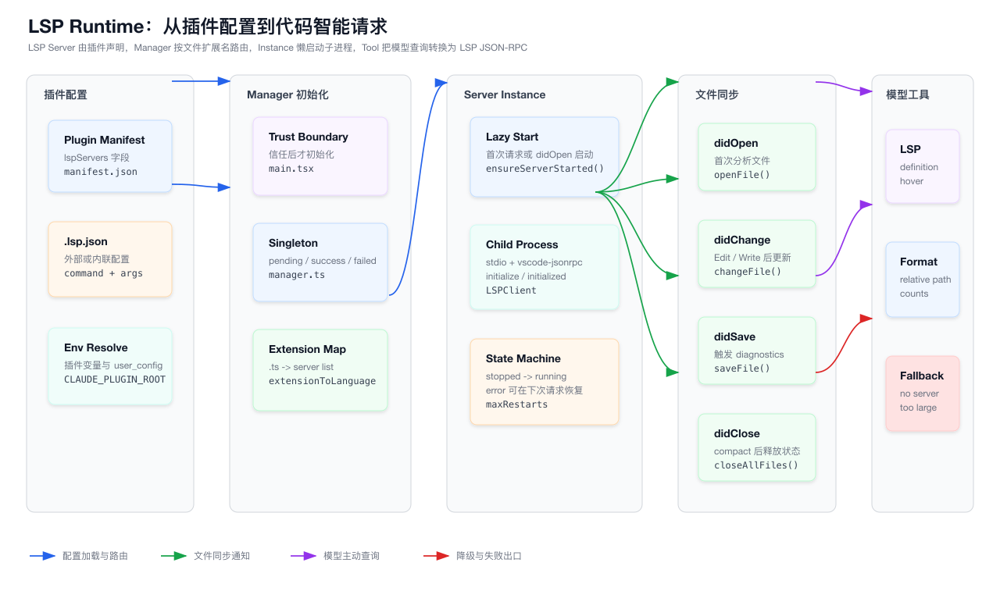
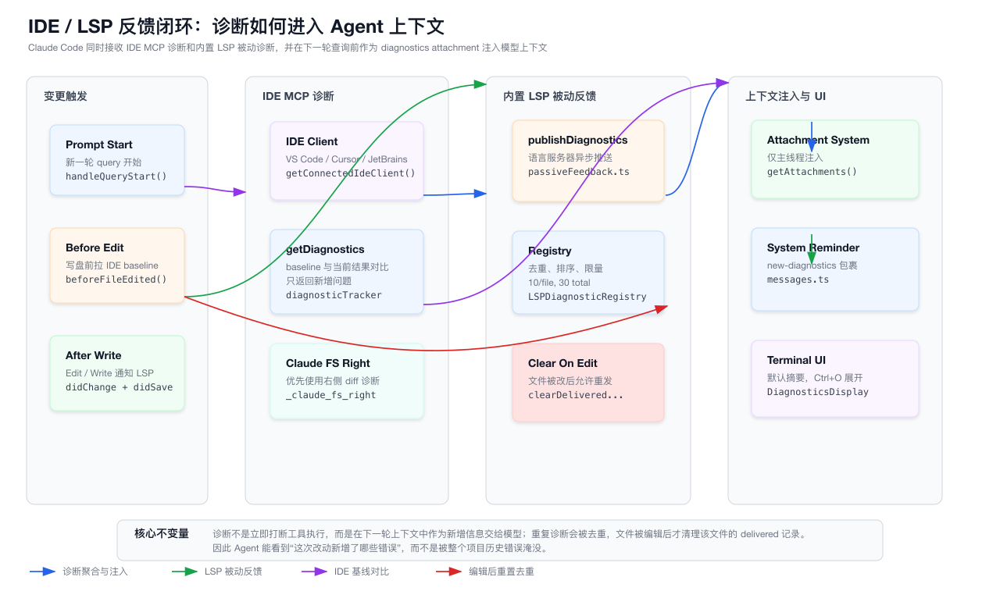

# 第 19 章：LSP、Diagnostics 与 IDE 代码智能反馈系统

> 本章只分析 `claude-code/` 子目录下的实现。所有源码路径都以 `claude-code/` 为根，文档与图表落在 `tech-docs/new/`。

上一批章节已经把文件读取、文件编辑、diff 预览、写盘校验、上下文压缩、请求拼装等主链路拆开讲过。

这些系统回答的是：

```text
模型如何看到代码？
模型如何提出修改？
修改如何被用户批准并安全写盘？
上下文如何压缩而不丢失关键状态？
```

这一章进入另一个对 Coding Agent 很关键、但容易被低估的系统：

```text
Claude Code 如何借助 IDE / LSP 获得代码语义、跳转、引用、hover、调用层级和新增诊断？
```

这不是普通的文本搜索能力。

`rg` 能告诉模型“某个字符串出现在哪里”，但它不知道：

- 这是变量定义，还是同名字段。
- 这是函数调用，还是注释里的文本。
- 这个 import 是否解析到真实模块。
- 编辑后 TypeScript / Rust / Python 语言服务是否产生了新错误。
- 用户 IDE diff 右侧临时文件里的诊断是否比磁盘文件更准确。

Claude Code 的方案不是把所有语言语义都重写一遍，而是接入两类现成信号：

```text
主动代码智能：
  模型通过 LSP Tool 主动问语言服务器 definition / references / hover / symbols / call hierarchy

被动诊断反馈：
  IDE MCP 和内置 LSP 服务器把 diagnostics 汇总成 attachment，在下一轮上下文注入给模型
```

这两条链路共同构成“代码智能反馈系统”。

第一张图展示 LSP runtime 从插件配置、server manager、文件同步到模型工具查询的主链路：



第二张图展示 IDE MCP 诊断和内置 LSP 被动诊断如何进入 Agent 上下文：



本章会按源码拆解这两条链路。

## 19.1 源码入口总览

LSP 与 diagnostics 相关代码分布在几个区域：

| 区域 | 代表文件 | 职责 |
| --- | --- | --- |
| LSP 生命周期 | `src/services/lsp/manager.ts` | 全局 LSP manager 初始化、重建、关闭、连接状态 |
| LSP server 管理 | `src/services/lsp/LSPServerManager.ts` | server 配置加载、扩展名路由、文件 didOpen/didChange/didSave/didClose |
| LSP 子进程客户端 | `src/services/lsp/LSPClient.ts` | 通过 stdio 启动语言服务器，建立 JSON-RPC 连接 |
| LSP 实例状态机 | `src/services/lsp/LSPServerInstance.ts` | start/stop/restart/error 状态、初始化参数、请求重试 |
| LSP 配置 | `src/services/lsp/config.ts` | 从插件缓存读取全部 LSP server 配置 |
| LSP 类型 | `src/services/lsp/types.ts` | server config、scoped config、运行状态类型 |
| LSP 插件解析 | `src/utils/plugins/lspPluginIntegration.ts` | 从插件 manifest 或 `.lsp.json` 解析 server 配置 |
| LSP 配置 schema | `src/utils/plugins/schemas.ts` | `LspServerConfigSchema` 的字段与校验 |
| 主动 LSP 工具 | `packages/builtin-tools/src/tools/LSPTool/LSPTool.ts` | 模型调用 definition/references/hover/symbols/call hierarchy |
| LSP 工具 schema | `packages/builtin-tools/src/tools/LSPTool/schemas.ts` | operation discriminated union |
| LSP 工具格式化 | `packages/builtin-tools/src/tools/LSPTool/formatters.ts` | 把 LSP 原始结果转成人类和模型可读文本 |
| LSP UI 展示 | `packages/builtin-tools/src/tools/LSPTool/UI.tsx` | tool use / tool result 的终端展示 |
| LSP symbol 上下文 | `packages/builtin-tools/src/tools/LSPTool/symbolContext.ts` | UI 中轻量提取光标位置附近 symbol |
| 被动 LSP 诊断 | `src/services/lsp/passiveFeedback.ts` | 注册 `textDocument/publishDiagnostics` 通知处理器 |
| LSP 诊断注册表 | `src/services/lsp/LSPDiagnosticRegistry.ts` | 去重、排序、限量、跨轮 delivered 记录 |
| IDE 诊断跟踪 | `src/services/diagnosticTracking.ts` | 编辑前 baseline、编辑后新增 diagnostics 对比 |
| diagnostics UI | `src/components/DiagnosticsDisplay.tsx` | 终端中展示新增诊断摘要和详情 |
| attachment 注入 | `src/utils/attachments.ts` | 把 IDE/LSP diagnostics 转成模型上下文附件 |
| message 包装 | `src/utils/messages.ts` | 用 `<new-diagnostics>` 系统提醒包裹诊断 |
| REPL 集成 | `src/screens/REPL.tsx` | 每轮 query 开始时初始化诊断跟踪 |
| IDE 自动连接 | `src/hooks/useIDEIntegration.tsx` | 根据环境、flag、lockfile 自动连接 IDE MCP |
| IDE 工具函数 | `src/utils/ide.ts` | IDE lockfile、WSL 路径、连接状态、diff tab 关闭 |
| VSCode SDK MCP | `src/services/mcp/vscodeSdkMcp.ts` | 内部 VSCode MCP、file_updated 通知、实验开关 |
| IDE diff 接入 | `src/hooks/useDiffInIDE.ts` | 打开 IDE diff、处理 accept/reject/close/save |
| LSP 插件推荐 | `src/utils/plugins/lspRecommendation.ts` | 根据文件扩展名推荐可安装 LSP 插件 |
| LSP 推荐 UI | `src/hooks/useLspPluginRecommendation.tsx` | 编辑文件后触发 LSP 插件推荐流程 |

理解这些文件之后，本章可以浓缩成一句话：

> Claude Code 不自己实现语言语义，而是把语言服务器、IDE 诊断和模型工具调用组织成一个可懒启动、可降级、可去重、可注入上下文的反馈系统。

## 19.2 为什么 Coding Agent 需要 LSP

前端开发者对 LSP 并不陌生。

VS Code 里的这些能力基本都来自语言服务：

- 跳转定义。
- 查找引用。
- hover 类型提示。
- outline / document symbols。
- workspace symbol。
- rename 前的引用分析。
- TypeScript 报错。
- ESLint / language server diagnostics。

人在 IDE 里写代码时，会自然使用这些反馈。

Coding Agent 如果只靠 `Read`、`Grep`、`Glob`，就相当于把 IDE 降级成文本编辑器。

例如一个 React 项目里有：

```ts
function useOrderList() {}
const useOrderListQuery = ...
type UseOrderListResult = ...
```

文本搜索 `useOrderList` 会返回很多结果。

但语言服务器能回答更精确的问题：

```text
当前位置这个符号的定义在哪里？
这个函数真正被哪些调用点引用？
hover 类型是什么？
当前文件的 symbol tree 是什么？
这个修改是否产生新的类型错误？
```

这就是 LSP Tool 和 diagnostics attachment 的价值。

## 19.3 LSP 不是替代 grep，而是补足 grep

Claude Code 仍然需要 `rg` / `Glob` / `Read`。

原因很直接：

| 能力 | 适合场景 |
| --- | --- |
| `Glob` | 快速找文件 |
| `Grep` / `rg` | 快速找文本模式、配置、字符串、注释 |
| `Read` | 把具体文件内容放进模型上下文 |
| LSP Tool | 查语义关系、定义、引用、hover、symbol、调用层级 |
| IDE/LSP diagnostics | 修改后发现新增编译或类型错误 |

LSP 的优势是语义准确。

LSP 的弱点也很明确：

- 依赖语言服务器是否安装。
- 依赖 workspace 初始化和索引状态。
- 部分语言服务器启动慢。
- 大仓库里 workspace symbol 可能很重。
- 语言服务器返回的路径和范围需要再过滤。
- 文件没 didOpen 时，服务器可能不知道最新文本。

所以 Claude Code 的实现没有让 LSP 成为唯一代码理解入口。

它把 LSP 设计成一个“可用时增强”的能力：

```text
有 LSP server：
  提供语义查询和被动 diagnostics

没有 LSP server：
  工具不可用或返回明确降级信息，文件读写主链路不受影响
```

## 19.4 系统里有两条反馈链路

本章最重要的区分是：

```text
主动查询链路：
  模型显式调用 LSP Tool
  -> LSP Tool 找 server
  -> openFile / sendRequest
  -> 格式化结果返回给模型

被动诊断链路：
  IDE 或 LSP server 产生 diagnostics
  -> registry / tracker 去重
  -> attachment 注入下一轮 prompt
  -> 模型看到“新增错误”
```

主动链路解决“我想知道某个符号是什么”。

被动链路解决“我刚才改坏了吗”。

这两个问题在工程上不能混在一起。

主动查询是 tool call，需要权限、输入 schema、结果格式化、错误返回。

被动诊断是上下文增强，需要去重、限量、跨轮 delivered 状态、UI 摘要和系统提醒。

## 19.5 LSP server 配置来自插件，不来自项目设置

`src/services/lsp/config.ts` 里有一个很关键的设计：

```text
LSP servers are now only supported through plugins.
```

也就是说，Claude Code 这个实现里没有把 LSP server 配置做成普通 project/user settings。

它从已启用插件里读取 LSP server。

主流程是：

```text
loadAllPluginsCacheOnly()
  -> getPluginLspServers(plugin)
  -> 合并所有插件提供的 server config
```

这样做有几个好处：

- LSP server 的安装、启用、禁用可以和插件生命周期绑定。
- 插件可以把 command、args、extension mapping、initializationOptions 放在一处声明。
- 不同插件提供的 server name 可以被 scope 化，避免冲突。
- 语言能力可以按需扩展，而不是内置到核心代码里。

代价是：

- 没有安装插件时，LSP 能力自然不可用。
- server 配置错误会表现为插件错误，而不是普通设置错误。
- 调试时要看插件 manifest / `.lsp.json`，不能只看项目配置。

## 19.6 插件 LSP 配置有两种声明方式

`src/utils/plugins/lspPluginIntegration.ts` 支持两类来源：

```text
manifest.json 的 lspServers 字段
.lsp.json 文件
```

manifest 里的 `lspServers` 可以是：

- 字符串路径。
- inline record。
- array。

如果是路径，代码会把它 resolve 到插件目录内部。

这里有一个安全边界：

```text
resolved path 必须仍然在 pluginDir 内部
```

这可以防止插件通过 `../` 读取插件目录外的任意文件。

解析后的配置会经过 `LspServerConfigSchema` 校验。

然后系统给 server name 加 scope：

```text
plugin:<pluginName>:<serverName>
```

这样不同插件即使都声明了 `typescript`，内部也不会互相覆盖成同一个裸名字。

## 19.7 LSP 配置 schema 先收紧最危险字段

`src/utils/plugins/schemas.ts` 里的 `LspServerConfigSchema` 至少要求：

| 字段 | 作用 |
| --- | --- |
| `command` | 启动语言服务器的命令 |
| `args` | 命令参数 |
| `extensionToLanguage` | 文件扩展名到 languageId 的映射 |
| `transport` | 当前 schema 支持 `stdio` / `socket`，默认 `stdio` |
| `env` | server 进程环境变量 |
| `initializationOptions` | 传给 LSP initialize 的初始化参数 |
| `settings` | 预留的 server settings |
| `workspaceFolder` | server 工作目录 |
| `startupTimeout` | 启动超时 |
| `shutdownTimeout` | 关闭超时字段 |
| `restartOnCrash` | 崩溃重启字段 |
| `maxRestarts` | 最大重启次数 |

其中 `command` 的校验很有工程味：

```text
如果 command 包含空格，且不是绝对路径，则判定为非法。
```

这能逼配置作者把参数放进 `args`，而不是把整条 shell 命令塞进 `command`。

正确形态应该类似：

```json
{
  "command": "typescript-language-server",
  "args": ["--stdio"],
  "extensionToLanguage": {
    ".ts": "typescript",
    ".tsx": "typescriptreact"
  }
}
```

不推荐：

```json
{
  "command": "typescript-language-server --stdio"
}
```

这是一个典型的边界收紧：

> LSP server 进程启动使用 `spawn(command, args)`，不是 shell 字符串执行。

## 19.8 插件变量解析让配置可迁移

插件里的 LSP 配置不能写死所有路径。

`lspPluginIntegration.ts` 支持变量替换：

```text
${CLAUDE_PLUGIN_ROOT}
${CLAUDE_PLUGIN_DATA}
${user_config.KEY}
${VAR}
```

这样插件可以声明：

```json
{
  "command": "${CLAUDE_PLUGIN_ROOT}/bin/my-language-server",
  "env": {
    "CACHE_DIR": "${CLAUDE_PLUGIN_DATA}/cache"
  }
}
```

其中 `user_config.KEY` 有一个额外保护：

```text
只有插件 manifest 声明了 userConfig 时才读取用户配置。
```

这避免了两个问题：

- 未声明配置的插件意外读取用户配置。
- 触发不必要的 keychain / secret 读取。

对工业系统来说，这是很重要的边界。

扩展能力越靠近进程启动和环境变量，就越需要明确声明来源。

## 19.9 LSP 初始化被放在 trust boundary 之后

`src/services/lsp/manager.ts` 的注释强调：

```text
LSP initialization must happen after trust dialog and inline plugins are set.
```

原因很直接：

LSP server 是外部子进程。

插件也可能提供 LSP server command。

如果在用户信任工作区之前就启动插件提供的语言服务器，相当于在未信任目录里执行了插件相关代码。

所以初始化位置不是单纯性能问题，而是信任边界问题。

主线可以理解成：

```text
进入 Claude Code
  -> 确认 workspace trust
  -> 初始化插件
  -> 初始化 LSP manager
  -> 后续工具或文件变更按需启动具体 server
```

这和浏览器扩展、IDE 插件的安全模型很像：

```text
先获得用户对 workspace / plugin 的信任，再运行扩展代码。
```

## 19.10 manager 是全局 singleton，但初始化是异步非阻塞

`src/services/lsp/manager.ts` 管理全局状态：

```ts
let lspManagerInstance: LSPServerManager | null = null
let initState: LSPInitState = { status: 'not-started' }
let initGeneration = 0
```

初始化状态大致有四种：

```text
not-started
pending
success
failed
```

`initializeLspServerManager()` 的设计要点是：

- bare/simple mode 直接跳过。
- 已经 pending 时直接返回同一个 promise。
- 已经 success 时直接返回现有 manager。
- 创建 manager 是同步动作。
- 真正 `manager.initialize()` 是异步动作，不阻塞主启动流程。
- 用 generation 防止旧初始化 promise 覆盖新状态。

generation 这个细节很重要。

如果用户刷新插件、重建 manager，而旧的初始化 promise 后完成，就可能把全局状态写回旧结果。

所以代码用：

```text
myGeneration === initGeneration
```

来判断当前 async 回调是否仍然有效。

这是所有全局 async 初始化都值得借鉴的模式。

## 19.11 reinitialize 是为插件刷新准备的

`reinitializeLspServerManager()` 做了几件事：

```text
保存旧 manager
清空全局 instance
initGeneration++
initState = not-started
best-effort shutdown old manager
重新 initialize
```

源码注释提到一个具体问题：

```text
插件刷新时，第一次初始化可能读到旧插件 cache。
```

所以需要显式重建。

这里的关键不是“重启 LSP”本身，而是：

```text
当配置来源是插件 cache，插件刷新必须能清掉旧 manager 和旧 init promise。
```

否则用户安装/启用新 LSP 插件后，当前会话可能仍然看不到新 server。

## 19.12 LSPServerManager 是路由器，不是语言服务器

`src/services/lsp/LSPServerManager.ts` 使用工厂函数创建 manager。

内部维护几个 map：

```ts
const servers = new Map<string, LSPServerInstance>()
const extensionMap = new Map<string, string[]>()
const openedFiles = new Map<string, string>()
```

它的职责是：

- 加载全部 server config。
- 根据 `extensionToLanguage` 建立扩展名到 server 的路由。
- 按需启动 server。
- 维护哪些 file URI 已经 didOpen。
- 把 LSP request / notification 转发给具体 server instance。

它本身不解析 TypeScript，也不理解 Python。

它只回答：

```text
这个文件应该交给哪个 LSP server？
这个 server 是否启动？
这个文件是否已经 didOpen？
这个 request 应该发给谁？
```

## 19.13 扩展名路由使用 first registered server

`getServerForFile(filePath)` 通过扩展名找 server：

```text
path.extname(filePath)
  -> extensionMap.get(ext)
  -> serverNames[0]
```

也就是说，如果多个插件都声明支持 `.ts`，当前路由会取第一个注册的 server。

这有一个隐含约束：

```text
插件加载顺序会影响同一扩展名的 server 选择。
```

这不一定是 bug。

很多系统都会用“第一个可用 provider”作为默认策略。

但写文档、排查问题时必须知道这一点：

```text
为什么 `.ts` 文件没有走我刚安装的 server？
可能是 extensionMap 里已有另一个 server 在前面。
```

## 19.14 workspace/configuration 请求被显式兜底

有些语言服务器即使客户端声明不支持 workspace configuration，也仍然会发送：

```text
workspace/configuration
```

`LSPServerManager.initialize()` 会注册一个 request handler，返回对应数量的 `null`。

这是一种兼容性兜底。

核心思想是：

```text
不支持配置，不代表可以让 server request 悬空或崩掉。
```

很多 LSP server 的行为不完全标准。

客户端需要对常见非理想行为做温和兜底。

## 19.15 LSPServerInstance 是状态机

`src/services/lsp/LSPServerInstance.ts` 把一个 server 包成实例状态机。

主要状态包括：

```text
stopped
starting
running
stopping
error
```

典型转换是：

```text
stopped -> starting -> running
running -> stopping -> stopped
any -> error
error -> starting
```

状态机的价值是避免这些问题：

- 同一个 server 被并发 start 多次。
- 已经 stopping 时继续发请求。
- error 后没有显式重试策略。
- shutdown 和 crash 同时发生时状态混乱。

`ensureHealthy()` 会在发送请求或 notification 前检查状态。

这让上层 manager 不需要到处判断进程是否还活着。

## 19.16 restart 字段在 schema 和 runtime 之间存在差异

`LspServerConfigSchema` 里有：

```text
restartOnCrash
shutdownTimeout
```

但 `LSPServerInstance.validateConfig()` 里会拒绝部分未实现字段。

这说明当前快照存在一个演进中的接口：

```text
schema 暴露了未来能力或兼容字段
runtime 仍然只实现了其中一部分
```

写教程时要避免把 schema 字段都描述成已完整可用。

更准确的说法是：

> 当前 runtime 已实现 stdio server、startup timeout、max restart 计数等核心路径；部分 schema 字段仍是预留或未实现能力。

这是阅读大型工程时常见的情况。

不要只看 schema，也要看 runtime 是否消费字段。

## 19.17 LSPClient 用 stdio 子进程承载 JSON-RPC

`src/services/lsp/LSPClient.ts` 是最靠近语言服务器进程的一层。

它做的事情是：

```text
spawn(command, args, { stdio: 'pipe' })
  -> StreamMessageReader(stdout)
  -> StreamMessageWriter(stdin)
  -> createMessageConnection(reader, writer)
  -> initialize request
  -> initialized notification
```

这就是标准 LSP over stdio 模式。

Claude Code 没有把语言服务器跑在同进程里。

它通过 JSON-RPC 和 server 通信，子进程边界天然隔离了不同语言服务的实现。

这也是为什么 `command` / `args` / `env` / `cwd` 的配置校验如此重要。

## 19.18 spawn 的 error 事件要在使用 stream 前处理

`LSPClient.start()` 有一个细节：

它会等子进程发生 `spawn` 或 `error` 事件之后，再继续使用 stdio stream。

原因是：

如果 command 不存在，Node 的 child process 会异步触发 `error`。

如果调用方太早认为进程已经可用，就可能出现未捕获 promise rejection 或连接状态错乱。

所以启动序列不是：

```text
spawn 后立即 create connection
```

而是：

```text
spawn
  -> 等待 spawn 成功或 error
  -> 成功后才接 reader/writer
```

这类边界处理在 agent 系统里很重要。

因为语言服务器命令来自插件，失败是常态，不是异常小概率。

## 19.19 LSP initialize 参数定义了 Claude Code 的客户端能力

`LSPServerInstance` 构造 initialize params。

其中比较重要的能力包括：

| 能力 | 说明 |
| --- | --- |
| `textDocumentSync.didSave` | 支持保存通知 |
| diagnostics related info | 支持诊断附加信息 |
| diagnostics tags | 支持 deprecated / unnecessary 等标签 |
| codeDescription | 支持诊断 codeDescription |
| hover | 支持 hover |
| definitionLink | definition 可返回 link |
| references | 支持引用查询 |
| documentSymbol.hierarchicalDocumentSymbolSupport | 支持层级 symbol |
| callHierarchy | 支持调用层级 |
| `positionEncodings` | 偏好 `utf-16` |

同时它没有声明一些动态能力：

```text
workspace configuration
workspace folders change notifications
```

这说明 Claude Code 当前的 LSP 客户端是“够用的代码智能客户端”，不是完整 IDE 客户端。

它关心的是 agent 需要的语义查询和诊断。

## 19.20 ContentModified 会被短暂重试

`LSPServerInstance.sendRequest()` 对 LSP error code `-32801` 有特殊处理。

这个错误常见含义是：

```text
ContentModified
```

例如 `rust-analyzer` 正在索引或文件状态刚变动时，可能暂时无法回答请求。

代码会做最多三次重试，并使用指数退避：

```text
500ms
1000ms
2000ms
```

这类 retry 不能无限做。

原因是 LSP request 是交互链路，模型正在等结果。

短暂重试可以消除索引瞬态，过度重试会让工具调用卡住。

## 19.21 文件同步是 LSP 正确性的前提

LSP server 不是直接读磁盘就一定知道最新内容。

客户端通常要发送：

```text
textDocument/didOpen
textDocument/didChange
textDocument/didSave
textDocument/didClose
```

`LSPServerManager` 对应提供：

| 方法 | LSP 通知 | 作用 |
| --- | --- | --- |
| `openFile()` | `textDocument/didOpen` | 首次把文件文本交给 server |
| `changeFile()` | `textDocument/didChange` | 编辑后同步最新全文 |
| `saveFile()` | `textDocument/didSave` | 通知保存，部分 server 会触发诊断 |
| `closeFile()` | `textDocument/didClose` | 释放单文件打开状态 |
| `closeAllFiles()` | 多个 `didClose` | 批量释放打开文件状态 |

这里的核心不变量是：

```text
请求一个文件的语义前，要确保 server 看到了这个文件内容。
```

所以 LSP Tool 在发送 definition / hover 等请求前，会先检查文件是否 open。

如果未 open，会读取文件并调用 `manager.openFile()`。

## 19.22 didChange 采用全文同步

`changeFile(filePath, content)` 的实现是：

```text
如果 server 未 running：
  openFile(filePath, content)

如果文件未 opened：
  openFile(filePath, content)

否则：
  发送 textDocument/didChange，contentChanges 为全文 text
```

这不是最省流量的增量同步。

但对 Coding Agent 来说，全文同步有明显优势：

- 实现简单。
- 不需要维护每一次编辑的 range。
- 不容易因为 offset / encoding 算错导致 server 状态漂移。
- 文件编辑工具本来就已经有最终全文。

缺点是大文件成本更高。

所以 LSP Tool 对读取待分析文件有 10MB 限制。

## 19.23 closeAllFiles 是压缩和长会话的清理钩子

`LSPServerManager.closeAllFiles()` 会：

```text
复制 openedFiles
先清空 openedFiles map
对仍在 running 的 server 发送 didClose
单个 close 失败不影响其他文件
```

先清空 map 是一个很实用的选择。

即使某个 `didClose` notification 失败，本地状态也不会继续认为文件是 open。

这适合会话压缩、长会话清理这类 best-effort 场景。

源码里 `closeFile()` 的注释仍提到单文件 close 与 compaction 的集成 TODO，而 `closeAllFiles()` 已经有批量释放的测试覆盖。

这提示我们：读源码时要区分“注释里的历史计划”和“当前已落地路径”。

## 19.24 LSP Tool 是模型主动语义查询入口

`packages/builtin-tools/src/tools/LSPTool/LSPTool.ts` 定义了内置工具：

```text
name: LSP
isLsp: true
shouldDefer: true
isReadOnly: true
isConcurrencySafe: true
```

它只在 `isLspConnected()` 为 true 时启用。

这意味着：

```text
没有可用 LSP server 时，模型不会把它当作常规可用工具。
```

LSP Tool 的定位是读工具。

它不会修改文件，只会查询语言服务器。

这很重要，因为它可以和文件写入权限系统分离。

## 19.25 LSP Tool 支持九类 operation

`packages/builtin-tools/src/tools/LSPTool/schemas.ts` 定义了 operation union。

当前主要包括：

| operation | LSP method |
| --- | --- |
| `goToDefinition` | `textDocument/definition` |
| `findReferences` | `textDocument/references` |
| `hover` | `textDocument/hover` |
| `documentSymbol` | `textDocument/documentSymbol` |
| `workspaceSymbol` | `workspace/symbol` |
| `goToImplementation` | `textDocument/implementation` |
| `prepareCallHierarchy` | `textDocument/prepareCallHierarchy` |
| `incomingCalls` | `callHierarchy/incomingCalls` |
| `outgoingCalls` | `callHierarchy/outgoingCalls` |

输入里统一有：

```text
operation
filePath
line
character
```

模型看到的行列是 1-based。

发送给 LSP 时会转换成 0-based：

```ts
line: input.line - 1
character: input.character - 1
```

这是 LSP 客户端最容易写错的细节之一。

终端、编辑器 UI、错误信息通常显示 1-based。

协议里的 position 通常是 0-based。

## 19.26 LSP Tool 会先做文件存在性和权限检查

`LSPTool.validateInput()` 会检查：

- operation 是否合法。
- `filePath` 是否存在。
- 目标是否是普通文件。
- UNC path 下跳过部分 fs 检查。

真正执行前还会检查读权限：

```text
checkReadPermissionForTool
```

这说明 LSP 查询也不是“绕过文件权限”的通道。

即使只是查 definition，它仍然以目标文件为入口，并遵循读权限。

## 19.27 LSP Tool 会把文件 open 到 server

`LSPTool.call()` 的关键步骤是：

```text
expandPath(filePath)
wait pending initialization
get manager
根据 operation 构造 method/params
如果文件没有 open：
  stat 文件
  超过 10MB 则返回 too large
  read utf8
  manager.openFile(filePath, content)
manager.sendRequest(serverName, method, params)
format result
```

这个顺序很重要。

如果不 didOpen，server 可能基于磁盘旧内容或未索引状态回答。

如果不限制文件大小，模型一次 LSP 查询可能触发对巨大文件的读取。

所以工具在语义查询前做了三个保护：

```text
权限保护
文件大小保护
server 初始化保护
```

## 19.28 call hierarchy 是两阶段查询

incoming / outgoing calls 不是直接拿当前位置发 `callHierarchy/incomingCalls`。

LSP 协议要求先做：

```text
textDocument/prepareCallHierarchy
```

拿到 `CallHierarchyItem` 后，再调用：

```text
callHierarchy/incomingCalls
callHierarchy/outgoingCalls
```

Claude Code 的 LSP Tool 也是这个流程。

如果 prepare 没有结果，就没有后续调用层级可查。

这类两阶段协议在 LSP 里很常见。

工具层要把协议复杂度藏起来，让模型只表达：

```text
我要查 incomingCalls / outgoingCalls。
```

## 19.29 查询结果会过滤 gitignored 路径

LSP server 可能返回很多位置。

其中一部分可能来自：

- build output。
- generated files。
- dependency cache。
- 被项目 gitignore 的目录。

`LSPTool.ts` 对以下结果会做 gitignored 过滤：

- definition。
- references。
- implementation。
- workspace symbol。

实现方式是批量调用：

```text
git check-ignore
```

并设置：

```text
batch size: 50
timeout: 5s
```

退出码处理也很务实：

| 退出码 | 含义 |
| --- | --- |
| 0 | 有路径被 ignore |
| 1 | 没有路径被 ignore |
| 128 | 不在 git repo 或 git 状态不可用 |

这样可以避免把模型带到大量不该改的生成文件里。

## 19.30 格式化层把 LSP 原始结构变成上下文文本

`packages/builtin-tools/src/tools/LSPTool/formatters.ts` 负责格式化 LSP 结果。

它做了几类处理：

- URI 转文件路径。
- 尽量用相对路径展示。
- Windows drive path 兼容。
- URI decode 失败时 fallback。
- references 按文件分组。
- document symbols 支持层级树。
- workspace symbols 按文件分组。
- malformed result 做日志记录而不是直接崩溃。

这层非常关键。

LSP 原始 JSON 直接给模型并不友好。

模型真正需要的是：

```text
哪个文件
哪一行哪一列
符号名是什么
上下文或 hover 内容是什么
结果数量是多少
```

格式化层就是把协议对象翻译成“agent 可行动信息”。

## 19.31 UI 只轻量提取 symbol，不读取整文件

`packages/builtin-tools/src/tools/LSPTool/symbolContext.ts` 供 tool use UI 使用。

它会读取目标文件前 64KB，尝试提取光标位置附近的 symbol。

如果目标行不在这个窗口里，或者文件被截断，就返回 null。

这个设计避免了一个常见问题：

```text
为了让 UI 展示得更漂亮，在 React render 路径里同步读取大文件。
```

Claude Code 选择只读小窗口。

UI 展示不是核心语义查询，不能为了展示 symbol 让终端渲染卡顿。

## 19.32 被动 LSP 诊断来自 publishDiagnostics

主动 LSP Tool 是模型问 server。

被动 LSP 诊断是 server 主动通知客户端：

```text
textDocument/publishDiagnostics
```

`src/services/lsp/passiveFeedback.ts` 注册这个 notification handler。

收到诊断后，它会做转换：

```text
LSP Diagnostic[]
  -> DiagnosticFile[]
  -> registerPendingLSPDiagnostic()
```

severity 映射大致是：

| LSP severity | Claude severity |
| --- | --- |
| 1 | Error |
| 2 | Warning |
| 3 | Info |
| 4 | Hint |
| unknown | Error |

URI 会尝试用 `fileURLToPath()` 转成本地路径。

转换失败时保留原始 URI。

## 19.33 passive handler 要隔离单 server 错误

`registerLSPNotificationHandlers(manager)` 会遍历所有 servers 注册 handler。

它有两个错误隔离层：

```text
注册 handler 失败：
  记录该 server 的注册错误，不影响其他 server

处理某条 diagnostics 失败：
  捕获错误，累计 consecutive failure
```

连续失败达到一定次数后会打 warning。

这体现了 LSP 集成的基本原则：

```text
语言服务器是外部进程，不能让一个 server 的异常拖垮整个 CLI。
```

## 19.34 LSPDiagnosticRegistry 解决三件事

`src/services/lsp/LSPDiagnosticRegistry.ts` 是被动 LSP diagnostics 的内存注册表。

它解决三类问题：

```text
去重：
  同一批次内重复诊断不重复返回
  跨轮已经 delivered 的诊断不重复返回

排序：
  Error > Warning > Info > Hint

限量：
  每文件最多 10 条
  总计最多 30 条
  delivered file LRU 最多 500 个文件
```

这些限制不是随意的。

诊断信息会进入模型上下文。

如果不限制，某些项目里一个 LSP server 可以一次返回几百上千条诊断，直接污染下一轮 prompt。

## 19.35 delivered 状态和 pending 状态要分开

注册表里有两类状态：

```text
pendingDiagnostics
deliveredDiagnostics
```

pending 表示：

```text
server 刚发来，等待下一轮 attachment 注入。
```

delivered 表示：

```text
这条诊断已经给过模型，不要下一轮反复重复。
```

所以 `clearAllLSPDiagnostics()` 只清 pending。

它不会清 delivered。

否则同一批旧错误会每轮重复出现，模型会被迫反复处理同一件事。

真正需要清 delivered 的时机是：

```text
文件被编辑后。
```

这由 `clearDeliveredDiagnosticsForFile(fileUri)` 完成。

原因是：文件改过之后，同样文本的诊断也可能是“新的反馈”，应该允许再次展示。

## 19.36 attachment 系统把 diagnostics 注入模型上下文

`src/utils/attachments.ts` 的 `getAttachments()` 会收集 main thread attachments。

与本章相关的有两类：

```text
diagnostics
lsp_diagnostics
```

它们都会转成 attachment：

```ts
{
  type: 'diagnostics',
  content,
  isNew: true
}
```

还有一个重要条件：

```text
只有当前 agent 有 Bash tool 时才注入 diagnostics。
```

这不是说 diagnostics 和 Bash 有协议依赖。

而是从 agent 行为上看：

```text
如果模型不能执行命令或修改验证，给它大量诊断通常没有意义。
```

诊断是行动反馈，不只是展示信息。

## 19.37 messages.ts 用 system reminder 包装诊断

`src/utils/messages.ts` 对 diagnostics attachment 有特殊包装：

```xml
<new-diagnostics>
The following new diagnostic issues were detected:
...
</new-diagnostics>
```

外层是 system reminder。

这让模型把它理解成环境反馈，而不是用户普通输入。

这点很关键。

诊断不是用户新需求。

诊断是工具运行后的事实反馈。

模型应该据此修复问题，而不是把它当成用户让它“解释一下错误”。

## 19.38 IDE diagnostics 和 LSP diagnostics 不是同一条链路

`src/services/diagnosticTracking.ts` 处理的是 IDE MCP diagnostics。

它和内置 LSP passive diagnostics 不同：

| 链路 | 来源 | 对比方式 |
| --- | --- | --- |
| IDE diagnostics | VS Code / Cursor / JetBrains 等 IDE MCP | 编辑前 baseline vs 编辑后当前 diagnostics |
| LSP passive diagnostics | Claude Code 自己启动的 LSP server | server publishDiagnostics 后 pending/delivered 去重 |

IDE diagnostics 的优势是：

- 复用用户 IDE 已经运行的语言服务。
- 能看到 IDE diff 右侧临时文件诊断。
- 可能包含 IDE 插件、lint、workspace 状态等更完整反馈。

内置 LSP passive diagnostics 的优势是：

- 不依赖 IDE 连接。
- 和 Claude Code 自己管理的 LSP server 生命周期一致。
- 插件可扩展。

两者可以同时存在。

## 19.39 diagnosticTracking 的核心是 baseline diff

IDE diagnostics 跟踪的核心流程是：

```text
beforeFileEdited(filePath)
  -> IDE getDiagnostics(file://filePath)
  -> 保存 baseline

写盘或 diff 之后
  -> getNewDiagnostics()
  -> IDE getDiagnostics({})
  -> 只比较有 baseline 的文件
  -> 返回新增或变化的 diagnostics
```

这和 LSP registry 的 pending/delivered 不同。

IDE diagnostics 不是 server 主动推送给 Claude Code。

它是 Claude Code 在编辑前后主动向 IDE 查询，然后做差量比较。

这样能回答一个更精确的问题：

```text
这次编辑新增了哪些问题？
```

而不是：

```text
项目里现在有哪些问题？
```

这对 Coding Agent 很重要。

大型项目本来就可能有很多历史错误。

Agent 需要优先修复自己刚引入的问题。

## 19.40 `_claude_fs_right` 表示 IDE diff 右侧诊断

`diagnosticTracking.ts` 里有对 `_claude_fs_right:` 的特殊处理。

这和 IDE diff 流程有关。

当 Claude Code 打开 IDE diff 时，右侧可能不是磁盘真实文件，而是一个临时的“提案内容”。

IDE 可以对这个右侧内容做诊断。

如果只看磁盘文件，用户还没 accept 的提案诊断就看不到。

所以系统优先考虑：

```text
_claude_fs_right:<fileUri>
```

这让 Claude Code 能在用户确认前也看到提案内容带来的错误。

这是 IDE 集成比纯磁盘 LSP 更强的地方。

## 19.41 编辑工具会在写前和写后接入 diagnostics

文件编辑链路和本章系统的连接点很明确。

编辑前：

```text
diagnosticTracker.beforeFileEdited(path)
```

写盘后：

```text
clearDeliveredDiagnosticsForFile(fileUri)
lspManager.changeFile(path, updatedContent)
lspManager.saveFile(path)
notifyVscodeFileUpdated(...)
```

这些动作都不是主写盘逻辑。

它们是写盘后的反馈副作用。

所以实现里通常会捕获错误并记录日志，而不是让 LSP notification 失败导致文件写入失败。

这里的工程取舍是：

```text
文件写入是主路径。
LSP / IDE 通知是增强反馈。
增强反馈失败不能回滚已经成功的主写入。
```

## 19.42 DiagnosticsDisplay 负责终端里的摘要和展开

`src/components/DiagnosticsDisplay.tsx` 渲染 diagnostics attachment。

默认模式展示摘要：

```text
Found N new diagnostic issues in M files
```

并提示可以用 Ctrl+O 展开。

verbose 模式会列出文件和诊断详情。

它还会清理路径展示：

- 去掉 `file://`。
- 处理 `_claude_fs_right:`。

这和 LSP Tool result UI 的思路一致：

```text
默认展示高信号摘要，需要时再展开细节。
```

Agent 终端 UI 不能把所有协议细节铺满屏幕。

## 19.43 REPL 每轮 query 开始会刷新诊断上下文

`src/screens/REPL.tsx` 在新一轮 prompt 开始时会做两件相关事情：

```text
diagnosticTracker.handleQueryStart(freshClients)
closeOpenDiffs(ideClient)
```

这意味着 diagnostics 不是孤立后台任务。

它绑定到 query loop。

每一轮用户输入前后，系统会刷新 IDE client 状态，并清理仍打开的 diff tabs。

这能减少上一轮编辑遗留状态对下一轮的影响。

## 19.44 IDE 自动连接依赖 lockfile、环境和终端上下文

`src/hooks/useIDEIntegration.tsx` 和 `src/utils/ide.ts` 负责 IDE 连接。

它会考虑：

- 全局 auto connect 配置。
- CLI flag。
- 是否在支持的 IDE terminal 中运行。
- `CLAUDE_CODE_SSE_PORT`。
- install target。
- `CLAUDE_CODE_AUTO_CONNECT_IDE` 环境变量。
- `~/.claude/ide` 下的 lockfile。
- WSL 下 Windows IDE 的路径与 host IP。

`ide.ts` 还会验证：

```text
IDE workspace folder 是否包含当前 cwd。
```

这可以避免连到另一个窗口的 IDE。

在内置终端里，它还会用父进程链辅助判断当前 CLI 是哪个 IDE window 启动的。

这些细节说明 IDE integration 不是简单“找一个端口连上”。

它要解决真实开发环境里多窗口、多 workspace、WSL、远程路径不一致的问题。

## 19.45 VSCode SDK MCP 提供内部通知通道

`src/services/mcp/vscodeSdkMcp.ts` 定义了内部 VSCode MCP。

它做几类事情：

- 保存 VSCode SDK client。
- `notifyVscodeFileUpdated` 发送 `file_updated` notification。
- 处理 `log_event`。
- 发送 experiment gates。
- 同步部分 VSCode extension 状态。

这条链路和通用 IDE MCP 不完全一样。

它更像 Claude Code 与官方 VSCode extension 之间的内部协作通道。

文件写盘后通知 VSCode，有助于 IDE 侧刷新 diff、状态、实验功能或其他扩展行为。

## 19.46 useDiffInIDE 与 diagnostics 的关系

`src/hooks/useDiffInIDE.ts` 负责打开 IDE diff。

它会：

- 根据 old/new content 重建 edits。
- 通过 IDE RPC `openDiff` 打开 diff。
- 监听用户 accept / reject / close / save。
- WSL 场景做路径转换。
- abort 或 beforeExit 时关闭 diff tab。

这和 diagnostics 的关系在于：

```text
IDE diff 右侧内容可能产生诊断。
diagnosticTracking 会识别 `_claude_fs_right` 诊断。
```

所以 IDE diff 不是只为用户看 patch。

它还让 IDE 的语言服务能提前分析“如果应用这次修改，会出现什么错误”。

## 19.47 LSP 插件推荐让代码智能可以渐进启用

`src/utils/plugins/lspRecommendation.ts` 和 `src/hooks/useLspPluginRecommendation.tsx` 处理 LSP 插件推荐。

流程大致是：

```text
观察 fileHistory.trackedFiles
  -> 用户编辑了某类扩展名文件
  -> 查 marketplace 中是否有支持该扩展名的 LSP 插件
  -> 检查 server command 是否在系统上存在
  -> 本会话未推荐过才弹出推荐 UI
```

推荐 UI 提供：

- Yes。
- No。
- Never。
- Disable。

并且有超时逻辑。

这里有几个谨慎点：

- 官方 marketplace 优先。
- 已安装插件不重复推荐。
- 用户多次忽略后会减少打扰。
- marketplace 中只有 inline LSP server config 可用于安装前分析。
- 如果 command 不存在，不推荐一个装完也跑不起来的插件。

这是一种渐进增强体验：

```text
用户开始编辑某语言文件后，再推荐相关 LSP 能力。
```

而不是启动时就要求用户配置所有语言服务器。

## 19.48 这套系统的关键不变量

把前面的代码压缩成工程不变量，大致有这些：

```text
1. 未信任 workspace 前不启动插件 LSP server。

2. LSP manager 是全局 singleton，但初始化结果必须用 generation 防陈旧写回。

3. LSP server 配置来自插件，并经过 schema 校验和路径边界检查。

4. 文件语义查询前必须 didOpen 或 didChange 到 server。

5. LSP request 失败不能拖垮主 CLI；错误要返回给 tool result 或日志。

6. diagnostics 进入模型上下文前必须去重、排序、限量。

7. 旧 diagnostics 不能每轮重复提醒；文件被编辑后才清对应 delivered 记录。

8. IDE diagnostics 要比较编辑前 baseline，只报告新增问题。

9. IDE diff 右侧临时内容的 diagnostics 优先级高于磁盘旧内容。

10. LSP / IDE 通知是文件写入后的增强副作用，不应反向破坏主写盘成功。
```

这些不变量比具体函数名更重要。

如果从 0 实现类似系统，先把这些边界定清楚，再写代码。

## 19.49 从 0 实现一个最小 LSP manager

一个最小实现可以只支持 stdio、单 server、全文同步。

伪代码如下：

```ts
type LspConfig = {
  command: string
  args?: string[]
  languageId: string
  extensions: string[]
}

class MiniLspManager {
  private server?: MiniLspClient
  private opened = new Set<string>()

  constructor(private config: LspConfig) {}

  async ensureStarted() {
    if (this.server?.isRunning()) return

    this.server = new MiniLspClient(this.config.command, this.config.args ?? [])
    await this.server.start({
      capabilities: {
        textDocument: {
          hover: {},
          definition: {},
          references: {},
        },
      },
    })
  }

  async openFile(filePath: string, content: string) {
    await this.ensureStarted()

    const uri = pathToFileURL(filePath).toString()
    if (this.opened.has(uri)) return

    this.server!.notify('textDocument/didOpen', {
      textDocument: {
        uri,
        languageId: this.config.languageId,
        version: 1,
        text: content,
      },
    })

    this.opened.add(uri)
  }

  async changeFile(filePath: string, content: string) {
    await this.ensureStarted()

    const uri = pathToFileURL(filePath).toString()
    if (!this.opened.has(uri)) {
      await this.openFile(filePath, content)
      return
    }

    this.server!.notify('textDocument/didChange', {
      textDocument: { uri, version: Date.now() },
      contentChanges: [{ text: content }],
    })
  }

  async definition(filePath: string, line: number, character: number) {
    await this.ensureStarted()

    return this.server!.request('textDocument/definition', {
      textDocument: { uri: pathToFileURL(filePath).toString() },
      position: { line: line - 1, character: character - 1 },
    })
  }
}
```

这个版本缺了很多工业能力：

- 多 server 扩展名路由。
- workspace folder。
- initialize capabilities。
- request timeout。
- ContentModified retry。
- gitignored 过滤。
- diagnostics registry。
- plugin config schema。
- shutdown / crash / restart。

但它已经表达了 LSP 集成的最小骨架：

```text
start server
initialize
didOpen
send request
format result
```

## 19.50 从 0 实现最小 diagnostics registry

被动 diagnostics 的最小实现可以先做 pending + delivered：

```ts
type Diagnostic = {
  file: string
  message: string
  severity: 'Error' | 'Warning' | 'Info' | 'Hint'
  line: number
  character: number
}

class DiagnosticRegistry {
  private pending: Diagnostic[] = []
  private delivered = new Map<string, Set<string>>()

  register(items: Diagnostic[]) {
    this.pending.push(...items)
  }

  collect(): Diagnostic[] {
    const next: Diagnostic[] = []
    const seen = new Set<string>()

    for (const item of this.pending) {
      const key = this.key(item)
      const deliveredForFile = this.delivered.get(item.file)

      if (seen.has(key)) continue
      if (deliveredForFile?.has(key)) continue

      seen.add(key)
      next.push(item)
    }

    next.sort((a, b) => this.rank(a.severity) - this.rank(b.severity))

    const limited = next.slice(0, 30)
    for (const item of limited) {
      const key = this.key(item)
      const set = this.delivered.get(item.file) ?? new Set<string>()
      set.add(key)
      this.delivered.set(item.file, set)
    }

    this.pending = []
    return limited
  }

  clearDeliveredForFile(file: string) {
    this.delivered.delete(file)
  }

  private key(item: Diagnostic) {
    return JSON.stringify({
      message: item.message,
      severity: item.severity,
      line: item.line,
      character: item.character,
    })
  }

  private rank(severity: Diagnostic['severity']) {
    return { Error: 0, Warning: 1, Info: 2, Hint: 3 }[severity]
  }
}
```

这个实现还缺 LRU 和 per-file cap。

但核心思想已经完整：

```text
pending 管还没给模型看的诊断
delivered 管已经给过模型的诊断
文件被编辑后清 delivered
```

## 19.51 前端工程里的类比

如果把这套系统类比到一个前端应用，可以这样理解：

```text
LSPServerManager
  类似 data client registry
  根据资源类型选择不同 provider

LSPServerInstance
  类似 websocket connection state machine
  管理 connecting / connected / error / reconnect

LSPClient
  类似 transport adapter
  把业务 request 转成底层协议消息

LSPTool
  类似 query hook
  做输入校验、权限、调用、结果格式化

DiagnosticRegistry
  类似 toast notification dedupe store
  控制重复、排序、数量、已展示状态

diagnosticTracking
  类似 form submit 前后的 validation diff
  只关心这次操作新增了哪些错误
```

这个类比能帮助前端同学理解：

> LSP 不是神秘编译器能力，而是一个外部 provider + transport + cache/dedupe + UI/上下文注入系统。

## 19.52 最容易踩的坑

第一类坑：把 LSP 当成同步库调用。

语言服务器是外部进程，启动、索引、响应都可能失败。

所以必须有：

- 启动超时。
- request 错误处理。
- crash 状态。
- best-effort shutdown。
- 日志但不拖垮主进程。

第二类坑：没有同步文件内容。

如果写盘后只改了磁盘，没有发 `didChange` / `didSave`，server 可能继续基于旧内容诊断。

第三类坑：重复 diagnostics 污染上下文。

如果没有 delivered 去重，同一个错误会每轮提醒模型。

模型会浪费大量动作反复处理历史问题。

第四类坑：把项目历史错误当成新错误。

IDE diagnostics 必须做 baseline diff。

否则 agent 会被要求修一堆和本次修改无关的旧问题。

第五类坑：忽略 IDE diff 右侧临时文件。

如果只看磁盘文件，就看不到用户还没 accept 的提案诊断。

第六类坑：只看 schema，不看 runtime。

配置 schema 里出现字段，不代表当前 runtime 已完整支持。

本章的 `restartOnCrash` / `shutdownTimeout` 就是一个例子。

## 19.53 测试应该覆盖什么

源码里已经能看到一些测试方向。

例如：

- `src/services/lsp/__tests__/closeAllFiles.test.ts`
- `packages/builtin-tools/src/tools/LSPTool/__tests__/formatters.test.ts`
- `packages/builtin-tools/src/tools/LSPTool/__tests__/schemas.test.ts`

如果继续补测试，建议覆盖这些场景：

| 模块 | 测试点 |
| --- | --- |
| manager 初始化 | pending 去重、success 复用、failed 状态、generation 防陈旧写回 |
| plugin LSP 解析 | manifest inline、`.lsp.json`、路径越界、变量替换、invalid schema |
| extension 路由 | 多 server 支持同一扩展名时 first registered 策略 |
| file sync | didOpen 去重、didChange 未 open 时自动 open、didSave 只对 running server 发 |
| LSPClient | command 不存在、stderr 日志、connection error、stop 幂等 |
| LSPTool | 1-based 到 0-based、10MB 文件限制、权限失败、无 manager 降级 |
| result filtering | gitignored 路径过滤、git exit code 1/128 |
| diagnostics registry | batch 去重、cross-turn 去重、per-file cap、total cap、clear delivered |
| IDE diagnostics | baseline diff、`_claude_fs_right` 优先、路径不匹配丢弃 |

这些测试不一定都要启动真实语言服务器。

多数可以通过 fake client / fake manager / fake IDE MCP client 完成。

真正的 LSP 集成测试成本较高，应放在少量端到端路径里。

## 19.54 工业实现建议

如果要在自己的 Coding Agent 里实现类似系统，可以按这个顺序做：

```text
第一步：
  做只读 LSP Tool，支持 hover / definition / references。

第二步：
  做 server manager，按扩展名路由，多 server 懒启动。

第三步：
  接入文件编辑后的 didChange / didSave。

第四步：
  接 publishDiagnostics，做 pending/delivered 去重。

第五步：
  接 IDE diagnostics，做 baseline diff。

第六步：
  做插件化配置和推荐安装。
```

不要一开始就做完整 IDE。

Claude Code 这个实现也不是完整 IDE。

它围绕 agent 最需要的能力做了裁剪：

```text
语义定位
引用理解
hover 上下文
调用层级
修改后诊断反馈
```

这比“实现所有 LSP capability”更现实。

## 19.55 面试题：如何设计一个 Agent LSP 系统

可以用下面这些问题检查候选人是否真正理解这类系统：

```text
1. 为什么 Coding Agent 不能只靠 grep 理解代码？

2. LSP Tool 为什么要在查询前 didOpen 文件？

3. 文件编辑后为什么要同时 didChange 和 didSave？

4. 为什么 diagnostics 不能每轮都完整注入模型上下文？

5. IDE diagnostics 为什么要做 baseline diff？

6. `_claude_fs_right` 解决什么问题？

7. 插件提供 LSP server command 时，信任边界应该放在哪里？

8. schema 里有字段但 runtime 未实现时，文档和兼容策略该怎么写？

9. LSP server crash 后应该影响文件写入主链路吗？

10. 如何测试 LSP manager 而不启动真实语言服务器？
```

比较好的回答通常会抓住这些关键词：

```text
外部进程
异步初始化
文件同步
权限和信任边界
best-effort feedback
去重和限量
baseline diff
插件化配置
降级可用
```

## 19.56 本章小结

本章拆解了 Claude Code 的 LSP、Diagnostics 与 IDE 代码智能反馈系统。

主线可以总结为：

```text
插件提供 LSP server 配置
  -> trust boundary 之后初始化 global manager
  -> 按文件扩展名路由到 server instance
  -> LSPClient 通过 stdio JSON-RPC 启动语言服务器
  -> LSP Tool 为模型提供主动语义查询
  -> 文件编辑后同步 didChange / didSave
  -> LSP publishDiagnostics 和 IDE getDiagnostics 生成新增诊断
  -> registry / tracker 去重、排序、限量
  -> attachment 系统把新增诊断注入下一轮上下文
```

这套系统的价值不是让 Claude Code 变成 IDE。

它的价值是：

> 在不重写各语言编译器和 IDE 能力的前提下，把代码语义和新增错误反馈接入 Agent 决策循环。

这也是现代 Coding Agent 和普通脚本自动化的关键差异之一。

普通脚本执行命令。

Coding Agent 需要持续观察代码语义、用户编辑、IDE 反馈和诊断结果，并把这些信号转成下一步行动。

下一章可以继续推进插件、扩展能力或更高层的代码索引与跨文件语义系统。
