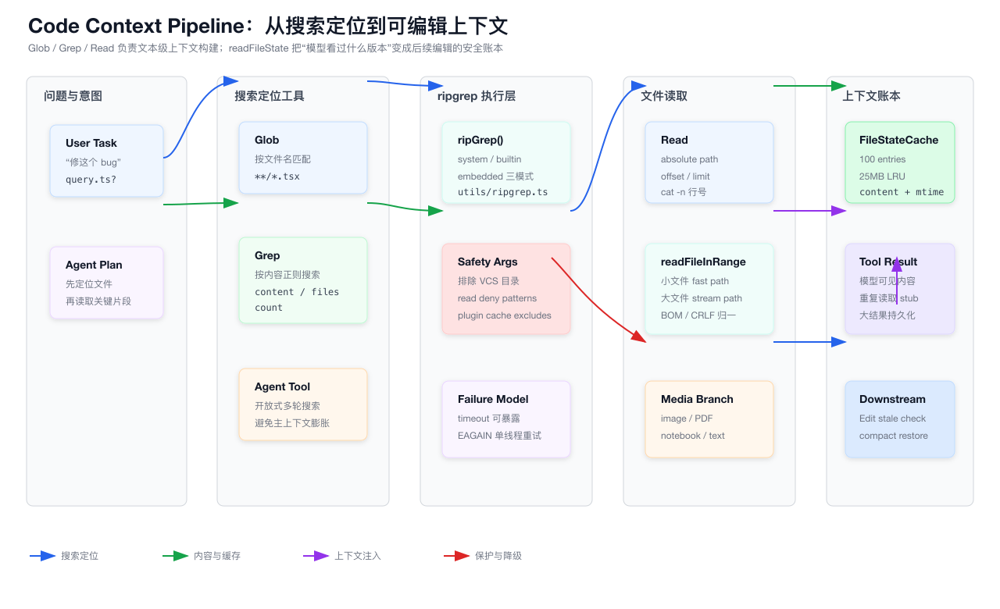
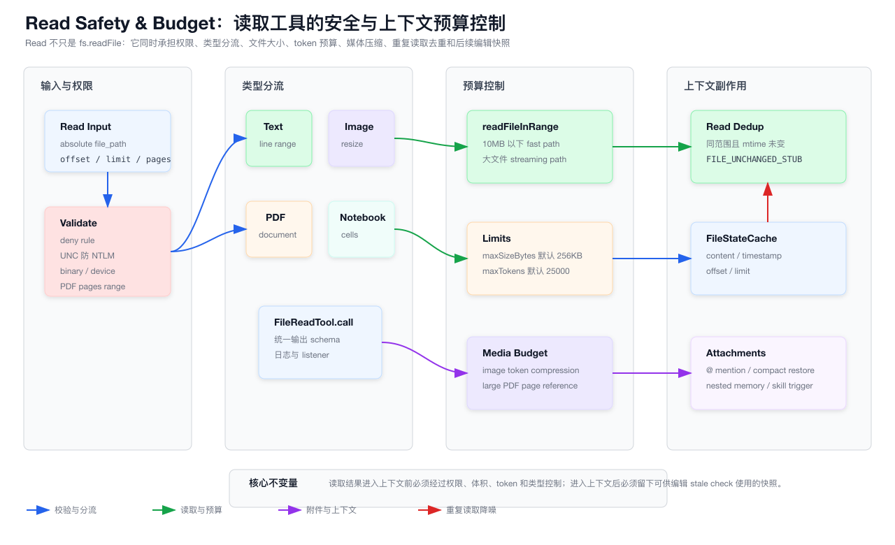

# 第 20 章：代码搜索、文件读取与上下文构建系统

> 本章只分析 `claude-code/` 子目录下的实现。所有源码路径都以 `claude-code/` 为根，文档与图表落在 `tech-docs/new/`。

上一章讲的是 LSP、Diagnostics 与 IDE 代码智能反馈系统。

那一章回答的是：

```text
模型如何借助语言服务器理解定义、引用、hover、调用层级？
模型如何通过 IDE / LSP diagnostics 发现自己刚刚改坏了什么？
```

这一章回到更基础、也更高频的能力：

```text
Claude Code 如何在一个真实代码仓库里搜索文件、读取内容、控制上下文体积，并把“看过的文件版本”沉淀为后续编辑的安全依据？
```

这看起来像几个简单工具：

```text
Glob
Grep
Read
```

但在 Coding Agent 里，它们不是普通文件 API。

它们是上下文构建系统。

原因很简单：

```text
模型不知道本地文件系统。
模型也没有稳定、无限、自动更新的项目索引。
模型每一次理解代码，都要把“文件系统里的事实”转成“上下文窗口里的文本、图片或结构化结果”。
```

所以搜索和读取工具的职责远远超过：

```ts
await fs.readFile(path, 'utf8')
```

它至少要解决这些问题：

- 如何快速在大仓库里找文件。
- 如何按内容搜索而不把整个仓库塞进 prompt。
- 如何过滤 `.git`、生成目录、权限 deny 目录和插件缓存噪声。
- 如何读大文件的一小段。
- 如何读图片、PDF、notebook。
- 如何避免重复读取同一个文件浪费 token。
- 如何限制文件大小和 token 数。
- 如何把读取结果带上行号。
- 如何记录模型读过哪个版本，给 Edit / Write stale check 使用。
- 如何在 compaction 后恢复关键文件上下文。
- 如何让读取某个文件触发 nested memory 和动态 skill 发现。

本章先用两张图建立全局结构。

第一张图展示搜索、ripgrep、Read 和 readFileState 如何共同组成代码上下文管线：



第二张图展示 Read 工具内部的权限、安全、类型分流和预算控制：



## 20.1 源码入口总览

本章核心源码集中在 built-in tools、文件读取 utility、权限、附件系统和 tool result 存储里。

| 模块 | 职责 |
| --- | --- |
| `packages/builtin-tools/src/tools/GlobTool/GlobTool.ts` | 按文件名 pattern 查找文件 |
| `packages/builtin-tools/src/tools/GlobTool/prompt.ts` | Glob 给模型的使用说明 |
| `src/utils/glob.ts` | 基于 ripgrep 的 glob 实现、绝对 pattern 拆分、ignore 处理 |
| `packages/builtin-tools/src/tools/GrepTool/GrepTool.ts` | 按内容正则搜索，支持多种输出模式 |
| `packages/builtin-tools/src/tools/GrepTool/prompt.ts` | Grep 给模型的使用说明 |
| `src/utils/ripgrep.ts` | ripgrep 选择、执行、timeout、EAGAIN 重试、流式能力 |
| `packages/builtin-tools/src/tools/FileReadTool/FileReadTool.ts` | Read 工具主体，处理文本、图片、PDF、notebook |
| `packages/builtin-tools/src/tools/FileReadTool/prompt.ts` | Read 工具 prompt、行号格式、offset/limit 指令 |
| `packages/builtin-tools/src/tools/FileReadTool/limits.ts` | 读取大小与 token 限制 |
| `src/utils/readFileInRange.ts` | 行区间读取，fast path 与 streaming path |
| `src/utils/fileStateCache.ts` | readFileState 的 LRU 缓存实现 |
| `src/utils/attachments.ts` | @ mention 文件、post-compact 文件恢复、nested memory、dynamic skill 附件 |
| `src/utils/toolResultStorage.ts` | 大 tool result 持久化和预览 |
| `src/Tool.ts` | tool 的 read/search/list 分类、结果大小、搜索索引接口 |
| `src/QueryEngine.ts` | 非交互模式 ToolUseContext 注入 readFileState |
| `src/screens/REPL.tsx` | 交互模式 readFileState 生命周期 |
| `src/services/compact/compact.ts` | compaction 前后保存和恢复 readFileState |
| `src/utils/permissions/filesystem.ts` | read 权限、deny pattern、UNC 保护、ignore pattern |
| `packages/builtin-tools/src/tools/BashTool/BashTool.tsx` | 部分模拟编辑也会更新 readFileState |
| `src/components/Messages.tsx` | transcript 搜索索引使用 tool.extractSearchText |

这张表里的工具可以分为三层：

```text
发现层：
  Glob / Grep / Bash 中的 find/ls/grep 类命令分类

读取层：
  Read / readFileInRange / media reader

上下文账本层：
  readFileState / attachments / compaction restore / tool result persistence
```

这三层共同回答一个问题：

> 模型应该看到哪些文件内容，以及系统如何记住模型已经看过什么。

## 20.2 代码上下文不是一次性输入，而是运行时资源

传统前端应用里，组件可以随时访问内存里的 store。

比如：

```text
React component
  -> useQuery()
  -> cache
  -> render
```

Coding Agent 不是这样。

模型每一轮只能看到 prompt 中的内容。

文件系统不在模型大脑里。

所以“读代码”这件事本质上是一次资源装载：

```text
本地文件系统
  -> 工具调用
  -> tool result
  -> message history
  -> 下一次模型推理
```

这就是为什么 Claude Code 把 Read/Grep/Glob 做成工具，而不是在启动时把整个项目扫描进 prompt。

全量扫描有三个问题：

- 成本不可控。
- 上下文窗口装不下。
- 文件会变化，启动时索引很快陈旧。

所以 Claude Code 选择懒加载：

```text
模型先搜索
  -> 找到候选文件
  -> 读取必要片段
  -> 修改前后用 readFileState 校验版本
```

这套系统和前端里的 virtual list 很像。

你不会一次渲染十万行。

Agent 也不应该一次读取整个 monorepo。

## 20.3 搜索工具和读取工具的职责边界

Claude Code 把“找在哪里”和“看具体内容”分开。

| 工具 | 解决的问题 | 结果形态 |
| --- | --- | --- |
| Glob | 哪些文件名匹配 pattern | 文件路径列表 |
| Grep | 哪些文件内容匹配 regex | 文件列表、匹配行、计数 |
| Read | 某个文件具体内容是什么 | 带行号文本、图片、PDF、notebook cells |
| LSP | 某个符号语义关系是什么 | 定义、引用、hover、symbol、call hierarchy |

这几个工具不是互相替代。

它们形成一个常见工作流：

```text
Glob 找候选文件
Grep 找关键字符串
Read 读取目标片段
LSP 验证语义关系
Edit / Write 修改
Diagnostics 反馈结果
```

如果模型跳过搜索，直接猜路径，容易读错文件。

如果模型只 Grep 不 Read，容易缺少上下文。

如果模型只 Read 整个目录，成本会爆炸。

所以工具 prompt 会明确引导：

```text
搜索任务用 Grep，不要 Bash 里手写 grep/rg。
找文件名用 Glob。
读取目录用 Bash ls，不要 Read 目录。
长文件用 offset/limit。
```

## 20.4 Glob 是文件名索引，不是内容搜索

`packages/builtin-tools/src/tools/GlobTool/GlobTool.ts` 的输入很简单：

```ts
{
  pattern: string
  path?: string
}
```

它适合这类问题：

```text
找所有 *.tsx
找 src/**/router*.ts
找 packages/**/package.json
找某个组件可能在哪个目录
```

Glob 的输出是：

```ts
{
  durationMs,
  numFiles,
  filenames,
  truncated
}
```

默认最多返回 100 个文件，除非上下文里通过 `globLimits.maxResults` 覆盖。

这里的设计重点是：

```text
Glob 是定位工具，不是上下文承载工具。
```

它只告诉模型“候选路径有哪些”。

真正要理解文件内容，仍然需要 Read。

## 20.5 Glob 底层也用 ripgrep

`src/utils/glob.ts` 没有自己递归 `fs.readdir()`。

它基于 ripgrep：

```text
rg --files --glob <pattern> --sort=modified
```

这样做的好处是：

- ripgrep 的目录遍历足够快。
- 可复用 gitignore / glob 语义。
- 大仓库性能比 Node 手写递归更稳。
- 隐藏文件、ignore 行为可以通过参数统一控制。

`glob()` 还处理绝对 pattern。

原因是 ripgrep 的 `--glob` 更适合相对 pattern。

如果输入是：

```text
/repo/src/**/*.ts
```

代码会先拆成：

```text
baseDir: /repo/src
relativePattern: **/*.ts
```

然后在 baseDir 内执行 ripgrep。

这避免了把绝对路径 glob 直接塞给 `--glob` 导致匹配语义异常。

## 20.6 Glob 默认会包含 hidden 和忽略 gitignore

`src/utils/glob.ts` 中有两个环境变量控制：

```text
CLAUDE_CODE_GLOB_NO_IGNORE
CLAUDE_CODE_GLOB_HIDDEN
```

默认逻辑是：

```text
--no-ignore
--hidden
```

也就是说，Glob 默认更偏向“找得到”。

这和普通开发者在 shell 里 `rg --files` 的默认体验不完全相同。

原因是 Coding Agent 经常需要看：

- `.claude`。
- hidden 配置。
- dotfiles。
- 被 gitignore 但仍与任务相关的生成配置。

不过这不代表它无视权限。

Glob 仍会叠加 read deny patterns 和插件缓存排除规则。

## 20.7 Grep 是内容搜索的主入口

`packages/builtin-tools/src/tools/GrepTool/GrepTool.ts` 是内容搜索工具。

它的输入比 Glob 丰富得多：

| 参数 | 作用 |
| --- | --- |
| `pattern` | ripgrep 正则 |
| `path` | 搜索文件或目录，默认 cwd |
| `glob` | 文件 glob 过滤 |
| `type` | ripgrep file type 过滤 |
| `output_mode` | `content` / `files_with_matches` / `count` |
| `-A` / `-B` / `-C` / `context` | 匹配上下文行 |
| `-n` | content 模式显示行号 |
| `-i` | 忽略大小写 |
| `head_limit` | 限制结果条数 |
| `offset` | 分页跳过前 N 条 |
| `multiline` | 开启跨行匹配 |

默认输出模式是：

```text
files_with_matches
```

这很合理。

大多数搜索的第一步不是要所有匹配行，而是要知道“哪些文件相关”。

模型拿到文件列表后，再 Read 最相关文件。

## 20.8 Grep prompt 禁止模型手写 grep/rg

`GrepTool/prompt.ts` 有一个明确指令：

```text
ALWAYS use Grep for search tasks. NEVER invoke grep or rg as a Bash command.
```

这不是偏好问题。

原因是 Grep 工具做了很多 Bash 里手写 `rg` 不会自动具备的事情：

- 权限检查。
- deny pattern 映射。
- VCS 目录排除。
- 插件缓存排除。
- 输出模式约束。
- head_limit 默认保护。
- 结果映射成 tool result。
- transcript search text 提取。

如果模型绕过 Grep 用 Bash 执行 `rg`，系统就失去了一部分治理能力。

这就是 Agent 工具化的核心价值：

> 不是不能执行 shell，而是把高频能力封装成可控、可观测、可限量的专用工具。

## 20.9 Grep 默认限制输出，避免搜索结果污染上下文

Grep 有一个默认限制：

```ts
const DEFAULT_HEAD_LIMIT = 250
```

如果模型没有显式传 `head_limit`，Grep 最多返回前 250 条。

如果传：

```text
head_limit: 0
```

才表示不限制。

这是一个很重要的上下文保护。

搜索结果非常容易爆炸。

例如：

```text
pattern: "useState"
path: "."
output_mode: "content"
```

在一个前端 monorepo 里可能返回几千行。

模型并不需要一次看到全部。

它需要的是：

```text
先拿到候选，再分页或缩小范围。
```

所以 Grep 的设计把无限输出变成显式 opt-in。

## 20.10 Grep content 模式会先限量再相对路径转换

`GrepTool.call()` 在 content 模式下先执行：

```text
applyHeadLimit(results, head_limit, offset)
```

再把绝对路径转换成相对路径。

这看似只是微优化，但对大结果很重要。

如果先对几万条结果做路径转换，再丢掉大部分，会浪费 CPU。

Claude Code 的实现顺序是：

```text
先裁剪
再格式化
```

这是所有工具结果处理都应该遵守的原则。

## 20.11 Grep files_with_matches 会按修改时间排序

在 `files_with_matches` 模式里，Grep 会对每个结果路径 `stat()`。

然后排序：

```text
mtime 新的优先
mtime 相同按文件名
测试环境按文件名保证稳定
```

这对 Agent 很有用。

最近修改的文件通常更可能和用户当前任务相关。

例如用户刚说“继续改刚才那个页面”，mtime 新的页面文件优先展示，可以减少模型无效探索。

同时测试环境不用 mtime，可以避免 flaky test。

这是一个很典型的工程细节：

```text
生产环境按相关性排序。
测试环境按确定性排序。
```

## 20.12 Grep 会过滤 VCS 目录和读权限 deny pattern

Grep 默认加：

```text
--hidden
--glob !.git
--glob !.svn
--glob !.hg
--glob !.bzr
--glob !.jj
--glob !.sl
```

还会从权限系统里读取 deny pattern：

```text
getFileReadIgnorePatterns(toolPermissionContext)
```

并转换成 ripgrep `--glob !pattern`。

这样模型搜索时不会轻易扫到：

- Git 内部对象。
- 版本控制元数据。
- 用户明确 deny 的目录。
- 过期插件版本缓存。

这不是性能优化而已。

它也是权限边界的一部分。

搜索结果本身也是信息泄露通道。

如果一个路径被 deny，最好连搜索列表里都不要出现。

## 20.13 Grep 对长行有 max-columns 保护

Grep 会加：

```text
--max-columns 500
```

这主要是为了避免 base64、minified bundle、单行 JSON 等内容把结果撑爆。

很多代码仓库里都有这类文件：

- sourcemap。
- minified js。
- lockfile。
- embedded base64。
- generated schema。

如果不限制，一条匹配行就可能几万字符。

Agent 的搜索结果应该是“定位线索”，不是“把无意义长行塞进 prompt”。

## 20.14 multiline 搜索必须显式打开

Grep 默认按单行匹配。

只有当输入：

```text
multiline: true
```

才会加：

```text
-U --multiline-dotall
```

这是一个正确的默认。

跨行正则通常更重，也更容易误匹配。

模型需要明确知道自己在找跨行结构时，才开启 multiline。

## 20.15 ripgrep 适配层有三种模式

`src/utils/ripgrep.ts` 的 `getRipgrepConfig()` 会选择 ripgrep 来源：

| 模式 | 说明 |
| --- | --- |
| `system` | 用户想用系统 rg，且系统 rg 可用 |
| `embedded` | bundled 模式下通过当前可执行文件用 `argv0='rg'` 分发 |
| `builtin` | 使用 vendor/ripgrep 下的内置二进制 |

这里还有一个安全细节：

如果使用 system ripgrep，代码返回：

```text
command: "rg"
```

而不是使用 `findExecutable()` 找到的完整路径。

注释说明这是为了避免 PATH hijacking 风险。

这类细节说明：

> 搜索工具不是“随便调用一个二进制”，它属于安全边界的一部分。

## 20.16 ripgrep timeout 失败不能伪装成无结果

`ripGrep()` 对错误的处理很谨慎。

退出码 1 表示：

```text
no matches
```

这是正常结果。

但 timeout 不一样。

如果 timeout 且没有任何 partial results，它会抛出：

```text
RipgrepTimeoutError
```

错误信息会提醒模型：

```text
搜索没有完成，请缩小 path 或 pattern。
```

这非常关键。

如果 timeout 被吞掉并返回空数组，模型会得出错误结论：

```text
“仓库里没有匹配项。”
```

真实情况是：

```text
“搜索没跑完。”
```

Agent 系统里，失败语义必须尽量保真。

## 20.17 EAGAIN 会单次降级为单线程重试

资源紧张环境里，ripgrep 可能因为线程启动失败报：

```text
Resource temporarily unavailable
os error 11
```

`ripGrep()` 会识别这种 EAGAIN，然后用：

```text
-j 1
```

重试一次。

注意它不是永久把 ripgrep 改成单线程。

注释里解释了原因：

```text
把单线程持久化会让大仓库 timeout 变多。
```

所以策略是：

```text
本次失败临时降级
下一次调用仍然使用默认并发
```

这是很典型的故障恢复策略：

```text
只修复当前瞬态错误，不把全局性能永久降级。
```

## 20.18 Read 是上下文系统的核心工具

`packages/builtin-tools/src/tools/FileReadTool/FileReadTool.ts` 定义的工具名是：

```text
Read
```

它的 searchHint 是：

```text
read files, images, PDFs, notebooks
```

它支持五类输出：

```text
text
image
notebook
pdf
parts
file_unchanged
```

这说明 Read 不是纯文本工具。

在 AI IDE 里，用户经常会让 Agent 看：

- 源代码。
- screenshot。
- 设计图。
- PDF 文档。
- Jupyter notebook。

Claude Code 把这些都收进同一个 Read 工具，是为了让模型形成统一调用习惯：

```text
只要用户给了本地文件路径，就用 Read。
```

## 20.19 Read prompt 要求绝对路径和 cat -n 格式

`FileReadTool/prompt.ts` 明确说明：

```text
file_path must be an absolute path
Results are returned using cat -n format
```

运行时会调用 `expandPath()` 做路径展开。

但 prompt 仍然要求模型传绝对路径。

这是为了减少歧义。

Agent 在多轮对话里可能改变 cwd，或者用户引用的路径来自 IDE、截图、附件。

绝对路径能让工具调用更稳定。

Read 返回行号也很重要。

后续 Edit 工具虽然用字符串替换，不直接用行号写盘，但行号能帮助模型：

- 定位讨论位置。
- 解释变更。
- 使用 Grep result 对齐文件片段。
- 精准读取下一段 offset。

## 20.20 Read 的 validateInput 尽量避免危险 I/O

`FileReadTool.validateInput()` 分几个阶段。

先处理纯字符串检查：

- PDF pages 参数是否合法。
- path expand。
- deny rule。
- UNC path。
- binary extension。
- blocked device path。

其中 UNC path 特别重要：

```text
\\server\share
//server/share
```

在 Windows 场景下，对 UNC path 做 `stat()` 可能触发 NTLM 凭据泄露风险。

所以代码遇到 UNC path 会跳过文件系统操作，把真正的 I/O 推迟到权限处理之后。

这是一个典型安全原则：

```text
校验阶段不要为了“确认路径存在”而触发网络副作用。
```

## 20.21 Read 会阻止容易挂死的设备文件

`FileReadTool.ts` 里有 `BLOCKED_DEVICE_PATHS`。

包括：

```text
/dev/zero
/dev/random
/dev/urandom
/dev/full
/dev/stdin
/dev/tty
/dev/console
/dev/stdout
/dev/stderr
/dev/fd/0
/dev/fd/1
/dev/fd/2
```

还处理：

```text
/proc/.../fd/0-2
```

这些文件要么无限输出，要么阻塞等待输入，要么语义上不该被 Read 读取。

如果模型读 `/dev/zero`，工具会永远读不到 EOF。

所以这里用路径级别直接拦截。

这比实际打开后再 timeout 更安全。

## 20.22 Read 对二进制文件做扩展名级拦截

Read 会检查：

```text
hasBinaryExtension(fullFilePath)
```

但排除：

- PDF。
- 图片。
- SVG。

因为这些类型 Read 有专门处理能力。

普通二进制文件会直接返回错误：

```text
This tool cannot read binary files.
```

这能防止模型把随机二进制当文本读进上下文。

如果将来要支持更多二进制分析，应该新增专门工具或媒体分支，而不是让文本 Read 兜底。

## 20.23 Read 有重复读取去重机制

Read 的一个关键优化是：

```text
如果同一个文件、同一个 offset/limit、磁盘 mtime 未变，则返回 file_unchanged stub。
```

返回内容来自：

```text
FILE_UNCHANGED_STUB
```

大意是：

```text
文件自上次读取以来未变化，前面的 Read tool_result 仍然有效。
```

这不是普通缓存命中。

它是上下文去重。

因为早先的 Read 结果仍然在 conversation history 里。

如果再次完整返回同一个文件，会重复消耗 token，并破坏 prompt cache 稳定性。

所以正确做法是：

```text
模型已经能看到旧内容时，不要再发一份完整副本。
```

## 20.24 dedup 只针对真正的 Read 结果

Read 去重有一个保护：

```text
existingState.offset !== undefined
```

注释说明：

```text
Edit/Write 会把 readFileState 的 offset 设为 undefined。
```

这代表该 entry 是写入后的状态，不是模型之前通过 Read 看到的那段内容。

如果对 Edit/Write 写入后的状态也返回 file_unchanged stub，模型可能被误导：

```text
“前面的 Read tool_result 仍然有效。”
```

但前面的 Read 看到的是编辑前内容。

所以 dedup 必须区分：

```text
Read 产生的上下文副本
Edit/Write 产生的最新磁盘状态
```

这是 readFileState 里 `offset/limit` 字段的一个隐含语义。

## 20.25 Read 会触发动态 skill 和 nested memory

Read 文件后，代码会做两类上下文触发：

```text
discoverSkillDirsForPaths()
activateConditionalSkillsForPaths()
```

以及：

```text
context.nestedMemoryAttachmentTriggers?.add(fullFilePath)
```

也就是说，读取某个文件不只把文件内容交给模型。

它还可能触发：

- 相关 skill 目录发现。
- 条件 skill 激活。
- 该文件所在路径的 nested CLAUDE.md memory 注入。

这是一种上下文联动：

```text
当模型进入某个目录或文件区域时，把该区域相关规则也带进来。
```

前端类比就是：

```text
进入某个 route 后，懒加载该 route 的 store、权限和局部配置。
```

## 20.26 文本读取走 readFileInRange

文本分支最终调用：

```ts
readFileInRange(
  resolvedFilePath,
  lineOffset,
  limit,
  limit === undefined ? maxSizeBytes : undefined,
  abortSignal,
)
```

这里有一个很重要的细节：

```text
只有未提供 limit 时，才把 maxSizeBytes 作为文件大小限制传入。
```

如果模型明确指定 offset/limit，说明它只想读片段。

这时不能因为整个文件很大就直接拒绝。

否则长文件根本无法按片段阅读。

这也是 prompt 里引导使用 offset/limit 的原因。

## 20.27 readFileInRange 有 fast path 和 streaming path

`src/utils/readFileInRange.ts` 里有两个路径：

```text
fast path:
  普通文件且小于 10MB
  直接 readFile 到内存
  split lines

streaming path:
  大文件、pipe、device 等
  createReadStream
  手动扫描 \n
  只累积目标行区间
```

还有一个额外判断：

```text
如果是 targeted read，且文件大于 2.5MB，也走 streaming path。
```

这避免为了读第 10000 行附近的 50 行，把一个几 MB 的文件整个读进内存。

## 20.28 streaming path 只保留目标行

streaming path 的核心优化是：

```text
目标范围外的行只计数，不累积内容。
```

这意味着读一个 100GB 文件的前 10 行，不会把 100GB 内容放进内存。

它仍然可能需要扫描流来计算 totalLines，但内存占用不会随文件大小线性增长。

这对 CLI 工具很重要。

Agent 不能因为一次错误 Read 调用把进程内存打爆。

## 20.29 readFileInRange 会做文本归一

不管 fast path 还是 streaming path，都会处理：

```text
UTF-8 BOM
CRLF -> LF
```

这让模型看到的文本更稳定。

如果每个平台的换行都原样暴露，模型在后续 Edit 时更容易复制出错。

注意这不是写盘归一。

这是读取展示层归一。

写盘保持行尾风格的逻辑在 Edit 工具里处理，上一章已经讲过。

## 20.30 Read 有两层预算：bytes 和 tokens

`FileReadTool/limits.ts` 写得很清楚：

| 限制 | 默认 | 检查对象 | 溢出行为 |
| --- | --- | --- | --- |
| `maxSizeBytes` | 256KB | 总文件大小或读取流量 | 抛错，提示 offset/limit |
| `maxTokens` | 25000 | 实际输出 token | 抛 `MaxFileReadTokenExceededError` |

`maxTokens` 的优先级是：

```text
env var > GrowthBook > DEFAULT_MAX_OUTPUT_TOKENS
```

环境变量是：

```text
CLAUDE_CODE_FILE_READ_MAX_OUTPUT_TOKENS
```

这里有一个真实工程取舍。

注释里提到曾经测试过“超大文件截断返回”，结果：

```text
错误率下降，但平均 tokens 上升。
```

因为抛错只需要一个短错误结果。

截断可能返回接近 25K token 的内容。

所以默认选择是：

```text
文件过大时提示模型用 offset/limit 或搜索，而不是自动塞一大段截断内容。
```

## 20.31 validateContentTokens 先用 byte 快速拒绝

`validateContentTokens()` 先做：

```text
Buffer.byteLength(content) > maxTokens * 4
```

如果成立，就直接拒绝。

理由是：

```text
最坏情况下约 4 bytes/token。
```

这可以避免对明显超大的内容发起 token count API 调用。

之后才用：

```text
roughTokenCountEstimationForFileType()
countTokensWithAPI()
```

也就是：

```text
便宜估算先行
昂贵精确计算后置
```

这是所有上下文预算系统都该遵守的顺序。

## 20.32 Read 返回给模型的是带行号内容

文本结果会经过：

```text
formatFileLines()
addLineNumbers()
```

形成类似 `cat -n` 的格式。

空文件或 offset 超出文件长度时，不会返回空字符串，而是返回 system reminder：

```text
文件存在但为空
文件短于提供的 offset
```

这也是为了避免空 tool result 带来的歧义。

空结果可能表示：

- 文件真的空。
- offset 错了。
- 工具失败了。
- 模型看不到内容。

明确的 system reminder 可以减少误判。

## 20.33 Read 会附加 cyber risk reminder

文本读取结果后面可能附加一个 system reminder：

```text
读到文件后要考虑是否是 malware。
可以分析恶意代码，但必须拒绝改进或增强恶意代码。
```

部分模型被豁免。

这说明 Read 工具也是安全策略的入口。

很多安全风险不是来自执行代码，而是来自“读取后帮忙改进恶意代码”。

所以提醒被放在文件内容旁边，让模型在分析具体代码时仍然看到安全边界。

## 20.34 图片读取有 token 预算压缩

图片分支调用：

```ts
readImageWithTokenBudget()
```

流程是：

```text
读取文件 bytes
检测图片格式
标准 resize / downsample
估算 base64 token
如果超预算，做 aggressive compression
fallback 到 400x400 JPEG quality 20
```

这里有一个明确优化：

```text
读文件只读一次。
```

后续压缩都基于同一个 buffer。

这避免了大图片多次读盘。

图片结果还可能生成 metadata message，包含尺寸信息，帮助模型做坐标或视觉分析。

## 20.35 PDF 读取有页数和模型能力限制

PDF 分支比普通文本复杂。

它会处理：

- `pages` 参数解析。
- 最大页数限制。
- 模型是否支持 PDF。
- 大 PDF 是否改用页面图片提取。
- `poppler-utils` 是否可用。

如果 PDF 页数太多且没有指定 pages，会直接提示：

```text
Use the pages parameter to read specific page ranges.
```

这和文本大文件 offset/limit 是同一类设计：

```text
不要默认把巨大文档塞进上下文。
让模型明确选择需要的范围。
```

## 20.36 large PDF 的 @ mention 会变成轻量 reference

`src/utils/attachments.ts` 的 `tryGetPDFReference()` 会在 @ mention 场景下检查 PDF 页数。

如果 PDF 太大，会返回：

```text
pdf_reference
```

而不是直接内联整个 PDF。

这样模型知道：

```text
用户提到了这个 PDF。
这个 PDF 很大。
需要用 pages 参数读取指定范围。
```

这比静默失败更好，也比直接读完整 PDF 更安全。

## 20.37 notebook 被作为结构化 cells 读取

`.ipynb` 不走普通文本分支。

Read 调用：

```text
readNotebook()
mapNotebookCellsToToolResult()
```

把 notebook cells 作为结构化结果返回。

如果 cells JSON 超过大小限制，错误会提示模型用 Bash + jq 读取部分 cells：

```text
cat "file.ipynb" | jq '.cells[:20]'
cat "file.ipynb" | jq '.cells[100:120]'
cat "file.ipynb" | jq '.cells | length'
```

这是一个很实际的 fallback。

Notebook 文件本质是 JSON，但模型真正关心的是 cell。

直接把整份 JSON 当普通文本读，很容易浪费上下文。

## 20.38 readFileState 是“模型看过什么”的账本

`src/utils/fileStateCache.ts` 定义：

```ts
export type FileState = {
  content: string
  timestamp: number
  offset: number | undefined
  limit: number | undefined
  isPartialView?: boolean
}
```

这不是普通 read cache。

它至少承担四个职责：

```text
1. Read 去重：判断同范围内容是否已经在上下文里。

2. Edit/Write stale check：判断模型读到的版本和磁盘当前版本是否一致。

3. compaction restore：压缩后恢复最近关键文件。

4. memory / attachment 去重：避免重复注入模型已经看过的文件。
```

所以它叫 FileStateCache，但更准确地说是：

```text
Context-visible file snapshot ledger
```

## 20.39 FileStateCache 是大小受限的 LRU

默认参数是：

```text
READ_FILE_STATE_CACHE_SIZE = 100
DEFAULT_MAX_CACHE_SIZE_BYTES = 25MB
```

key 会先做：

```text
path.normalize(key)
```

value size 按 UTF-8 byte length 计算。

这能防止两类问题：

- 模型读过太多文件导致内存无限增长。
- 同一个路径的不同写法导致缓存错过。

例如：

```text
/repo/src/../src/a.ts
/repo/src/a.ts
```

归一化后应该落到同一个 key。

## 20.40 readFileState 和文件编辑系统直接相连

上一章讲过，Edit / Write 会要求模型先 Read。

原因就在这里。

如果模型没有 Read，系统不知道它基于哪个文件版本提出修改。

如果模型 Read 了，readFileState 里有：

```text
content
timestamp
offset
limit
```

后续 Edit / Write 可以做 stale check。

这构成一个重要不变量：

```text
模型只能安全修改自己已经观察过的文件版本。
```

文件读取系统不是只服务“理解代码”。

它也服务“安全修改代码”。

## 20.41 Bash 模拟 sed 编辑也会更新 readFileState

`packages/builtin-tools/src/tools/BashTool/BashTool.tsx` 有 `applySedEdit()`。

它用于权限弹窗里把某些 sed 编辑模拟成真实文件编辑。

成功写入后也会：

```text
toolUseContext.readFileState.set(absoluteFilePath, {
  content: newContent,
  timestamp: getFileModificationTime(absoluteFilePath),
  offset: undefined,
  limit: undefined,
})
```

这说明 readFileState 是跨工具共享的。

只要某个工具改变了文件内容，就应该更新这份账本。

否则后续 Edit stale check 会基于旧状态判断。

## 20.42 compaction 前会保存 readFileState

`src/services/compact/compact.ts` 在压缩前做：

```text
preCompactReadFileState = cacheToObject(context.readFileState)
context.readFileState.clear()
```

清理 readFileState 是为了释放内存。

注释里明确提到：

```text
它可能持有 25MB+ 文件内容。
```

但清理前会把快照拿出来，用于 post-compact 恢复。

这体现了 compaction 的核心问题：

```text
压缩 conversation 时，不能把文件上下文安全状态一并丢掉。
```

## 20.43 post-compact 会恢复最近文件上下文

`createPostCompactFileAttachments()` 会从 readFileState 里挑：

```text
最近访问的文件
最多 POST_COMPACT_MAX_FILES_TO_RESTORE 个
排除 agent 内部文件
排除 preserved messages 里已经有 Read 结果的文件
```

然后调用：

```text
generateFileAttachment()
```

生成 compact 后的文件附件。

它还会控制总 token budget。

这样压缩后模型不会完全忘记刚才读过的关键文件。

但也不会把整个 readFileState 全量恢复。

这是一个平衡：

```text
恢复最重要的上下文
丢弃次要或可重新搜索的上下文
```

## 20.44 @ mention 文件也复用 FileReadTool

用户输入里如果 @ mention 文件，`attachments.ts` 会通过：

```text
generateFileAttachment()
```

读取文件。

它内部仍然调用：

```text
FileReadTool.validateInput()
FileReadTool.call()
```

这避免了两套读取逻辑分叉。

@ mention 不是绕过权限、大小和 token 限制的特殊通道。

它只是触发 Read 的另一种入口。

## 20.45 @ mention 对大文件会降级为截断或 reference

`generateFileAttachment()` 在 @ mention 模式下会先检查文件大小。

如果文件太大：

- 非 PDF 可能直接不内联。
- 大 PDF 可能变成 `pdf_reference`。
- Read 抛 `MaxFileReadTokenExceededError` 或 `FileTooLargeError` 时，会尝试读取前 `MAX_LINES_TO_READ` 行。

而 compact 模式下，大文件会变成：

```text
compact_file_reference
```

这说明同一个文件在不同场景下有不同策略：

| 场景 | 策略 |
| --- | --- |
| 用户 @ mention | 尽量给模型内容，但受预算控制 |
| post-compact 恢复 | 更偏向引用，避免压缩后马上再次膨胀 |
| 显式 Read | 由模型用 offset/limit 精确读取 |

## 20.46 nested memory 必须在用户附件之后处理

`attachments.ts` 里有一个顺序注释：

```text
Process user input attachments first.
This ensures files are added to nestedMemoryAttachmentTriggers before nested_memory processes them.
```

原因是：

读取用户 @ mention 的文件可能触发 nested memory。

如果 nested memory attachment 先跑，就看不到这些触发。

所以顺序必须是：

```text
用户附件 / @ mention 文件
  -> 填充 nestedMemoryAttachmentTriggers
  -> nested memory attachment
```

这是 attachment 系统里的隐式数据依赖。

如果调换顺序，模型可能读了目录里的文件，却没拿到该目录的 CLAUDE.md 规则。

## 20.47 dynamic skill 也是读取路径触发的

Read 和 Edit/Write 都可能调用：

```text
discoverSkillDirsForPaths()
activateConditionalSkillsForPaths()
```

随后 `attachments.ts` 的 `getDynamicSkillAttachments()` 会读取这些 skill dir。

它检查目录下哪些子目录包含：

```text
SKILL.md
```

然后生成：

```text
dynamic_skill
```

这说明 Claude Code 的上下文系统不是静态 prompt。

它会根据模型实际接触的文件路径，动态补充能力说明。

这和现代前端里的 route-level code splitting 非常像：

```text
进入某个功能域
  -> 加载该功能域的代码和规则
```

## 20.48 Tool result 太大会持久化到磁盘

`src/utils/toolResultStorage.ts` 处理大 tool result。

主流程是：

```text
tool.mapToolResultToToolResultBlockParam()
  -> maybePersistLargeToolResult()
  -> persistToolResult()
  -> 返回 <persisted-output> preview
```

持久化文件在 session-specific tool results directory 下。

返回给模型的是：

```text
Output too large.
Full output saved to: <filepath>
Preview...
```

这避免了一个工具调用把 message history 撑爆。

搜索和读取工具自身已经有很多 limit，但 tool result persistence 是最后一道保险。

## 20.49 空 tool result 也会被填充短文本

`maybePersistLargeToolResult()` 里还有一个很细的保护：

如果 tool result 内容为空，会替换成：

```text
(<toolName> completed with no output)
```

注释提到，空 tool result 在某些模型和服务端渲染下可能被误识别为 turn boundary。

所以即使工具成功但无输出，也要给模型一个短文本。

这类问题不是业务逻辑问题，而是 LLM message serialization 的工程坑。

Agent Runtime 需要处理这些“协议边界上的奇怪小风险”。

## 20.50 transcript 搜索使用 tool.extractSearchText

`src/components/Messages.tsx` 里，transcript 搜索不是简单把 tool result 对象 stringify。

它会：

```text
找到 tool_result 对应的 tool_use
找到 tool definition
调用 tool.extractSearchText(out)
```

工具可以自己决定哪些内容应该进入搜索索引。

例如：

- Grep content 模式索引匹配内容。
- Glob 索引文件名列表。
- Read 返回空字符串，因为 UI 只显示读取摘要，不直接显示完整文件内容。

这是 UI 搜索索引和模型上下文的分离：

```text
模型看到的内容不等于终端 transcript 搜索应该索引的内容。
```

如果把 Read 的完整文件内容都放进 transcript 搜索索引，搜索体验会很噪。

## 20.51 Search/read/list 分类服务于 UI 折叠

`src/Tool.ts` 的 `isSearchOrReadCommand()` 允许工具声明自己是不是：

```text
search
read
list
```

Glob 返回：

```text
{ isSearch: true, isRead: false }
```

Grep 返回：

```text
{ isSearch: true, isRead: false }
```

Read 返回：

```text
{ isSearch: false, isRead: true }
```

Bash 会根据命令内容判断是否是 grep/find/cat/head/ls 等。

这让 UI 可以把连续搜索、读取、列表操作折叠成更紧凑的展示。

Agent 一次排查任务可能产生很多搜索读取调用。

如果每个都铺满终端，用户体验会非常差。

## 20.52 这套系统的关键不变量

把代码压缩成工程不变量，可以得到：

```text
1. 搜索结果也是信息泄露通道，必须叠加 read deny 和噪声排除。

2. Grep 默认应限量，只有显式 head_limit=0 才允许无限输出。

3. timeout 不能伪装成 no matches。

4. Read 在权限前不能对 UNC path 做危险 I/O。

5. Read 不应读取会阻塞或无限输出的设备文件。

6. 文本读取必须支持 offset/limit，否则大文件不可用。

7. 文件太大时优先提示精确读取，不默认注入大段截断内容。

8. 模型读过的文件版本必须进入 readFileState。

9. 重复读取同范围且未变化文件应返回 stub，而不是重复注入内容。

10. 写入工具更新文件后必须更新 readFileState，避免 stale check 基于旧账本。

11. compaction 可以清理 readFileState 内存，但要恢复最近关键文件上下文。

12. @ mention 文件、post-compact 文件恢复和显式 Read 应复用同一套读取校验。
```

这些不变量比具体工具名更重要。

如果你自己实现 Coding Agent，先实现这些边界，再考虑 UI 和体验优化。

## 20.53 从 0 实现一个最小搜索读取系统

一个最小系统可以这样写：

```ts
type ReadState = {
  content: string
  mtimeMs: number
  offset?: number
  limit?: number
}

class CodeContextStore {
  private files = new Map<string, ReadState>()

  get(path: string) {
    return this.files.get(normalize(path))
  }

  set(path: string, state: ReadState) {
    this.files.set(normalize(path), state)
  }
}

async function grep(pattern: string, cwd: string, limit = 250) {
  const { stdout } = await execFile('rg', [
    '--hidden',
    '--max-columns',
    '500',
    '-l',
    pattern,
    cwd,
  ])

  return stdout
    .trim()
    .split('\n')
    .filter(Boolean)
    .slice(0, limit)
}

async function readFileSlice(
  filePath: string,
  offset = 1,
  limit?: number,
  store = new CodeContextStore(),
) {
  const absolute = resolve(filePath)
  const stats = await stat(absolute)
  const existing = store.get(absolute)

  if (
    existing &&
    existing.offset === offset &&
    existing.limit === limit &&
    existing.mtimeMs === stats.mtimeMs
  ) {
    return 'File unchanged since last read.'
  }

  const text = await readFile(absolute, 'utf8')
  const lines = text.replace(/\r\n/g, '\n').split('\n')
  const start = Math.max(0, offset - 1)
  const end = limit ? start + limit : lines.length
  const selected = lines.slice(start, end)

  const content = selected
    .map((line, index) => `${String(start + index + 1).padStart(6)}\t${line}`)
    .join('\n')

  store.set(absolute, {
    content,
    mtimeMs: stats.mtimeMs,
    offset,
    limit,
  })

  return content
}
```

这个版本还缺很多工业能力：

- 权限系统。
- deny pattern。
- UNC 防护。
- 设备文件拦截。
- streaming 大文件读取。
- token budget。
- 图片 / PDF / notebook。
- tool result persistence。
- compaction restore。
- nested memory / skill trigger。

但它已经体现核心模型：

```text
搜索定位
范围读取
版本缓存
重复读取去重
```

## 20.54 前端工程里的类比

对前端同学来说，可以这样理解本章系统：

| Claude Code | 前端类比 |
| --- | --- |
| Glob | 路由表或资源 manifest 查询 |
| Grep | 全局搜索 / 索引查询 |
| Read | 按需加载某个模块源码 |
| readFileInRange | virtual list 只渲染可见区 |
| readFileState | query cache + optimistic concurrency snapshot |
| file_unchanged stub | React Query cache hit |
| maxTokens / maxSizeBytes | bundle size budget |
| tool result persistence | 大响应落 IndexedDB，只给 UI preview |
| post-compact restore | 页面刷新后恢复关键 store |
| nested memory | route-level config / layout context |
| dynamic skill | code splitting 后加载局部能力 |

这套类比能帮助你建立一个直觉：

> Coding Agent 的上下文窗口，就是一个昂贵、有限、需要精细调度的运行时内存。

文件搜索和读取工具，就是这个运行时的资源加载器。

## 20.55 最容易踩的坑

第一类坑：启动时全量扫描仓库。

这看起来方便，但很快会遇到成本、延迟、陈旧和上下文窗口问题。

第二类坑：搜索没有默认 limit。

一次宽泛 Grep 就能把 prompt 撑爆。

第三类坑：把 timeout 当作无结果。

这会让模型做出错误判断。

第四类坑：Read 大文件默认截断。

截断看似友好，但经常把 25K token 浪费在无关开头。

更好的方式是提示模型用 search 或 offset/limit。

第五类坑：没有 read state。

没有 read state，就无法判断模型修改基于哪个版本。

第六类坑：只缓存路径，不缓存 offset/limit。

模型读过前 100 行，不代表它看过整个文件。

第七类坑：@ mention 文件和 Read 工具走两套逻辑。

这会导致权限、大小、PDF、图片处理不一致。

第八类坑：transcript 搜索直接索引模型上下文文本。

UI 搜索、模型上下文和 tool result serialization 是三件事。

混在一起会产生 phantom hit 或漏高亮。

## 20.56 测试应该覆盖什么

源码里已经有一些相关测试：

- `src/utils/__tests__/glob.test.ts`
- `src/utils/__tests__/fileStateCache.test.ts`
- `src/services/searchExtraTools/__tests__/toolIndex.test.ts`
- Grep / Glob / Read 周边工具也通过通用 tool execution 测试间接覆盖。

如果继续补测试，建议覆盖：

| 模块 | 测试点 |
| --- | --- |
| Glob | absolute pattern baseDir 提取、Windows drive root、limit/truncated |
| Grep | output modes、head_limit/offset、dash 开头 pattern、multiline、glob split |
| ripgrep | exit code 1、timeout、partial results、EAGAIN retry、embedded argv0 |
| Read validate | deny rule、UNC path、binary extension、blocked device、PDF pages |
| readFileInRange | fast path、targeted streaming、BOM/CRLF、maxBytes throw、truncate mode |
| Read dedup | 同范围 mtime 未变返回 stub、Edit/Write entry 不误 dedup |
| FileStateCache | path normalize、LRU entry 上限、size 上限、merge 新 timestamp 覆盖旧 |
| generateFileAttachment | @ mention 大文件、PDF reference、already_read_file、compact reference |
| compaction restore | preserved Read 跳过、token budget、最近文件排序 |
| transcript search | tool.extractSearchText 与渲染内容一致 |

这些测试多数不需要真实大仓库。

可以通过临时目录、fake ripgrep 输出、fake FileReadTool call 来覆盖。

## 20.57 工业实现建议

如果要在自己的 Coding Agent 里实现类似系统，建议按这个顺序：

```text
第一步：
  先实现 Grep / Glob，并强制默认 limit。

第二步：
  实现 Read 文本读取，带 line number、offset、limit。

第三步：
  加 readFileState，用它支撑 Edit stale check。

第四步：
  加权限 deny pattern，让搜索和读取都遵守。

第五步：
  加大文件 streaming 和 token budget。

第六步：
  支持图片、PDF、notebook。

第七步：
  加 @ mention 文件附件和 compaction restore。

第八步：
  加 nested memory、dynamic skill、tool result persistence。
```

不要一开始就做全量索引。

先做可控的懒加载上下文系统。

等模型能稳定搜索、读取、修改，再考虑向量索引、AST 索引和语义索引。

## 20.58 面试题：如何设计 Agent 的文件上下文系统

可以用下面这些问题检查候选人是否真正理解这类系统：

```text
1. 为什么 Coding Agent 不应该启动时读取整个仓库？

2. Grep 为什么默认返回 files_with_matches，而不是 content？

3. 搜索结果为什么也要遵守 read deny rules？

4. ripgrep timeout 为什么不能返回空数组？

5. Read 为什么要支持 offset/limit？

6. 为什么重复 Read 同一个未变化文件应该返回 stub？

7. readFileState 为什么要记录 offset/limit，而不是只记录 path？

8. compaction 后为什么要恢复最近文件上下文？

9. @ mention 文件为什么应该复用 FileReadTool，而不是单独 fs.readFile？

10. transcript 搜索为什么不能直接索引模型看到的全部 tool result？
```

好的回答通常会提到：

```text
上下文窗口有限
搜索和读取分层
权限边界
大仓库性能
timeout 语义
版本快照
stale check
重复注入去重
媒体类型分流
compaction 后上下文恢复
```

## 20.59 本章小结

本章拆解了 Claude Code 的代码搜索、文件读取与上下文构建系统。

主线可以总结为：

```text
Glob / Grep 负责快速定位文件和内容
  -> ripgrep 适配层负责高性能搜索、timeout、降级和错误语义
  -> Read 负责把具体文件内容转成模型可消费结果
  -> readFileInRange 负责大文件范围读取和文本归一
  -> FileReadTool 负责权限、二进制、设备文件、图片、PDF、notebook 和 token 预算
  -> readFileState 记录模型看过的文件版本
  -> Edit / Write / compact / attachments 复用这份账本
```

这套系统的核心价值是：

> 把无限的、动态变化的本地文件系统，转换成有限的、可控的、可校验的模型上下文。

这也是实现 Coding Agent 的基本功。

没有稳定的代码上下文构建系统，后面的 LSP、编辑、诊断、计划、子 Agent 都会失去基础。

下一章可以继续推进任务计划、Todo、长期任务和自治执行链路，进一步解释 Claude Code 如何从“看懂代码”走向“持续推进任务”。
