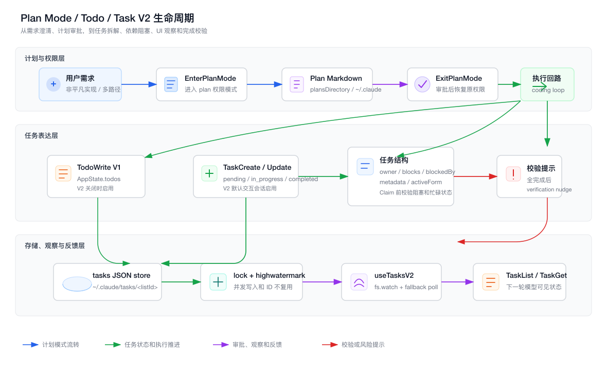
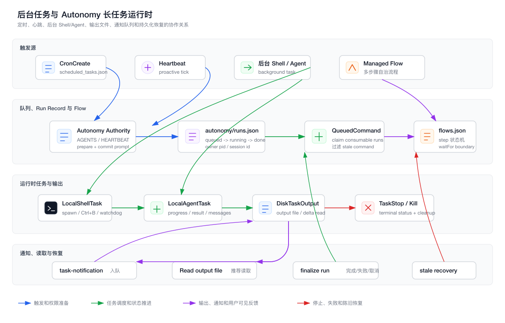

# 第 21 章：Plan Mode、Todo、Task 与 Autonomy 长任务执行系统

> 本章只分析 `claude-code/` 子目录下的实现。所有源码路径都以 `claude-code/` 为根，文档与图表落在 `tech-docs/new/`。

上一章讲的是代码搜索、文件读取与上下文构建系统。

那一章回答的是：

```text
模型如何在真实仓库里找到代码？
模型如何读取有限片段，而不是把整个项目塞进上下文？
系统如何记住模型看过哪些文件版本，给后续编辑做安全校验？
```

到这里，Claude Code 已经具备了一个 Coding Agent 的基础感知能力：

```text
看目录
搜代码
读文件
理解上下文
修改文件
拿到诊断反馈
```

但是，一个真正能干活的 Agent 不能只“看懂代码”。

它还必须能持续推进任务。

这就是本章要讲的系统：

```text
Plan Mode
TodoWrite
Task V2
后台 Task runtime
Cron / Scheduled Task
Autonomy runs / flows
```

它们看起来像几组不同功能：

- 计划模式。
- Todo 清单。
- 多 Agent 任务分配。
- 后台 Shell / Agent。
- 定时任务。
- 自治运行记录。

但从架构上看，它们解决的是同一个问题：

> 如何把一句自然语言需求，变成一个可以被持续推进、可以被观察、可以被恢复、可以被多人协作的执行系统。

本章先用两张图建立全局结构。

第一张图展示 Plan Mode、TodoWrite 和 Task V2 如何共同组成“任务表达层”：



第二张图展示后台任务、输出文件、通知队列、定时触发和 Autonomy run record 如何组成“长任务运行时”：



## 21.1 源码入口总览

本章涉及的源码分布比较广，因为“任务推进”不是一个孤立工具，而是横跨 prompt、工具、状态、UI、磁盘持久化和队列系统。

| 模块 | 职责 |
| --- | --- |
| `packages/builtin-tools/src/tools/EnterPlanModeTool/EnterPlanModeTool.ts` | 进入计划模式，切换权限上下文 |
| `packages/builtin-tools/src/tools/EnterPlanModeTool/prompt.ts` | 模型何时应该进入 Plan Mode 的策略说明 |
| `packages/builtin-tools/src/tools/ExitPlanModeTool/ExitPlanModeV2Tool.ts` | 退出计划模式、触发用户审批、恢复原权限 |
| `packages/builtin-tools/src/tools/ExitPlanModeTool/prompt.ts` | 模型如何提交计划审批 |
| `src/utils/plans.ts` | plan 文件路径、slug、远程 snapshot、resume/fork 恢复 |
| `src/utils/planModeV2.ts` | plan mode v2 实验、探索 agent 数量、interview phase 开关 |
| `packages/builtin-tools/src/tools/TodoWriteTool/TodoWriteTool.ts` | Todo V1 写入工具 |
| `packages/builtin-tools/src/tools/TodoWriteTool/prompt.ts` | Todo 使用时机、状态规范、完成标准 |
| `src/utils/todo/types.ts` | TodoItem 类型定义 |
| `packages/builtin-tools/src/tools/TaskCreateTool/TaskCreateTool.ts` | Task V2 创建任务 |
| `packages/builtin-tools/src/tools/TaskUpdateTool/TaskUpdateTool.ts` | Task V2 更新任务、依赖、owner、完成 hook |
| `packages/builtin-tools/src/tools/TaskListTool/TaskListTool.ts` | Task V2 列表读取 |
| `packages/builtin-tools/src/tools/TaskGetTool/TaskGetTool.ts` | Task V2 单任务详情读取 |
| `src/utils/tasks.ts` | Task V2 schema、磁盘存储、锁、依赖、claim 逻辑 |
| `src/hooks/useTasksV2.ts` | Task V2 UI 观察器，fs.watch 与轮询兜底 |
| `src/Task.ts` | 后台运行时 Task 类型、状态、ID 生成 |
| `src/tasks/types.ts` | 各类后台任务状态 union |
| `src/utils/task/framework.ts` | registerTask、pollTasks、通知、offset patch、GC |
| `src/utils/task/diskOutput.ts` | 后台任务输出文件、增量读取、5GB 上限、防 symlink |
| `src/tasks/LocalShellTask/LocalShellTask.tsx` | 后台 Bash 任务、Ctrl+B、stall watchdog |
| `src/tasks/LocalAgentTask/LocalAgentTask.tsx` | 后台 Agent 任务、进度、结果、通知 |
| `packages/builtin-tools/src/tools/TaskOutputTool/TaskOutputTool.tsx` | 读取后台任务输出的兼容工具 |
| `packages/builtin-tools/src/tools/TaskStopTool/TaskStopTool.ts` | 停止后台任务 |
| `src/tasks/stopTask.ts` | 根据 task type 分发 kill |
| `packages/builtin-tools/src/tools/ScheduleCronTool/CronCreateTool.ts` | 创建 cron 定时任务 |
| `src/utils/cronTasks.ts` | `.claude/scheduled_tasks.json` 的读写、校验、触发记录 |
| `src/hooks/useScheduledTasks.ts` | 定时任务 fire 后注入 queued command 或 teammate message |
| `src/utils/autonomyAuthority.ts` | Autonomy 执行前加载 AGENTS / HEARTBEAT 权限上下文 |
| `src/utils/autonomyRuns.ts` | `.claude/autonomy/runs.json`，run 生命周期持久化 |
| `src/utils/autonomyQueueLifecycle.ts` | queued command 认领、取消、完成、失败收口 |
| `src/utils/autonomyFlows.ts` | `.claude/autonomy/flows.json`，多步骤自治流程状态机 |
| `src/cli/handlers/autonomy.ts` | autonomy CLI 状态查看、取消、恢复 |

这里有一个很容易混淆的点：

```text
Task V2:
  面向模型和团队协作的“工作项”
  pending / in_progress / completed
  存储在 ~/.claude/tasks/<taskListId>/*.json

Runtime Task:
  面向进程和 UI 的“后台运行单元”
  pending / running / completed / failed / killed
  存储在 AppState.tasks，输出落到 task output 文件
```

这两个都叫 Task，但它们不是同一层东西。

可以类比前端：

```text
Task V2        -> Jira issue / Redux entity
Runtime Task   -> Promise / Web Worker / background job
```

一个描述“要做什么”，一个描述“某段执行正在跑”。

## 21.2 从“会读代码”到“能推进任务”

传统 IDE 的核心动作是：

```text
用户想
用户点
用户改
用户保存
用户运行
```

Coding Agent 的核心动作变成：

```text
用户描述目标
Agent 理解目标
Agent 拆解任务
Agent 逐步执行
Agent 自己检查
Agent 在必要时等待用户确认
```

这中间最大的变化，不是工具多了。

而是状态变复杂了。

一个真实开发需求通常不是单步动作：

```text
读需求
定位入口
梳理调用链
设计改法
改代码
补测试
跑检查
修失败
总结结果
```

如果没有任务系统，模型只能靠上下文里的自然语言记忆：

```text
我刚刚好像说过要先改 A，再改 B，然后跑测试。
```

这在短任务里还能忍。

一旦任务变长，就会出现典型问题：

- 忘了某个步骤。
- 同时做两件事导致状态乱掉。
- 误把半完成任务标记完成。
- 多 Agent 协作时不知道谁负责什么。
- 后台任务完成后没人消费结果。
- 定时任务触发了，但不知道上一次是否还在跑。

所以 Claude Code 把任务推进拆成四层：

```text
Plan Mode:
  先对齐方案和权限边界

Todo / Task V2:
  把工作项结构化

Runtime Task:
  把长耗时执行变成可观察后台任务

Autonomy:
  把定时、心跳、多步骤流程变成可恢复的执行账本
```

这就是本章的主线。

## 21.3 Plan Mode 是需求到执行之间的“事务准备阶段”

很多人第一次看 Plan Mode，会以为它只是一个用户体验功能：

```text
先写计划，再让用户点确认。
```

但从架构上看，它更像数据库事务里的 prepare 阶段。

普通模式下，模型可以直接调用写文件工具、Bash、编辑工具。

Plan Mode 下，模型的职责变成：

```text
探索代码
澄清需求
识别约束
提出计划
等待用户批准
```

真正的关键不是“写不写计划”，而是：

> 在执行有风险的任务前，先把 Agent 的权限、意图和用户预期锁定到一个可审查的中间态。

这和前端里的“提交前预览”很像。

比如你做一个低代码平台，用户点“发布”之前，系统通常会先展示：

```text
将修改 3 个页面
将新增 2 个 API 调用
将影响线上路由 /foo
是否确认发布？
```

Plan Mode 对 Coding Agent 的意义类似。

它在自然语言执行前加了一个 review gate。

## 21.4 EnterPlanMode：切换的不是 UI，而是权限上下文

`EnterPlanModeTool` 的核心动作不是打开某个面板，而是修改 `toolPermissionContext`。

它会调用：

```text
handlePlanModeTransition(currentMode, 'plan')
applyPermissionUpdate(..., { type: 'setMode', mode: 'plan', destination: 'session' })
```

这说明 Plan Mode 不是一个提示词标签。

它进入了权限系统。

`EnterPlanModeTool` 还有几个重要边界：

| 边界 | 设计原因 |
| --- | --- |
| agent context 里不能使用 | 子 Agent 不应该自己切换主会话权限模式 |
| channels active 时禁用 | 避免进入计划模式后没有可用 ExitPlanMode，形成 trap |
| 工具是 deferred | 进入模式会影响后续回合，不是普通同步结果 |
| read-only / concurrency safe | 进入计划模式本身不应修改项目文件 |

`prompt.ts` 也很有意思。

它不是让模型“所有任务都先计划”，而是列出使用条件：

```text
新功能
多文件修改
影响行为的代码变更
架构选择
需求不清
用户偏好会影响方案
```

简单任务可以跳过。

这是一种很实际的产品设计。

如果所有小改动都强制进入计划模式，Agent 会变得像流程审批系统一样笨重。

但如果重大改动不计划，Agent 又容易直接开干，把用户带进错误方向。

所以 Plan Mode 的本质是：

```text
按风险启用的执行前事务。
```

## 21.5 Plan 文件：为什么计划要落盘

`src/utils/plans.ts` 管理 plan 文件。

计划不是只存在内存里的字符串，而是会落到文件：

```text
settings.plansDirectory
  或
~/.claude/plans
```

主会话和子 agent 的 plan 文件路径也不同：

```text
main:
  {slug}.md

agent:
  {slug}-agent-{agentId}.md
```

这个设计解决了几个问题：

第一，用户可以审查真实计划文件。

计划不是藏在 tool input 里的临时文本，而是一个独立 Markdown artifact。

第二，远程会话可以恢复。

`persistFileSnapshotIfRemote()` 会在远程环境里把 plan 内容作为 `file_snapshot` 写进 transcript。

第三，resume / fork 可以带走计划上下文。

`copyPlanForResume()` 和 `copyPlanForFork()` 说明 plan 不是一次性 UI 状态，而是会话生命周期的一部分。

第四，compaction 后仍能找回计划。

如果 plan 文件缺失，恢复逻辑会尝试从 file snapshot、message history、ExitPlanMode tool use input、`plan_file_reference` attachment 等地方找回。

这背后的架构思想是：

> 对长任务有决策意义的中间产物，不能只放在模型上下文里。

模型上下文会压缩。

进程会重启。

远程任务会恢复。

用户会 fork 会话。

所以关键计划必须成为可持久化 artifact。

## 21.6 ExitPlanMode：审批、恢复权限与团队例外

`ExitPlanModeV2Tool` 是 Plan Mode 的出口。

它做的事情比名字复杂：

```text
读取 plan 文件
必要时写回用户编辑后的 plan
请求用户审批
恢复 plan 前的权限模式
处理 auto-mode / dangerous mode 边界
给 teammate 走 leader approval mailbox
把批准后的 plan 回传给模型
```

普通用户场景下，它会触发用户交互：

```text
Exit plan mode?
```

用户批准后，结果会告诉模型：

```text
User has approved your plan.
You can now start coding.
Start with updating your todo list if applicable.
```

这个返回语义非常关键。

ExitPlanMode 不是“计划结束”。

它是“执行开始”。

如果存在 Task 工具，它还会提示模型可以把可并行部分交给团队工具处理。

teammate 场景下，逻辑更复杂。

如果 teammate 需要 leader 审批，ExitPlanMode 不直接恢复执行，而是写一个 `plan_approval_request` 到 `team-lead` mailbox，并把 teammate 标记为等待审批。

这说明 Plan Mode 的审批边界不是只面向人类用户。

在多 Agent 系统里，leader 也可以成为审批者。

## 21.7 为什么 Plan Mode 不能替代 Todo

很多人会问：

```text
既然已经有 plan，为什么还要 Todo / Task？
```

答案是：

```text
Plan 是方案。
Todo / Task 是执行状态。
```

Plan 通常描述：

```text
我准备怎么改
为什么这么改
会影响哪些文件
如何验证
```

Todo / Task 描述：

```text
现在做到哪一步
哪一步正在执行
哪一步完成了
哪一步被阻塞
谁负责
```

这就像前端项目里的两种文档：

```text
技术方案文档:
  说明整体设计

Jira / Linear ticket:
  跟踪执行进度
```

不能用方案文档当任务看板。

也不能用任务看板替代架构方案。

Claude Code 把它们拆开，是因为它们的读写频率、用户、生命周期完全不同。

## 21.8 TodoWrite V1：最轻量的会话内任务清单

`TodoWriteTool` 是旧版任务清单工具。

它的输入是：

```ts
{
  todos: TodoItem[]
}
```

`TodoItem` 来自 `src/utils/todo/types.ts`：

```ts
{
  content: string
  status: 'pending' | 'in_progress' | 'completed'
  activeForm: string
}
```

TodoWrite 有几个关键约束：

- 只在 `isTodoV2Enabled()` 为 false 时启用。
- 结果写入 `AppState.todos`。
- key 使用 `context.agentId ?? getSessionId()`。
- 没有权限检查。
- `shouldDefer: true`，因为它影响会话状态。

如果所有 todo 都完成，工具会把 `appState.todos[todoKey]` 存成空数组。

但它的 tool result 仍会返回 `newTodos`，让模型能看到刚才提交的完成状态。

这个细节体现了两个状态视角：

```text
UI / AppState:
  全部完成后可以清空展示

模型 / tool result:
  仍然需要知道刚才完成了什么
```

## 21.9 Todo prompt 是执行纪律，不是普通说明

`TodoWriteTool/prompt.ts` 的价值不在 API 描述，而在行为约束。

它告诉模型什么时候应该用 Todo：

```text
3 个以上步骤
非平凡任务
用户明确要求
多个任务
收到新指令后
```

也告诉模型什么时候不要用：

```text
单步小事
纯对话
不需要跟踪的微小动作
```

更重要的是状态纪律：

```text
开始做某项前，先标记 in_progress
完成后立即标记 completed
同一时间只能有一个 in_progress
失败、测试没跑过、依赖缺失时不能标记 completed
发现新增工作要加入清单
```

这就是 Agent 的“执行伦理”。

模型本身没有天然的项目管理纪律。

如果不通过工具 prompt 明确约束，它很容易：

- 一口气把所有 todo 标成 completed。
- 没跑测试也说完成。
- 忘记把发现的问题追加到任务清单。
- 同时推进多个 in_progress，导致上下文混乱。

所以 TodoWrite 不是为了好看。

它是在给模型加一个轻量状态机。

## 21.10 Task V2：从个人 Todo 到协作任务账本

`src/utils/tasks.ts` 中的 `isTodoV2Enabled()` 决定是否启用 Task V2：

```ts
if (CLAUDE_CODE_ENABLE_TASKS) return true
return !getIsNonInteractiveSession()
```

也就是说：

```text
交互式 CLI 默认启用 Task V2
非交互式会话默认保留 TodoWrite
环境变量可以强制启用 Task V2
```

Task V2 相比 TodoWrite 多了这些能力：

| 能力 | TodoWrite V1 | Task V2 |
| --- | --- | --- |
| 存储位置 | AppState | `~/.claude/tasks/<listId>/*.json` |
| owner | 无 | 有 |
| blocks / blockedBy | 无 | 有 |
| metadata | 无 | 有 |
| 并发写入 | 依赖单进程状态 | 文件锁 |
| 多 Agent 共享 | 弱 | 强 |
| UI watch | 内存状态 | fs.watch + signal + poll |
| hook | 简单 | TaskCreated / TaskCompleted |

这说明 Task V2 的定位不再是“个人待办列表”。

它是多执行体共享的任务账本。

## 21.11 Task schema：为什么字段这样设计

Task V2 的核心 schema 是：

```ts
{
  id: string
  subject: string
  description: string
  activeForm?: string
  owner?: string
  status: 'pending' | 'in_progress' | 'completed'
  blocks: string[]
  blockedBy: string[]
  metadata?: Record<string, unknown>
}
```

每个字段都对应一个真实工程问题。

`subject` 是列表视图里的短标题。

`description` 是执行者真正需要看的细节。

`activeForm` 是 UI 里显示“正在做什么”的动词进行时。

`owner` 让任务可以分配给 teammate。

`blocks` 和 `blockedBy` 让任务之间有依赖关系。

`metadata` 给实验能力、团队工具或后续扩展留下结构化空间。

这比 TodoItem 重很多。

但它解决的是完全不同的规模问题：

```text
TodoItem:
  单个模型在单个会话中自我约束

Task:
  多个执行体在同一个任务列表上协同
```

## 21.12 taskListId：任务清单必须有“归属域”

Task V2 的文件目录是：

```text
~/.claude/tasks/<taskListId>/*.json
```

`getTaskListId()` 的优先级是：

```text
1. CLAUDE_CODE_TASK_LIST_ID
2. in-process teammate 的 teamName
3. CLAUDE_CODE_TEAM_NAME / leaderTeamName
4. sessionId
```

这个设计非常重要。

如果只有 sessionId，那么多 Agent 就无法共享任务列表。

如果只有 teamName，那么单人会话又会互相污染。

所以它需要一个“归属域”：

```text
单人会话:
  sessionId

团队会话:
  teamName

显式测试或外部集成:
  CLAUDE_CODE_TASK_LIST_ID
```

这和前端缓存里的 query key 很像。

同样是 `tasks`，不同 workspace、不同用户、不同团队必须有不同 cache key。

## 21.13 文件锁与 high water mark：协作系统最怕 ID 复用

Task V2 用 JSON 文件存任务。

最直观的实现是：

```text
读取目录
找最大 id
写入 max + 1.json
```

但多 Agent 并发创建任务时，这会出问题：

```text
Agent A 看到最大 ID 是 3
Agent B 也看到最大 ID 是 3
A 写 4.json
B 也写 4.json
```

所以 `createTask()` 先获取 list-level lock：

```text
ensureTaskListLockFile()
lockfile.lock(.lock, LOCK_OPTIONS)
findHighestTaskId()
writeFile(<id>.json)
```

`LOCK_OPTIONS` 里有 retry 和 backoff，注释明确说明这是为了 10+ swarm agents 并发场景。

还有一个 `.highwatermark` 文件。

它记录“历史上分配过的最大 ID”。

删除任务或 reset task list 时，也会更新 high water mark。

原因是：

> 协作系统里的 ID 一旦被用户、日志、依赖关系或消息引用，就不应该轻易复用。

即使 `4.json` 删除了，新的任务也不应该重新叫 `#4`。

否则旧消息里的 `Task #4` 会指向新任务，调试会非常痛苦。

## 21.14 Task 工具族：CRUD 只是表面

Task V2 对模型暴露四个主要工具：

```text
TaskCreate
TaskUpdate
TaskList
TaskGet
```

表面看像普通 CRUD。

但真正的设计重点是：

```text
创建任务时触发 hook
更新任务时保持依赖和 owner 语义
列表输出过滤已完成 blocker
读取详情前要求模型拿最新状态
失败时返回 non-error result，避免取消同轮其他工具
```

`TaskCreateTool` 创建任务时：

- 默认 status 是 `pending`。
- owner 为空。
- blocks / blockedBy 为空。
- 会执行 `TaskCreated` hooks。
- 如果 hook 返回 blocking error，会删除刚创建的任务，相当于回滚。

`TaskUpdateTool` 更复杂。

它支持：

```text
subject / description / activeForm
status
owner
addBlocks
addBlockedBy
metadata merge
deleted 特殊状态
```

当 status 改成 `completed` 时，会执行 `TaskCompleted` hooks。

如果 hook 阻塞完成，工具返回：

```text
success: false
```

但这不是 throw。

源码注释明确说明，这是为了避免 `StreamingToolExecutor` 取消同一轮里的其他并行工具。

这就是工程细节。

在 Agent runtime 里，工具失败不仅是业务失败，还可能影响整轮 tool execution。

所以“失败是否抛异常”本身就是协议设计。

## 21.15 owner 与 dependency：从线性任务到任务图

Task V2 的 `blocks` / `blockedBy` 把任务列表变成了任务图。

`blockTask(taskListId, fromTaskId, toTaskId)` 会同时更新两端：

```text
from.blocks += to
to.blockedBy += from
```

这避免了单向边造成的数据不一致。

`claimTask()` 则体现了协作执行的基本规则：

```text
任务不存在 -> 失败
已经有 owner -> 失败
已经完成 -> 失败
有未完成 blocker -> 失败
当前 agent 已忙 -> 失败
否则设置 owner
```

这和工作流引擎非常接近。

一个 worker 不能随便拿任务。

它必须先确认：

- 任务还存在。
- 没有被别人认领。
- 依赖已经完成。
- 自己没有同时处理另一个任务。

如果把 Agent 看成 worker，那么 Task V2 就是一个很轻量的调度队列。

## 21.16 TaskList UI：文件系统状态如何变成可见进度

`src/hooks/useTasksV2.ts` 是 Task V2 的 UI 观察层。

它用一个 singleton `TasksV2Store` 包住状态订阅。

它的刷新来源有三种：

```text
fs.watch
onTasksUpdated in-process signal
fallback poll
```

为什么需要三种？

因为任务可能被不同来源修改：

```text
当前进程内工具调用:
  onTasksUpdated 最快

其他 teammate 进程写 JSON 文件:
  fs.watch 可以捕获

文件系统 watch 丢事件或平台表现不一致:
  fallback poll 兜底
```

当所有任务完成后，hook 会延迟一段时间隐藏，然后 `resetTaskList(currentId)`。

这个行为说明 Task V2 的 UI 不只是静态文件查看器。

它在做会话体验管理：

```text
任务完成后给用户短暂看到结果
然后收起，避免 UI 长期占位
下一批任务重新开始展示，但编号继续前进
```

但 high water mark 又避免历史 ID 被复用。

这是 UI 体验和数据一致性的折中。

## 21.17 Todo / Task 的完成校验提示

TodoWrite 和 TaskUpdate 都有一个相似逻辑：

```text
如果所有任务都完成
且任务数 >= 3
且没有 verification 相关任务
且特性开关满足
则提示需要 verification agent
```

这个 nudge 不会强制执行。

它只是提醒模型：

```text
你完成了很多步骤，但没有明确验证步骤。
是否应该起一个 verification agent 或补验证任务？
```

这反映了 Claude Code 一个很重要的产品方向：

> 任务系统不只是记录进度，也可以反向约束模型的工程质量。

真实开发里，“完成”不等于“代码写完”。

完成至少包括：

- 实现完成。
- 测试或检查通过。
- 没有明显回归。
- 用户要求的验证路径已覆盖。

把这种质量门槛注入 Todo / Task 系统，比只在最终回答里提醒更可靠。

因为它发生在模型标记完成的瞬间。

## 21.18 两个 Task 世界：任务账本与运行时任务

到这里必须停下来区分两个概念。

Claude Code 里有两套 Task：

```text
src/utils/tasks.ts:
  Task V2 工作项

src/Task.ts + src/tasks/*:
  后台运行时任务
```

它们的状态也不同：

```text
Task V2:
  pending / in_progress / completed

Runtime Task:
  pending / running / completed / failed / killed
```

为什么不合并？

因为它们表达的是两种不同生命周期。

一个工作项可能需要多个 runtime task：

```text
Task #3: 修复登录测试
  -> 后台跑 pnpm test
  -> 后台跑 lint
  -> 起一个 local_agent 继续排查
```

一个 runtime task 也可能只是某个临时命令，并不对应任何 Task V2 工作项：

```text
后台跑一个长时间 grep
后台启动 dev server
后台等待 remote agent
```

所以正确分层是：

```text
Task V2:
  表达“工作管理”

Runtime Task:
  表达“执行实体”
```

这就像前端里：

```text
业务订单:
  order entity

网络请求:
  fetch promise
```

你不会把订单状态和 fetch 状态混成一个字段。

## 21.19 Runtime Task 的基础类型

`src/Task.ts` 定义后台任务类型：

```ts
type TaskType =
  | 'local_bash'
  | 'local_agent'
  | 'remote_agent'
  | 'in_process_teammate'
  | 'local_workflow'
  | 'monitor_mcp'
  | 'dream'
```

Runtime status 是：

```ts
'pending' | 'running' | 'completed' | 'failed' | 'killed'
```

所有 runtime task 都有一组基础字段：

```ts
{
  id
  type
  status
  description
  toolUseId?
  startTime
  endTime?
  outputFile
  outputOffset
  notified
}
```

这里最值得关注的是：

```text
outputFile
outputOffset
notified
```

它们共同构成后台任务的“增量输出协议”：

```text
任务持续写 outputFile
框架记录上次读到 outputOffset
完成后通过 notified 避免重复通知
```

Task ID 也不是简单自增。

`generateTaskId(type)` 使用类型前缀加 8 位 base36 随机字符：

```text
local_bash        -> bxxxxxxxx
local_agent       -> axxxxxxxx
remote_agent      -> rxxxxxxxx
in_process_team   -> txxxxxxxx
```

注释里提到 36^8 组合量，足以抵抗暴力猜测 symlink 攻击。

这说明后台输出文件路径也被纳入安全设计。

## 21.20 registerTask 与 pollTasks：后台任务如何进入系统

`src/utils/task/framework.ts` 是 runtime task 的基础框架。

`registerTask()` 把任务写入 `AppState.tasks`。

如果是 resume 造成的 replacement，它会保留 UI 相关状态：

```text
retain
startTime
messages
diskLoaded
pendingMessages
```

这避免了恢复任务时把用户正在看的 transcript 或 retain 状态清掉。

首次注册任务时，还会发 SDK event：

```text
system / task_started
```

`pollTasks()` 则做周期性扫描：

```text
generateTaskAttachments()
applyTaskOffsetsAndEvictions()
enqueueTaskNotification()
```

其中 `generateTaskAttachments()` 有一个关键防御：

它只返回 offset patch，而不是完整 task snapshot。

注释里解释了原因：

```text
异步读取 output delta 时，任务可能已经完成。
如果把旧 snapshot 整体写回，就会把 completed 覆盖回 running。
```

这是典型的前端并发状态问题。

类似 React 里：

```text
await 之后不能拿旧 state 整体 set 回去
必须基于最新 prev 合并局部 patch
```

Claude Code 在后台任务系统里也遇到同样问题。

## 21.21 DiskTaskOutput：长任务输出不能只放内存

`src/utils/task/diskOutput.ts` 管理后台任务输出文件。

它解决的是一个非常现实的问题：

```text
后台命令可能输出很多内容。
Agent 结果可能很长。
进程可能暂停、恢复、清理 UI。
模型不应该每轮都吃完整输出。
```

所以输出落到磁盘：

```text
<project temp dir>/<session id>/tasks/<taskId>.output
```

session id 在第一次调用时被捕获。

这样即使后续 `/clear` 改变会话状态，正在运行的后台任务仍然写到原来的输出目录。

`DiskTaskOutput` 还有几个重要细节：

| 设计 | 目的 |
| --- | --- |
| 队列化写入 | 避免并发 append 打乱 |
| Buffer splice | 写完后释放内存，避免 promise 链保留大字符串 |
| `O_NOFOLLOW` | Unix 上防 symlink 攻击 |
| 5GB 上限 | 防止无限输出打爆磁盘 |
| delta 读取 | 每轮只读新增内容 |
| symlink init | local_agent 可以把输出指向 session transcript |

这已经不是普通日志文件。

它是 Agent runtime 的输出总线。

## 21.22 LocalShellTask：后台 Bash 不是简单 spawn

`src/tasks/LocalShellTask/LocalShellTask.tsx` 管理后台 shell。

在用户体验上，它支持：

```text
后台执行长命令
前台命令 Ctrl+B 后转后台
任务完成后通知
TaskStop / Kill 停止
```

但它还有一个很工程化的机制：

```text
stall watchdog
```

它每 5 秒检查一次输出。

如果输出 45 秒没有增长，并且 tail 看起来像交互式提示：

```text
(y/n)
Continue?
Press any key
```

就发出 task notification，提示这个命令可能卡在交互输入上。

这解决的是 Coding Agent 很常见的坑：

```text
npm create ...
git rebase ...
某些 CLI 安装器 ...
```

它们会等待用户输入，但模型以为命令还在“正常运行”。

一个成熟 Agent 不能只知道“进程还活着”。

它还要识别“进程活着但没人能继续推进”。

## 21.23 LocalAgentTask：后台 Agent 是可恢复的子执行体

`LocalAgentTask` 比 shell 更复杂。

它维护：

```text
agentId
prompt
agentType
model
abortController
error
result
progress
retrieved
messages
pendingMessages
retain
diskLoaded
evictAfter
```

这说明后台 agent 不是一次性 promise。

它更像一个轻量子会话。

它需要：

- 汇报工具调用进度。
- 统计 token。
- 记录最近活动。
- 支持 SendMessage 追加消息。
- 支持 resume 替换 task state。
- 在完成后把结果整理成 task notification。

`enqueueAgentNotification()` 会生成包含 task id、output file、status、summary、result、usage、worktree 信息的 XML 式通知。

同时它会设置 `notified`，避免重复投递。

这一层把后台 Agent 的执行结果重新送回主会话。

也就是说：

```text
主 Agent 发起子 Agent
子 Agent 独立执行
输出写文件 / transcript
完成后通知主 Agent
主 Agent 再决定下一步
```

这就是多 Agent 系统最小闭环。

## 21.24 TaskOutputTool 与 TaskStopTool

`TaskOutputTool` 已经带有 deprecated 意味，描述里明确说优先用 Read 读取 task output file。

但它仍然实现了兼容能力：

```text
block=false:
  立即返回当前状态

block=true:
  每 100ms 轮询，直到任务不再 running/pending 或 timeout
```

它支持不同 task 类型的输出整理：

```text
local_bash:
  ShellCommand task output 或磁盘文件

local_agent:
  优先返回干净 final assistant text

remote_agent:
  包含 prompt
```

`TaskStopTool` 则只做一件事：

```text
停止正在 running 的后台任务
```

真正 kill 分发在 `src/tasks/stopTask.ts`。

它按 task type 找实现。

对于 LocalShell，停止时会抑制类似 exit code 137 的重复 XML 通知，避免用户看到两次“任务被杀”。

这说明后台任务系统不只是执行，还管理通知语义。

## 21.25 CronCreate：定时任务不是 cron 字符串这么简单

`CronCreateTool` 允许模型创建定时任务。

输入包括：

```text
cron
prompt
recurring
durable
```

表面上它只是把 cron 表达式写进去。

但 `src/utils/cronTasks.ts` 处理了更多事情：

```text
持久化路径:
  <project>/.claude/scheduled_tasks.json

任务字段:
  id
  cron
  prompt
  createdAt
  lastFiredAt
  recurring
  permanent
  runtime
  agentId
```

`readCronTasks()` 会验证文件形态和 cron parse。

无效任务会被丢弃。

`CronCreateTool` 也会校验：

```text
cron 必须能在一年内找到下一次触发
最多 50 个任务
durable teammate cron 不合法
durable 能力受 feature gate 控制
```

这就是生产系统里的定时任务设计。

你不能只把用户给的 cron 字符串塞进文件。

必须考虑：

- 表达式是否合法。
- 下一次是否可计算。
- 数量是否限制。
- 持久任务和会话任务的区别。
- teammate 生命周期是否能承载 durable cron。

## 21.26 useScheduledTasks：触发后如何进入 Agent Loop

`src/hooks/useScheduledTasks.ts` 负责把 cron fire 转成真正的执行。

关键函数是：

```text
createScheduledTaskQueuedCommand()
```

它调用：

```text
createAutonomyQueuedPromptIfNoActiveSource()
```

这里有一个重要防重逻辑：

```text
如果同一个 source 已经有 queued / running run，就不再创建重复执行。
```

这非常关键。

否则一个每分钟触发的任务，如果上一次还没跑完，就会堆积：

```text
第 1 分钟任务还在跑
第 2 分钟又进来一个
第 3 分钟再进来一个
...
```

最后 Agent 会被自己创建的任务淹没。

对于 teammate 定时任务，hook 会尝试把消息注入到对应 teammate。

如果 teammate 不存在，就移除孤儿 cron。

对于主线程任务，则会加入 scheduled task fire meta message，并入队 pending notification。

所以 scheduled task 不是直接调用模型。

它先变成一个 queued command，再进入统一的 autonomy 生命周期。

## 21.27 Autonomy Authority：自治执行也必须先加载权限上下文

`src/utils/autonomyAuthority.ts` 做的是自治执行前的“authority prompt”准备。

`prepareAutonomyTurnPrompt()` 会加载：

```text
AGENTS
HEARTBEAT
due heartbeat tasks
当前 rootDir / currentDir
当前时间
```

然后把这些内容包进：

```text
<autonomy_authority>
  ...
</autonomy_authority>
```

再拼到 base prompt 前面。

这说明 Autonomy 不是“跳过上下文，后台直接跑”。

它仍然要经过权限和指令加载。

只是触发源从“用户此刻输入”变成了：

```text
定时任务
心跳任务
managed flow step
proactive tick
```

`commitPreparedAutonomyTurn()` 会在真正创建 queued prompt 后，标记 heartbeat task 已消费。

这避免了准备了 prompt 但没真正进入队列时，提前消耗任务。

这里的设计和数据库事务也很像：

```text
prepare:
  读取 authority / due tasks

commit:
  queued command 成功落账后再标记消费
```

## 21.28 autonomy/runs.json：自治执行的账本

`src/utils/autonomyRuns.ts` 管理：

```text
.claude/autonomy/runs.json
```

一个 run record 包含：

```ts
{
  runId
  runtime
  trigger
  status
  rootDir
  currentDir
  ownerKey
  sourceId
  sourceLabel
  parentFlowId
  flowStepId
  promptPreview
  createdAt
  ownerProcessId
  ownerSessionId
  startedAt
  endedAt
  error
}
```

status 是：

```text
queued
running
completed
failed
cancelled
```

这套账本解决几个问题。

第一，去重。

`createAutonomyRunIfNoActiveSource()` 可以避免同一个 source 重复创建 active run。

第二，可观察。

用户可以通过 autonomy CLI 或 panel 查看最近 run。

第三，可恢复。

如果进程死了，active run 不能永远卡在 running。

代码里有 stale recovery：

```text
ownerProcessId 不存在或进程已死
  -> 标记 failed
  -> error 使用 Recovered stale active autonomy run 前缀
```

第四，防内存泄漏。

`retainActiveFirst()` 保留 active run 优先，最多保留一定数量历史。

如果 active run 数超过阈值，会打日志告警。

这说明 Autonomy 是按“分布式任务账本”思路设计的。

哪怕现在只跑在本地，也已经考虑了进程死亡、重复触发、历史膨胀和状态可解释性。

## 21.29 autonomyQueueLifecycle：queued command 不能盲目消费

有了 runs.json，还要把 queued command 和 run record 对齐。

`src/utils/autonomyQueueLifecycle.ts` 做这件事。

它会把 queued autonomy commands 分成：

```text
可消费:
  run 仍是 queued，且没有 startedAt / endedAt

陈旧:
  run 不存在
  run 已 running / completed / failed / cancelled
  run 已经 started 或 ended
```

`claimConsumableQueuedAutonomyCommands()` 会把可消费命令标记为 running。

如果标记失败，就视为 stale。

一轮模型执行结束后，`finalizeAutonomyCommandsForTurn()` 会根据结果收口：

```text
completed:
  mark completed，可能返回 flow 的下一步 command

cancelled:
  mark cancelled

failed:
  mark failed，并清洗错误信息
```

这里有一个很好的抽象：

```text
queued command 是输入队列里的消息
run record 是持久化账本里的生命周期
```

二者必须一致。

不能只看队列。

否则恢复、重复提交、取消、失败都会乱。

## 21.30 Managed Autonomy Flow：多步骤自治流程

`src/utils/autonomyFlows.ts` 把单个 run 扩展成多步骤 flow。

flow record 存在：

```text
.claude/autonomy/flows.json
```

flow status 包括：

```text
queued
running
waiting
blocked
succeeded
failed
cancelled
lost
```

step status 包括：

```text
pending
queued
running
completed
failed
cancelled
```

managed step 有：

```text
name
prompt
waitFor
```

这说明它不是简单 cron。

它可以表达：

```text
第一步：检查状态
第二步：执行修复
第三步：等待某个边界条件
第四步：继续推进
```

`startManagedAutonomyFlow()` 会用 flowKey 去重：

```text
managed:<trigger>:<source>
```

如果已有 active flow，就不会重复创建。

`queueManagedAutonomyFlowStepRun()` 会给当前 step 创建 runId，并把 step 标记 queued。

run 开始、完成、失败时，会同步更新 flow step。

这就是一个轻量 workflow engine。

它没有引入 Temporal / Argo 这种大型依赖，而是用本地 JSON + 状态机满足 Claude Code 的自治流程需求。

## 21.31 为什么需要 Autonomy，而不是让模型自己循环

最简单的自治执行方案是：

```text
模型完成一轮后，如果还有事，就自己再调用自己。
```

听起来很直接，但工业上问题很多：

- 进程死了怎么办？
- 上一次是否还在跑？
- 用户如何查看后台状态？
- 如何取消？
- 如何区分定时触发和用户触发？
- 如何避免同一 source 重复执行？
- 心跳任务是否已经消费？
- 多步骤流程走到哪一步？

所以 Claude Code 没有做一个“无限 while loop agent”。

它把自治执行拆成：

```text
authority prompt
queued command
runs.json
queue lifecycle
flow state
notification
CLI / panel
```

这就是工程化和 demo 的区别。

Demo 只要跑起来。

工程系统要能解释、能停止、能恢复、能去重。

## 21.32 前端工程师如何理解这套系统

可以把本章系统映射到前端架构：

| Claude Code | 前端类比 |
| --- | --- |
| Plan Mode | 提交前预览 / route guard / confirm modal |
| Plan file | 设计文档 artifact / draft document |
| TodoWrite | 组件本地 state 里的 checklist |
| Task V2 | Redux entity / Jira issue / shared board |
| TaskList watcher | store subscription / websocket + polling |
| Runtime Task | Promise / Web Worker / background job |
| DiskTaskOutput | IndexedDB / log stream / downloadable artifact |
| task notification | toast / event bus / push message |
| Cron task | scheduler / setInterval with persistence |
| Autonomy run | job record / workflow execution |
| Managed flow | XState / workflow engine |

最重要的认知是：

> Coding Agent 不是一个“大模型 + 工具列表”，而是一个带状态机、队列、权限、持久化和 UI 反馈的运行时。

前端工程师转 Agent 工程时，最容易低估的就是状态。

模型输出只是其中一环。

真正决定系统稳定性的，是：

```text
状态在哪里？
谁能改？
如何观察？
如何恢复？
如何避免重复？
失败如何收口？
```

本章所有代码都在回答这些问题。

## 21.33 最小实现路径：自己做一个 Claude Code 任务系统

如果你要从 0 到 1 实现一个简化版，不建议一上来就做 Autonomy。

可以按这个顺序推进。

第一步，实现 Todo。

```text
TodoItem:
  content
  status
  activeForm

规则:
  同时只有一个 in_progress
  完成前必须验证
```

这一步让模型具备基本执行纪律。

第二步，实现 Plan Mode。

```text
mode:
  default
  plan

plan mode:
  允许读
  禁止写
  计划落 Markdown
  用户批准后恢复 default
```

这一步让高风险任务有审批边界。

第三步，把 Todo 升级成文件任务账本。

```text
~/.agent/tasks/<sessionOrTeamId>/<id>.json
```

加上：

```text
owner
blocks
blockedBy
metadata
file lock
high water mark
```

这一步支持多 Agent 协作。

第四步，实现后台任务输出文件。

```text
spawn command
write output file
track offset
notify on completion
read output by path
stop task
```

这一步支持长耗时命令。

第五步，实现 scheduled task。

```text
.agent/scheduled_tasks.json
cron parse
lastFiredAt
recurring / one-shot
duplicate active source guard
```

第六步，实现 autonomy runs。

```text
.agent/autonomy/runs.json
queued / running / completed / failed / cancelled
ownerProcessId
stale recovery
CLI status
```

第七步，再做 managed flow。

```text
flows.json
steps
waitFor
step runId
resume / cancel
```

这个顺序很重要。

先做任务纪律，再做权限审批，再做共享任务，再做后台执行，最后做自治。

否则很容易做出一个会无限自我调用、但不可观察也不可停止的 Agent。

## 21.34 常见架构坑

实现这类系统时，有一些坑非常典型。

第一，把 plan 存在上下文里。

短期能跑，长任务一 compact 就丢。

计划必须是 artifact。

第二，Todo 没有状态纪律。

如果不约束一个 in_progress，模型会把 checklist 当完成报告写。

第三，任务 ID 复用。

删除后重用 ID 会让日志、依赖、用户讨论全部混乱。

第四，没有文件锁。

多 Agent 同时创建任务，迟早覆盖。

第五，把后台输出放内存。

长命令输出一多，UI 和模型上下文都会爆。

第六，完成通知重复投递。

后台系统最容易出现：

```text
poll 发一次
task 完成 callback 又发一次
TaskOutput 再标记一次
```

所以需要 `notified` 字段和清晰的通知归属。

第七，队列和账本分离但不校验。

queued command 还在，但 run record 已完成，这种 stale command 必须过滤。

第八，定时任务不做 active source 去重。

这会让 cron 任务在慢执行时堆积。

第九，自治任务没有 ownerProcessId。

进程死后无法判断 running 是否真实存在。

第十，UI 只靠 fs.watch。

跨平台文件 watch 不可靠，需要进程内 signal 和 fallback poll。

## 21.35 测试应该覆盖什么

Claude Code 源码里和本章相关的测试集中在几个区域：

```text
src/utils/__tests__/autonomyRuns.test.ts
src/utils/__tests__/autonomyQueueLifecycle.test.ts
src/utils/__tests__/autonomyFlows.test.ts
src/utils/__tests__/autonomyPersistence.test.ts
src/utils/__tests__/autonomyAuthority.test.ts
src/utils/__tests__/cronTasks.baseline.test.ts
src/utils/__tests__/cronScheduler.baseline.test.ts
src/hooks/__tests__/useScheduledTasks.test.ts
src/cli/handlers/__tests__/autonomy.test.ts
tests/integration/autonomy-lifecycle-user-flow.test.ts
src/tasks/LocalAgentTask/__tests__/LocalAgentTask.test.ts
```

如果自己实现，至少要测这些场景：

```text
Task 创建并发时 ID 不重复
删除任务后 ID 不复用
blocks / blockedBy 双向一致
completed hook 阻塞时不标记完成
所有任务完成但缺少验证时给 nudge
fs.watch 丢事件时 poll 能恢复 UI
后台输出 delta 不会重复读取
任务完成通知不会重复发送
kill running task 后状态进入 terminal
cron 无效表达式被拒绝
cron fire 不会重复创建 active source
queued command 的 run 已 stale 时不会执行
running run 的 ownerProcess 已死时被恢复为 failed
flow step 完成后能推进下一步
flow waitFor 时不会提前跑
cancel flow 后后续 step 不再执行
```

这些测试不是为了追求覆盖率数字。

它们覆盖的是长任务系统最容易出事故的边界。

## 21.36 面试题：如何设计 Coding Agent 的长任务系统

可以用下面这些问题检查候选人是否真正理解本章：

```text
1. Plan Mode 为什么应该接入权限系统，而不是只改 UI 文案？

2. 为什么计划要落盘，而不是作为一条消息留在上下文里？

3. TodoWrite 为什么要限制同一时间只有一个 in_progress？

4. Todo 和 Task V2 的核心差异是什么？

5. Task V2 为什么需要 taskListId？

6. 多 Agent 并发创建任务时，为什么需要文件锁和 high water mark？

7. blocks / blockedBy 为什么要双向维护？

8. TaskUpdate 失败为什么有时不应该 throw？

9. Runtime Task 和 Task V2 为什么不能合并？

10. 后台任务输出为什么要落文件，并用 offset 做增量读取？

11. completed task notification 为什么不能由 pollTasks 和 task callback 同时负责？

12. Cron 触发为什么要先创建 autonomy run，而不是直接向模型发 prompt？

13. runs.json 里的 ownerProcessId 解决什么问题？

14. queued command 为什么还要校验 run record 状态？

15. Managed Flow 和简单 Cron 的区别是什么？
```

好的回答通常会提到：

```text
权限边界
计划 artifact
上下文压缩
执行状态机
协作任务账本
并发写入
任务依赖
后台输出总线
通知去重
可观察性
去重和恢复
进程死亡检测
本地 workflow engine
```

## 21.37 本章小结

本章拆解了 Claude Code 如何从“理解代码”走向“持续推进任务”。

主链路可以总结为：

```text
EnterPlanMode
  -> 切换到计划权限上下文
  -> 读取代码、形成 plan 文件
  -> ExitPlanMode 请求审批并恢复执行权限

TodoWrite / Task V2
  -> 把执行步骤结构化
  -> 记录 pending / in_progress / completed
  -> 通过 owner、blocks、blockedBy 支持多 Agent 协作
  -> 通过 hooks 和 verification nudge 约束质量

Runtime Task
  -> 把长耗时 Shell / Agent 变成后台任务
  -> 输出落盘、增量读取、完成通知、可停止

Scheduled Task / Autonomy
  -> 把时间触发、心跳、managed flow 变成可持久化 run record
  -> queued / running / completed / failed / cancelled 全生命周期可观察
  -> 支持去重、取消、恢复和 stale active run 修复
```

这套系统的核心价值是：

> 把一次自然语言请求，升级成可计划、可跟踪、可协作、可后台运行、可恢复的工程执行链路。

这也是 AI Coding Agent 和普通 Chatbot 的分水岭。

普通 Chatbot 回答问题。

Coding Agent 要管理工作。

下一章可以继续进入团队协作、teammate、mailbox、swarm 与多 Agent 工作分配系统，进一步解释 Claude Code 如何从“单 Agent 执行”扩展到“多执行体协同开发”。
