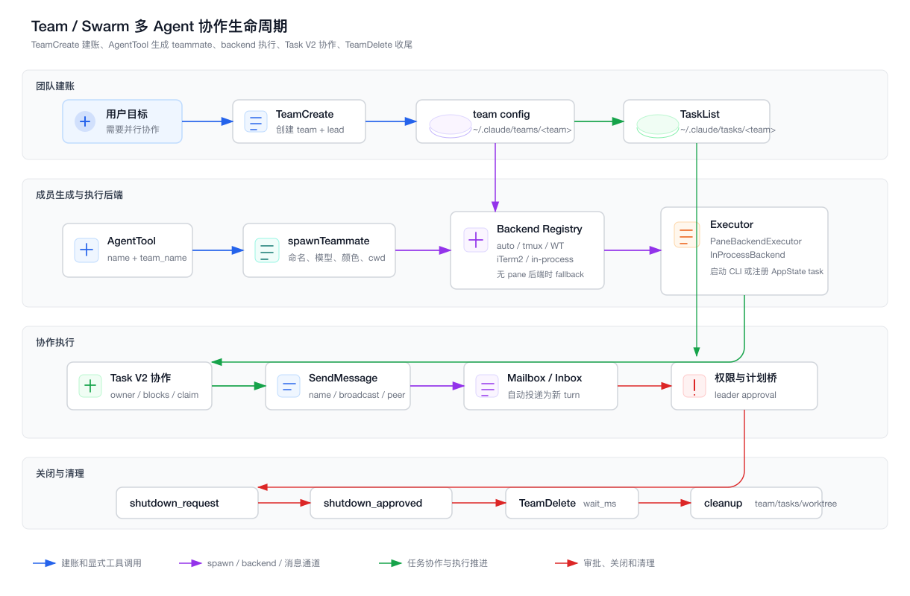
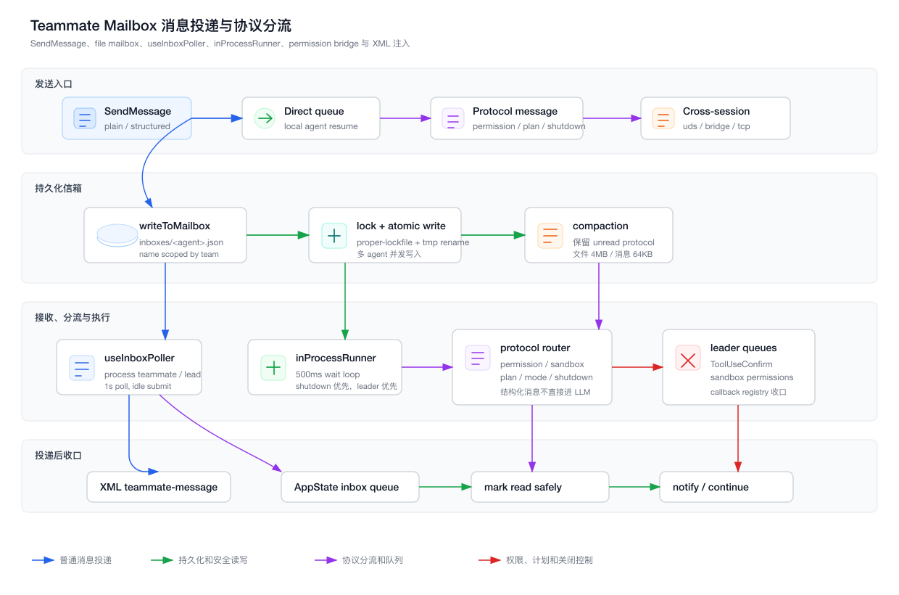

# 第 22 章：Teammate、Mailbox、Swarm 与多 Agent 协作系统

> 本章只分析 `claude-code/` 子目录下的实现。所有源码路径都以 `claude-code/` 为根，文档与图表落在 `tech-docs/new/`。

上一章讲的是 Plan Mode、Todo、Task V2、后台任务与 Autonomy。

那一章回答的是：

```text
Claude Code 如何把一次自然语言请求，变成可计划、可跟踪、可后台运行、可恢复的长任务执行链路？
```

这一章继续向前走一步：

```text
当一个 Agent 不再够用时，Claude Code 如何把工作扩展成一个长期协作的 Agent 团队？
```

第 8 章已经讲过 `AgentTool`、`runAgent()`、`LocalAgentTask` 这些 Sub Agent 主链路。

所以本章不重复讲“一次性子 Agent 如何执行”。

本章聚焦更难的一层：

```text
teammate 是如何成为长期 actor 的？
team config 如何成为团队事实源？
不同执行后端如何统一成 teammate executor？
mailbox 如何在多进程 / 同进程间可靠传递消息？
leader 如何处理 teammate 的权限、计划审批、关闭和清理？
```

这套系统的本质不是“多调用几次模型”。

真正的多 Agent 协作必须有：

- 团队身份。
- 成员注册。
- 共享任务账本。
- 消息通道。
- 权限同步。
- 空闲通知。
- 关闭协议。
- 清理策略。
- UI 可观察状态。

没有这些，所谓 swarm 只是一组互相看不见的并发请求。

本章先用两张图建立全局结构。

第一张图展示 TeamCreate、AgentTool teammate spawn、backend executor、Task V2 和 TeamDelete 的生命周期：



第二张图展示 SendMessage、file mailbox、useInboxPoller、inProcessRunner 和协议消息分流：



## 22.1 源码入口总览

团队协作系统横跨 built-in tools、swarm utils、任务运行时、React hooks、权限系统和 UI 状态。

| 模块 | 职责 |
| --- | --- |
| `src/utils/agentSwarmsEnabled.ts` | Agent Teams / swarm 的中心开关 |
| `packages/builtin-tools/src/tools/TeamCreateTool/TeamCreateTool.ts` | 创建团队、team config、共享 task list |
| `packages/builtin-tools/src/tools/TeamCreateTool/prompt.ts` | 团队工作流、任务分配、消息纪律 |
| `packages/builtin-tools/src/tools/TeamDeleteTool/TeamDeleteTool.ts` | 关闭团队、等待 teammate、清理目录 |
| `packages/builtin-tools/src/tools/TeamDeleteTool/prompt.ts` | 团队收尾 prompt |
| `packages/builtin-tools/src/tools/AgentTool/AgentTool.tsx` | `name + team_name` 分支触发 teammate spawn |
| `packages/builtin-tools/src/tools/AgentTool/prompt.ts` | teammate 场景下 AgentTool 的使用约束 |
| `packages/builtin-tools/src/tools/shared/spawnMultiAgent.ts` | teammate spawn 的统一入口 |
| `src/utils/swarm/teamHelpers.ts` | team file schema、读写、成员删除、模式同步、清理 |
| `src/utils/swarm/backends/types.ts` | PaneBackend 与 TeammateExecutor 抽象 |
| `src/utils/swarm/backends/registry.ts` | backend 检测、auto / tmux / iTerm2 / Windows Terminal / in-process 选择 |
| `src/utils/swarm/backends/PaneBackendExecutor.ts` | pane 后端适配成 TeammateExecutor |
| `src/utils/swarm/backends/InProcessBackend.ts` | 同进程 teammate 后端 |
| `src/utils/swarm/backends/TmuxBackend.ts` | tmux pane / session 后端 |
| `src/utils/swarm/backends/ITermBackend.ts` | iTerm2 pane 后端 |
| `src/utils/swarm/backends/WindowsTerminalBackend.ts` | Windows Terminal 后端 |
| `src/utils/swarm/spawnUtils.ts` | teammate CLI flags、环境变量继承、spawn command |
| `src/utils/swarm/spawnInProcess.ts` | 同进程 teammate task 创建与 kill |
| `src/utils/swarm/inProcessRunner.ts` | 同进程 teammate 长期 loop、idle、task claim、权限桥 |
| `src/utils/teammateContext.ts` | AsyncLocalStorage 隔离同进程 teammate 身份 |
| `src/utils/teammate.ts` | teammate 身份解析、team lead 判断、等待 idle |
| `src/tasks/InProcessTeammateTask/types.ts` | 同进程 teammate task state |
| `src/tasks/InProcessTeammateTask/InProcessTeammateTask.tsx` | teammate task kill、注入消息、查找 task |
| `packages/builtin-tools/src/tools/SendMessageTool/SendMessageTool.ts` | teammate 消息、广播、结构化协议、跨会话发送 |
| `packages/builtin-tools/src/tools/SendMessageTool/prompt.ts` | SendMessage 使用规则 |
| `src/utils/teammateMailbox.ts` | file mailbox、锁、compact、协议消息类型 |
| `src/hooks/useInboxPoller.ts` | 轮询 inbox、协议分流、忙碌队列、XML 注入 |
| `src/utils/swarm/permissionSync.ts` | worker 与 leader 的权限请求/响应消息 |
| `src/hooks/useSwarmPermissionPoller.ts` | 权限响应 callback registry |
| `src/utils/swarm/leaderPermissionBridge.ts` | 同进程 teammate 使用 leader ToolUseConfirm UI 的桥 |
| `src/utils/swarm/teammateInit.ts` | pane teammate 初始化 hook，停止时发 idle notification |
| `src/utils/swarm/reconnection.ts` | resume / fresh spawn 的 teamContext 恢复 |
| `src/utils/swarm/teammatePromptAddendum.ts` | teammate 专属 system prompt addendum |
| `src/state/AppStateStore.ts` | `teamContext`、`inbox`、worker permission queues |

可以把这些文件分成五层：

```text
团队事实层:
  teamHelpers / team config / task list

成员执行层:
  AgentTool / spawnMultiAgent / backend registry / executor

身份隔离层:
  teammate.ts / teammateContext / InProcessTeammateTask

通信层:
  SendMessage / teammateMailbox / useInboxPoller / inProcessRunner

治理层:
  permissionSync / leaderPermissionBridge / TeamDelete / cleanup
```

这五层合在一起，才构成 Claude Code 的 team / swarm 系统。

## 22.2 teammate 和普通 subagent 的差异

普通 subagent 更像一次函数调用：

```text
主 Agent:
  交给子 Agent 一个任务

子 Agent:
  独立跑完
  返回一个结果
```

teammate 更像长期 actor：

```text
team lead:
  创建团队
  分配任务
  发送消息
  处理权限请求
  收到 idle / shutdown / task updates

teammate:
  有名字
  有 teamName
  有 inbox
  有自己的 loop
  可以等待下一条消息
  可以认领 Task V2
  可以和其他 teammate 对话
  可以被请求关闭
```

这就是两者的根本差异：

| 维度 | subagent | teammate |
| --- | --- | --- |
| 生命周期 | 一次性任务 | 长期成员 |
| 身份 | agentId / taskId | `agentName@teamName` |
| 通信 | task notification / result | SendMessage + mailbox |
| 状态 | AppState task | team config + task + inbox |
| 任务来源 | 初始 prompt | 初始 prompt、message、TaskList、Autonomy |
| 权限 | 子 Agent 上下文 | 可走 leader approval |
| 关闭 | TaskStop / abort | shutdown request / approval / cleanup |

所以 teammate 系统不能只复用 `LocalAgentTask`。

它需要额外的团队事实源、消息协议和治理机制。

## 22.3 TeamCreate：团队协作的起点是建账

`TeamCreateTool` 创建团队时做了几件关键事情。

第一，校验功能开关。

```ts
isAgentSwarmsEnabled()
```

当前实现里，swarm 默认可用，可以通过：

```text
CLAUDE_CODE_EXPERIMENTAL_AGENT_TEAMS_DISABLED
```

关闭。

第二，限制一个 leader 同时只管理一个 team。

如果 `appState.teamContext?.teamName` 已存在，`TeamCreate` 会拒绝创建新团队。

这是一个很实际的约束。

多团队并行会让：

```text
TaskList
mailbox
teamContext
权限同步
UI 展示
cleanup
```

全部变复杂。

Claude Code 先选择一个清晰边界：

```text
一个 leader 会话 -> 一个 active team
```

第三，写入 team file。

路径是：

```text
~/.claude/teams/{team-name}/config.json
```

第四，创建共享 task list。

路径是：

```text
~/.claude/tasks/{team-name}/
```

第五，更新 AppState。

```text
teamContext:
  teamName
  teamFilePath
  leadAgentId
  teammates
```

第六，注册 session cleanup。

如果 leader 退出时没有显式 `TeamDelete`，`cleanupSessionTeams()` 仍能清掉这次会话创建的 team。

这就是“建账”的意义。

团队不是临时 prompt 里的概念，而是磁盘上有事实源、AppState 里有上下文、退出时有清理责任的运行时对象。

## 22.4 team config 是团队事实源

`src/utils/swarm/teamHelpers.ts` 定义 `TeamFile`：

```ts
{
  name: string
  description?: string
  createdAt: number
  leadAgentId: string
  leadSessionId?: string
  hiddenPaneIds?: string[]
  teamAllowedPaths?: TeamAllowedPath[]
  members: Array<{
    agentId: string
    name: string
    agentType?: string
    model?: string
    prompt?: string
    color?: string
    planModeRequired?: boolean
    joinedAt: number
    tmuxPaneId: string
    cwd: string
    worktreePath?: string
    sessionId?: string
    subscriptions: string[]
    backendType?: BackendType
    isActive?: boolean
    mode?: PermissionMode
  }>
}
```

这里有几个值得注意的字段。

`leadAgentId` 让系统知道谁是 leader。

`leadSessionId` 用于团队发现和 transcript 关联。

`members` 是 roster。

`backendType` 告诉 cleanup 和 UI 这个成员跑在哪里。

`isActive` 区分 active 和 idle。

`mode` 表示成员当前权限模式。

`teamAllowedPaths` 是团队级权限同步。

这些字段说明 team file 不是普通配置文件。

它是团队运行时的 durable state。

UI、工具、teammate 进程、cleanup 都要读它。

## 22.5 为什么 Team = TaskList

`TeamCreateTool/prompt.ts` 明确说：

```text
Teams have a 1:1 correspondence with task lists.
Team = TaskList.
```

这和上一章 Task V2 的 `taskListId` 是一条线。

单人会话里：

```text
taskListId = sessionId
```

团队会话里：

```text
taskListId = sanitized teamName
```

`TeamCreateTool` 会调用：

```text
resetTaskList(taskListId)
ensureTasksDir(taskListId)
setLeaderTeamName(taskListId)
```

这样 leader 创建的任务和 teammate 看到的任务在同一目录。

如果不这么做，会出现一个严重问题：

```text
leader 写任务到 sessionId 目录
teammate 读任务从 teamName 目录
```

结果就是 leader 以为已经分配了工作，teammate 什么也看不到。

所以 team 创建时必须同时建任务目录，并把 leader 的 task list 解析切到 teamName。

## 22.6 TeamCreate 为什么不设置 leader 的 agent env

`TeamCreateTool` 有一段注释很重要。

它不会给 leader 设置：

```text
CLAUDE_CODE_AGENT_ID
```

原因是：

```text
team lead 不是 teammate
如果给 leader 设置 agent id，isTeammate() 会误判
leader 的 inbox polling 和 team lead 判断会被破坏
```

leader 的身份存在于：

```text
AppState.teamContext
team file leadAgentId
```

而不是进程级 teammate env。

这是身份系统里的边界设计。

同一个团队里，leader 和 teammate 都是成员，但它们不是同一种运行角色。

## 22.7 teammate spawn：AgentTool 的特殊分支

teammate 不是通过 `TeamCreate` 创建的。

`TeamCreate` 只创建 team 和 lead。

真正添加成员，是 `AgentTool` 的特殊分支：

```text
teamName 存在
name 存在
  -> spawnTeammate()
```

对应代码在：

```text
packages/builtin-tools/src/tools/AgentTool/AgentTool.tsx
```

输入字段包括：

```ts
{
  name?: string
  team_name?: string
  mode?: PermissionMode
}
```

如果传了 `name`，并且当前有 teamName，就不是普通 subagent，而是 teammate spawn。

有两个重要限制。

第一，teammate 不能再 spawn teammate。

源码里明确拒绝：

```text
Teammates cannot spawn other teammates.
```

原因是 team roster 是平的。

如果 teammate 再创建 teammate，就会出现嵌套组织结构，但 team file 只知道一个 `leadAgentId` 和平铺 members。

第二，同进程 teammate 不能 spawn background agent。

因为它的生命周期挂在 leader 进程内，后台 agent 生命周期更难治理。

这两个限制体现了一种保守设计：

> 多 Agent 系统要先控制组织结构，再追求灵活性。

## 22.8 spawnMultiAgent：把 teammate 生成编译成后端调用

`packages/builtin-tools/src/tools/shared/spawnMultiAgent.ts` 是 teammate spawn 的统一入口。

它做了几件事情。

第一，解析 team。

如果输入里没有 `team_name`，会使用当前 `appState.teamContext?.teamName`。

如果 team file 不存在，直接报错。

第二，生成唯一 teammate name。

`generateUniqueTeammateName()` 会检查 team file 里的现有成员。

如果已经有 `worker`，新成员会变成：

```text
worker-2
worker-3
...
```

第三，生成 agent id。

```text
formatAgentId(sanitizedName, teamName)
```

结果类似：

```text
researcher@my-team
```

第四，解析 model。

`resolveTeammateModel()` 支持 `inherit`，也会读全局 `teammateDefaultModel`，最后 fallback 到 teammate 默认模型。

第五，分配颜色。

`assignTeammateColor(teammateId)` 让 UI 可以区分成员。

第六，选择执行后端。

```text
getTeammateExecutor(true, ...)
```

第七，spawn 成功后更新两份状态：

```text
AppState.teamContext.teammates
team config members
```

这就是 teammate spawn 的“编译过程”：

```text
模型输入:
  name + prompt + team_name + agent_type + mode

系统解析:
  unique name / agentId / model / color / cwd

运行时选择:
  pane backend 或 in-process backend

状态落账:
  AppState + config.json
```

## 22.9 backend registry：为什么 teammate 需要多种执行后端

Claude Code 支持几种 teammate 后端：

```text
tmux
iTerm2
Windows Terminal
in-process
```

它们的目标不同。

pane-based 后端的目标是：

```text
让 teammate 真正跑在独立终端 pane / tab 里
用户可以看到每个 teammate 的 CLI
```

in-process 后端的目标是：

```text
不依赖外部终端
在同一个 Node.js 进程内跑多个 teammate
适合非交互、无 pane、或 fallback 场景
```

`registry.ts` 的选择逻辑大致是：

```text
显式 windows-terminal:
  Windows + wt.exe

如果当前就在 tmux:
  使用 tmux

如果在 iTerm2:
  优先 iTerm2 + it2 CLI
  否则可 fallback 到 tmux

如果在 Windows Terminal:
  使用 wt.exe

如果系统有 tmux:
  创建外部 tmux swarm session

否则:
  auto 模式 fallback 到 in-process
```

`isInProcessEnabled()` 还有一条重要规则：

```text
非交互会话强制使用 in-process
```

这很合理。

`-p` 这类 headless 场景没有终端 UI，tmux pane 没有意义。

## 22.10 PaneBackendExecutor：把 pane 后端适配成 teammate executor

`PaneBackendExecutor` 的职责是把低层 pane 操作包装成统一的 teammate 生命周期接口。

底层 `PaneBackend` 能做：

```text
createTeammatePaneInSwarmView
sendCommandToPane
setPaneTitle
setPaneBorderColor
killPane
hidePane
showPane
```

但上层希望使用统一接口：

```text
spawn
sendMessage
terminate
kill
isActive
```

这就是 adapter pattern。

spawn 时，`PaneBackendExecutor` 会：

1. 创建 pane。
2. 生成 teammate identity CLI args。
3. 继承 leader 的必要 CLI flags。
4. 继承必要环境变量。
5. 拼出启动命令。
6. `sendCommandToPane()` 执行 Claude Code。
7. 记录 `agentId -> paneId`。
8. 向 teammate inbox 写入初始 prompt。

这里最关键的是第 2 步和第 4 步。

teammate 是一个新进程。

它必须通过 CLI flags 获得身份：

```text
--agent-id
--agent-name
--team-name
--agent-color
--parent-session-id
--plan-mode-required
--agent-type
```

它也必须继承关键环境变量，例如 provider、proxy、config dir、remote 标记等。

否则 teammate 可能和 leader 使用不同模型、不同 provider、不同代理，甚至读错配置目录。

## 22.11 spawnUtils：环境继承不是细节

`src/utils/swarm/spawnUtils.ts` 专门处理 teammate spawn command。

它会继承：

```text
permission mode
model override
settings path
plugin dirs
teammate mode
chrome flag
provider env
proxy env
config dir
remote env
```

注意权限继承里有一个特殊规则：

```text
如果 planModeRequired 为 true，不继承 bypassPermissions。
```

原因很清楚：

```text
plan mode required 是安全约束
bypass permissions 是高权限模式
不能让后者绕过前者
```

这就是多 Agent 系统里的权限传递原则：

> 子执行体可以继承能力，但不能无意绕过父级设置的安全门。

## 22.12 InProcessBackend：同进程 teammate 的价值

`InProcessBackend` 不创建终端 pane。

它调用：

```text
spawnInProcessTeammate()
startInProcessTeammate()
```

它的优势是：

- 不依赖 tmux / iTerm2 / Windows Terminal。
- 非交互模式可用。
- 共享进程内 API client、MCP 连接和资源。
- UI 可以直接通过 AppState 观察 task。

但同进程也带来一个难题：

```text
多个 teammate 并发执行时，不能共用全局 teammate identity。
```

如果用全局变量保存：

```text
currentAgentName = "researcher"
```

那两个 teammate 并发时会互相覆盖。

所以同进程 teammate 使用：

```text
AsyncLocalStorage
```

也就是 `src/utils/teammateContext.ts`。

## 22.13 TeammateContext：同进程身份隔离

`TeammateContext` 保存：

```ts
{
  agentId
  agentName
  teamName
  color
  planModeRequired
  parentSessionId
  isInProcess: true
  abortController
}
```

`runWithTeammateContext(context, fn)` 会在 AsyncLocalStorage 中运行 teammate loop。

`teammate.ts` 里的身份解析优先级是：

```text
1. AsyncLocalStorage
2. dynamicTeamContext
3. AppState teamContext
```

这里要区分两类 teammate：

```text
pane teammate:
  独立进程，通过 CLI args 设置 dynamicTeamContext

in-process teammate:
  同进程并发，通过 AsyncLocalStorage 隔离上下文
```

这也是为什么 `teammate.ts` 不直接读 env。

同进程 teammate 没有独立 env，但仍然需要独立身份。

## 22.14 InProcessTeammateTask：长期 actor 的 AppState 外壳

同进程 teammate 会注册一个 runtime task：

```text
type: 'in_process_teammate'
status: 'running'
```

核心字段在 `InProcessTeammateTaskState`：

```text
identity
prompt
model
selectedAgent
abortController
currentWorkAbortController
awaitingPlanApproval
permissionMode
result
progress
messages
inProgressToolUseIDs
pendingUserMessages
isIdle
shutdownRequested
onIdleCallbacks
lastReportedToolCount
lastReportedTokenCount
```

它和普通 background agent 最大区别是：

```text
普通 background agent 完成后终止
in-process teammate 完成一轮后进入 idle，等待下一条消息或任务
```

`messages` 只是 UI 镜像。

源码里明确限制：

```text
TEAMMATE_MESSAGES_UI_CAP = 50
```

原因是长会话和 swarm burst 下，AppState 里保留完整消息会造成巨大内存开销。

完整会话由 runner 的 `allMessages` 和 transcript 承担，UI 只保留近期片段。

这是很典型的工程权衡。

## 22.15 inProcessRunner：teammate 的长期执行循环

`src/utils/swarm/inProcessRunner.ts` 是同进程 teammate 的核心。

它不是跑一次 `runAgent()` 就结束。

它有一个长期 loop：

```text
处理当前 prompt
  -> runAgent()
  -> 更新 progress / messages
  -> 标记 idle
  -> 发 idle notification
  -> 等待下一条 prompt、shutdown 或 task
```

等待下一条工作时，它会检查三类来源：

第一，内存里的 `pendingUserMessages`。

这用于 UI 中查看 teammate transcript 时直接给它发消息，也用于 scheduled task 注入。

第二，file mailbox。

它会读取 teammate 的 inbox，并优先处理：

```text
shutdown_request
```

shutdown 优先级高于普通消息，避免被 peer-to-peer 聊天淹没。

普通消息里，又优先处理 `team-lead` 的消息。

这体现了组织优先级：

```text
关闭请求 > leader 指令 > peer 消息
```

第三，Task V2。

它会从团队 task list 里找：

```text
pending
无 owner
没有未完成 blocker
```

然后 `claimTask()` 并设置 `in_progress`。

这让 idle teammate 可以主动找活干，而不是只能等 leader 私信。

## 22.16 teammate system prompt：文本输出不等于团队通信

`teammatePromptAddendum.ts` 给 teammate 追加了一段非常关键的 system prompt：

```text
Just writing a response in text is not visible to others on your team.
You MUST use the SendMessage tool.
```

这句话是多 Agent 协作里的核心规则。

普通 subagent 的结果会回到主 Agent。

teammate 不一样。

teammate 是长期 actor，它的一轮 assistant text 不会自动广播给其他成员。

如果它要告诉 leader：

```text
我完成了任务 #3
我发现测试失败
我需要另一个 teammate 帮忙
```

它必须调用 `SendMessage`。

这和真实团队一样。

你在自己 IDE 里写完代码，不等于团队知道了。

你必须发消息、更新任务状态或提交 PR。

## 22.17 SendMessage：多 Agent 的显式通信工具

`SendMessageTool` 支持几类目标：

```text
teammate name
*
uds:<socket-path>
bridge:<session-id>
tcp:<host>:<port>
```

普通团队通信最常用的是：

```json
{"to": "researcher", "summary": "assign task", "message": "Start task #1"}
```

有几个重要规则。

第一，纯文本消息必须有 summary。

summary 用于 UI 预览。

第二，`to` 必须是裸 teammate name，不允许 `name@team`。

因为一个会话只管理一个 team，通信使用 name 而不是 UUID。

第三，广播 `to: "*"` 是线性写入每个 teammate inbox。

prompt 明确说要谨慎使用。

第四，跨会话 bridge / tcp 需要用户授权。

`checkPermissions()` 会对跨机器 bridge 和 LAN tcp 做 safety check。

第五，UDS 地址不能包含 inline auth token。

`SendMessageTool` 会拒绝包含 `#token=` 的 uds 地址，避免 token 进入可观察输入。

这些都说明 SendMessage 不是普通字符串写入。

它是有路由、安全、UI 预览和协议约束的通信工具。

## 22.18 SendMessage 的路由顺序

`SendMessageTool.call()` 的路由大致分几层。

第一层，跨会话目标。

```text
bridge:
  通过 Remote Control peer session 发送

uds:
  通过本机 socket 发送

tcp:
  通过 LAN pipe 发送
```

第二层，本地 agent name registry。

如果 `to` 对应的是 `appState.agentNameRegistry` 里的 local agent，它会：

```text
running:
  queuePendingMessage()

stopped:
  resumeAgentBackground()

task evicted:
  尝试从 transcript resume
```

这说明 SendMessage 不只给 teammate 用。

它也是继续后台 agent 的入口。

第三层，team mailbox。

如果是普通 teammate name：

```text
writeToMailbox(recipientName, ...)
```

如果是 `*`：

```text
读取 team file
给除自己外每个 member 写 inbox
```

第四层，结构化协议消息。

例如：

```text
shutdown_request
shutdown_response
plan_approval_response
```

这些消息会进入专门 handler，而不是当普通聊天。

## 22.19 File mailbox：为什么不用进程内 EventEmitter

`src/utils/teammateMailbox.ts` 实现 file-based messaging。

每个 teammate 有一个 inbox：

```text
~/.claude/teams/{team_name}/inboxes/{agent_name}.json
```

消息结构是：

```ts
{
  from: string
  text: string
  timestamp: string
  read: boolean
  color?: string
  summary?: string
}
```

为什么不用进程内 EventEmitter？

因为 teammate 可能是：

```text
同进程 in-process teammate
tmux pane 里的独立进程
iTerm2 pane 里的独立进程
Windows Terminal 里的独立进程
恢复后的 session
```

只有 file mailbox 同时覆盖这些场景。

它的优点是：

- 跨进程可见。
- 崩溃后仍可恢复 unread 消息。
- leader 和 teammate 不需要保持长连接。
- 和 team config 一样落在 config home 下。

缺点是需要处理并发、体积和 read 状态。

所以 mailbox 不是简单 `appendFile()`。

## 22.20 mailbox 的并发与体积治理

`writeToMailbox()` 的写入流程是：

```text
ensure inbox dir
如果 inbox 不存在，用 wx 创建 []
lock inbox file
重新读取最新消息
校验新消息大小
push unread message
compact
atomic write temp + rename
release lock
```

这里有几个上限：

```text
MAX_MAILBOX_MESSAGES = 1000
MAX_READ_MAILBOX_MESSAGES = 200
MAX_UNREAD_PROTOCOL_MAILBOX_MESSAGES = 2000
MAX_MAILBOX_MESSAGE_TEXT_BYTES = 64KB
MAX_MAILBOX_RETAINED_BYTES = 2MB
MAX_MAILBOX_FILE_BYTES = 4MB
```

`compactMailboxMessages()` 的策略也很讲究：

```text
优先保留 unread protocol messages
再保留 unread regular messages
最后保留最近 read messages
同时受 retained bytes 限制
```

为什么 unread protocol message 要单独保留？

因为它们可能是：

```text
permission_response
plan_approval_response
sandbox_permission_response
shutdown_request
```

这些消息如果被 compact 掉，不只是少一条聊天记录，而是会让 worker 永远等不到决策。

所以 protocol unread 的 retention 优先级高于普通消息。

## 22.21 useInboxPoller：process teammate 和 leader 的收件箱

`src/hooks/useInboxPoller.ts` 负责 React / REPL 侧的 inbox 轮询。

它每 1 秒读一次 unread messages。

但它不是简单把消息全部塞给模型。

它会先分流：

```text
permission_request
permission_response
sandbox_permission_request
sandbox_permission_response
shutdown_request
shutdown_approved
team_permission_update
mode_set_request
plan_approval_request
regular message
```

不同消息走不同路径。

普通 teammate message 会被包装成：

```xml
<teammate-message teammate_id="researcher" color="blue" summary="...">
...
</teammate-message>
```

然后作为新一轮 user turn 交给模型。

如果当前会话 busy 或有 input dialog，它不会直接提交。

它先放进：

```text
AppState.inbox.messages
```

等会话 idle 后再投递。

最关键的是 read 标记时机：

```text
只有消息已经成功提交，或可靠进入 AppState 队列后，才 mark read。
```

这避免了一个严重问题：

```text
读到消息
先标记 read
提交前进程崩溃
消息永久丢失
```

这就是消息系统最基本的 at-least-once 思维。

## 22.22 in-process teammate 为什么不用 useInboxPoller

`useInboxPoller` 里有一个特殊判断：

```text
if (isInProcessTeammate()) return undefined
```

同进程 teammate 不走这个 hook。

原因是：

```text
in-process teammate 和 leader 共享 React context / AppState
如果它也走 useInboxPoller，会把消息路由到 leader UI 体系里
```

所以同进程 teammate 在 `inProcessRunner.waitForNextPromptOrShutdown()` 里自己轮询 mailbox。

这就是两套接收路径：

```text
pane / process teammate:
  React hook useInboxPoller

in-process teammate:
  runner 内部 wait loop
```

二者共用 file mailbox，但消费端不同。

## 22.23 结构化协议消息：聊天通道也是控制面

mailbox 里不仅有普通文本。

还有结构化控制消息。

例如：

```text
idle_notification
permission_request
permission_response
sandbox_permission_request
sandbox_permission_response
plan_approval_request
plan_approval_response
shutdown_request
shutdown_approved
shutdown_rejected
task_assignment
team_permission_update
mode_set_request
```

这些消息让 mailbox 同时承担两种角色：

```text
data plane:
  teammate 之间的自然语言协作

control plane:
  权限、计划审批、关闭、模式同步、任务通知
```

为什么不分两个通道？

因为团队成员可能跨进程、跨终端、同进程。

统一走 mailbox 可以简化传输。

但消费端必须分流。

这就是 `isStructuredProtocolMessage()` 和 `useInboxPoller` 分类逻辑的意义。

结构化协议消息不能随便被包装成普通 LLM 上下文。

否则权限响应可能变成一段聊天文字，worker 仍然等不到 callback。

## 22.24 权限桥：teammate 的 ask 权限如何回到 leader

多 Agent 系统最危险的点之一是权限。

如果 teammate 要执行：

```text
Edit file
Bash dangerous command
network access
```

谁来批准？

Claude Code 有两条路径。

第一，同进程 teammate 优先使用 leader 的 ToolUseConfirm UI。

`leaderPermissionBridge.ts` 注册了：

```text
setToolUseConfirmQueue
setToolPermissionContext
```

`inProcessRunner.createInProcessCanUseTool()` 遇到 `ask` 权限时，会把请求放到 leader 的标准确认队列，并带上 worker badge。

这样 teammate 的 Bash / Edit 权限请求能复用主会话同样的 UI。

第二，如果 bridge 不可用，则走 mailbox。

worker 写：

```text
permission_request
```

leader 的 `useInboxPoller` 收到后，把它转成 `ToolUseConfirm`。

用户批准或拒绝后，leader 写回：

```text
permission_response
```

worker 侧 `useSwarmPermissionPoller` 或 runner 的 callback registry 收到响应后继续执行。

这就是多 Agent 权限同步链路：

```text
worker tool call ask
  -> leader confirmation UI
  -> permission response
  -> worker resumes
```

## 22.25 sandbox 权限也是团队控制面

除了普通 tool permission，还有 sandbox 网络权限。

`permissionSync.ts` 定义：

```text
sandbox_permission_request
sandbox_permission_response
```

worker 请求某个 host 网络访问时，会发送给 leader。

leader 侧 `useInboxPoller` 把它加入：

```text
AppState.workerSandboxPermissions.queue
```

用户决策后再写回 worker。

这说明权限系统不是只管工具。

网络访问这种 sandbox runtime 事件，也要进入 team lead 的治理面。

## 22.26 Plan approval：teammate 的计划如何获得 leader 许可

上一章讲过 `ExitPlanMode` 在 teammate 场景下不会直接退出。

它会向 `team-lead` mailbox 写：

```text
plan_approval_request
```

本章从接收端看这条链路。

`useInboxPoller` 在 leader 侧看到 plan approval request 后，会：

```text
生成 plan_approval_response
写回 teammate inbox
把 teammate 从 awaitingPlanApproval 推进出去
```

当前实现里，leader 侧 poller 对 plan approval request 走 auto-approve 路径，并把 leader 当前 permission mode 传给 teammate。

如果 leader 当前在 `plan`，则 teammate 继承 `default`。

这避免了 teammate 被批准后仍困在 plan mode。

`SendMessageTool` 也保留了显式 `plan_approval_response` 的结构化响应处理，用于更直接的协议交互。

核心原则是：

> teammate 的写操作权限，不能只由 teammate 自己决定；需要 leader 侧上下文参与。

## 22.27 mode_set 与 team permission update

团队系统还支持 leader 改 teammate 权限模式。

`mode_set_request` 的消息形态是：

```text
{
  type: "mode_set_request",
  mode,
  from
}
```

`useInboxPoller` 在 teammate 侧只接受来自 `team-lead` 的 mode change。

收到后会：

```text
applyPermissionUpdate(... setMode ...)
setMemberMode(teamName, agentName, mode)
```

也就是说，本地权限上下文和 team config 都会更新。

`team_permission_update` 则用于团队级 allowed path 之类的同步。

teammate 初始化时，`teammateInit.ts` 也会读取 team file 里的 `teamAllowedPaths`，把团队级 allow rules 应用到自己的 session permission context。

这说明团队权限是双层的：

```text
session local permission context
team config durable permission hints
```

## 22.28 idle notification：空闲不是失败

TeamCreate prompt 里特别强调：

```text
Teammates go idle after every turn.
This is normal.
```

这不是废话。

在长期 actor 模型里，idle 是一个正常状态。

teammate 一轮工作结束后，会通过 Stop hook 或 in-process runner 发送：

```text
idle_notification
```

它可能包含：

```text
idleReason
summary
completedTaskId
completedStatus
failureReason
```

pane teammate 的 idle notification 在 `teammateInit.ts` 里通过 Stop hook 发送。

in-process teammate 在 `inProcessRunner` 每轮结束后发送。

leader 收到 idle notification 后，不应该立刻认为 teammate 不可用。

它表示：

```text
我现在等待下一条消息或任务。
```

这和 worker pool 里的 idle worker 一样。

idle 是可用状态，不是异常状态。

## 22.29 Task assignment：任务状态优先于闲聊状态

团队协作里，普通消息不是唯一协调方式。

Task V2 仍然是主要工作账本。

`TeamCreateTool/prompt.ts` 要求：

```text
创建任务
用 TaskUpdate owner 分配任务
teammate 完成后 TaskUpdate completed
完成后 TaskList 查下一项
```

`TaskUpdateTool` 在 owner 变化时，会向新 owner 写 task assignment message。

in-process runner 还会在 idle loop 里主动 `tryClaimNextTask()`。

所以团队协作有两条协作通道：

```text
Task V2:
  工作状态、owner、依赖、完成情况

SendMessage:
  解释、请求、反馈、提醒、协调
```

不能只靠 SendMessage 说“我做完了”。

真正完成必须落到 TaskUpdate。

这就是为什么 prompt 反复强调：

```text
Do NOT send structured JSON status messages.
Use TaskUpdate to mark tasks completed.
```

## 22.30 shutdown 协议：关闭 teammate 也要协商

`TeamDeleteTool` 不会直接删除所有东西。

它先检查 team file 里的非 leader 成员。

如果有 active members，会尝试发送：

```text
shutdown_request
```

不同 backend 的 terminate 都是“请求关闭”：

```text
InProcessBackend.terminate()
PaneBackendExecutor.terminate()
```

teammate 收到 shutdown request 后，模型需要响应：

```text
shutdown_response approve=true/false
```

如果 approve，`SendMessageTool` 会写回：

```text
shutdown_approved
```

leader 侧收到后：

```text
kill pane 或 abort in-process teammate
remove from team file
unassign teammate tasks
remove AppState.teamContext.teammates
```

这套协议避免了粗暴 kill。

因为 teammate 可能正在：

- 写文件。
- 执行测试。
- 处理用户批准后的任务。
- 等待权限响应。

关闭必须先给 teammate 一个机会收尾。

## 22.31 TeamDelete：清理必须包含目录、任务和 worktree

`TeamDeleteTool` 的收尾流程是：

```text
读取 teamContext.teamName
检查 active teammates
发送 shutdown_request
可选等待 wait_ms
如果仍 active，则拒绝 cleanup
否则 cleanupTeamDirectories()
unregisterTeamForSessionCleanup()
clearTeammateColors()
clearLeaderTeamName()
清空 AppState.teamContext 和 inbox
```

`cleanupTeamDirectories()` 会清：

```text
team directory:
  ~/.claude/teams/{team-name}/

task directory:
  ~/.claude/tasks/{team-name}/

worktrees:
  team file members[].worktreePath
```

worktree 清理先尝试：

```text
git worktree remove --force
```

失败后再 fallback 到 `rm -rf`。

这是因为 teammate 可能在隔离 worktree 中工作。

清 team 不能只删 mailbox。

否则会留下悬空 worktree、任务目录和 pane。

## 22.32 session cleanup：防止孤儿团队

TeamCreate 会调用：

```text
registerTeamForSessionCleanup(finalTeamName)
```

如果用户没有显式 TeamDelete，进程退出时还有：

```text
cleanupSessionTeams()
```

它会：

```text
killOrphanedTeammatePanes()
cleanupTeamDirectories()
```

这解决的是异常退出。

比如：

```text
leader SIGINT
terminal 关闭
进程崩溃
```

如果没有 session cleanup，tmux pane 里的 teammate 可能还在跑，team directory 也会残留。

这类清理不是产品锦上添花。

多 Agent 系统一旦能启动多个执行体，就必须有 orphan cleanup。

## 22.33 resume 与 reconnection

`src/utils/swarm/reconnection.ts` 处理两类情况。

第一，fresh spawn。

`main.tsx` 从 CLI args 里解析：

```text
--agent-id
--agent-name
--team-name
```

然后设置 dynamicTeamContext。

`computeInitialTeamContext()` 会在第一次 render 前同步读 team file，构造 AppState.teamContext。

第二，resume session。

`initializeTeammateContextFromSession()` 可以根据 transcript 里的 teamName / agentName 恢复 teamContext。

这说明 team membership 不只存在于当前 React 状态。

它需要能跨 session 恢复。

否则 teammate 进程恢复后，会失去：

```text
teamName
leader identity
mailbox route
permission sync context
```

## 22.34 AppState 中的团队状态

`AppStateStore.ts` 中有几个关键字段。

`teamContext` 保存：

```text
teamName
teamFilePath
leadAgentId
selfAgentId
selfAgentName
isLeader
selfAgentColor
teammates
```

`teammates` map 里有：

```text
name
agentType
color
tmuxSessionName
tmuxPaneId
cwd
worktreePath
spawnedAt
```

`inbox.messages` 保存忙碌期间尚未投递给模型的 teammate messages。

`workerSandboxPermissions.queue` 保存 leader 侧待处理 sandbox 权限请求。

`pendingWorkerRequest` 和 `pendingSandboxRequest` 保存 worker 侧正在等待 leader 的请求。

这说明团队 UI 不是单一状态。

它分为：

```text
团队结构:
  teamContext

消息缓冲:
  inbox

权限等待:
  worker permission queues

执行实体:
  AppState.tasks
```

多 Agent UI 的难点就是这些状态需要同时展示，并且不能互相覆盖。

## 22.35 前端工程师如何理解 teammate 系统

可以把这套系统映射到前端架构：

| Claude Code | 前端类比 |
| --- | --- |
| TeamCreate | 创建 workspace / project |
| team config | workspace metadata / org roster |
| teammate | 长连接 worker / background tab |
| backend registry | runtime adapter / platform driver |
| PaneBackend | Electron window / terminal pane driver |
| InProcessBackend | Web Worker / shared worker |
| TeammateContext | AsyncLocalStorage 版 request context |
| mailbox | durable message queue |
| useInboxPoller | websocket fallback polling / query subscription |
| SendMessage | event bus publish |
| protocol message | control-plane event |
| permission bridge | parent window permission modal |
| TeamDelete | workspace teardown / worker pool shutdown |

如果你做过前端协同编辑，会更好理解。

多人协作系统不会只靠：

```text
sendMessage(text)
```

它还需要：

```text
presence
roles
permissions
document state
operation log
ack
retry
offline recovery
cleanup
```

Claude Code 的 teammate 系统也是同理。

## 22.36 最小实现路径：从 0 做一个 Agent Team

如果你要自己实现一个简化版，不建议一开始就做 tmux、iTerm2 和 Windows Terminal。

可以按这个顺序。

第一步，实现 team config。

```text
~/.agent/teams/<team>/config.json

fields:
  name
  leadAgentId
  members[]
```

第二步，实现共享 task list。

```text
~/.agent/tasks/<team>/*.json
```

团队所有成员用同一个 taskListId。

第三步，实现 in-process teammate。

```text
AsyncLocalStorage identity
independent AbortController
AppState task
long-running loop
```

第四步，实现 file mailbox。

```text
inboxes/<agent>.json
lock
read/unread
compact
mark read after delivered
```

第五步，实现 SendMessage。

```text
to: name
to: *
summary
plain text only first
```

第六步，实现 inbox poller。

```text
idle submit immediately
busy queue in memory
wrap as <teammate-message>
```

第七步，实现 permission request / response。

```text
worker asks leader
leader UI approves
worker resumes
```

第八步，实现 shutdown protocol。

```text
shutdown_request
shutdown_approved
remove member
unassign tasks
cleanup
```

第九步，再实现 pane backend。

```text
tmux / iTerm2 / Windows Terminal
CLI identity flags
env inheritance
pane cleanup
```

这个顺序的核心是：

> 先做身份、状态和消息，再做炫酷的多窗口体验。

否则很容易做出一堆终端 pane，但没有稳定协作协议。

## 22.37 常见架构坑

第一，把 teammate 当普通 subagent。

这样会丢掉长期身份、消息通道、idle 状态和关闭协议。

第二，team roster 只存在内存。

进程一重启，成员关系、backend type、pane id 全丢。

第三，mailbox 不加锁。

多个 teammate 同时写 leader inbox 时，会覆盖消息。

第四，先 mark read 再投递。

进程在中间崩溃，消息永久丢失。

第五，结构化协议消息直接塞给 LLM。

权限响应和计划审批会变成普通聊天，callback 永远等不到。

第六，不限制 mailbox 大小。

长期 team 会把 inbox 文件写爆。

第七，同进程 teammate 用全局变量保存 identity。

并发执行时身份串线。

第八，teammate 可以 spawn teammate。

flat team roster 会失效，权限和 cleanup 都会变复杂。

第九，TeamDelete 直接 kill。

teammate 可能正在写文件或等待权限，粗暴 kill 容易留下不一致状态。

第十，pane 后端和 in-process 后端各写一套逻辑。

应该抽象成 `TeammateExecutor`，否则 SendMessage、terminate、cleanup 会分叉失控。

## 22.38 测试应该覆盖什么

源码里相关测试包括：

```text
src/utils/__tests__/teammateMailbox.test.ts
src/utils/swarm/__tests__/agentTeamsLifecycle.test.ts
src/utils/swarm/__tests__/spawnInProcess.test.ts
src/utils/swarm/__tests__/spawnUtils.test.ts
src/utils/swarm/backends/__tests__/PaneBackendExecutor.test.ts
src/utils/swarm/backends/__tests__/WindowsTerminalBackend.test.ts
src/hooks/__tests__/swarmPermissionPoller.test.ts
packages/builtin-tools/src/tools/SendMessageTool/__tests__/udsRecipientSanitization.test.ts
```

如果自己实现，至少要测：

```text
TeamCreate 创建 team config 和 task dir
同名 team 自动生成唯一 teamName
spawn teammate 追加 team file member
同名 teammate 生成 worker-2
leader task list 和 teammate task list 指向同一 team
writeToMailbox 并发写不丢消息
mailbox 超限时保留 unread protocol message
mark read 只在投递或可靠入队后发生
useInboxPoller busy 时消息进入 AppState inbox
idle 后 pending inbox 被投递
permission_request 能进入 leader confirmation queue
permission_response 能触发 worker callback 并删除 callback
shutdown_request 优先于普通消息
TeamDelete 遇到 active teammate 会先请求关闭
shutdown_approved 后成员从 team file 和 AppState 移除
TeamDelete 清理 team dir、tasks dir、worktree
in-process teammate kill 会 abort controller 并移除 teamContext 成员
UDS 地址内联 token 被拒绝且可观察输入不泄漏 token
```

这些测试覆盖的是团队系统的核心不变量：

```text
不丢消息
不串身份
不绕权限
不残留孤儿资源
```

## 22.39 面试题：如何设计 Coding Agent 的团队协作系统

可以用这些问题检查候选人是否真正理解多 Agent 工程：

```text
1. teammate 和普通 subagent 的本质区别是什么？

2. 为什么 TeamCreate 要同时创建 team config 和 task list？

3. 为什么 team lead 不应该设置 teammate env identity？

4. AgentTool 为什么用 name + team_name 触发 teammate spawn？

5. 为什么 teammate 不能 spawn teammate？

6. pane backend 和 in-process backend 为什么要抽象成 TeammateExecutor？

7. 同进程 teammate 为什么需要 AsyncLocalStorage？

8. file mailbox 相比 EventEmitter 解决了什么问题？

9. mailbox 写入为什么要 lock + reread + atomic rename？

10. 为什么 unread protocol messages 要有独立 retention？

11. useInboxPoller 为什么不能先 mark read 再投递？

12. 为什么结构化协议消息不能直接作为普通 LLM 上下文？

13. teammate 的 tool permission 为什么要回到 leader？

14. shutdown 为什么是 request/approval 协议，而不是直接 kill？

15. TeamDelete 为什么要清理 worktree 和 task dir？
```

好的回答通常会提到：

```text
长期 actor
团队事实源
共享任务账本
跨进程消息队列
AsyncLocalStorage 身份隔离
控制面和数据面分流
权限桥
消息投递时机
关闭协议
orphan cleanup
```

## 22.40 本章小结

本章拆解了 Claude Code 的 teammate、mailbox、swarm 与多 Agent 协作系统。

主链路可以总结为：

```text
TeamCreate
  -> 创建 team config
  -> 创建共享 task list
  -> 注册 leader teamContext 和 cleanup

AgentTool(name + team_name)
  -> spawnTeammate
  -> 解析唯一 name / agentId / model / color / cwd
  -> 选择 pane backend 或 in-process backend
  -> 更新 AppState 和 team file

teammate runtime
  -> pane teammate 通过 CLI args 和 mailbox 加入团队
  -> in-process teammate 通过 AsyncLocalStorage 隔离身份
  -> runner 每轮完成后 idle，等待 message / task / shutdown

SendMessage + mailbox
  -> 文本消息和结构化协议都落到 inbox file
  -> lock + compact + unread protocol retention 保证可靠性
  -> useInboxPoller / inProcessRunner 分类消费

permission / plan / shutdown
  -> worker 请求 leader 决策
  -> leader UI 或 mailbox response 收口
  -> TeamDelete 通过 shutdown protocol 和 cleanup 完成收尾
```

这套系统的核心价值是：

> 把多个模型调用，升级成有身份、有任务、有消息、有权限、有生命周期的协作团队。

这也是从“并发 subagent”到“Agent organization”的关键跃迁。

下一章可以继续深入 UI、团队面板、任务树、teammate transcript 与用户如何在终端中观察和操控一个多 Agent 团队。
