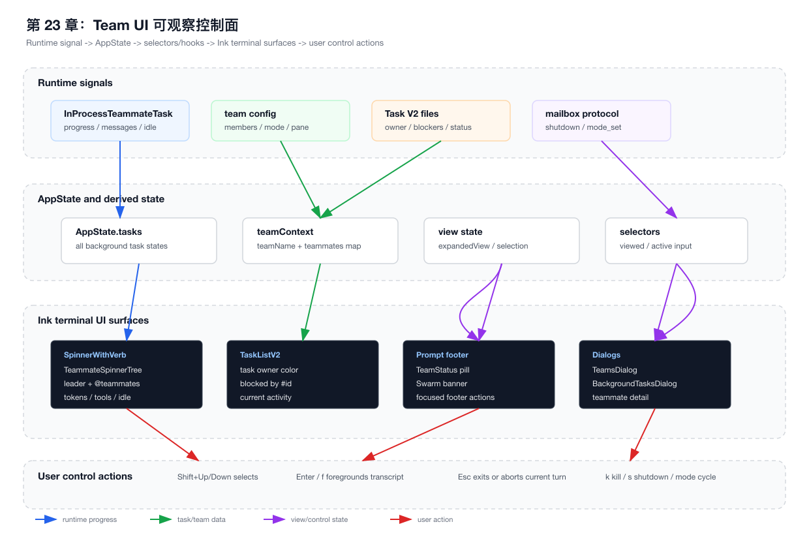
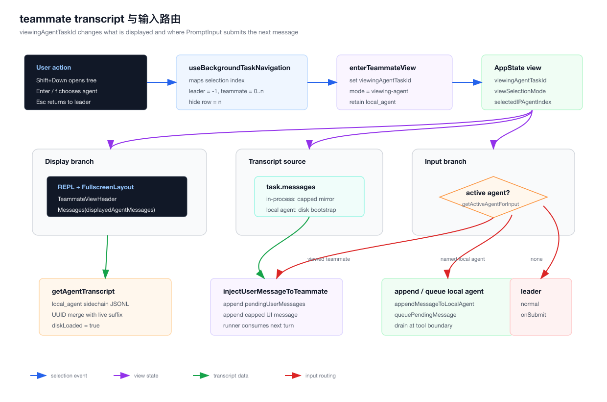

# 第 23 章：团队 UI、Transcript 视图与 Agent 可观察控制面

> 本章只分析 `claude-code/` 子目录下的实现。所有源码路径都以 `claude-code/` 为根，文档与图表落在 `tech-docs/new/`。

上一章讲的是 Teammate、Mailbox、Swarm 与多 Agent 协作系统。

那一章回答的是：

```text
Claude Code 如何把多个 Agent 组织成一个有身份、有任务、有消息、有权限、有生命周期的团队？
```

这一章继续补上一个真实产品中更容易被低估的部分：

```text
当团队真正运行起来以后，用户如何在终端里看见它、理解它、切换它、打断它、控制它？
```

很多人做多 Agent demo，会停在这一步：

```text
启动 3 个 Agent
并发调用模型
最后汇总结果
```

这不是工业级多 Agent 产品。

真正的 Coding Agent 团队必须让用户知道：

- 当前谁在工作。
- 谁已经 idle。
- 谁在等审批。
- 谁被请求 shutdown。
- 每个 teammate 消耗了多少 token。
- 每个 teammate 最近在调用什么工具。
- 某个任务由谁负责。
- 某个 teammate 的完整对话在哪里看。
- 我现在输入一句话，到底是发给 leader，还是发给某个 teammate。
- 我按下 Esc，是中断当前 teammate 的 turn，还是退出 teammate 视角。

这些问题不是 UI 细节。

它们是多 Agent 系统的控制面。

没有这层控制面，Agent 团队就会变成一堆后台进程，用户只能祈祷它们“自己做对”。

这一章会从源码拆解 Claude Code 如何把多 Agent runtime 的状态，映射成终端中的可观察、可导航、可操控体验。

本章先用两张图建立全局结构。

第一张图展示 teammate runtime、team config、Task V2、mailbox protocol 如何流入 `AppState`，再由 selectors/hooks 渲染成 terminal UI surfaces：



第二张图展示用户如何从 leader 视角切换到 teammate transcript，`viewingAgentTaskId` 如何改变消息展示与输入路由：



## 23.1 章节目标

读完本章，你应该能回答这些问题：

```text
1. 为什么多 Agent 系统必须有可观察控制面？
2. Claude Code 为什么把 teammate view 放进 AppState，而不是只做一个局部 React state？
3. viewingAgentTaskId 到底控制了什么？
4. 为什么 foreground teammate 不是切换进程，而是切换 transcript projection？
5. 用户输入如何被路由到 leader、in-process teammate 或 named local agent？
6. Spinner tree 为什么同时展示 leader 和 teammate？
7. TaskListV2 如何把任务 owner、阻塞关系和 teammate activity 合成一个任务面板？
8. TeamsDialog 为什么既要读 team file，又要更新 AppState？
9. Esc、Ctrl+C、k、s、Shift+Up/Down 这些键为什么不能随便绑定？
10. 如果自己实现一个 Agent Team UI，最小状态模型应该怎么设计？
```

这一章的重点不是讲 Ink 组件怎么写。

重点是理解：

> 多 Agent 产品的 UI，本质是 Agent runtime 的控制面投影。

前端工程师可以把它类比成：

```text
React DevTools + Chrome Task Manager + VS Code Terminal + Redux DevTools
```

Agent 团队跑起来以后，UI 不只是展示结果，而是承担：

- 进程观察。
- 任务看板。
- 输入路由。
- 权限控制。
- 生命周期管理。
- transcript 调试。
- 故障恢复入口。

这就是本章要拆的系统。

## 23.2 源码入口总览

本章涉及的文件比第 22 章更偏 UI 和状态层。

| 模块 | 职责 |
| --- | --- |
| `src/state/AppStateStore.ts` | 定义 `expandedView`、`viewingAgentTaskId`、`viewSelectionMode`、`selectedIPAgentIndex`、`teamContext` 等全局 UI 状态 |
| `src/state/selectors.ts` | 派生 `getViewedTeammateTask()` 与 `getActiveAgentForInput()` |
| `src/state/teammateViewHelpers.ts` | 进入/退出 teammate transcript view，维护 local agent retain / release |
| `src/hooks/useTeammateViewAutoExit.ts` | teammate 被 kill / failed / evicted 时自动退出 view |
| `src/hooks/useBackgroundTaskNavigation.ts` | Shift+Up/Down、Enter、f、k、Esc 的 teammate 导航和控制 |
| `src/components/Spinner.tsx` | spinner 主状态，决定是否展示 teammate tree、tasks、tip、idle 状态 |
| `src/components/Spinner/TeammateSpinnerTree.tsx` | leader + teammate 树形状态面板 |
| `src/components/Spinner/TeammateSpinnerLine.tsx` | 单个 teammate 的 idle、approval、shutdown、activity、token 展示 |
| `src/components/TeammateViewHeader.tsx` | foreground teammate transcript 时的顶部标题 |
| `src/components/TaskListV2.tsx` | 任务看板 UI，展示 owner、blocker、activity、完成状态 |
| `src/hooks/useTasksV2.ts` | Task V2 单例 store，watch 文件目录并同步 UI |
| `src/components/PromptInput/useSwarmBanner.ts` | prompt 输入区上方的 agent / teammate / tmux hint banner |
| `src/components/PromptInput/PromptInput.tsx` | 输入提交、footer 导航、teammate mode cycle、TeamsDialog 入口 |
| `src/components/PromptInput/PromptInputFooterLeftSide.tsx` | footer mode indicator、TeamStatus、任务/teammate 提示 |
| `src/components/teams/TeamStatus.tsx` | footer teammate count indicator |
| `src/components/teams/TeamsDialog.tsx` | 团队成员列表、详情、kill、shutdown、mode cycle、pane focus |
| `src/utils/teamDiscovery.ts` | 从 team file 读取 teammate status |
| `src/components/tasks/BackgroundTasksDialog.tsx` | 后台任务统一面板，包含 teammate detail / foreground |
| `src/components/tasks/InProcessTeammateDetailDialog.tsx` | in-process teammate 详情弹窗 |
| `src/tasks/InProcessTeammateTask/types.ts` | teammate UI mirror、progress、messages cap |
| `src/tasks/InProcessTeammateTask/InProcessTeammateTask.tsx` | 注入用户消息、append teammate message、kill teammate |
| `src/tasks/LocalAgentTask/LocalAgentTask.tsx` | local agent transcript retain、disk bootstrap、pending message |
| `src/utils/sessionStorage.ts` | agent transcript 读取、teammate transcript 提取 |
| `src/hooks/useCancelRequest.ts` | Esc / Ctrl+C 在 teammate view 下的特殊中断语义 |
| `src/state/onChangeAppState.ts` | `expandedView` 持久化为 `showExpandedTodos` / `showSpinnerTree` |
| `src/screens/REPL.tsx` | 主屏渲染、transcript projection、TeammateViewHeader、Messages 分支 |

可以把这些文件分成五层：

```text
Runtime mirror:
  InProcessTeammateTask / LocalAgentTask / Task V2 / team config

View model:
  AppStateStore / selectors / teammateViewHelpers

Navigation:
  useBackgroundTaskNavigation / PromptInput footer / GlobalKeybindings

Rendering:
  SpinnerWithVerb / TeammateSpinnerTree / TaskListV2 / TeammateViewHeader / Messages

Admin console:
  TeamStatus / TeamsDialog / BackgroundTasksDialog / InProcessTeammateDetailDialog
```

这五层共同解决一个问题：

```text
多 Agent runtime 是异步、并发、长期运行的。
终端 UI 必须把它压缩成用户能理解和操作的界面。
```

## 23.3 为什么多 Agent 系统必须有可观察控制面

单 Agent 的 UI 可以很简单。

用户输入：

```text
帮我修复这个 bug
```

Agent 输出：

```text
我改了 A 文件，测试通过。
```

中间过程最多展示 spinner、tool use、diff。

但是多 Agent 不一样。

当团队中有多个 teammate 时，用户真正关心的是：

```text
现在系统里有多少个执行体？
谁还在跑？
谁在等我？
谁失败了？
谁修改了任务状态？
谁应该被关闭？
我现在输入的话会进入哪个上下文？
```

这就是控制面要回答的问题。

可以把多 Agent 产品拆成两面：

| 层面 | 负责什么 |
| --- | --- |
| 数据面 | LLM 调用、tool execution、file edit、shell command、mailbox message |
| 控制面 | 状态观察、任务分配、输入路由、权限审批、生命周期管理 |

很多 demo 只实现数据面。

Claude Code 的 teammate UI 是控制面。

它不只是“显示一下正在跑”。

它把 runtime 中的状态变成了：

- tree。
- pill。
- dialog。
- header。
- banner。
- shortcut。
- task board。
- transcript projection。

这些都是用户操控 Agent 团队的界面对象。

## 23.4 前端工程师如何类比这套系统

前端工程师可以用熟悉的体系理解本章：

| Claude Code 概念 | 前端类比 |
| --- | --- |
| `AppState.tasks` | Redux store 中的 async job map |
| `teamContext` | 当前 workspace / org / project context |
| `viewingAgentTaskId` | 当前 route param：`/agents/:id` |
| `viewSelectionMode` | focus / selection mode |
| `TeammateSpinnerTree` | DevTools performance sidebar |
| `TaskListV2` | Jira board + build pipeline status |
| `TeamsDialog` | Kubernetes dashboard / process manager |
| `getActiveAgentForInput()` | Router 根据当前 route 决定提交到哪个 controller |
| `enterTeammateView()` | route transition + retain resource |
| `exitTeammateView()` | navigate back + release resource |
| `task.messages` | UI 层 conversation cache |
| `getAgentTranscript()` | 从持久化 log bootstrap 页面数据 |

最关键的类比是：

```text
多 Agent UI = Agent Runtime 的 DevTools
```

浏览器没有 DevTools，也能执行 JS。

但开发者无法理解：

- 哪个请求慢。
- 哪个组件重复渲染。
- 哪个 storage 被写入。
- 哪个 event listener 卡住。

同理，多 Agent 没有控制面，也能并发跑模型。

但用户无法理解：

- 哪个 teammate 在做事。
- 哪个任务被阻塞。
- 哪个上下文正在接收输入。
- 哪个后台执行体应该被停止。

所以本章不是“UI 章节”。

它是多 Agent 工程化的可观测性章节。

## 23.5 AppState 是团队 UI 的 View Model

第 22 章已经讲过 `teamContext` 是团队事实源在进程内的镜像。

本章要关注的是 `AppStateStore.ts` 里这些 UI 状态：

```ts
export type AppState = DeepImmutable<{
  expandedView: 'none' | 'tasks' | 'teammates'
  showTeammateMessagePreview?: boolean
  selectedIPAgentIndex: number
  viewSelectionMode: 'none' | 'selecting-agent' | 'viewing-agent'
}> & {
  tasks: { [taskId: string]: TaskState }
  viewingAgentTaskId?: string
  teamContext?: {
    teamName: string
    teamFilePath: string
    leadAgentId: string
    selfAgentId?: string
    selfAgentName?: string
    isLeader?: boolean
    selfAgentColor?: string
    teammates: {
      [teammateId: string]: {
        name: string
        color?: string
        tmuxSessionName: string
        tmuxPaneId: string
        cwd: string
        worktreePath?: string
        spawnedAt: number
      }
    }
  }
}
```

这里有几个非常关键的设计。

第一，`expandedView` 不是 bool。

它有三种状态：

```text
none
tasks
teammates
```

因为 Claude Code 的底部扩展视图不是只有“展开任务列表”这一种。

当有 teammate 时，`ctrl+t` 会在：

```text
none -> tasks -> teammates -> none
```

之间循环。

这比两个 boolean 更稳。

如果设计成：

```ts
showTasks: boolean
showTeammates: boolean
```

就会出现非法组合：

```text
showTasks = true
showTeammates = true
```

终端 UI 空间有限，两个扩展面板同时出现会挤爆布局。

所以这里用 union type 表示互斥视图。

第二，`selectedIPAgentIndex` 用数字表示 tree selection。

它有一个特殊值：

```text
-1 = leader
0..n-1 = teammate
n = hide row
```

这不是最“优雅”的建模方式，但非常适合终端 keyboard navigation。

在 terminal UI 里，selection 常常是线性的。

用户按 Shift+Down，本质是在一个可见列表中移动光标。

把 leader、teammate、hide row 放进同一个 index 空间，可以让导航逻辑非常直接。

第三，`viewSelectionMode` 分成：

```text
none
selecting-agent
viewing-agent
```

这解决了一个产品级问题：

```text
用户正在选择 agent
```

和：

```text
用户已经进入某个 agent transcript
```

不是同一件事。

如果只用 `viewingAgentTaskId`，你无法区分：

- 当前只是展开了 tree。
- 当前光标停在某一行。
- 当前主 transcript 已经切到 teammate。

Claude Code 用 `viewSelectionMode` 把这几个状态拆开。

第四，`viewingAgentTaskId` 是主视图的路由参数。

当它是 `undefined`：

```text
主屏展示 leader transcript
PromptInput 提交给 leader
```

当它指向一个 teammate task：

```text
主屏展示 teammate transcript
PromptInput 提交给 teammate
Esc 语义发生变化
brief UI 被禁用
```

所以 `viewingAgentTaskId` 不只是“选中了谁”。

它是 terminal app 内部的 route。

## 23.6 selector：把 AppState 变成业务语义

`src/state/selectors.ts` 很短，但很重要。

它提供两个 selector：

```ts
export function getViewedTeammateTask(appState) {
  const { viewingAgentTaskId, tasks } = appState
  if (!viewingAgentTaskId) return undefined

  const task = tasks[viewingAgentTaskId]
  if (!isInProcessTeammateTask(task)) return undefined

  return task
}
```

这个 selector 做了三层防御：

```text
没有 viewingAgentTaskId -> 不是 teammate view
task 不存在 -> 可能被清理或 evict
task 类型不对 -> 不要把 local_agent 当成 in-process teammate
```

第二个 selector 更关键：

```ts
export type ActiveAgentForInput =
  | { type: 'leader' }
  | { type: 'viewed'; task: InProcessTeammateTaskState }
  | { type: 'named_agent'; task: LocalAgentTaskState }

export function getActiveAgentForInput(appState): ActiveAgentForInput {
  const viewedTask = getViewedTeammateTask(appState)
  if (viewedTask) {
    return { type: 'viewed', task: viewedTask }
  }

  const { viewingAgentTaskId, tasks } = appState
  if (viewingAgentTaskId) {
    const task = tasks[viewingAgentTaskId]
    if (task?.type === 'local_agent') {
      return { type: 'named_agent', task }
    }
  }

  return { type: 'leader' }
}
```

这个 selector 是输入路由的中心。

它回答：

```text
用户现在敲 Enter，消息应该发给谁？
```

注意它不仅支持 in-process teammate，还支持 `local_agent`。

这是一个架构上的统一：

```text
foregrounded background agent
foregrounded teammate
leader
```

都可以成为 prompt input 的目标。

从前端角度看，这就像一个 controller resolver：

```ts
const controller = resolveController(currentRoute)
controller.submit(formValue)
```

而不是在每个组件里自己判断：

```ts
if (isTeammate) ...
if (isAgent) ...
if (isLeader) ...
```

这就是 selector 的价值。

它把 UI 状态翻译成业务动作。

## 23.7 enterTeammateView：foreground 不是切换进程

`src/state/teammateViewHelpers.ts` 是 teammate transcript view 的状态机。

核心函数是：

```ts
export function enterTeammateView(taskId, setAppState): void {
  setAppState(prev => {
    const task = prev.tasks[taskId]
    const prevId = prev.viewingAgentTaskId
    const prevTask = prevId !== undefined ? prev.tasks[prevId] : undefined

    const needsRetain =
      isLocalAgent(task) && (!task.retain || task.evictAfter !== undefined)

    return {
      ...prev,
      viewingAgentTaskId: taskId,
      viewSelectionMode: 'viewing-agent',
      tasks,
    }
  })
}
```

这个函数的名字容易让人误解。

它不是把 teammate 进程“切到前台”。

对 in-process teammate 来说，它只是：

```text
主屏从 leader transcript 投影，切换为 teammate transcript 投影。
```

对 `local_agent` 来说，它额外做了一件事：

```text
retain = true
evictAfter = undefined
```

这表示 UI 正在持有这个 agent 的 transcript，不能被后台任务面板的清理逻辑马上 evict。

这是一个很典型的前端资源管理问题。

可以类比 React Router：

```text
进入详情页:
  保留 detail cache
  不要让列表 GC 掉当前 item

退出详情页:
  释放 detail cache
  如果 item 已结束，设置 delayed eviction
```

`exitTeammateView()` 正是这么做的：

```ts
export function exitTeammateView(setAppState): void {
  setAppState(prev => {
    const id = prev.viewingAgentTaskId
    const cleared = {
      ...prev,
      viewingAgentTaskId: undefined,
      viewSelectionMode: 'none',
    }

    if (!isLocalAgent(task) || !task.retain) return cleared

    return {
      ...cleared,
      tasks: {
        ...prev.tasks,
        [id]: release(task),
      },
    }
  })
}
```

`release()` 会：

```text
retain = false
messages = undefined
diskLoaded = false
terminal task -> evictAfter = now + PANEL_GRACE_MS
```

这里有一个非常重要的工程经验：

> foreground view 和 runtime lifecycle 必须解耦。

用户退出 transcript view，不应该 kill teammate。

用户进入 transcript view，也不应该重启 teammate。

UI view 只是观察和发送消息的窗口。

runtime 继续按自己的生命周期运行。

## 23.8 REPL 如何切换 transcript projection

真正渲染主屏的是 `src/screens/REPL.tsx`。

它读：

```ts
const viewingAgentTaskId = useAppState(s => s.viewingAgentTaskId)
const tasks = useAppState(s => s.tasks)
const viewedTask = viewingAgentTaskId ? tasks[viewingAgentTaskId] : undefined
const viewedTeammateTask =
  viewedTask && isInProcessTeammateTask(viewedTask) ? viewedTask : undefined
const viewedAgentTask =
  viewedTeammateTask ?? (viewedTask && isLocalAgentTask(viewedTask) ? viewedTask : undefined)
```

然后决定消息来源：

```ts
const rawAgentMessages = viewedAgentTask?.messages
```

如果 `viewedAgentTask` 存在：

```text
Messages 渲染 viewed agent 的 messages
```

如果不存在：

```text
Messages 渲染 leader 的 displayedMessages
```

所以 teammate transcript view 的本质是：

```text
同一个 Messages 组件
不同的 messages projection
```

这比打开一个新弹窗更强。

因为它让 teammate transcript 获得主屏的完整能力：

- message rendering。
- tool use rendering。
- in-progress tool animation。
- scroll。
- transcript mode。
- message action。
- prompt input。

`TeammateViewHeader` 则在主屏顶部加一个提示：

```tsx
<Text>Viewing </Text>
<Text color={nameColor} bold>
  @{viewedTeammate.identity.agentName}
</Text>
<KeyboardShortcutHint shortcut="esc" action="return" />
<Text dimColor>{viewedTeammate.prompt}</Text>
```

这看起来只是 UI 文案。

但它解决的是“上下文归属感”问题：

```text
我现在看到的是谁的 transcript？
我输入会发给谁？
我怎么回到 leader？
```

在多 Agent 产品里，用户最怕的是“我不知道自己正在操作哪个 Agent”。

所以 foreground view 必须有非常明确的 identity signal。

## 23.9 local agent transcript 为什么需要 disk bootstrap

in-process teammate 的 message mirror 保存在 `task.messages`。

但是 `local_agent` 的 transcript 不一定一直在内存里。

`LocalAgentTaskState` 里有这些字段：

```ts
type LocalAgentTaskState = {
  messages?: Message[]
  retain: boolean
  diskLoaded: boolean
  evictAfter?: number
}
```

当用户进入 local agent view 时：

```text
retain = true
```

REPL 会检查：

```ts
const needsBootstrap =
  isLocalAgentTask(viewedLocalAgent) &&
  viewedLocalAgent.retain &&
  !viewedLocalAgent.diskLoaded
```

然后从 sidechain JSONL 读取历史：

```ts
void getAgentTranscript(asAgentId(taskId)).then(result => {
  const live = t.messages ?? []
  const liveUuids = new Set(live.map(m => m.uuid))
  const diskOnly = result ? result.messages.filter(m => !liveUuids.has(m.uuid)) : []

  return {
    messages: [...diskOnly, ...live],
    diskLoaded: true,
  }
})
```

这个设计回答了一个现实问题：

```text
background agent 可能跑了很久
UI 不可能一直保留它的完整 messages
但用户随时可能点进去看 transcript
```

所以 Claude Code 的策略是：

```text
内存中保留 live suffix
进入 view 时从磁盘读取 prefix
按 uuid 去重合并
```

这是非常工程化的做法。

前端类比：

```text
聊天详情页:
  进入页面前只保留会话摘要
  进入页面后从 indexedDB / server 拉历史消息
  与 websocket live messages 去重合并
```

## 23.10 in-process teammate 的 UI message cap

`src/tasks/InProcessTeammateTask/types.ts` 里有一个很重要的常量：

```ts
export const TEAMMATE_MESSAGES_UI_CAP = 50
```

并且注释解释得非常直接：

```text
task.messages exists purely for the zoomed transcript dialog
```

也就是说：

```text
task.messages 是 UI mirror
不是完整事实源
```

完整对话在 runner 的 local `allMessages` 和 transcript 存储里。

UI mirror 只保留最近 50 条。

为什么？

因为多 Agent 场景下内存会爆。

源码注释提到过真实分析：

```text
500+ turn sessions 会产生明显 RSS 成本
swarm burst 中每个 concurrent agent 可能带来大量 message copy
```

这对前端工程师非常好理解。

不要把无限列表全部塞进 React state。

你需要：

```text
事实源: disk / database / runtime buffer
UI mirror: bounded cache
渲染视图: windowed / capped projection
```

`appendCappedMessage()` 就是这个原则：

```ts
export function appendCappedMessage(prev, item) {
  if (!prev?.length) return [item]
  if (prev.length >= TEAMMATE_MESSAGES_UI_CAP) {
    const next = prev.slice(-(TEAMMATE_MESSAGES_UI_CAP - 1))
    next.push(item)
    return next
  }
  return [...prev, item]
}
```

这看起来简单，但背后是工业级多 Agent UI 的基本规则：

> runtime 可以长期运行，UI state 必须有上限。

## 23.11 PromptInput：用户输入到底发给谁

`PromptInput.tsx` 的提交逻辑里有一段关键代码：

```ts
const activeAgent = getActiveAgentForInput(store.getState())
if (activeAgent.type !== 'leader' && onAgentSubmit) {
  await onAgentSubmit(inputParam, activeAgent.task, {
    setCursorOffset,
    clearBuffer,
    resetHistory,
  })
  return
}

await onSubmitProp(inputParam, {
  setCursorOffset,
  clearBuffer,
  resetHistory,
})
```

这就是输入路由。

它有三个分支：

| active target | 输入去哪里 |
| --- | --- |
| `leader` | 正常提交到主 Agent |
| `viewed` | 提交到当前 viewed in-process teammate |
| `named_agent` | 提交到当前 viewed local agent |

这有一个非常重要的产品含义：

```text
foreground transcript 不只是可读，它是可交互的。
```

用户进入 teammate transcript 后，输入框不再是 leader 的输入框。

它变成了 teammate 的输入框。

这与 Slack/Discord/IDE 类似：

```text
当前打开哪个 channel
输入就发到哪个 channel
```

但 Agent 产品更危险。

因为错误输入目标可能导致：

- leader 接收到本该给 teammate 的细节。
- teammate 接收到本该给 leader 的全局指令。
- 任务上下文污染。
- 权限模式误用。

所以 Claude Code 没有让每个 UI 组件自己判断。

它用 selector 集中决策。

## 23.12 给 in-process teammate 注入消息

当 active target 是 in-process teammate 时，最终会走到：

```ts
injectUserMessageToTeammate(taskId, message, options, setAppState)
```

它做两件事：

```ts
pendingUserMessages: [...task.pendingUserMessages, pendingMessage]
messages: appendCappedMessage(task.messages, createUserMessage(...))
```

第一件事是 runtime 输入：

```text
把消息放入 pendingUserMessages
runner 下一轮消费它
```

第二件事是 UI 反馈：

```text
立即把用户消息 append 到 transcript view
```

这就是聊天产品的标准体验：

```text
用户发送后，消息立即出现在界面中
异步 runtime 稍后处理
```

如果只放进 runtime queue，而不更新 UI，用户会觉得消息丢了。

如果只更新 UI，而不放进 runtime queue，Agent 收不到。

所以这里必须双写：

```text
runtime queue + UI mirror
```

当然，双写天然有一致性风险。

Claude Code 的约束是：

```text
task.messages 只是 UI mirror
pendingUserMessages 才是输入队列
```

它不会把 UI mirror 当事实源。

## 23.13 给 local agent 发送消息

`LocalAgentTask` 的路径略有不同。

它有两个函数：

```ts
queuePendingMessage(taskId, msg, setAppState)
appendMessageToLocalAgent(taskId, message, setAppState)
```

`queuePendingMessage()` 把消息放到：

```text
pendingMessages
```

`drainPendingMessages()` 会在 agent tool-round 边界消费。

这是因为 local agent 的执行 loop 和 in-process teammate 的 runner 不完全一样。

它更像一个正在后台运行的 sidechain agent。

对用户来说，两者都是“我正在和某个 Agent 对话”。

对 runtime 来说，输入投递点不同：

| 类型 | 输入队列 |
| --- | --- |
| in-process teammate | `pendingUserMessages` |
| local agent | `pendingMessages` |

`getActiveAgentForInput()` 把这个差异藏在上层。

PromptInput 只关心：

```text
active target is not leader
```

真正注入细节由 `onAgentSubmit` 处理。

这就是架构上常见的 adapter 思路。

## 23.14 useBackgroundTaskNavigation：键盘就是控制协议

终端 UI 没有鼠标优先的复杂界面。

所以键盘绑定就是控制协议。

`src/hooks/useBackgroundTaskNavigation.ts` 处理 teammate tree 的核心操作：

```text
Shift+Up / Shift+Down:
  展开 teammate tree 或移动 selection

Enter:
  leader -> exit teammate view
  teammate -> enter teammate view
  hide row -> collapse tree

f:
  foreground selected teammate transcript

k:
  kill selected running teammate

Esc:
  selecting-agent -> 退出 selection
  viewing-agent + running teammate -> abort current turn
  viewing-agent + terminal teammate -> exit view
```

这里最值得注意的是 Esc。

源码里有一段逻辑：

```ts
if (e.key === 'escape' && viewSelectionMode === 'viewing-agent') {
  const task = tasks[taskId]
  if (isInProcessTeammateTask(task) && task.status === 'running') {
    task.currentWorkAbortController?.abort()
    return
  }
  exitTeammateView(setAppState)
  return
}
```

这说明：

```text
Esc 在 teammate view 下不是简单返回。
```

如果 teammate 正在跑当前 turn：

```text
Esc 中断当前 turn，但 teammate 仍然活着。
```

如果 teammate 已经不在运行：

```text
Esc 退出视图，回到 leader。
```

为什么不直接 kill teammate？

因为 teammate 是长期 actor。

中断当前 turn 和杀掉 actor 是两种完全不同的动作。

这和浏览器里：

```text
停止当前请求
关闭整个 tab
```

不是一回事。

## 23.15 selection index 为什么要与渲染顺序一致

`useBackgroundTaskNavigation()` 里有一个注释：

```text
Filter to running teammates and sort alphabetically to match TeammateSpinnerTree display
```

它使用：

```ts
getRunningTeammatesSorted(tasks)
```

`TeammateSpinnerTree` 也用同一个函数。

这是一个非常容易踩坑的 UI 不变量：

> selection data order 必须与 rendered list order 一致。

如果导航 hook 按创建时间排序，UI 按名字排序，用户按下 Enter 时就可能进入另一个 teammate。

这类 bug 很隐蔽。

因为界面上看起来只是“选中第三行”。

但内部的第三个 item 和渲染的第三行不一致。

Claude Code 用共享排序函数保证：

```text
导航顺序 = 渲染顺序 = footer 顺序
```

这是 terminal UI 中非常重要的工程细节。

## 23.16 SpinnerWithVerb：主状态行如何感知 teammate

`src/components/Spinner.tsx` 是终端底部状态的核心。

它不是简单地显示：

```text
Claude is thinking...
```

它会根据：

- leader 是否在 loading。
- 是否正在查看 teammate。
- 是否有 running teammates。
- teammate 是否 all idle。
- `expandedView` 是 tasks 还是 teammates。
- 当前是否 brief mode。
- token 统计。
- 当前任务列表。

组合出不同 UI。

关键逻辑之一：

```ts
const foregroundedTeammate =
  viewingAgentTaskId ? getViewedTeammateTask({ viewingAgentTaskId, tasks }) : undefined

const effectiveVerb =
  foregroundedTeammate && !foregroundedTeammate.isIdle
    ? (foregroundedTeammate.spinnerVerb ?? randomVerb)
    : leaderVerb
```

也就是说：

```text
当用户 foreground teammate 时，spinner 展示 teammate 的动作。
```

这避免了一个错觉：

```text
我正在看 @researcher 的 transcript
但 spinner 还在展示 leader 的状态
```

另一个关键逻辑：

```ts
if (leaderIsIdle && hasRunningTeammates && !foregroundedTeammate) {
  return Idle + TeammateSpinnerTree
}
```

当 leader 已经 idle，但 teammate 还在跑时，不能让主 spinner 一直转。

否则用户会误以为 leader 还在生成。

Claude Code 显示：

```text
Idle · teammates running
```

这是一个很细但很重要的产品判断：

```text
leader idle != system idle
```

多 Agent 系统里必须区分：

- 当前 foreground agent 是否 idle。
- 整个 team 是否 idle。
- 某个 background teammate 是否 running。

## 23.17 TeammateSpinnerTree：团队状态树

`TeammateSpinnerTree` 是多 Agent 状态最直观的 UI。

它展示：

```text
team-lead
├─ @researcher: Searching...
├─ @coder: Using Edit...
└─ @reviewer: Idle for 12s
```

源码里它总是包含 leader row：

```tsx
<Text>team-lead</Text>
```

然后遍历：

```ts
const teammateTasks = getRunningTeammatesSorted(tasks)
```

每个 teammate 交给 `TeammateSpinnerLine`。

leader row 的高亮逻辑也很有意思：

```ts
const isLeaderForegrounded = viewingAgentTaskId === undefined
const isLeaderSelected = isInSelectionMode && selectedIndex === -1
const isLeaderHighlighted = isLeaderForegrounded || isLeaderSelected
```

这说明 UI 中有两个概念：

```text
foregrounded: 当前主屏正在看谁
selected: 当前 keyboard cursor 停在哪一行
```

它们可能相同，也可能不同。

例如：

```text
主屏正在看 @coder
用户 Shift+Down 把 selection 移到 @reviewer
```

此时：

```text
foregrounded = @coder
selected = @reviewer
```

如果没有这两个状态，用户无法在保持当前 view 的同时预选另一个 agent。

这就是 `viewSelectionMode` 和 `selectedIPAgentIndex` 存在的原因。

## 23.18 TeammateSpinnerLine：一行里压缩多少 runtime 信号

`TeammateSpinnerLine` 是很值得学习的组件。

它一行里压缩了大量状态：

```text
selection pointer
tree branch glyph
agent name
shutdown status
awaiting approval
idle duration
activity text
tool count
token count
select hint
view hint
optional preview lines
```

关键状态渲染：

```ts
if (teammate.shutdownRequested) {
  return <Text dimColor>[stopping]</Text>
}

if (teammate.awaitingPlanApproval) {
  return <Text color="warning">[awaiting approval]</Text>
}

if (teammate.isIdle) {
  return <Text dimColor>Idle for {idleElapsedTime}</Text>
}
```

这就是控制面信息。

`shutdownRequested` 不是一个普通文案。

它告诉用户：

```text
这个 teammate 已经进入关闭协议，别再期待它接新任务。
```

`awaitingPlanApproval` 也不是普通状态。

它告诉用户：

```text
这个 teammate 卡住不是失败，而是在等 leader 审批。
```

如果 UI 不展示这些，用户只能看到“它不动了”。

这会造成误判：

```text
以为卡死 -> 强杀
实际是在等权限 -> 破坏任务
```

多 Agent UI 最大的价值，就是把“异步等待”解释清楚。

## 23.19 activity summary：不要把工具噪音直接塞给用户

`TeammateSpinnerLine` 展示 activity 时，会优先使用：

```ts
summarizeRecentActivities(activities)
```

否则使用：

```ts
teammate.progress?.lastActivity?.activityDescription
```

为什么不是直接展示最近一次 tool name？

因为真实 coding agent 会频繁调用：

- Read。
- Grep。
- Glob。
- LS。
- Edit。
- Bash。

如果 UI 一直显示：

```text
Using Read...
Using Read...
Using Grep...
Using Read...
```

用户不会得到有意义的信息。

所以 Claude Code 会把连续的 search/read 操作折叠成更高层的描述。

这和前端性能面板很像。

Chrome DevTools 不会只告诉你：

```text
function call
function call
function call
```

它会聚合成：

```text
Scripting
Rendering
Painting
Network
```

Agent UI 也需要类似的语义压缩。

## 23.20 TaskListV2：团队任务看板

`TaskListV2` 是另一个重要 UI。

它把 Task V2 文件状态渲染成终端任务看板。

核心输入：

```ts
type Props = {
  tasks: Task[]
  isStandalone?: boolean
}
```

它做了几件关键事情。

第一，根据 terminal rows 控制展示数量：

```ts
const maxDisplay = rows <= 10 ? 0 : Math.min(10, Math.max(3, rows - 14))
```

终端空间是稀缺资源。

任务列表不能无限展开。

第二，任务排序不是简单按 id。

当需要截断时，优先级是：

```text
recently completed
in-progress
pending
older completed
```

这是非常产品化的选择。

用户最关心：

```text
刚完成了什么
现在正在做什么
接下来还有什么
```

而不是完整历史。

第三，它展示 blocker：

```ts
blocked by #1, #2
```

这让任务看板不只是 todo list，而是 DAG 的可视化投影。

第四，它展示 owner 和 activity。

```ts
const teammateActivity: Record<string, string> = {}
const activeTeammates = new Set<string>()
```

它会从 `AppState.tasks` 中找到 running in-process teammate：

```ts
if (isInProcessTeammateTask(bgTask) && bgTask.status === 'running') {
  activeTeammates.add(bgTask.identity.agentName)
  activeTeammates.add(bgTask.identity.agentId)
  teammateActivity[bgTask.identity.agentName] = desc
  teammateActivity[bgTask.identity.agentId] = desc
}
```

为什么同时 map `agentName` 和 `agentId`？

因为任务 owner 可能用：

```text
researcher
```

也可能用：

```text
researcher@team
```

UI 层不能假设模型总是用同一种 owner 格式。

所以它做了兼容映射。

这是 Agent 工程里非常常见的现实主义：

```text
模型输出不是强类型数据库字段
UI 需要容忍合理变体
```

## 23.21 useTasksV2：文件监听必须做成单例 store

`src/hooks/useTasksV2.ts` 里有一个 `TasksV2Store`。

注释写得很清楚：

```text
Multiple hook instances subscribe to one shared store instead of each setting up their own fs.watch.
Spinner mounts/unmounts every turn.
Per-hook watchers caused constant watch/unwatch churn.
```

这就是工业级 UI 的细节。

如果每个组件都：

```ts
useEffect(() => watch(tasksDir), [])
```

会发生：

- 多个 watcher 重复监听同一个目录。
- spinner 每轮 mount/unmount 造成 watcher 抖动。
- Bun PathWatcherManager 出现死锁风险。
- 文件系统事件风暴导致重复渲染。

所以 Claude Code 把任务列表做成 external store：

```ts
class TasksV2Store {
  #tasks: Task[] | undefined
  #watcher: FSWatcher | null
  #subscriberCount = 0

  getSnapshot = () => this.#hidden ? undefined : this.#tasks
  subscribe = fn => { ... }
}
```

React 侧用：

```ts
useSyncExternalStore(store.subscribe, store.getSnapshot)
```

这非常值得前端工程师学习。

当数据源是：

```text
文件系统
WebSocket
进程状态
外部 runtime
```

时，很多时候不应该用一堆组件级 `useEffect`。

更好的方式是：

```text
外部 store 管订阅和缓存
React 只订阅 snapshot
```

## 23.22 为什么 useTasksV2 只给 team lead 启用

`useTasksV2()` 中有一行：

```ts
const enabled = isTodoV2Enabled() && (!teamContext || isTeamLead(teamContext))
```

这意味着：

```text
有 teamContext 时，只有 team lead 展示 Task V2 主面板。
```

为什么 teammate 不展示？

因为 teammate 的终端视图不是团队控制台。

如果每个 teammate 都渲染同一套团队任务面板，会产生：

- 状态噪音。
- 多个进程重复 watch task dir。
- teammate 自己的 prompt/output 被任务面板挤压。
- 用户以为 teammate 也能管理全局 task board。

Claude Code 的产品边界是：

```text
leader 负责团队控制台
teammate 负责执行自己的任务
```

这也是多 Agent 产品里很重要的角色分工。

## 23.23 GlobalKeybindings：ctrl+t 在 tasks 和 teammates 之间循环

`src/hooks/useGlobalKeybindings.tsx` 里，`ctrl+t` 不只是展开 todo。

它会检查是否存在 running in-process teammates：

```ts
const hasTeammates =
  count(getAllInProcessTeammateTasks(prev.tasks), t => t.status === 'running') > 0
```

如果有 teammate：

```ts
switch (prev.expandedView) {
  case 'none':
    return { ...prev, expandedView: 'tasks' }
  case 'tasks':
    return { ...prev, expandedView: 'teammates' }
  case 'teammates':
    return { ...prev, expandedView: 'none' }
}
```

如果没有 teammate：

```text
none <-> tasks
```

这是一个很自然的 terminal UX：

```text
同一个快捷键在有限空间内切换几个相关面板。
```

`onChangeAppState.ts` 还会把它持久化到 global config：

```text
expandedView -> showExpandedTodos + showSpinnerTree
```

这里用了旧配置字段兼容新 union state。

这是产品演进中的常见妥协：

```text
内部状态升级了
但持久化配置要兼容老字段
```

## 23.24 TeamStatus：footer 中的团队入口

`TeamStatus` 很简单：

```tsx
const totalTeammates = teamContext
  ? Object.values(teamContext.teammates).filter(t => t.name !== 'team-lead').length
  : 0
```

然后渲染：

```text
1 teammate
2 teammates
```

它有一个关键注释：

```text
Derive teammate count from teamContext (no filesystem I/O needed)
```

为什么 footer 不能读文件系统？

因为 footer 每次渲染都在 terminal 主界面路径上。

如果它去读：

```text
~/.claude/teams/{team}/config.json
```

会造成：

- 渲染路径阻塞 I/O。
- 状态抖动。
- 文件锁竞争。
- 更难测试。

所以 footer 只读 AppState。

这是 UI 性能原则：

> render path 读内存 snapshot，不做外部 I/O。

真正需要读 team file 的地方放在 dialog 或 utility 中。

## 23.25 useSwarmBanner：告诉用户当前 Agent 身份

`useSwarmBanner()` 返回输入区上方的 banner 信息。

它处理几种场景：

| 场景 | banner |
| --- | --- |
| teammate process | `@agentName` |
| leader 外部 tmux 且不在 tmux 内 | `tmux -L ... attach` 提示 |
| leader in-process / native panes 且正在 view teammate | `@viewedTeammate` |
| named local agent | `@name` |
| standalone agent | standalone name / color |
| `--agent` CLI | agent name |

这里最有意思的是外部 tmux 场景：

```ts
if (insideTmux === false && !inProcessMode && !nativePanes) {
  return {
    text: `View teammates: \`tmux -L ${getSwarmSocketName()} a\``,
    bgColor: viewedColor,
  }
}
```

这不是普通提示。

它是跨 pane backend 的可观察入口。

如果 teammate 不是 in-process，而是 tmux pane，leader 当前终端未必能直接显示它们的 transcript。

所以 UI 要告诉用户：

```text
去哪个 tmux socket attach，才能看到 teammate panes。
```

这就是“控制面适配后端差异”的例子。

## 23.26 TeamsDialog：团队管理控制台

`TeamsDialog` 是外部 pane teammate 的管理界面。

它做的事情比一个列表多得多：

- 展示 teammate list。
- 展示 teammate detail。
- 查看 prompt。
- 查看 assigned tasks。
- kill teammate。
- graceful shutdown teammate。
- hide/show pane。
- prune idle teammate。
- cycle permission mode。
- focus teammate pane。

它的状态来自：

```ts
const teammateStatuses = getTeammateStatuses(dialogLevel.teamName)
```

`getTeammateStatuses()` 会读 team file：

```ts
const teamFile = readTeamFile(teamName)
```

并把 member 转成 UI status：

```ts
status = member.isActive !== false ? 'running' : 'idle'
hidden = teamFile.hiddenPaneIds
mode = member.mode
backendType = member.backendType
```

注意这里和 `TeamStatus` 不同。

`TeamsDialog` 可以读文件，因为它是显式打开的管理界面。

用户打开 dialog 的目的就是获取更详细、更实时的团队信息。

同时它每 1 秒 refresh：

```ts
useInterval(() => {
  setRefreshKey(k => k + 1)
}, 1000)
```

这是 dialog 层的合理 polling。

如果放在 footer 渲染路径上，就不合理。

## 23.27 kill 与 shutdown 是两个产品动作

`TeamsDialog` 里有两个不同按键：

```text
k kill
s shutdown
```

`k` 走：

```ts
killTeammate(...)
```

它会：

```text
backend.killPane
removeMemberFromTeam
unassignTeammateTasks
更新 AppState.teamContext
插入 teammate_terminated inbox notification
```

`s` 走：

```ts
sendShutdownRequestToMailbox(
  teammate.name,
  teamName,
  'Graceful shutdown requested by team lead',
)
```

这两个动作本质不同：

| 动作 | 语义 |
| --- | --- |
| kill | 直接终止执行资源，并清理成员状态 |
| shutdown | 发出优雅关闭请求，让 teammate 自己收尾 |

为什么需要两个？

因为长期 actor 可能正在：

- 写文件。
- 执行 shell。
- 等权限。
- 持有 task owner。
- 准备发送最终报告。

直接 kill 是强制手段。

shutdown 是协议手段。

工业级 Agent 产品不能只提供 kill。

否则用户很容易破坏任务一致性。

## 23.28 mode cycle：权限模式也是团队 UI 控制项

`TeamsDialog` 支持 mode cycle。

单个 teammate：

```ts
setMemberMode(teamName, teammateName, targetMode)
writeToMailbox(teammate.name, createModeSetRequestMessage(...))
```

批量 teammate：

```ts
setMultipleMemberModes(teamName, modeUpdates)
for (const teammate of teammates) {
  writeToMailbox(teammate.name, mode_set_message)
}
```

这里也是双写：

```text
更新 team config -> UI 立即反映
写 mailbox -> teammate runtime 更新本地 permission context
```

这和前端里的 optimistic update 很像。

用户按下 mode cycle 后，UI 不应该等 teammate 处理 mailbox 后才变化。

所以先更新 config。

但 teammate 真正执行权限判断，需要收到 control message。

所以还要写 mailbox。

这再次体现：

```text
team config 是可观察事实源
mailbox 是运行时控制消息
```

## 23.29 BackgroundTasksDialog：后台任务面板与 teammate 面板的边界

Claude Code 还有一个更通用的后台任务面板：

```text
BackgroundTasksDialog
```

它管理多种后台任务：

- local shell。
- remote agent。
- local agent。
- in-process teammate。
- workflow。
- MCP monitor。
- dream task。

它会把任务转换成统一的 `ListItem`。

但它有一个关键分支：

```ts
const teammates = showSpinnerTree ? [] : sorted.filter(item => item.type === 'in_process_teammate')
```

意思是：

```text
如果 spinner tree 已经展示 teammate，就不要在 BackgroundTasksDialog 里重复展示。
```

这避免了两个控制面同时管理同一组 teammate。

同时，当有 teammate 时，它会加一个 leader item：

```ts
const leaderItem =
  teammates.length > 0
    ? [{ id: '__leader__', type: 'leader', label: '@team-lead' }]
    : []
```

这让用户可以从后台任务面板回到 leader。

`InProcessTeammateDetailDialog` 则展示更细节的信息：

- teammate name。
- running/completed/failed/stopped。
- elapsed time。
- token count。
- tool count。
- recent activities。
- prompt。
- error。
- foreground shortcut。
- stop shortcut。

这和 `TeamsDialog` 不完全重叠：

| 面板 | 更适合 |
| --- | --- |
| `BackgroundTasksDialog` | in-process teammate 和通用后台任务 |
| `TeamsDialog` | pane backend teammate、team file、mode、shutdown、pane focus |

这是因为 Claude Code 同时支持不同 execution backend。

UI 不能假设所有 teammate 都是同一种形态。

## 23.30 cancel / interrupt：多 Agent 下的中断语义

`useCancelRequest.ts` 里有 teammate view 的特殊处理。

Esc 被让给 `useBackgroundTaskNavigation`：

```ts
const isViewingTeammate = viewSelectionMode === 'viewing-agent'

const isEscapeActive =
  isContextActive &&
  canCancelRunningTask &&
  !isViewingTeammate
```

也就是说：

```text
当用户正在看 teammate transcript，普通 Esc cancel handler 不接管。
```

因为 Esc 在 teammate view 下有特殊语义：

```text
先中断当前 teammate turn
或退出 teammate view
```

Ctrl+C 则不同：

```ts
if (isViewingTeammate) {
  killAllAgentsAndNotify()
  exitTeammateView(setAppState)
}
```

这表达的是更强的全局中断。

终端产品里，快捷键语义必须非常谨慎。

尤其多 Agent 下，同一个键可能有三层含义：

```text
当前输入模式
当前 foreground view
整个 session runtime
```

如果不分层，用户会遇到最糟糕的体验：

```text
我只是想退出视图，却杀了任务。
我只是想停当前 turn，却退出了团队控制台。
我想取消 leader 请求，却中断了 teammate。
```

Claude Code 的做法是：

```text
把 teammate view 下的 Esc 从通用 cancel handler 中排除
再由 teammate navigation handler 接管
```

这就是控制优先级设计。

## 23.31 auto exit：被观察对象消失时，UI 要自愈

`useTeammateViewAutoExit()` 做一件事：

```text
当前 viewed teammate 被 kill / failed / evicted 时，自动退出 view
```

源码逻辑：

```ts
if (!taskExists) {
  exitTeammateView(setAppState)
  return
}

if (
  viewedStatus === 'killed' ||
  viewedStatus === 'failed' ||
  viewedError ||
  invalidStatus
) {
  exitTeammateView(setAppState)
}
```

但它有一个重要注释：

```text
Users stay viewing completed teammates so they can review the full transcript.
```

也就是说：

```text
completed 不自动退出
killed / failed 自动退出
```

这是产品判断。

完成的 transcript 有复盘价值。

失败或被杀的 teammate 可能已经不再有稳定消息来源，继续停留可能导致空白或错误 view。

这和前端里：

```text
详情页 item 被删除 -> 自动回列表
详情页 item 完成 -> 仍可查看结果
```

是同一个模式。

## 23.32 UserPromptMessage 和 brief mode 的 teammate 例外

Claude Code 有 brief / assistant mode 的 UI 优化。

但当用户进入 teammate transcript 时，很多 brief UI 要关闭。

例如 `UserPromptMessage.tsx` 会读：

```ts
const viewingAgentTaskIdState = useAppState(s => s.viewingAgentTaskId)
```

然后：

```ts
useBriefLayout = briefEnabled && !isTranscriptMode && !viewingAgentTaskIdState
```

也就是说：

```text
teammate view 下不使用 brief layout
```

`SpinnerWithVerb` 也有类似逻辑：

```ts
if (isBriefOnly && !viewingAgentTaskId) {
  return <BriefSpinner />
}
```

为什么？

因为 teammate transcript 是调试和观察界面。

用户进入这里，通常想看完整上下文。

如果仍然使用 brief layout，可能隐藏关键消息、工具状态、上下文归属。

所以 teammate view 强制偏向“可观察性”，而不是“极简聊天体验”。

这是一个重要产品原则：

> 当用户进入调试/控制面时，信息密度应该提高，而不是继续追求简洁。

## 23.33 TeamsDialog 为什么既读文件又更新 AppState

`TeamsDialog.killTeammate()` 里有一个典型的双层状态处理：

```ts
removeMemberFromTeam(teamName, paneId)
await unassignTeammateTasks(...)

setAppState(prev => ({
  teamContext: {
    ...prev.teamContext,
    teammates: remainingTeammates,
  },
  inbox: {
    messages: [...prev.inbox.messages, teammate_terminated],
  },
}))
```

为什么不只更新文件？

因为 footer 和当前 UI 依赖 `AppState.teamContext`。

只更新 team file，会导致：

```text
文件已经删除 teammate
footer 仍显示旧 teammate count
当前 session UI 不刷新
```

为什么不只更新 AppState？

因为 pane teammate、TeamDelete、resume、其他进程都依赖 team file。

只更新 AppState，会导致：

```text
当前 UI 看起来删除了
team config 里仍有 member
下次读取又复活
cleanup 逻辑错误
```

所以这里必须：

```text
team file = 跨进程事实源
AppState = 当前进程 UI mirror
```

这和前端里：

```text
server state + client cache
```

的关系完全一样。

## 23.34 control plane 和 data plane 的边界

本章所有组件可以按 control plane / data plane 重新分类。

| 模块 | 类型 | 说明 |
| --- | --- | --- |
| `InProcessTeammateTask.messages` | data projection | transcript UI mirror |
| `pendingUserMessages` | data plane input queue | teammate 下一轮输入 |
| `teamContext` | control mirror | 当前团队成员和身份 |
| `viewingAgentTaskId` | control state | 当前主屏看谁 |
| `expandedView` | control state | 展示任务还是 teammate tree |
| `TeammateSpinnerTree` | control UI | 团队运行状态 |
| `TaskListV2` | control UI | 任务状态和 owner |
| `TeamsDialog` | admin control UI | kill/shutdown/mode/focus |
| `mailbox mode_set` | control message | 修改 teammate permission mode |
| `mailbox shutdown_request` | control message | 请求 teammate 优雅关闭 |

这个分类很重要。

如果你自己做 Agent 产品，要避免把控制面和数据面混在一起。

错误示例：

```ts
messages.push({
  role: 'user',
  content: '__KILL_AGENT__'
})
```

这把控制命令塞进了 LLM 上下文。

正确做法应该是：

```ts
controlBus.send({ type: 'shutdown_request', targetAgentId })
```

Claude Code 的 mailbox structured protocol、team config、AppState view fields，都是在维护这个边界。

## 23.35 手写一个最小版：Agent Team UI View Model

如果我们从 0 实现一个最小版，可以先定义 view model：

```ts
type AgentStatus = 'running' | 'idle' | 'awaiting_approval' | 'stopping' | 'completed' | 'failed'

type AgentTask = {
  id: string
  name: string
  prompt: string
  status: AgentStatus
  progress?: {
    activity?: string
    toolUseCount: number
    tokenCount: number
  }
  messages: Message[]
  pendingUserMessages: string[]
}

type TeamUiState = {
  tasks: Record<string, AgentTask>
  expandedView: 'none' | 'tasks' | 'agents'
  viewSelectionMode: 'none' | 'selecting-agent' | 'viewing-agent'
  selectedAgentIndex: number
  viewingAgentTaskId?: string
}
```

然后写 selector：

```ts
type ActiveInputTarget =
  | { type: 'leader' }
  | { type: 'agent'; task: AgentTask }

function getViewedAgent(state: TeamUiState): AgentTask | undefined {
  if (!state.viewingAgentTaskId) return undefined
  return state.tasks[state.viewingAgentTaskId]
}

function getActiveInputTarget(state: TeamUiState): ActiveInputTarget {
  const viewed = getViewedAgent(state)
  if (viewed && viewed.status !== 'failed') {
    return { type: 'agent', task: viewed }
  }
  return { type: 'leader' }
}
```

实现进入/退出 view：

```ts
function enterAgentView(state: TeamUiState, taskId: string): TeamUiState {
  if (!state.tasks[taskId]) return state
  return {
    ...state,
    viewingAgentTaskId: taskId,
    viewSelectionMode: 'viewing-agent',
  }
}

function exitAgentView(state: TeamUiState): TeamUiState {
  return {
    ...state,
    viewingAgentTaskId: undefined,
    viewSelectionMode: 'none',
    selectedAgentIndex: -1,
  }
}
```

实现输入路由：

```ts
async function submitPrompt(input: string, state: TeamUiState) {
  const target = getActiveInputTarget(state)

  if (target.type === 'agent') {
    target.task.pendingUserMessages.push(input)
    target.task.messages.push({
      role: 'user',
      content: input,
      createdAt: Date.now(),
    })
    return
  }

  await submitToLeader(input)
}
```

实现 spinner tree：

```ts
function renderAgentTree(state: TeamUiState): string[] {
  const agents = Object.values(state.tasks)
    .filter(t => t.status === 'running' || t.status === 'idle')
    .sort((a, b) => a.name.localeCompare(b.name))

  return [
    `${state.viewingAgentTaskId ? ' ' : '>'} team-lead`,
    ...agents.map((agent, index) => {
      const selected = state.viewSelectionMode === 'selecting-agent' && state.selectedAgentIndex === index
      const viewed = state.viewingAgentTaskId === agent.id
      const prefix = selected ? '>' : viewed ? '*' : ' '
      const activity = agent.progress?.activity ?? agent.status
      return `${prefix} @${agent.name}: ${activity}`
    }),
  ]
}
```

这个最小版没有 mailbox、permission、disk transcript。

但它已经包含了最重要的不变量：

```text
view target
input target
selection target
runtime status
UI projection
```

这就是多 Agent UI 的骨架。

## 23.36 手写一个单例 task store

如果任务来自文件系统，不要每个组件都 watch。

可以写一个最小 external store：

```ts
type Listener = () => void

class TaskStore {
  private tasks: Task[] | undefined
  private listeners = new Set<Listener>()
  private watcher?: FSWatcher

  getSnapshot = () => this.tasks

  subscribe = (listener: Listener) => {
    this.listeners.add(listener)
    if (this.listeners.size === 1) {
      this.start()
    }
    return () => {
      this.listeners.delete(listener)
      if (this.listeners.size === 0) {
        this.stop()
      }
    }
  }

  private async start() {
    this.watcher = watch(taskDir, () => this.refreshDebounced())
    await this.refresh()
  }

  private stop() {
    this.watcher?.close()
    this.watcher = undefined
  }

  private async refresh() {
    this.tasks = await readTasksFromDisk()
    for (const listener of this.listeners) listener()
  }
}
```

React 里：

```ts
const tasks = useSyncExternalStore(
  taskStore.subscribe,
  taskStore.getSnapshot,
)
```

这就是 `useTasksV2` 的核心思想。

多 Agent 产品里，外部状态源非常多：

- task file。
- mailbox。
- process status。
- tmux pane。
- websocket。
- transcript log。

这些都应该通过稳定 store 汇入 UI，而不是散落在组件树里。

## 23.37 工业实践：可观察 UI 的十条原则

从 Claude Code 这套实现，可以提炼出十条原则。

第一，runtime state 和 UI state 分层。

```text
agent 是否 running 是 runtime state
用户是否正在 view 它是 UI state
```

第二，UI state 用 union 表示互斥状态。

```ts
expandedView: 'none' | 'tasks' | 'teammates'
```

优于多个 boolean。

第三，输入路由必须集中决策。

不要在多个组件里散落：

```ts
if (viewingAgentTaskId) ...
```

应该用 selector。

第四，terminal selection order 必须等于 render order。

否则 Enter 会进入错误对象。

第五，UI mirror 必须有上限。

`TEAMMATE_MESSAGES_UI_CAP = 50` 是必要的。

第六，render path 不做文件 I/O。

footer 读 AppState，dialog 才读 team file。

第七，kill 和 shutdown 分开。

强制终止和优雅关闭是不同动作。

第八，控制消息不要塞进 LLM 上下文。

用 mailbox protocol 或 control bus。

第九，brief UI 和 debug UI 要分开。

teammate transcript view 应该偏可观察，而不是极简。

第十，被观察对象消失时 UI 要自愈。

task evicted / failed / killed 时自动退出 view。

## 23.38 常见架构坑

第一个坑：把 teammate view 当成 modal。

如果 teammate transcript 只是弹窗，就很难复用主屏的：

- message renderer。
- tool renderer。
- scroll。
- input。
- transcript mode。
- permission UI。

Claude Code 选择把它作为主屏 projection，这是更强的设计。

第二个坑：输入框永远提交给 leader。

这会让 teammate transcript 变成只读日志。

用户想跟 teammate 补充信息时，只能绕回 leader。

这会破坏多 Agent 的交互性。

第三个坑：不展示 active input target。

如果 UI 没有 header/banner，用户很容易不知道自己在和谁说话。

第四个坑：把完整 transcript 放进 AppState。

多 Agent 长会话会迅速吃掉内存。

第五个坑：每个组件自己 watch 文件。

这会带来 watcher 风暴和重复渲染。

第六个坑：Esc 语义不分层。

多 Agent 下 Esc 至少涉及：

```text
退出 selection
中断 current turn
退出 teammate view
取消 leader request
```

不能混成一个 handler。

第七个坑：任务 owner 只支持一种格式。

模型输出可能是 `name`，也可能是 `name@team`。

UI 要容错。

第八个坑：只提供 kill，不提供 shutdown。

这会把用户引向破坏性操作。

第九个坑：外部 pane teammate 和 in-process teammate 用同一个 UI 假设。

它们的 transcript、focus、kill、mode sync 路径不同。

第十个坑：control message 只更新 UI，不通知 runtime。

例如 mode cycle 只更新 config，不发 mailbox，teammate 实际权限不会变。

## 23.39 测试应该覆盖什么

这一层很容易被当成“UI 不好测”。

但它其实有很多可测的不变量。

至少应该覆盖：

```text
getViewedTeammateTask:
  no viewing id -> undefined
  missing task -> undefined
  local_agent -> undefined
  in_process_teammate -> task

getActiveAgentForInput:
  no view -> leader
  viewed teammate -> viewed
  viewed local_agent -> named_agent

enterTeammateView:
  sets viewingAgentTaskId
  sets viewSelectionMode=viewing-agent
  local_agent retain=true
  switching away releases previous retained local_agent

exitTeammateView:
  clears viewingAgentTaskId
  clears viewSelectionMode
  terminal local_agent gets evictAfter

useBackgroundTaskNavigation:
  Shift+Down expands tree
  selection wraps leader -> teammate -> hide
  Enter on teammate enters view
  Enter on hide collapses tree
  Esc in selecting mode exits selection
  Esc in viewing running teammate aborts current work
  k kills selected running teammate

TaskListV2:
  owner color from teamContext
  owner activity from running teammate progress
  blocker displayed only when unresolved
  hidden summary counts pending/in_progress/completed

TeamsDialog:
  kill removes member from team file and AppState
  shutdown writes shutdown_request mailbox
  mode cycle updates config and writes mode_set mailbox
  detail shows tasks owned by agentId or name

Transcript bootstrap:
  local_agent retain triggers getAgentTranscript
  disk messages and live messages merge by uuid
  in-process teammate messages remain capped
```

这些测试不一定都要是端到端。

大量逻辑可以通过 selector、helper、store、纯函数测试覆盖。

对于 Ink UI，可以重点测：

- 状态输入。
- 文案输出。
- shortcut 行为。
- AppState 更新。

不要只做截图测试。

多 Agent UI 最重要的是状态转换正确。

## 23.40 面试题：如何设计多 Agent 的终端控制面

可以用这些问题判断候选人是否真正理解本章。

```text
1. 为什么多 Agent 系统需要控制面，而不只是结果输出？

2. viewingAgentTaskId 和 selectedIPAgentIndex 的区别是什么？

3. foreground teammate 为什么不等于切换进程？

4. 为什么输入路由要由 selector 集中决定？

5. 为什么 teammate view 下 Esc 不能交给普通 cancel handler？

6. 为什么 in-process teammate 的 task.messages 要做 cap？

7. local_agent transcript 为什么需要从磁盘 bootstrap？

8. TaskListV2 为什么要同时 map owner name 和 owner agentId？

9. 为什么 footer 只读 AppState，不直接读 team file？

10. TeamsDialog 为什么 kill 和 shutdown 都要提供？

11. mode cycle 为什么既要更新 config，又要写 mailbox？

12. 为什么 teammate tree 的排序函数必须和 navigation 共享？

13. completed teammate 为什么可以继续停留在 view，而 killed / failed 要 auto exit？

14. 多 Agent UI 中 control plane 和 data plane 如何区分？

15. 如果你要把这套系统搬到 Web IDE，会如何设计状态层？
```

好的回答通常会提到：

```text
runtime mirror
UI projection
input target
selection target
bounded transcript cache
external store
control protocol
foreground view
graceful shutdown
role-aware UI
```

如果候选人只回答：

```text
用 React state 存一下当前 agent
```

说明还没有进入 Agent 产品工程的层次。

## 23.41 架构升级路线

Claude Code 当前实现已经很实用，但如果要做更完整的 AI IDE / Agent OS，还可以继续升级。

第一，统一 teammate 和 local agent 的 transcript abstraction。

现在：

```text
in-process teammate -> task.messages capped mirror
local_agent -> disk bootstrap + retain
pane teammate -> 外部 pane / mailbox / team file
```

未来可以抽象成：

```ts
interface AgentTranscriptStore {
  load(agentId: string): Promise<Message[]>
  subscribe(agentId: string, listener: Listener): Unsubscribe
  appendLocalEcho(agentId: string, message: Message): void
}
```

第二，把 keyboard navigation 状态机显式化。

现在 selection 逻辑分布在：

- `useBackgroundTaskNavigation`
- `PromptInput`
- `BackgroundTasksDialog`
- footer indicator

可以抽成：

```ts
type AgentFocusState =
  | { mode: 'leader' }
  | { mode: 'selecting'; index: number }
  | { mode: 'viewing'; agentId: string }
```

第三，把 TeamsDialog 的 backend 行为完全 adapter 化。

现在 pane focus、hide/show、kill 等逻辑仍有 backend 分支。

未来可以让 backend 暴露：

```ts
interface TeamUiBackend {
  focus(member: TeamMember): Promise<void>
  kill(member: TeamMember): Promise<void>
  hide?(member: TeamMember): Promise<void>
  show?(member: TeamMember): Promise<void>
}
```

第四，加入时间线视图。

当前 UI 展示当前状态。

更强的 Agent DevTools 应该展示：

```text
teammate timeline
tool use spans
permission waits
mailbox message events
task state transitions
```

这会让用户定位多 Agent 卡顿和冲突更容易。

第五，把 control plane event 持久化。

现在 transcript 主要围绕 message。

如果要做真正的 Agent OS，需要持久化：

- view enter / exit。
- task assignment。
- mode change。
- shutdown request。
- permission wait。
- idle transition。
- kill action。

这些事件对调试团队协作非常有价值。

## 23.42 本章小结

本章拆解了 Claude Code 的团队 UI、transcript view 与多 Agent 可观察控制面。

主链路可以总结为：

```text
runtime signals
  -> InProcessTeammateTask / LocalAgentTask / team config / Task V2

AppState view model
  -> tasks / teamContext / expandedView / viewSelectionMode / viewingAgentTaskId

selectors
  -> getViewedTeammateTask
  -> getActiveAgentForInput

rendering
  -> SpinnerWithVerb
  -> TeammateSpinnerTree
  -> TaskListV2
  -> TeammateViewHeader
  -> Messages projection

control surfaces
  -> PromptInput routing
  -> useBackgroundTaskNavigation
  -> TeamsDialog
  -> BackgroundTasksDialog
  -> TeamStatus / SwarmBanner
```

这套系统的核心价值是：

> 把后台运行的 Agent 团队，变成用户可以理解、可以切换、可以输入、可以打断、可以关闭的产品界面。

这也是从“多 Agent runtime”走向“Agent IDE / Agent OS”的关键一步。

前端工程师要特别记住：

```text
Agent UI 不是聊天框。
Agent UI 是 runtime control plane。
```

下一章可以继续深入更底层的 transcript persistence、session storage、resume、conversation recovery 与长会话可恢复系统。
