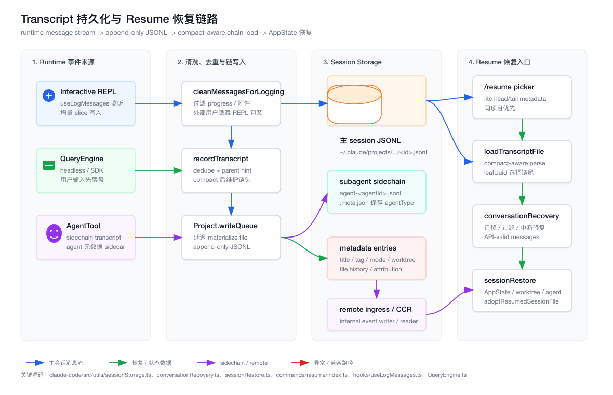
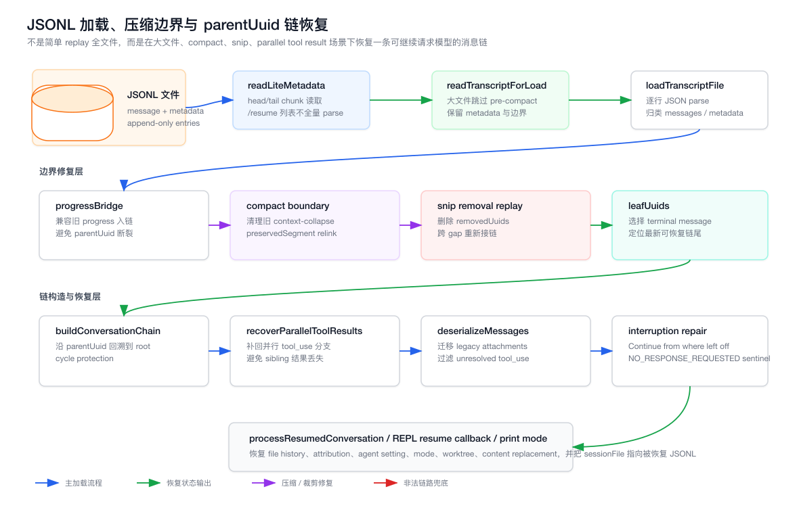

# 第 24 章：Transcript Persistence、Session Storage、Resume 与长会话恢复系统

本章继续第 23 章的“团队 UI 与 transcript 控制面”，进入更底层的一层：Claude Code 如何把一次长会话持久化成 JSONL，如何在 `/resume`、`--continue`、headless resume、fork session、subagent sidechain 场景下把文件恢复成一条可继续请求模型的消息链。

本章所有源码路径默认以 `claude-code/` 为根。

## 24.1 章节目标

读完本章，你应该能回答五个问题：

1. Claude Code 为什么使用 append-only JSONL 保存 transcript，而不是只保存最终 messages 数组。
2. `parentUuid` 如何把扁平 JSONL 恢复成可继续对话的链。
3. compaction、snip、parallel tool result、legacy progress 为什么会让恢复逻辑复杂化。
4. `/resume`、`--continue`、headless resume 与 REPL 内部 mid-session resume 分别走哪些入口。
5. session metadata、file history、attribution、worktree、agent setting 如何跟随 transcript 一起恢复。

这不是“怎么把聊天记录写到文件”的章节。真正的难点是：

- 文件可能很大，不能每次 `/resume` 都全量 parse。
- 会话可能被压缩，旧链段不能简单 replay。
- 工具调用可能并行，线性 parent walk 会漏掉 sibling tool result。
- 进程可能在模型返回前被 kill，所以用户输入要先落盘。
- 子 Agent 有自己的 sidechain transcript，但主链不能被 sidechain UUID 污染。
- 恢复后不仅要有 messages，还要恢复 UI、Agent、工作树、成本、文件历史等运行态。

## 24.2 架构图：Transcript 持久化与 Resume 恢复链路

源文件在 `assets/24-transcript-persistence-resume-flow.svg`，PNG 导出文件在 `assets/24-transcript-persistence-resume-flow.png`。



这张图可以先按四层理解：

- Runtime 事件来源：交互式 REPL、headless `QueryEngine`、`AgentTool` sidechain 都会产生需要落盘的消息。
- 清洗与链写入：`cleanMessagesForLogging`、`recordTranscript`、`Project.insertMessageChain` 负责把 UI 内部消息变成可持久化的 transcript entry。
- Session Storage：主 session JSONL、subagent JSONL、metadata entry、remote CCR event 共同构成恢复数据面。
- Resume 恢复入口：`/resume` picker、`loadTranscriptFile`、`conversationRecovery`、`sessionRestore` 把 JSONL 还原成运行态。

## 24.3 架构图：JSONL 链恢复与压缩边界

源文件在 `assets/24-session-storage-chain-recovery.svg`，PNG 导出文件在 `assets/24-session-storage-chain-recovery.png`。



这张图强调加载阶段的核心事实：恢复并不是把 JSONL 每一行按时间顺序塞回 messages。

真实恢复过程要做这些事：

- 用 lite metadata 支撑 `/resume` 列表快速展示。
- 对大文件跳过旧的 pre-compact 区段。
- 兼容旧版本把 progress 写进 parent 链的历史数据。
- 在 compact preserved segment、snip removal 后重新接链。
- 从 leafUuid 选择当前应该恢复的链尾。
- 补回 parallel tool result 的 sibling 分支。
- 在中断 turn 后追加 synthetic message，保证下一次 API 请求合法。

## 24.4 源码入口总览

本章最重要的源码文件如下：

| 文件 | 角色 |
| --- | --- |
| `claude-code/src/utils/sessionStorage.ts` | transcript 持久化、加载、链恢复、metadata 恢复的核心实现 |
| `claude-code/src/utils/sessionStoragePortable.ts` | 可复用的轻量读取、路径解析、大文件读取工具 |
| `claude-code/src/utils/conversationRecovery.ts` | 反序列化、legacy migration、中断检测与 synthetic repair |
| `claude-code/src/utils/sessionRestore.ts` | 把恢复结果写回 AppState、Agent、worktree、file history 等运行态 |
| `claude-code/src/hooks/useLogMessages.ts` | 交互式 REPL 的增量 transcript 记录 hook |
| `claude-code/src/QueryEngine.ts` | headless / SDK 模式下的 transcript 记录入口 |
| `claude-code/src/commands/resume/index.ts` | `/resume` slash command 定义与参数处理 |
| `claude-code/src/commands/resume/resume.tsx` | `/resume` picker UI 与跨项目 resume 行为 |
| `claude-code/src/screens/REPL.tsx` | 交互式会话内切换到另一个 transcript 的恢复路径 |
| `claude-code/src/cli/print.ts` | print/headless 模式的 `--continue`、`--resume`、fork、rewind 路径 |
| `claude-code/src/types/logs.ts` | persisted log、metadata entry、worktree state 等类型定义 |

如果只能先读一个文件，读 `claude-code/src/utils/sessionStorage.ts`。它既写 transcript，也读 transcript，还包含多处兼容旧数据与性能优化的逻辑。

## 24.5 从前端视角类比

前端工程师可以把这套系统类比成一个“可恢复的 event log store”：

- React state 是当前 UI 的投影。
- JSONL transcript 是 append-only event log。
- metadata entry 是 last-wins 的辅助状态。
- `parentUuid` 是 event graph 的链指针。
- `/resume` picker 是轻量索引视图。
- `loadTranscriptFile` 是 event log loader。
- `sessionRestore` 是 hydration reducer。

但它比普通前端持久化更复杂。

普通前端可能只需要把 Redux store 序列化到 localStorage。Claude Code 不行，因为它要恢复的是“下一次可以继续发给模型的上下文”。这要求消息必须满足模型 API 的结构约束：

- assistant tool_use 必须有对应 user tool_result。
- 不能残留 unresolved tool_use。
- 不能以不完整的 tool_result 中间态结束。
- 被压缩的历史不能重新喂回模型。
- 中断过的 turn 要变成“从上次位置继续”的合法提示。

所以，transcript storage 不是 UI 历史记录，而是 Agent runtime 的恢复协议。

## 24.6 JSONL transcript 保存的不是单一种类数据

`claude-code/src/types/logs.ts` 能看出 transcript entry 的混合性质。

主类数据是 `SerializedMessage`：

- `user`
- `assistant`
- `system`
- `attachment`

这些是 conversation chain 的主体。

但同一个 JSONL 文件里还会保存 metadata 和恢复辅助 entry：

- `summary`
- `custom-title`
- `ai-title`
- `last-prompt`
- `task-summary`
- `tag`
- `agent-name`
- `agent-color`
- `agent-setting`
- `pr-link`
- `mode`
- `worktree-state`
- `content-replacement`
- `file-history-snapshot`
- `attribution-snapshot`
- `context-collapse-*`

这意味着 loader 不能简单把每一行都当 Message。

它要先做分类：

- Message entry 进入 `messages` map。
- summary/title/tag/mode 等进入对应 last-wins map。
- file history、attribution、context collapse 进入恢复 snapshot。
- content replacement 进入 resume 重建逻辑。
- sidechain entry 根据 `agentId` 与 `isSidechain` 单独处理。

这也是为什么 `loadTranscriptFile` 的返回值很大：它不是只返回 `messages`，而是返回完整 session 恢复所需的多种状态。

## 24.7 transcript 路径：项目目录不是源码目录

路径相关逻辑在 `claude-code/src/utils/sessionStorage.ts` 与 `claude-code/src/utils/sessionStoragePortable.ts`。

默认项目目录是：

```text
~/.claude/projects
```

具体 session 文件路径大致是：

```text
~/.claude/projects/<sanitized-project-path>/<session-id>.jsonl
```

注意这里的 `<sanitized-project-path>` 来自实际项目工作目录，不是 Claude Code 源码根。

核心函数包括：

- `getProjectsDir()`
- `getProjectDir()`
- `getTranscriptPath()`
- `getTranscriptPathForSession(sessionId)`
- `resolveSessionFilePath()`
- `findProjectDir()`

`getTranscriptPath()` 的一个关键细节是：如果当前 session 已经记录了 `sessionProjectDir`，就优先使用它；否则才根据 `getOriginalCwd()` 计算项目目录。

这支撑了跨目录 resume、worktree resume、remote hydration 等场景。

## 24.8 sidechain transcript 路径

主线程 transcript 是 `<session-id>.jsonl`。

Subagent sidechain transcript 不是直接写进主链同一个文件，而是写到 session 子目录下：

```text
<project-dir>/<session-id>/subagents/.../agent-<agentId>.jsonl
```

对应入口是：

- `getAgentTranscriptPath(agentId)`
- `getAgentMetadataPath(agentId)`
- `recordSidechainTranscript(...)`
- `getAgentTranscript(agentId)`
- `loadSubagentTranscripts(...)`
- `loadAllSubagentTranscriptsFromDisk(...)`

sidechain 还会有 `.meta.json` 保存 agent 元数据，例如 `agentType`、`worktreePath`、`description`。

这里的架构边界很重要：

- 主链记录用户与主 assistant 的 conversation。
- sidechain 记录子 Agent 自己的对话。
- sidechain 可以继承主链上下文。
- 但 sidechain UUID 不应该污染主链 dedupe set。

`appendEntry` 中有专门逻辑：agent sidechain 的本地写入会绕过主 session dedupe，因为 sidechain 文件可能包含继承来的 parent message；同时不会把 sidechain UUID 加进主 `messageSet`，避免主链出现 dangling reference。

## 24.9 什么是 transcript message

`sessionStorage.ts` 里有一个非常关键的判定：

```text
isTranscriptMessage(entry)
```

它是 transcript message 的单一事实来源。

当前语义下，真正参与 transcript 的 message 类型包括：

- `user`
- `assistant`
- `attachment`
- `system`

而 `progress` 不再是 transcript message。

这不是随手过滤一个 UI 噪音那么简单。源码注释里解释了原因：历史上如果 progress 进入 parent 链，resume 时可能因为 progress 被跳过而让真实 conversation message 变成 orphan。

因此，当前代码区分两个概念：

- transcript message：能进入 transcript 的 message。
- chain participant：能参与 parent 链的 message。

`isChainParticipant(m)` 的语义是：

```text
m.type !== 'progress'
```

为了兼容旧文件，加载阶段还有 `isLegacyProgressEntry` 和 `progressBridge`。

这说明一件事：持久化格式一旦发布，就要为历史数据负责。即使今天的设计已经不写 progress，loader 仍然要知道过去写过什么。

## 24.10 cleanMessagesForLogging：落盘前的清洗边界

交互式 UI 中的 messages 并不等于可以直接落盘的 transcript。

入口是：

- `isLoggableMessage(m)`
- `cleanMessagesForLogging(messages, allMessages)`

核心规则包括：

- `progress` 不落盘。
- 非 ant 用户的大多数 attachment 不落盘，避免把不该外泄的数据带入 transcript。
- 如果开启环境变量允许，`hook_additional_context` 可以作为 attachment 保存。
- 外部用户的 REPL wrapper 会被隐藏。
- `isVirtual` messages 会被提升成普通 messages。

REPL wrapper 的处理尤其值得看。

内部 UI 可能看到的是 REPL tool wrapper。但 resume 时，模型需要看到的是连贯的原生 tool call 历史，例如 assistant 调 Bash、收到结果、再调 Read、再收到结果。

所以 `transformMessagesForExternalTranscript` 会：

- 从 assistant content 中移除 REPL tool_use。
- 从 user content 中移除对应的 REPL tool_result。
- 如果 message 是 `isVirtual`，落盘时去掉 virtual 标记。

还有一个细节：`collectReplIds(allMessages)` 是从完整 session array 收集，而不是只看本次 incremental slice。

原因是 `recordTranscript` 收到的可能只是增量片段。REPL tool_use 和 tool_result 可能分布在两次记录中。如果只看当前 slice，就会漏掉前一次的 tool_use id，导致磁盘上残留 orphan tool_result。

## 24.11 Project：持久化写入器

`sessionStorage.ts` 里的 `Project` 类是 transcript 写入核心。

它承担几类职责：

- 维护当前 session 文件指针。
- 缓存 session metadata。
- 在 session file 尚未 materialize 时缓存 pending entries。
- 用 write queue 批量 append JSONL。
- 管理 dedupe set。
- 在需要时把本地 transcript 同步到 remote ingress / CCR internal event。

一个关键设计是：session 文件不是一开始就创建。

`Project` 会把 pending entries 暂存在内存里，直到出现第一条 user/assistant message 才 materialize session file。

原因很务实：避免仅因为 metadata、title、mode 等辅助 entry 就生成一个“空会话文件”。

这和前端应用里“用户还没输入就不创建草稿记录”很像。

## 24.12 materializeSessionFile：什么时候真正创建文件

`materializeSessionFile()` 会做三件事：

1. 确认 session 文件路径。
2. 把已经缓存的 metadata 与 pending entries 写进去。
3. 后续 append 直接进入该文件。

这与 `appendEntry` 联动。

如果当前 entry 是 metadata，并且 session file 还没有 materialize，它会先缓存。

如果当前 entry 是第一条真实 user/assistant message，就触发 materialization。

这样做的结果是：

- 用户真正开始会话后，metadata 不会丢。
- 没有真实会话内容时，不制造无意义 session。
- resume 后重新追加 metadata 时也能保持 session 文件一致。

## 24.13 write queue：append-only 但不是每行同步写

`Project` 不是每来一条 message 就立刻同步写文件。

它维护 per-file write queue：

- 本地 flush interval 是 `FLUSH_INTERVAL_MS = 100`。
- remote CCR 相关路径有更短 interval。
- 单个 chunk 有 `MAX_CHUNK_BYTES` 保护。
- queue 超过阈值时会丢弃最旧项，避免内存无限增长。

文件权限也有明确要求：

- 文件使用 `0600`。
- 目录使用 `0700`。

这些细节说明 transcript 不是普通日志文件。它可能含有用户代码、命令输出、路径、对话上下文，所以权限需要收紧。

## 24.14 什么时候跳过持久化

`shouldSkipPersistence()` 汇总了跳过持久化的条件。

典型情况包括：

- 测试环境没有显式启用持久化。
- cleanup period 配成 `0`。
- 用户传了 `--no-session-persistence`。
- 环境变量 `CLAUDE_CODE_SKIP_PROMPT_HISTORY` 存在。

这类开关在 Agent 产品中非常重要。

一方面 transcript 是强功能：resume、history、debug、observability 都依赖它。

另一方面 transcript 也是敏感数据面：不是所有运行模式都应该保存。

## 24.15 insertMessageChain：把消息变成 parentUuid 链

`Project.insertMessageChain(messages, isSidechain, agentId, startingParentUuid, teamInfo)` 是写链的关键入口。

它的核心工作是：

- 给每条 message 补上 `sessionId`、`timestamp`、`version`、`cwd`、`entrypoint`、`userType`。
- 记录 `gitBranch`、`slug` 等会话上下文。
- 为每条 message 设置 `parentUuid`。
- 写入 `isSidechain`、`teamName`、`agentName`、`promptId` 等协作上下文。
- 更新当前 session 的 last prompt。

普通情况下，parent 链就是线性推进：

```text
user A -> assistant B -> user C -> assistant D
```

但真实工具调用会更复杂。

对于 `tool_result`，如果 user message 有 `sourceToolAssistantUUID`，会用它作为 parent。这样 tool result 能回到触发它的 assistant tool_use，而不是简单接到上一个 message。

对于 compact boundary，`insertMessageChain` 会重置 parent，保留 logical parent。这样 compact 后的新链不会错误地继续挂在被压缩掉的旧消息上。

## 24.16 recordTranscript：增量写入不是简单 append slice

`recordTranscript(messages, teamInfo, startingParentUuidHint, allMessages)` 是外部最常用的记录入口。

它做的事情包括：

- 调用 `cleanMessagesForLogging`。
- 从 `getSessionMessages(sessionId)` 获取已记录 UUID，用于 dedupe。
- 判断本次 slice 里哪些是新消息。
- 处理被跳过的 prefix message，把它们作为 parent hint。
- 遇到 compaction 时，避免把 compact boundary 之前的 messagesToKeep 错误加入 dedupe。
- 返回最后一个实际记录的 chain participant UUID。

最后一点很关键。

`useLogMessages` 依赖这个返回值维护下一次 incremental write 的 parent hint。如果 parent hint 错了，后续 JSONL 就可能出现链断裂。

## 24.17 appendEntry：metadata 和 message 的 dedupe 不一样

`appendEntry(entry, sessionId)` 是更底层的入口。

它区分几类情况：

- metadata entry：直接 append，不用 message dedupe。
- content replacement 且带 `agentId`：写到 agent transcript 文件。
- message entry：检查 session message set，避免重复落盘。
- sidechain entry：使用 sidechain 文件语义，不能污染主链 message set。
- 非 sidechain transcript message：触发 remote persist。

metadata 不 dedupe 是合理的。

例如 `agent-name`、`tag`、`mode`、`worktree-state` 都可能多次写入。加载时采用 last-wins 或按序恢复，而不是写入时去重。

message dedupe 则必须严格，因为重复 message UUID 会让 parent 链与 leaf 判断混乱。

## 24.18 useLogMessages：交互式 REPL 的增量记录器

`claude-code/src/hooks/useLogMessages.ts` 是交互式 UI 的 transcript bridge。

它维护这些 ref：

- `lastRecordedLengthRef`
- `lastParentUuidRef`
- `firstMessageUuidRef`
- `callSeqRef`

正常情况下，messages 数组在一轮轮对话中是 append-only 的。Hook 可以只把新增 tail slice 传给 `recordTranscript`。

但有几种情况会破坏这个假设：

- compaction 改写了 messages 数组头部。
- clear / rewind / snip 让长度缩短。
- messagesToKeep 在 compact boundary 后重新组织。

所以它会检测：

- first UUID 是否变化。
- 当前长度是否小于上次记录长度。
- shrink 是否仍然同 head。
- 本次是否需要 full array 记录。

对于普通 incremental slice，hook 可以同步扫描 `cleanMessagesForLogging(slice, messages)`，找到最后一个 chain participant，立刻更新 parent hint。

对于 compaction/full array，必须等 `recordTranscript` 的异步返回。因为 compact 后保留段与新 boundary 的关系不能靠局部 slice 安全推断。

这就是为什么 transcript 写入不能只是 `useEffect(() => append(messages.at(-1)))`。

## 24.19 QueryEngine：headless 模式为什么要先写用户输入

`claude-code/src/QueryEngine.ts` 是 headless / SDK 路径。

这里有一个非常重要的持久化策略：用户输入在进入 query loop 前就会落盘。

大致流程是：

1. `processUserInput` 把输入变成 messages。
2. 把 user input append 到内存 messages。
3. 如果允许 session persistence 且用户输入非空，就调用 `recordTranscript(messages)`。
4. 然后才进入模型请求循环。

这样做是为了应对进程被 kill 的情况。

如果用户输入已经被接受，但模型还没返回，进程就退出，那么没有早期落盘的话，这次 session 可能无法 resume。源码注释也明确了这个目标：保证已接受的用户消息可恢复。

后续 query loop 中，assistant/user/compact_boundary 到来时也会继续记录 transcript。

对于 assistant message，通常可以 fire-and-forget，避免阻塞 streaming generator。

对于 user/system 或 eager flush 场景，则会更积极地等待写入完成。

## 24.20 compact boundary 前为什么要先 flush preserved tail

`QueryEngine` 中还有一个容易忽略的点：遇到 compact boundary 前，如果存在 preserved segment tail，会先把 mutable messages 中到 tail 为止的部分 flush 到磁盘。

原因是 compact preserved segment 要在恢复时重新接链。

如果边界前保留段没有完整落盘，loader 后续看到 compact boundary 时就没有足够信息做 relink。

这是一个典型的“写入路径为读取路径服务”的设计：

- 写入时多做一点顺序保证。
- 读取时才能在大文件、压缩、裁剪后恢复出正确链。

## 24.21 metadata entry：恢复的不只是聊天消息

`Project` 缓存并写入多类 session metadata。

常见入口包括：

- `saveAgentName`
- `saveAgentColor`
- `saveAgentSetting`
- `cacheSessionTitle`
- `saveMode`
- `saveWorktreeState`
- `restoreSessionMetadata`
- `clearSessionMetadata`
- `adoptResumedSessionFile`

metadata 有两类策略：

- 纯 cache：在 session file materialize 前先保存在内存里。
- eager append：如果 session file 已存在，立即追加 entry。

例如 `saveWorktreeState(worktreeSession | null)` 会剥掉 ephemeral fields，只保存可恢复的 worktree state。如果 session file 已存在，它会立即写入 `worktree-state`。

这让 resume 能知道：

- 当时是否在 worktree 内。
- worktree path 是什么。
- 原始 branch/head 是什么。
- 该恢复进入 worktree，还是因为 exit 写了 null 而不恢复。

## 24.22 adoptResumedSessionFile：resume 后继续写原文件

当用户 resume 一个旧 session，后续新消息应该继续写到哪个文件？

非 fork resume 的答案是：继续写被恢复的 session 文件。

`adoptResumedSessionFile()` 会：

- 把当前 `Project.sessionFile` 指向 `getTranscriptPath()`。
- 重新追加 session metadata。
- 避免 resume 后立刻 quit 导致 metadata 没保存。
- 避免磁盘上的旧 title 覆盖当前新 `--name`。

这也是 fork session 和普通 resume 的边界之一。

普通 resume 是继续同一 session。

fork session 则是基于旧上下文开一个新 session，不应该把后续写入落回旧 transcript。

## 24.23 loadMessageLogs：/resume 列表不能全量 parse

`/resume` 需要展示历史会话列表。

如果每个 JSONL 都全量 parse，用户项目稍微多一点就会卡。

所以 session storage 有 lite path：

- `getSessionFilesLite(...)`
- `readLiteMetadata(...)`
- `enrichLog(...)`
- `deduplicateLogsBySessionId(...)`
- `loadMessageLogs(...)`

lite 读取策略大致是：

- stat 文件得到时间、大小。
- 读取 head/tail chunk。
- 从 head 里提取 first prompt。
- 从 tail 里提取 title、tag、agent name、summary、mode 等最近 metadata。
- 不加载完整 messages。

`sessionStoragePortable.ts` 中有一些轻量 JSON 字段提取函数，例如通过字符串扫描提取字段，而不是完整 JSON parse。

这是一种很工程化的优化：列表页只需要展示摘要，不需要恢复 conversation chain。

## 24.24 readTranscriptForLoad：大文件加载的第一道闸

真正进入 resume 时，还是要加载完整 transcript。

但“完整”不等于“整个文件每行都 parse”。

`sessionStoragePortable.ts` 的 `readTranscriptForLoad` 负责在文件层做预处理。

它的关键目标是：

- 对大文件跳过 compact boundary 之前不再需要的历史。
- 保留必要的 metadata。
- 处理 preserved segment。
- 避免 attribution snapshots 这类大型旧数据造成内存放大。
- 让峰值内存主要取决于输出 buffer，而不是原文件大小。

`sessionStorage.ts` 中还会在特定阈值下使用 `walkChainBeforeParse`。

这个函数利用 JSONL 行的稳定字段前缀，先在字节层索引 `uuid` 与 `parentUuid`，找出最新非 sidechain leaf，再沿链回溯。只有当它能丢弃至少一半 buffer 时才采用裁剪结果。

这是一种很实用的优化：先不 parse JSON，先从文本结构里定位有用链。

## 24.25 loadTranscriptFile：恢复的主 reducer

`loadTranscriptFile(filePath, opts)` 是 transcript 读取核心。

它返回的不只是 messages，而是一组恢复所需状态：

- `messages`
- `summaries`
- `customTitles`
- `tags`
- `agentNames`
- `agentColors`
- `agentSettings`
- `prNumbers`
- `prUrls`
- `prRepositories`
- `modes`
- `worktreeStates`
- `fileHistorySnapshots`
- `attributionSnapshots`
- `contentReplacements`
- `agentContentReplacements`
- `contextCollapseCommits`
- `contextCollapseSnapshot`
- `leafUuids`

加载时它会逐行处理 entry：

- message entry 进入 messages map。
- metadata entry 进入各自 map。
- compact boundary 会清理 context-collapse 状态。
- content replacement 按 main / agent 分流。
- legacy progress 通过 bridge 修复 parent 链。
- preserved segment 与 snip removal 会在后续阶段应用。

`leafUuids` 是关键输出。

恢复时通常不是任意选择最后一行 message，而是要选择“最新可作为链尾的 terminal message”。之后 `buildConversationChain` 才能沿 parentUuid 回溯出当前对话。

## 24.26 legacy progressBridge：为历史数据还债

前面提到，当前 progress 不再进入 transcript chain。

但历史 transcript 里可能已经有 progress entry 参与 parent 链。

如果 loader 直接忽略 progress，会发生：

```text
assistant A -> progress P -> user B
```

忽略 P 后，B 的 parent 指向一个不存在的节点，链就断了。

`loadTranscriptFile` 中的 progress bridge 会把这种旧链桥接过去，让真实 conversation message 能重新连上。

这个设计说明一个持久化格式的重要原则：

> 写入格式可以演进，读取器必须长期兼容旧格式。

对 Agent 产品尤其如此。用户可能几个月后才 resume 一个旧 session，不能因为内部 message 类型重构就让历史会话不可恢复。

## 24.27 compact preservedSegment relink

Compaction 会把旧上下文压缩成摘要，只保留一段必要消息。

这会带来一个问题：原来的 parent 链可能跨过被删除的旧区段。

`applyPreservedSegmentRelinks(messages)` 就是为这个场景服务。

它会处理 compact boundary 中的 preserved segment 信息：

- 验证 tail 到 head 的关系。
- 把 preserved head 重新接到 anchor。
- 把 anchor 的 children 重新接到 preserved tail。
- 清掉 stale usage。
- 剪掉 compact boundary 前不再保留的消息。

如果 preserved segment 结构不合法，代码会记录异常并保守地加载完整 pre-compact 历史。

这个兜底很重要。

恢复系统宁可多加载一点历史，也不能静默构造一条错误链。

## 24.28 snip removal：裁剪后的跨 gap 接链

Snip removal 是另一类链修复。

它会记录被删除的 `removedUuids`。

加载时 `applySnipRemovals(messages)` 会：

- 删除这些 message。
- 找到删除前后的 surviving nodes。
- 跨过 gap 重新设置 parent。

这和文本编辑器里的“删除一段后把前后内容拼起来”类似。

区别在于这里拼的是 conversation graph，不是字符串。

如果不做这步，resume 可能会沿 parentUuid 走到已经被 snip 掉的节点，然后链断。

## 24.29 buildConversationChain：从 leaf 走回 root

`buildConversationChain(messages, leafMessage)` 是把 map 还原成数组的核心。

基本逻辑是：

1. 从 leaf message 开始。
2. 根据 `parentUuid` 找父节点。
3. 一直回溯到 root。
4. 反转结果，得到从旧到新的 conversation chain。
5. 做 cycle protection，避免坏数据导致死循环。

但这还不够。

工具调用可能出现 parallel tool use：

```text
assistant A(tool_use 1, tool_use 2)
  -> user B(tool_result 1)
  -> user C(tool_result 2)
```

单纯沿一条 parent 链走，可能只拿到其中一个 tool_result 分支。

所以 `buildConversationChain` 后面还会调用 `recoverOrphanedParallelToolResults`，补回 sibling tool results，避免恢复后的消息数组对模型 API 来说不完整。

## 24.30 checkResumeConsistency：恢复质量的观测点

`checkResumeConsistency(chain)` 会检查恢复出来的 chain 是否和 transcript 中记录的 turn duration system message 预期一致。

它会找最后的 `turn_duration` system message，看里面的 `messageCount`，再和实际 chain 长度对比。

这不是业务逻辑必需项，而是一个质量探针。

它帮助开发者发现：

- resume 少加载了消息。
- resume 多加载了旧消息。
- compact / snip / sidechain 影响了链恢复。

长会话恢复系统必须有这种内部一致性检查。否则用户只会看到“模型好像忘了上下文”，很难定位到底是写入、加载还是恢复阶段的问题。

## 24.31 loadTranscriptFromFile 与 LogOption

`loadTranscriptFromFile(filePath)` 是把 JSONL 文件转成 `/resume` 可用 `LogOption` 的路径之一。

它会：

- 调用 `loadTranscriptFile`。
- 选择最新 leaf。
- 调用 `buildConversationChain`。
- 转成 `LogOption`。

`convertToLogOption` 会做几件事：

- 去掉 transcript entry 上多余字段。
- 计算 firstPrompt。
- 计算 messageCount。
- 带上 summary、title、tag 等 metadata。
- 带上 fileHistory、attribution、contentReplacements。
- 带上 gitBranch、projectPath。
- 标记 `isSidechain`、`teamName`、`agentName`。

`LogOption` 是 UI 与 resume 之间的中间形态。

lite log 可以先不带 messages，用于列表展示；真正 resume 时再 `loadFullLog`。

## 24.32 getLastSessionLog：指定 session 的恢复入口

`getLastSessionLog(sessionId)` 用于根据 sessionId 找到并加载某个 session。

它会：

- 读取当前 session 文件。
- 如果 message cache 为空，会 prime `getSessionMessages`。
- 选择最新非 sidechain message。
- 构建 conversation chain。
- 附带 metadata、context collapse、worktree、content replacement 等恢复数据。

这里强调“非 sidechain”。

主 session resume 时不能把 subagent sidechain 当成主链 leaf。否则用户 `/resume` 一个主会话，可能进入某个子 Agent 的内部上下文。

## 24.33 conversationRecovery：让历史 messages 重新变成 API-valid

`claude-code/src/utils/conversationRecovery.ts` 是 resume 后进入模型前的一道清洗层。

入口是：

- `deserializeMessages(serializedMessages)`
- `deserializeMessagesWithInterruptDetection(...)`
- `loadConversationForResume(...)`

这里的工作不是持久化读写，而是“把历史 transcript 变成当前 runtime 能接受的 messages”。

它包含几类逻辑：

- legacy attachment 类型迁移。
- 无效 `permissionMode` 清理。
- unresolved tool_use 过滤。
- thinking-only assistant 清理。
- whitespace-only assistant 清理。
- 中断 turn 检测与修复。
- skill state 恢复。

这层非常像前端应用升级后的 localStorage migration。

旧数据不能假设永远符合今天的 schema。Resume 前要做 migration 和 validation。

## 24.34 legacy attachment migration

`migrateLegacyAttachmentTypes` 会把历史 attachment 类型迁移到当前结构。

例如旧的：

- `new_file`
- `new_directory`

会被转换成当前 attachment 类型，并补上 `displayPath`。

这类 migration 的原则是：

- 不要求用户知道历史内部格式。
- 不要求旧 transcript 被批量重写。
- 加载时兼容，恢复时输出当前 runtime 能理解的数据。

这比写一次性迁移脚本更适合本地 CLI 产品，因为用户的 transcript 分散在不同项目目录下，不一定会被集中升级。

## 24.35 interrupted turn：中断恢复的语义

长会话最常见的非正常结束是中断。

用户可能按 ESC、进程可能退出、模型请求可能失败、工具执行可能停在中间。

`detectTurnInterruption` 会判断最后一个 relevant message 的状态：

- assistant last：认为 turn 已完整。
- plain user last：认为是 `interrupted_prompt`。
- 非 terminal tool_result last：认为是 `interrupted_turn`。
- attachment last：认为是 `interrupted_turn`。
- system/progress 与 synthetic API error assistant 会被跳过。

对于 `interrupted_turn`，恢复逻辑会追加一个 meta user message：

```text
Continue from where you left off.
```

对于最后是 user 的情况，会追加 synthetic assistant sentinel：

```text
NO_RESPONSE_REQUESTED
```

目标不是“还原 UI 上看到的最后状态”，而是让下一次 API 请求结构合法，并且语义上能继续。

## 24.36 terminal tool result：不是所有 tool_result 都代表中断

`isTerminalToolResult` 会把某些工具结果视为 turn 的自然结束。

例如：

- `BriefTool`
- legacy `BriefTool`
- `SendUserFile`

这些 tool_result 在产品语义上可以结束一个 turn，不应该被误判为 interrupted turn。

这说明中断检测不能只看 message type。

它必须理解某些工具的业务语义。

## 24.37 skill state restore：恢复提示缓存稳定性

`restoreSkillStateFromMessages` 会从历史 messages 中恢复 skill 调用状态。

它的目标包括：

- 还原已经 invoked 的 skill attachments。
- 避免 resume 后重复 listing/discovery skill。
- 保持 prompt cache 的稳定性。

这和第 16 章的 prompt cache 主题有关。

如果 resume 后系统重新插入不同的 skill discovery 内容，即使业务上下文一样，prompt prefix 也可能变化，导致缓存命中下降。

所以 transcript recovery 不只是恢复“用户说过什么”，还要恢复“系统已经知道什么”。

## 24.38 loadConversationForResume：统一 resume 数据加载

`loadConversationForResume(source, sourceJsonlFile)` 是 resume 的统一加载入口。

它支持几类 source：

- `undefined`：对应 `--continue`，加载最近 session。
- `sourceJsonlFile`：从任意 JSONL path 恢复。
- `string`：按 sessionId 查找。
- `LogOption`：直接使用 picker 已选中的 log。

加载后它会：

- 对 lite log 调用 `loadFullLog`。
- 复制 plan 状态。
- 复制 file history。
- 执行 `checkResumeConsistency`。
- 恢复 skill state。
- 调用 `deserializeMessagesWithInterruptDetection`。
- 执行 resume 类型的 SessionStart hooks。
- 返回 messages、snapshots、content replacements、context collapse、metadata、sessionId、fullPath 等。

它是“读 transcript + 做 migration + 准备 runtime restore”的聚合层。

真正把这些状态写回 AppState 的，是下一层 `sessionRestore`。

## 24.39 sessionRestore：恢复 AppState 和运行态

`claude-code/src/utils/sessionRestore.ts` 把 `loadConversationForResume` 的结果应用回运行时。

重要函数包括：

- `restoreSessionStateFromLog`
- `computeRestoredAttributionState`
- `computeStandaloneAgentContext`
- `restoreAgentFromSession`
- `refreshAgentDefinitionsForModeSwitch`
- `restoreWorktreeForResume`
- `exitRestoredWorktree`
- `processResumedConversation`

`restoreSessionStateFromLog` 会恢复：

- file history snapshots。
- attribution snapshots。
- context-collapse state。
- TodoWrite 产生的 todos。

`restoreAgentFromSession` 会恢复 agent setting，但有一个优先级规则：CLI 显式指定的 agent 优先于 session 中保存的 agent。

这符合命令行产品直觉：用户本次明确传的参数应该覆盖历史 session。

## 24.40 worktree resume：恢复目录也是恢复上下文

`restoreWorktreeForResume(worktreeSession)` 负责恢复 worktree。

它有几个关键规则：

- 如果本次已经显式使用新的 `--worktree`，则当前 fresh worktree 优先。
- 如果 transcript 没有 saved worktree，直接返回。
- 如果 saved worktree path 已不存在，写入 `saveWorktreeState(null)` 清除状态。
- 如果存在，就 `process.chdir` 到 worktree，并更新 cwd/originalCwd。
- 恢复后清理相关缓存。

这里要注意：对 Coding Agent 来说，cwd 是上下文的一部分。

恢复 messages 但留在错误目录，可能导致后续 Read/Edit/Bash 都指向错误项目。

所以 session resume 必须包含目录恢复。

## 24.41 processResumedConversation：非 fork resume 的完整应用

`processResumedConversation(result, opts, context)` 是 CLI/headless 路径下的关键函数。

非 fork resume 大致会做：

- 根据 result sessionId 切换当前 session。
- 如果 fullPath 来自跨目录 JSONL，使用其 dirname 更新 session project dir。
- rename asciicast。
- reset session file pointer。
- 恢复 cost state。
- restore session metadata。
- restore worktree。
- `adoptResumedSessionFile()`。
- 恢复 context collapse。
- 恢复 agent setting 与 mode。
- 构造初始 AppState。

fork resume 则不同：

- 不恢复 worktree 到旧 session。
- 不继续写旧 session 文件。
- content replacements 会记录到 fresh session。
- metadata 中的 worktree 会被剥掉。

这是 session recovery 中最重要的分叉之一：继续旧会话，还是基于旧会话创建新分支。

## 24.42 /resume slash command：用户入口

`claude-code/src/commands/resume/index.ts` 定义了 `/resume`。

它的特征包括：

- command type 是 `local-jsx`。
- alias 包括 `continue`。
- 参数提示是 `[conversation id or search term]`。

真正的 picker UI 在 `claude-code/src/commands/resume/resume.tsx`。

它会加载同项目 logs，默认过滤：

- 当前 session。
- sidechain。

用户可以切换查看 all projects。

跨项目行为也有保护：

- 同 repo worktree 可以直接 resume。
- 不同项目时，会提示命令并复制到剪贴板，而不是直接把当前进程切到另一个无关项目。

这避免了一个危险体验：用户在项目 A 中 `/resume` 到项目 B 的会话，然后后续工具调用误改项目 B 或 A。

## 24.43 `/resume <arg>` 的直接参数路径

`/resume` 支持直接参数。

参数可能是：

- conversation id。
- search term。
- custom title。

处理规则大致是：

- 如果是 UUID，优先在同项目 logs 中找。
- 找不到时可以直接调用 `getLastSessionLog`。
- 如果开启 custom title，可以做 title exact match。
- 无匹配或多匹配时返回错误信息。

这说明 `/resume` 不是纯 UI picker。

它同时是一个可脚本化入口，便于用户通过 ID 或标题快速恢复。

## 24.44 REPL 内部 mid-session resume

`claude-code/src/screens/REPL.tsx` 中有交互式会话内切换 transcript 的恢复逻辑。

它做的事情比启动时 resume 更多，因为当前已经有一个活跃 session：

- 反序列化目标 log messages。
- 匹配 coordinator mode。
- 必要时重新派生 agent definitions。
- 对当前 session 执行 SessionEnd hooks。
- 对目标 session 执行 SessionStart hooks。
- fork 时复制 plan；非 fork 时复制 resume plan。
- 恢复 file history、attribution、todos。
- 恢复 agent。
- 恢复 standalone agent context。
- 恢复 read file state。
- 重置 loading / abort / tool JSX / input。
- 切换 conversationId。
- 保存当前 session cost，再恢复目标 session cost。
- switch session 并 reset session file pointer。
- 清理并恢复 session metadata。
- 非 fork 时退出旧 restored worktree，再恢复新 worktree，并 adopt resumed session file。
- 恢复 remote agent tasks。
- 重建 content replacement state。
- 最后 setMessages。

这不是简单地 `setMessages(log.messages)`。

它是一次完整的 runtime context switch。

## 24.45 print/headless 模式的 resume

`claude-code/src/cli/print.ts` 处理 headless/print 模式。

相关参数包括：

- `--continue`
- `--resume`
- `--resume-session-at`
- `--fork-session`
- `--rewind-files`

其中 `--resume-session-at` 会恢复到指定 assistant message UUID。

`--rewind-files` 则要求目标是 user message UUID，并根据 file history 恢复文件后退出。

这些能力说明 transcript 不只是“继续聊天”。

它还是一个可寻址的历史执行轨迹：

- 可以从某个 message 继续。
- 可以 fork。
- 可以回滚文件。
- 可以在非交互模式下恢复。

## 24.46 remote CCR 与 hydration

`sessionStorage.ts` 中还支持 remote persistence。

相关入口包括：

- `setInternalEventWriter`
- `setInternalEventReader`
- `persistToRemote`
- `hydrateRemoteSession`
- `hydrateFromCCRv2InternalEvents`

remote path 有两类：

- Session Ingress URL。
- CCR v2 internal events。

`persistToRemote` 会把 transcript 事件写到 remote，包含 event type、compaction 标记、agentId 等信息。

`hydrateFromCCRv2InternalEvents(sessionId)` 则会：

- 切换到目标 session。
- 读取 foreground internal events。
- 写回本地主 transcript JSONL。
- 按 `agent_id` 分组读取 subagent events。
- 写到对应 `agent-<agentId>.jsonl`。

也就是说，remote 不是替代本地 JSONL，而是可以把 remote event stream hydrate 回本地 transcript 文件。

## 24.47 content replacement：恢复压缩后的大内容

`content-replacement` entry 记录的是：某些 content block 在上下文里被替换成更小 stub，但完整内容保存在别处。

它的作用是 resume 时重建 prompt cache 稳定的上下文。

主线程 replacement 由 `/resume` 读取。

带 `agentId` 的 replacement 属于 subagent sidechain，AgentTool resume 时读取。

这类 entry 说明 transcript 不只保存“模型看到的文本”，还保存“模型为什么看到这个替代文本”的恢复依据。

如果没有 content replacement，resume 后可能出现两种问题：

- 大内容无法恢复，只剩 stub。
- 重新展开大内容，导致 prompt prefix 与缓存结构变化。

## 24.48 file history 与 attribution

file history snapshots 用来支持文件恢复、rewind、resume 后继续追踪 read/write 状态。

attribution snapshots 用来追踪 Claude 对文件内容的贡献。

它们都写进 transcript，而不是放到单独数据库。

优点是：

- session 文件自包含。
- resume 一次即可恢复相关状态。
- fork、rewind、跨模式恢复可以共用同一数据源。

代价是：

- transcript 文件可能变大。
- loader 需要知道哪些 snapshot 可以丢弃或压缩。
- 大文件加载要避免旧 attribution snapshot 造成内存放大。

这也是 `readTranscriptForLoad` 要在文件层剔除旧 snapshot 的原因之一。

## 24.49 mode、agent setting 与 coordinator restore

Claude Code 有 normal / coordinator 等模式，以及 main thread agent setting。

这些也会进入 session metadata。

恢复时要处理两个问题：

1. 当前 CLI 参数是否覆盖历史 session。
2. 当前可用 agent definitions 是否包含历史 agent。

`restoreAgentFromSession` 的策略是：

- 如果当前命令显式指定了 agent，优先当前命令。
- 如果 session 没有 agent，清空 mainThreadAgentType。
- 如果 session agent 已不可用，记录日志并清空。
- 如果 agent 有模型配置，且当前没有 CLI model override，可以恢复模型。

`refreshAgentDefinitionsForModeSwitch` 则处理 coordinator/normal mode 变化后的 agent definitions 更新。

这里体现的是产品规则：resume 要尽量恢复历史，但不能覆盖用户本次显式选择，也不能引用当前环境不存在的 agent。

## 24.50 teamInfo：团队会话如何进入 transcript

第 23 章讲过团队 UI 与 teammate transcript。

在本章里对应的落盘点是 `recordTranscript` 与 `insertMessageChain` 的 `teamInfo` 参数。

当 swarm/team 功能启用时，`useLogMessages` 会从 AppState team context 取出团队信息。

写入 message 时可能带上：

- `teamName`
- `agentName`
- `promptId`

这让后续 `/resume`、team observability、teammate view 能知道一条 message 属于哪类团队上下文。

但要注意：teamInfo 是主链 message metadata，不等于 subagent sidechain 的内部 transcript。

主链回答“团队整体发生了什么”。

sidechain 回答“某个 Agent 自己在想什么、调用了什么”。

## 24.51 最小实现：一个教学版 append-only session store

下面是教学用的最小模型，不是源码复制。

它表达的是 `recordTranscript + parentUuid + JSONL append` 的核心思想：

```ts
type Role = 'user' | 'assistant' | 'system'

type StoredMessage = {
  type: Role
  uuid: string
  parentUuid: string | null
  sessionId: string
  timestamp: string
  message: unknown
}

class MiniSessionStore {
  private parentUuid: string | null = null
  private seen = new Set<string>()

  constructor(
    private readonly sessionId: string,
    private readonly appendLine: (line: string) => Promise<void>,
  ) {}

  async record(messages: Array<Omit<StoredMessage, 'parentUuid' | 'sessionId' | 'timestamp'>>) {
    for (const message of messages) {
      if (this.seen.has(message.uuid)) continue

      const entry: StoredMessage = {
        ...message,
        parentUuid: this.parentUuid,
        sessionId: this.sessionId,
        timestamp: new Date().toISOString(),
      }

      await this.appendLine(JSON.stringify(entry))

      this.seen.add(message.uuid)
      this.parentUuid = message.uuid
    }
  }
}
```

这个版本能说明基本结构，但离真实 Claude Code 差很远。

真实系统还要处理：

- progress 过滤。
- attachment 隐私。
- REPL wrapper 去除。
- sidechain。
- metadata。
- compaction。
- snip。
- parallel tool result。
- large file loading。
- remote ingress。
- resume 后继续写原 session file。

## 24.52 最小实现：从 leaf 恢复 parent 链

教学版 loader 可以这样写：

```ts
function buildChain(messages: Map<string, StoredMessage>, leafUuid: string) {
  const chain: StoredMessage[] = []
  const visited = new Set<string>()
  let current = messages.get(leafUuid)

  while (current) {
    if (visited.has(current.uuid)) {
      throw new Error(`cycle detected at ${current.uuid}`)
    }

    visited.add(current.uuid)
    chain.push(current)

    current = current.parentUuid ? messages.get(current.parentUuid) : undefined
  }

  return chain.reverse()
}
```

这就是 `buildConversationChain` 的最小精神。

但真实系统还要做：

- 从 `leafUuids` 选择合适 leaf。
- 处理 parent 缺失。
- 处理 cycle。
- 补回 parallel tool results。
- 应用 preserved segment relink。
- 应用 snip removal。

所以不要把 `parentUuid` 理解成一个永远线性的链表。

它更像一个大部分时候线性、在工具调用和压缩时带 graph 特征的恢复索引。

## 24.53 最小实现：中断 turn 修复

教学版中断修复可以这么理解：

```ts
function repairInterruptedTurn(messages: StoredMessage[]) {
  const last = [...messages].reverse().find(m => m.type !== 'system')
  if (!last) return messages

  if (last.type === 'assistant') return messages

  if (last.type === 'user') {
    return [
      ...messages,
      {
        type: 'assistant',
        uuid: crypto.randomUUID(),
        parentUuid: last.uuid,
        sessionId: last.sessionId,
        timestamp: new Date().toISOString(),
        message: { content: 'NO_RESPONSE_REQUESTED' },
      },
    ]
  }

  return messages
}
```

真实 `conversationRecovery.ts` 更细：

- 它会区分 interrupted prompt 和 interrupted turn。
- 它会跳过 synthetic API error assistant。
- 它会识别 terminal tool result。
- 它会追加“Continue from where you left off.”。
- 它会保证最终 messages 能被当前 API 接受。

核心目标只有一个：resume 不是展示历史，而是继续执行。

## 24.54 为什么 append-only 比覆盖 snapshots 更适合这里

可以想象另一种设计：每次 messages 改变，都覆盖写一个 `session.json`。

这会简单很多，但 Claude Code 选择 JSONL append-only 有明显优势：

- 写入成本低。
- 进程崩溃时更容易保留已写部分。
- metadata 可以 last-wins，不必重写大文件。
- remote event stream 可以自然映射。
- compaction、snip、content replacement 可以作为事件记录。
- 调试时能看到历史演进。

缺点也明显：

- loader 更复杂。
- 文件会变大。
- 需要 dedupe。
- 需要处理坏行和旧格式。
- 恢复时需要选择 leaf。

这是典型的工程权衡：写路径简单可靠，读路径承担复杂性。

对 CLI Agent 来说，这是合理选择。因为每一轮写入都发生在用户正在等待的执行路径上，写入越简单越好；而 resume 相对低频，可以把复杂性放到加载时。

## 24.55 为什么不能只靠数组下标

如果 transcript 是数组，恢复最后一条消息似乎很简单。

但 Claude Code 需要处理：

- compaction 后旧数组前缀被替换。
- fork session 可能从中间 message 分叉。
- `--resume-session-at` 可以指定某个 assistant message。
- tool_result 可能需要挂回产生 tool_use 的 assistant。
- sidechain 可能共享部分上下文。
- snip 删除中间消息。

数组下标在这些场景里不稳定。

`uuid + parentUuid` 更稳：

- 删除一段不会改变其他节点身份。
- fork 只需要选择不同 leaf。
- compact 可以通过 boundary/relink 修复。
- tool_result 可以指向源 assistant。
- loader 可以从任意 leaf 回溯。

这就是为什么 transcript entry 要携带 UUID，而不是只依赖行号。

## 24.56 为什么 metadata 放在同一个 JSONL 文件

也可以把 title、tag、mode、worktree 放到单独 metadata DB。

Claude Code 没这么做，原因大致是：

- session 文件自包含。
- 复制或同步一个 session 更容易。
- remote hydration 能按 event stream 恢复。
- append-only 写入简单。
- metadata 与 message 的时间顺序可追踪。

缺点是 loader 要处理更多 entry 类型。

但这比维护多套文件一致性简单。

尤其在 CLI 环境里，进程可能被 kill，用户可能移动项目，remote 可能延迟同步。单一 append-only transcript 是更鲁棒的基础设施。

## 24.57 为什么 `/resume` 要过滤 sidechain

Sidechain transcript 对调试和 AgentTool resume 很重要，但不应该默认出现在主 `/resume` 列表里。

原因是：

- sidechain 是子 Agent 内部上下文。
- 用户通常想恢复主会话。
- sidechain 可能没有完整主 UI 状态。
- sidechain 的 leaf 不代表主会话进展。

所以 `enrichLog`、`getLastSessionLog`、resume picker 都会注意 sidechain 标记。

但系统仍然提供读取 sidechain 的能力：

- `getAgentTranscript(agentId)`
- `extractTeammateTranscriptsFromTasks`
- `loadSubagentTranscripts`
- `loadAllSubagentTranscriptsFromDisk`

这对应两种产品视角：

- 用户恢复主会话。
- 系统或调试工具查看子 Agent 轨迹。

## 24.58 为什么 `getAgentTranscript` 还要看 AppState task messages

`extractTeammateTranscriptsFromTasks` 的注释指出：对于 in-process teammates，AppState task messages 可能比磁盘更可靠。

原因是每个 teammate turn 可能使用随机 agentId 做 transcript storage。

所以对于这类 teammate，直接从 AppState task messages 提取 transcript 更符合用户看到的团队状态。

这是第 23 章和本章交界处的一个细节：

- UI control plane 有自己的 live state。
- transcript storage 是持久化 data plane。
- 某些 in-process 场景下，live state 比磁盘 sidechain 更准确。

好的恢复系统不是盲目相信某一个来源，而是根据对象类型选择可靠来源。

## 24.59 session file pointer 与 switchSession

Resume 过程中经常会看到：

- `switchSession(...)`
- `resetSessionFilePointer()`
- `adoptResumedSessionFile()`

它们处理的是当前进程的写入目标。

如果只加载旧 messages，但不切换 session id，后续新消息会写到错误 session。

如果切换了 session id，但没有 reset file pointer，`Project` 可能继续握着旧 file path。

如果恢复了旧 session，但没有 adopt resumed file，后续消息可能创建新文件或 metadata 丢失。

所以 resume 的顺序很重要：

1. 加载旧 transcript。
2. 切换 session id / project dir。
3. reset file pointer。
4. 恢复 metadata。
5. 非 fork 时 adopt resumed file。
6. 再继续记录新消息。

这类细节通常是 resume bug 的来源。

## 24.60 SessionStart 与 SessionEnd hooks

Resume 不是纯内存操作，还会触发 hooks。

`loadConversationForResume` 会执行 resume 类型的 SessionStart hooks，并把 hook messages append 到恢复后的 messages。

REPL 内部 mid-session resume 还会对当前 session 执行 SessionEnd hooks，再对目标 session 执行 SessionStart hooks。

这保证外部集成能观察到 session 生命周期切换。

但它也带来一个要求：hook output 如果进入 messages，必须经过 `cleanMessagesForLogging` 与 attachment 策略，避免把不该持久化的数据写回 transcript。

## 24.61 常见故障一：resume 后丢上下文

可能原因：

- `recordTranscript` 没有拿到正确的 starting parent hint。
- compact 后 messagesToKeep 被错误加入 dedupe。
- progress 被错误写入或错误跳过。
- `leafUuids` 选到了 sidechain 或旧 leaf。
- snip removal 后没有 relink。
- preserved segment 不完整。

排查思路：

1. 看 JSONL 中最后几条 non-sidechain message 的 `uuid` 与 `parentUuid`。
2. 看 compact boundary 是否包含 preserved segment。
3. 看 loader 是否记录了 relink 异常。
4. 看 `checkResumeConsistency` 是否报告 message count delta。
5. 看 sidechain 标记是否误用。

## 24.62 常见故障二：/resume 列表很慢

可能原因：

- 列表页不小心走了 full load。
- `readLiteMetadata` 没有命中 head/tail 快路径。
- session 文件数量太多且没有 stat 限制。
- 大文件 tail metadata 提取逻辑退化。

正确方向：

- 列表只读 lite metadata。
- full parse 只发生在用户选中某个 session 后。
- 同 sessionId 多副本要 deduplicate。
- sidechain 默认过滤。

这是 UI 性能和 storage 设计的直接关联。

## 24.63 常见故障三：恢复后工具调用结构非法

可能原因：

- unresolved tool_use 没有过滤。
- parallel tool result sibling 没有补回。
- interrupted turn 没有追加 continue prompt。
- 最后一条 user message 后没有 sentinel。
- tool_result parent 指向错误 assistant。

排查时不要只看“最后一条消息是什么”。

要看：

- assistant content 中 tool_use id。
- user content 中 tool_result id。
- tool_result 对应的 parent/source assistant。
- `deserializeMessagesWithInterruptDetection` 的输出状态。

## 24.64 常见故障四：resume 后写到了新文件

可能原因：

- 非 fork resume 没有 `adoptResumedSessionFile()`。
- `resetSessionFilePointer()` 顺序错误。
- `switchSession` 没有带正确 project dir。
- cross-dir resume 没有使用 transcript fullPath dirname。

这个问题非常隐蔽。

用户表面上能继续对话，但后续 `/resume` 可能出现两个相似 session，metadata 也可能分裂。

所以 resume 后的第一轮写入目标必须明确。

## 24.65 常见故障五：恢复到了错误 cwd

可能原因：

- worktree state 没恢复。
- saved worktree path 已删除但没有清空 state。
- 当前 `--worktree` 与历史 worktree 优先级处理错误。
- `setOriginalCwd` / `setCwd` 没同步。
- 相关缓存未清理。

对 Coding Agent 来说，这比普通聊天应用严重得多。

错误 cwd 意味着工具可能读写错误仓库。

所以 `restoreWorktreeForResume` 对不存在 path 的处理必须保守：清空状态，而不是猜一个替代路径。

## 24.66 测试应该覆盖什么

围绕 transcript/resume，测试至少覆盖这些维度：

1. 普通 user/assistant 线性链写入与恢复。
2. 重复 UUID 不重复落盘。
3. metadata 多次写入 last-wins。
4. session file 在第一条真实 message 前不 materialize。
5. progress 不进入新 transcript chain。
6. legacy progress entry 能 bridge。
7. compaction preserved segment 能 relink。
8. malformed preserved segment 能保守兜底。
9. snip removal 后链不断。
10. parallel tool results 恢复完整。
11. interrupted prompt 追加 sentinel。
12. interrupted turn 追加 continue prompt。
13. terminal tool result 不误判为 interrupted。
14. `/resume` lite list 不 full parse 大文件。
15. sidechain 不出现在主 resume 列表。
16. subagent transcript 能按 agentId 读取。
17. worktree 不存在时清空 state。
18. fork session 不继续写旧 transcript。
19. non-fork resume 会 adopt resumed session file。
20. remote hydration 能恢复主链和 agent sidechain。

测试不应该只验证“能读出 messages 数量”。

更重要的是验证恢复后的 messages 能被模型 API 接受，并且后续新消息会写到正确 session。

## 24.67 工业实践：长会话恢复系统的十条原则

1. 写路径保持简单，读路径承担复杂性。
2. 持久化 entry 必须有稳定 id。
3. 不要依赖数组下标表达历史关系。
4. UI-only 状态不要进入模型恢复链。
5. 旧格式读取器要长期保留。
6. 列表页必须有 lite metadata 快路径。
7. 大文件加载要先做文件层裁剪。
8. resume 不只恢复 messages，还要恢复运行态。
9. fork 和 resume 的写入目标必须区分。
10. 恢复质量要有一致性观测。

这些原则不只适用于 Claude Code。

任何长任务 Agent、IDE Agent、自动化执行器，只要要支持“过几天继续”，都会遇到类似问题。

## 24.68 面试题：如何设计一个 Coding Agent 的 resume 系统

可以按下面结构回答。

先定义存储模型：

- 使用 append-only JSONL。
- 每条 message 有 uuid、parentUuid、sessionId、timestamp。
- metadata entry 与 message entry 共存。
- 大内容 replacement、file history、worktree state 作为恢复辅助 entry。

再定义写入路径：

- UI/headless 都通过统一 `recordTranscript`。
- 落盘前过滤 UI-only progress 与敏感 attachment。
- 用户输入先落盘，避免 kill 后不可恢复。
- parent hint 保证增量写入不断链。
- sidechain 单独文件，避免污染主链。

然后定义读取路径：

- `/resume` 列表走 lite metadata。
- 选中 session 后 full load。
- 大文件先跳过 pre-compact 区段。
- parse entry 并分类 metadata。
- 应用 compaction relink 与 snip removal。
- 从 leafUuid 构造 conversation chain。
- 补回 parallel tool result。

最后定义恢复路径：

- migration legacy schema。
- 清理非法 tool use。
- 检测 interrupted turn。
- 恢复 AppState、file history、agent setting、mode、worktree。
- 非 fork 时继续写原 session 文件。
- fork 时创建新 session。

如果候选人只回答“把聊天记录存数据库，再读出来”，说明还没理解 Coding Agent 的恢复难点。

## 24.69 本章小结

Claude Code 的 transcript/session storage 是一个长会话恢复系统，不是普通历史记录。

写入侧，它通过 `useLogMessages`、`QueryEngine`、`recordTranscript`、`Project` 把 runtime messages 清洗、去重、串链后 append 到 JSONL。

存储侧，它把主链 message、sidechain message、metadata、content replacement、file history、attribution、worktree state 等统一保存在 session transcript 体系中。

读取侧，它通过 lite metadata 支撑 `/resume` 列表，通过 `readTranscriptForLoad`、`loadTranscriptFile`、`buildConversationChain` 处理大文件、compaction、snip、legacy progress 与 parallel tool result。

恢复侧，它通过 `conversationRecovery` 做 schema migration 和 interrupted turn repair，通过 `sessionRestore` 把 messages 之外的运行态恢复回来，并在非 fork 场景下继续写原 session 文件。

这套系统的核心工程判断是：让每一轮写入尽可能可靠，让恢复阶段足够聪明。

下一章可以继续进入更靠近“多会话与任务运行时”的部分，例如 background process、daemon session、session lifecycle、远端/本地任务状态同步，或者转向更具体的文件历史与 rewind 机制。
