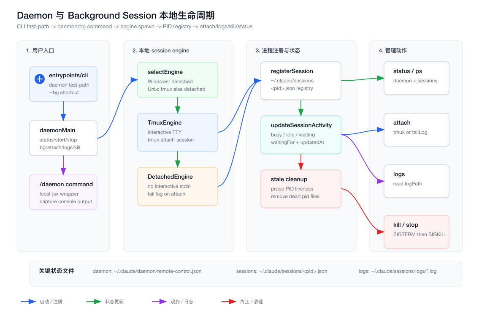
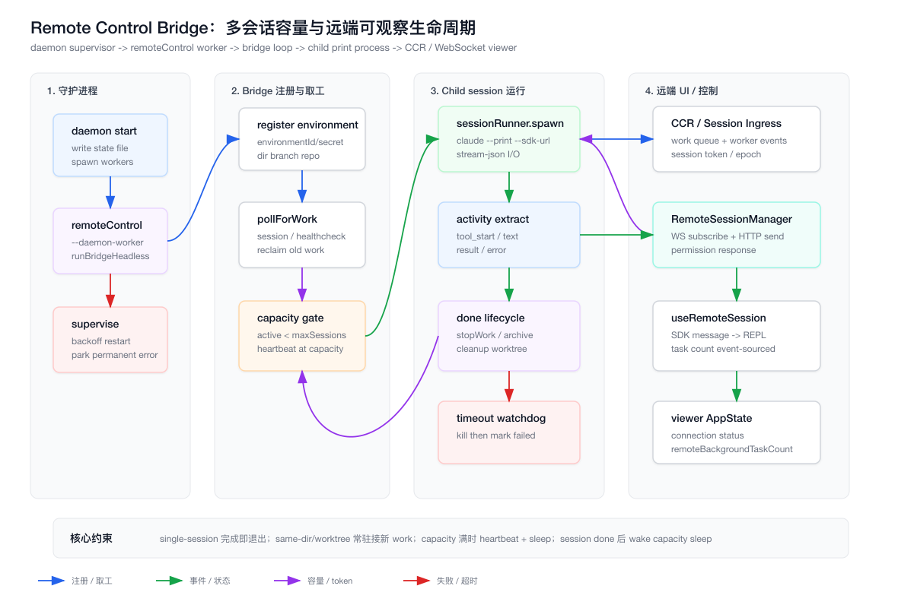

# 第 25 章：Daemon、Background Session 与 Remote Bridge 多会话运行时

上一章讲的是 transcript 如何让长会话“可恢复”。这一章继续往外扩一层：Claude Code 如何让会话“可脱离当前终端继续运行”，如何用 daemon 管理后台进程，如何用 Remote Control bridge 接收远端任务，如何在多会话并发时做容量控制、状态注册、attach、logs、kill 与远端可观察。

本章所有源码路径默认以 `claude-code/` 为根。

## 25.1 章节目标

读完本章，你应该能回答六个问题：

1. Claude Code 里 `daemon`、`bg session`、`remote-control bridge` 分别是什么，为什么不能混为一谈。
2. `claude daemon bg` 如何在 tmux 与 detached engine 之间选择。
3. `~/.claude/sessions/<pid>.json` 这个 PID registry 为什么是本地多会话控制面的核心。
4. daemon supervisor 如何管理 `remoteControl` worker，并用 backoff / parking 防止崩溃循环。
5. Remote bridge 如何注册环境、poll work、按 capacity 启动 child session、心跳、回收、归档。
6. 远端 viewer 如何通过 WebSocket、HTTP POST、permission control、event-sourced task count 映射到 REPL UI。

这章不是普通“Node.js 子进程”教程。真正要理解的是：一个 Coding Agent 产品为什么需要把“会话”抽象成可管理的 runtime instance。

## 25.2 架构图：本地 Daemon 与 Background Session 生命周期

源文件在 `assets/25-daemon-background-session-runtime.svg`，PNG 导出文件在 `assets/25-daemon-background-session-runtime.png`。



这张图展示本地路径：

- `claude-code/src/entrypoints/cli.tsx` 做 daemon / bg fast-path。
- `claude-code/src/daemon/main.ts` 统一处理 `status/start/stop/bg/attach/logs/kill`。
- `claude-code/src/cli/bg.ts` 管理 background sessions。
- `claude-code/src/cli/bg/engines/*` 提供 tmux 与 detached 两种运行引擎。
- `claude-code/src/utils/concurrentSessions.ts` 负责 session PID registry 与 live activity。

可以把它理解为一个轻量版的“本地进程控制面”。

## 25.3 架构图：Remote Bridge 多会话容量与远端控制

源文件在 `assets/25-remote-bridge-capacity-lifecycle.svg`，PNG 导出文件在 `assets/25-remote-bridge-capacity-lifecycle.png`。



这张图展示远端路径：

- daemon supervisor 启动 `remoteControl` worker。
- worker 调用 `runBridgeHeadless` 注册 bridge environment。
- bridge loop 从 CCR / Session Ingress poll work。
- capacity 未满时 spawn child `claude --print --sdk-url ...`。
- child stdout 的 NDJSON 被解析成 activity。
- session done 后 stop work、archive session、清理 worktree，并 wake capacity sleep。
- 远端 viewer 通过 `RemoteSessionManager` 和 `useRemoteSession` 订阅消息、发送用户输入、处理 permission request。

这条链路让 Claude Code 从“一个本地 CLI”变成“一个可以被远端调度的 Agent worker”。

## 25.4 先分清三个概念

Claude Code 里有三个容易混淆的概念：

| 概念 | 典型入口 | 作用 |
| --- | --- | --- |
| Background session | `claude daemon bg`、`--bg` | 把一个 Claude CLI 会话放到后台跑，之后 attach/logs/kill |
| Daemon supervisor | `claude daemon start` | 常驻管理 worker，目前主要管理 Remote Control worker |
| Remote bridge | `remoteControl` worker、`runBridgeHeadless` | 向远端注册环境，接收远端 session work，spawn child CLI |

它们共享部分基础设施，例如 PID registry、daemon command namespace、session logs。

但它们的生命周期不同：

- Background session 是“我要把当前任务丢到后台继续跑”。
- Daemon supervisor 是“我要有一个常驻本地管理进程”。
- Remote bridge 是“我要让远端系统把任务投递给本机 Claude Code 执行”。

如果把这三者混在一起，后面看代码会非常乱。

## 25.5 从前端视角类比

前端工程师可以这样类比：

| Claude Code 机制 | 前端 / Node 类比 |
| --- | --- |
| background session | 浏览器 tab 被放到后台，但 JS 任务还在跑 |
| daemon supervisor | PM2 / nodemon / service worker supervisor |
| PID registry | client-side store + heartbeat registry |
| tmux engine | 提供真实交互终端的容器 |
| detached engine | 后台 child process + log file |
| attach | devtools reconnect 到已有 runtime |
| logs | 读取 runtime stdout/stderr |
| kill | 向 runtime 发送 SIGTERM/SIGKILL |
| Remote bridge | 本机 Agent worker 注册到云端调度中心 |
| capacity gate | worker pool 的 max concurrency |

核心认知是：Agent 不是一次函数调用，而是一个长生命周期 runtime。

前端应用里，用户关掉某个 panel 不代表业务任务必须停止。

Coding Agent 也一样。终端 UI 只是控制面，真正执行任务的是后面的 session process。

## 25.6 为什么 Coding Agent 需要后台会话

普通 CLI 工具通常是：

```text
command starts -> command runs -> command exits
```

Coding Agent 不一样。

它可能：

- 连续跑几十分钟。
- 等待用户权限确认。
- 执行多个工具调用。
- 在中途 compact context。
- 启动 subagent。
- 需要从另一个终端重新连接。
- 被远端 UI 观察或控制。

如果所有能力都绑定在当前 TTY 上，用户一关终端，任务就没了。

所以 Claude Code 需要一层 session lifecycle management，把“UI 是否还连接”与“Agent 是否还运行”分开。

## 25.7 CLI fast-path：为什么 daemon 不走完整 Commander 初始化

入口在 `claude-code/src/entrypoints/cli.tsx`。

它对几类命令做 fast-path：

- `--daemon-worker=<kind>`
- `claude daemon [subcommand]`
- `--bg` / `--background`
- deprecated 的 `ps/logs/attach/kill`

fast-path 的价值是：这些命令不需要完整加载交互式 REPL。

例如 `claude daemon status` 只是读取状态文件、列出 sessions，不应该初始化完整 MCP、hooks、UI、插件、prompt pipeline。

`--daemon-worker` 更敏感。它是 supervisor spawn 出来的内部 worker，要尽量 lean。源码注释也强调：这个路径不在 entrypoint 层做 `enableConfigs()` 和 analytics sinks，worker 需要什么自己初始化。

这是一条重要原则：

> 进程控制命令应该比业务 runtime 更轻。

否则你每次 `ps` 都会触发一堆不必要的副作用。

## 25.8 `claude daemon` 命名空间

`claude-code/src/daemon/main.ts` 是 daemon 子命令入口。

它支持：

- `status`
- `ps`
- `start`
- `stop`
- `bg`
- `attach`
- `logs`
- `kill`
- `help`

这里的设计很像 Docker：

```text
docker ps
docker logs <id>
docker attach <id>
docker kill <id>
```

Claude Code 把 daemon supervisor 和 background sessions 放在同一个 namespace 下，是为了给用户一个统一心智：

```text
claude daemon status
claude daemon bg
claude daemon attach
claude daemon logs
claude daemon kill
```

它不是说所有 session 都由同一个 supervisor 直接创建。

它只是把“后台进程管理”收敛到一个命令入口。

## 25.9 `/daemon` slash command

REPL 内也有 `/daemon`。

源码在：

- `claude-code/src/commands/daemon/index.ts`
- `claude-code/src/commands/daemon/daemon.tsx`

它是 `local-jsx` command，会在 REPL 内调用 `daemonMain` 或 `handleBgStart`，然后 capture `console.log/error` 输出，再通过 `onDone` 返回系统消息。

有一个限制：`attach` 不允许在 REPL 内执行。

原因很简单：attach 是交互式阻塞行为。你不能在一个已经运行的 Ink REPL 里再嵌一个阻塞式 tmux attach。

所以 `/daemon attach` 会提示用户使用 CLI：

```text
claude daemon attach
```

这体现了 UI command 和 terminal control 的边界。

## 25.10 daemon supervisor 状态文件

`claude-code/src/daemon/state.ts` 负责 daemon supervisor 的状态文件。

默认路径是：

```text
~/.claude/daemon/remote-control.json
```

状态结构包括：

- `pid`
- `cwd`
- `startedAt`
- `workerKinds`
- `lastStatus`

提供的操作包括：

- `writeDaemonState`
- `readDaemonState`
- `removeDaemonState`
- `queryDaemonStatus`
- `stopDaemonByPid`

`queryDaemonStatus` 不是只看文件是否存在。它会用 `process.kill(pid, 0)` 探测进程是否还活着。

结果有三种：

- `running`：状态文件存在，PID 活着。
- `stopped`：没有状态文件。
- `stale`：状态文件存在，但 PID 死了，会自动清理。

这就是本地 daemon 的最小 control plane。

## 25.11 为什么要探测 PID，而不是相信状态文件

状态文件是进程写的。

如果进程正常退出，它可以删除状态文件。

但如果进程崩溃、机器断电、被用户 `kill -9`，状态文件就会残留。

如果 `status` 只看 JSON 文件，用户会看到一个不存在的 daemon 还在 running。

所以 Claude Code 采用 PID probe：

```text
state file exists -> probe pid -> alive: running / dead: stale cleanup
```

这是任何本地 daemon 都绕不开的问题。

前端类比的话，localStorage 里有 token 不代表 session 还有效。你仍然要向服务器验证。

## 25.12 stopDaemonByPid：温和终止与强制终止

`stopDaemonByPid` 的策略是：

1. 读取 state file。
2. 如果 PID 不存在或已死，清理 state file。
3. 发送 `SIGTERM`。
4. 在超时时间内轮询等待退出。
5. 如果仍然存活，发送 `SIGKILL`。
6. 清理 state file。

这比直接 `SIGKILL` 更合理。

`SIGTERM` 给 supervisor 一个机会：

- abort controller。
- 清理 restart timer。
- 给 worker 发 SIGTERM。
- 等 worker 退出。
- 删除 state file。

`SIGKILL` 是最后兜底，防止用户永远停不掉 daemon。

## 25.13 runSupervisor：一个很小的进程监督器

`runSupervisor(args)` 是 daemon supervisor 的主体。

它做这些事：

- 解析 `--dir`、`--spawn-mode`、`--capacity`、`--permission-mode`、`--sandbox`、`--name`。
- 写 daemon state file。
- 创建 AbortController。
- 注册 SIGTERM/SIGINT graceful shutdown。
- spawn worker。
- 等待 abort。
- 等所有 worker 退出，必要时 30 秒后 SIGKILL。

当前默认 worker 只有一个：

```text
remoteControl
```

但数据结构是 `WorkerState[]`，说明它已经按多 worker supervisor 写了。

这是一种有意的架构余量：今天只有 remoteControl，未来可以加别的 worker，例如 schedule、sync、indexing、assistant worker。

## 25.14 WorkerState：supervisor 为什么需要 backoff

`WorkerState` 包含：

- `kind`
- `process`
- `backoffMs`
- `failureCount`
- `parked`
- `lastStartTime`
- `restartTimer`

worker 崩溃后，supervisor 不会立刻无限重启。

它会：

- 初始 backoff 2 秒。
- 每次失败按 2 倍增长。
- 上限 120 秒。
- 如果 worker 在 10 秒内快速失败，累计 failureCount。
- 快速失败超过 5 次后 park worker。
- permanent exit code 直接 park。

这是生产系统里非常关键的保护。

没有 backoff，坏配置会导致进程疯狂重启，刷爆日志、CPU 和远端服务。

没有 parking，永久错误会被当成瞬时错误不断重试。

## 25.15 permanent error 和 transient error

`claude-code/src/daemon/workerRegistry.ts` 定义了两个退出码语义：

- `EXIT_CODE_PERMANENT = 78`
- `EXIT_CODE_TRANSIENT = 1`

`runDaemonWorker(kind)` 如果遇到未知 kind，会设置 permanent。

`runRemoteControlWorker()` 捕获 `BridgeHeadlessPermanentError` 时也会设置 permanent。

典型 permanent error：

- workspace trust 未接受。
- worktree mode 下既不是 git repo，也没有 WorktreeCreate hook。
- remote base URL 使用不安全 HTTP。

典型 transient error：

- 没有 token，但 supervisor 后续可能刷新。
- bridge registration 网络失败。
- 远端暂时不可用。

这个区分非常重要。

transient 应该 backoff retry。

permanent 应该 park，等待用户修配置。

## 25.16 remoteControl worker：daemon 的业务 worker

`runRemoteControlWorker()` 会从环境变量读取配置：

- `DAEMON_WORKER_DIR`
- `DAEMON_WORKER_NAME`
- `DAEMON_WORKER_SPAWN_MODE`
- `DAEMON_WORKER_CAPACITY`
- `DAEMON_WORKER_PERMISSION`
- `DAEMON_WORKER_SANDBOX`
- `DAEMON_WORKER_TIMEOUT_MS`
- `DAEMON_WORKER_CREATE_SESSION`

这些环境变量由 `daemon/main.ts` 的 `spawnWorker` 注入。

然后它构造 `HeadlessBridgeOpts`，调用：

```text
runBridgeHeadless(opts, controller.signal)
```

这说明 remoteControl worker 本身不直接做 work queue 调度。

它只是把 daemon supervisor 的配置转换成 headless bridge 所需配置。

真正的远端 work loop 在 `claude-code/src/bridge/bridgeMain.ts`。

## 25.17 Background session：不是 daemon supervisor 的 worker

`claude daemon bg` 走的是 `claude-code/src/cli/bg.ts`。

它不是 `remoteControl` worker。

它的目标是启动一个用户可 attach 的后台 Claude CLI。

流程是：

1. `handleBgStart(args)` 调用 `selectEngine()`。
2. 去掉 `--bg/--background` 兼容参数。
3. 如果 engine 不支持 interactive input，要求 `-p/--print` 或 `--pipe`。
4. 生成 `claude-bg-<uuid>` session name。
5. 生成 log path。
6. 调用 engine.start。
7. 输出 attach/status/kill 提示。

这里最关键的是第 3 步。

detached engine 没有真实 TTY，所以不能启动一个等待用户输入的交互式 REPL。用户必须提供 print prompt 或 pipe input。

tmux engine 有虚拟终端，所以可以后台运行交互式会话。

## 25.18 BgEngine 抽象

`claude-code/src/cli/bg/engine.ts` 定义了 `BgEngine`：

- `name`
- `supportsInteractiveInput`
- `available()`
- `start(opts)`
- `attach(session)`

这是一层非常干净的跨平台抽象。

为什么需要它？

因为后台会话在不同平台上的最佳实现不同：

- macOS/Linux 有 tmux 时，最好的体验是 tmux session。
- Windows 或没有 tmux 时，只能 detached child process。
- detached child 没有 stdin，所以 attach 只能 tail log。

如果没有 `BgEngine` 抽象，这些分支会散落在 bg start、attach、status、tests 各处。

## 25.19 selectEngine：平台和能力优先级

`claude-code/src/cli/bg/engines/index.ts` 的策略很清楚：

- Windows：直接 `DetachedEngine`。
- 非 Windows：先试 `TmuxEngine.available()`。
- tmux 可用：用 tmux。
- tmux 不可用：fallback detached。

这不是“偏好 tmux”这么简单。

tmux 提供的是能力差异：

- 可交互 stdin。
- 可重新 attach 到完整终端。
- 可以保留 REPL UI 状态。

detached 提供的是兼容性：

- 任何平台都能启动。
- stdout/stderr 写 log。
- attach 时 tail log。

能力越强，约束也越多。tmux 依赖系统安装；detached 牺牲交互。

## 25.20 TmuxEngine：后台交互式终端

`claude-code/src/cli/bg/engines/tmux.ts` 会通过：

```text
tmux new-session -d -s <sessionName> <cmd>
```

启动后台 session。

它设置的环境变量包括：

- `CLAUDE_CODE_SESSION_KIND=bg`
- `CLAUDE_CODE_SESSION_NAME`
- `CLAUDE_CODE_SESSION_LOG`
- `CLAUDE_CODE_TMUX_SESSION`

attach 时调用：

```text
tmux attach-session -t <tmuxSessionName>
```

注意：tmux 不直接返回 child Claude 的 PID，所以 `start()` 返回 `pid: 0`。真正的 session process 会在启动后自己写 PID file。

这就是为什么 PID registry 要由 child process 自己注册，而不是 parent 替它写。

## 25.21 DetachedEngine：后台非交互执行

`claude-code/src/cli/bg/engines/detached.ts` 使用 `spawnCli`：

- `detached: true`
- `stdio: ['ignore', logFd, logFd]`
- `child.unref()`

stdout 和 stderr 都写到同一个 log file。

attach 时走 `tailLog(logPath)`。

这类 session 的使用方式更像：

```text
claude daemon bg -p "fix the failing tests"
claude daemon attach <session>
```

而不是把一个完整 REPL 放到后台。

## 25.22 tailLog：跨平台 attach 的最小实现

`claude-code/src/cli/bg/tail.ts` 实现 detached attach。

策略是：

1. 读取已有 log 内容并输出。
2. 用 `fs.watchFile()` 轮询 log 文件。
3. 文件变大时，从上次 position 读取新增 bytes。
4. Ctrl+C 只 detach tail，不 kill 后台进程。

选择 `watchFile` 而不是平台特定的文件通知，是为了跨平台稳定。

这是一种朴素但可靠的实现。

对用户来说，attach detached session 看到的是日志流，不是交互终端。

## 25.23 PID registry：`~/.claude/sessions`

`claude-code/src/utils/concurrentSessions.ts` 是本地 session registry。

它写入：

```text
~/.claude/sessions/<pid>.json
```

注册内容包括：

- `pid`
- `sessionId`
- `cwd`
- `startedAt`
- `kind`
- `entrypoint`
- `messagingSocketPath`
- `name`
- `logPath`
- `agent`

这份 registry 被多个功能复用：

- `claude daemon status`
- `claude daemon attach`
- `claude daemon logs`
- `claude daemon kill`
- concurrent session telemetry。
- UDS peer discovery。
- Remote bridge peer dedupe。

它是本地控制面的基础数据源。

## 25.24 registerSession：为什么 child 自己注册

`registerSession()` 会注册所有 top-level sessions：

- interactive CLI。
- SDK / print。
- background sessions。
- daemon / daemon-worker spawns。

但它会跳过 teammates/subagents，因为这些不是用户层面的并发 CLI session。如果把它们也写进 PID registry，`claude ps` 会被 swarm 内部噪音污染。

Child 自己注册有两个好处：

1. parent 不需要猜 child PID。
2. cleanup-on-exit 可以在 child 进程内注册，退出时自动删除自己的 pid file。

这也是 tmux engine 返回 `pid: 0` 仍然可行的原因。

## 25.25 envSessionKind：用环境变量标记 session 类型

`envSessionKind()` 会读取：

```text
CLAUDE_CODE_SESSION_KIND
```

支持：

- `bg`
- `daemon`
- `daemon-worker`

没有 env override 时，默认是 `interactive`。

这让 spawn 方可以告诉 child：

```text
你是一个 bg session
你是一个 daemon worker
```

child 在 `registerSession` 时就能写出正确 `kind`。

这种方式比 parent 写 registry 更松耦合。

## 25.26 updateSessionActivity：live status 的写入点

`updateSessionActivity({ status, waitingFor })` 会更新 PID file：

- `status`
- `waitingFor`
- `updatedAt`

`claude-code/src/screens/REPL.tsx` 会根据 UI 状态计算：

- `busy`
- `idle`
- `waiting`

如果等待权限、worker request、sandbox request、local JSX dialog，就会写 `waitingFor`。

这让 `claude ps` 不只是显示“进程活着”，还可以显示它在干什么。

这就是控制面从 process list 升级为 session dashboard 的关键。

## 25.27 背景任务 summary

`claude-code/src/utils/taskSummary.ts` 会在 bg session 中按节流生成状态摘要。

它只在满足这些条件时工作：

- feature `BG_SESSIONS` 开启。
- 当前是 bg session。
- 距离上次 summary 超过 30 秒。

它会从最近 assistant message 中提取工具调用状态，例如最后一个 block 是 `tool_use`，就写：

```text
waitingFor = tool: <name>
```

这是一个轻量状态更新，不是完整 transcript。

它的目标是让后台 session 在 `ps` 里更像“正在执行某件事”，而不是只显示 PID。

## 25.28 listLiveSessions：状态列表如何避免 stale

`claude-code/src/cli/bg.ts` 的 `listLiveSessions()` 会读取 `~/.claude/sessions`。

它只接受严格匹配的文件：

```text
<digits>.json
```

然后：

- 从文件名解析 PID。
- 用 `isProcessRunning(pid)` 判断是否活着。
- 不活着就异步删除。
- 活着就 parse JSON。
- corrupt file 会跳过。

这里和 daemon state 一样：不能相信文件存在。

PID registry 是缓存，不是权威真相。权威真相是 OS process liveness。

## 25.29 findSession：用户 target 的多种寻址方式

`findSession(sessions, target)` 支持按三种方式找 session：

- `sessionId`
- `pid`
- `name`

这对 CLI 可用性很重要。

用户可能记得：

- 完整 session id。
- `claude daemon status` 里看到的 PID。
- 自己设置的 name。

控制面应该允许这些自然入口，而不是强迫用户复制长 ID。

## 25.30 psHandler：本地 session dashboard

`psHandler` 会列出 live sessions。

每个 session 可能显示：

- PID
- Kind
- Engine
- Session
- CWD
- Name
- Started
- Status
- Waiting for
- Bridge
- Tmux
- Log

这里 `Engine` 需要向后兼容。旧 session 可能没有 `engine` 字段，所以 `resolveSessionEngine` 会通过 `tmuxSessionName` 推断。

这是一条持久化兼容原则：registry schema 演进时，读取侧要兼容旧字段。

## 25.31 attachHandler：tmux 和 detached 的分叉

`attachHandler(target)` 会：

1. 列出 live sessions。
2. 如果没有 target 且只有一个可 attach session，就默认选它。
3. 多个 session 时提示用户指定。
4. 找到目标 session。
5. 根据 engine 分流：
   - tmux：`TmuxEngine.attach`
   - detached：`DetachedEngine.attach`

对于 tmux，是进入交互式终端。

对于 detached，是 tail log。

同一个命令 `claude daemon attach` 在不同 engine 下语义不同，但用户心智一致：重新观察这个后台 session。

## 25.32 logsHandler：只读日志

`logsHandler(target)` 会读 `session.logPath` 并输出。

如果没有 target：

- 没有 session：提示无 active sessions。
- 只有一个 session：默认使用它。
- 多个 session：要求用户指定。

这和 attach 一样，单 session 时减少摩擦，多 session 时避免误操作。

logs 是只读动作，不连接进程，也不影响 session 生命周期。

## 25.33 killHandler：终止后台 session

`killHandler(target)` 会：

1. 查找目标 session。
2. 发送 `SIGTERM`。
3. 等待 2 秒。
4. 如果还活着，发送 `SIGKILL`。
5. 删除 PID file。

这和 daemon stop 类似，但目标是单个 background session。

注意它不依赖 session 自己优雅退出一定成功。它会主动清理 PID file，避免 status 继续显示已 kill 的 session。

## 25.34 bg session 中 `/exit` 为什么是 detach

`claude-code/src/screens/REPL.tsx` 的 `handleExit` 有一段专门逻辑：

如果开启 `BG_SESSIONS` 且 `isBgSession()` 为 true，`/exit` 或退出路径会执行：

```text
tmux detach-client
```

然后返回，而不是杀掉 Claude Code 进程。

原因是：在 bg session 里，用户 attach 到 tmux 后按退出，不一定想终止任务。很多时候只是想离开这个终端视图。

这和 SSH 很像：

- detach：断开控制端。
- kill：终止远端进程。

产品上必须区分这两个动作。

## 25.35 prevent sleep 与 background status

REPL 中还会在 agent 忙碌且不等待用户输入时调用 prevent sleep。

这与 background session 没有直接耦合，但体现了同一个目标：长任务不能被终端 UI 的短生命周期打断。

后台会话要持续运行。

前台会话执行长任务时，也应该尽量避免系统睡眠导致任务中断。

这类细节通常不是 demo 级 Agent 会做的，但工业产品必须考虑。

## 25.36 Remote Control 与 daemon 的关系

`claude remote-control` 是另一条入口。

但 daemon supervisor 也能启动 Remote Control worker。

关系可以这样理解：

- `remote-control` CLI 是用户手动启动 bridge 的前台入口。
- `daemon start` 是把 bridge worker 作为后台常驻 worker 管理。
- `remoteControl` worker 调用 `runBridgeHeadless`，没有 TUI，没有 readline。

`claude-code/src/commands/remoteControlServer/remoteControlServer.tsx` 和 `claude-code/src/commands/assistant/assistant.tsx` 都会通过 `buildCliLaunch(['daemon','start',...])` 启动 daemon。

这说明 assistant / remote-control 产品层最终落到同一个 daemon supervisor。

## 25.37 runBridgeHeadless：无 TUI 的 bridgeMain 子集

`runBridgeHeadless(opts, signal)` 在 `claude-code/src/bridge/bridgeMain.ts`。

它是 `bridgeMain` 的非交互子集：

- 没有 readline dialogs。
- 没有 stdin key handlers。
- 没有 TUI。
- 不直接 `process.exit()`。
- config 从 daemon worker 传入。
- auth 通过 `getAccessToken` 回调获取。
- 日志写到 worker stdout。
- fatal error 抛出，让 worker 映射 permanent/transient exit code。

这就是“同一业务内核，多种宿主”的写法。

前台 `bridgeMain` 负责交互体验。

后台 `runBridgeHeadless` 负责可监督、可重启、可长期运行。

## 25.38 runBridgeHeadless 的启动步骤

它会做这些事：

1. `process.chdir(dir)`。
2. 设置 `setOriginalCwd(dir)` 和 `setCwdState(dir)`。
3. `enableConfigs()`。
4. `initSinks()`。
5. 检查 workspace trust。
6. 检查 access token。
7. 检查 base URL 是否 HTTPS 或 localhost HTTP。
8. 如果 spawnMode 是 worktree，检查 git repo 或 WorktreeCreate hook。
9. 获取 branch、remote URL、hostname。
10. 构造 `BridgeConfig`。
11. 创建 Bridge API client。
12. 注册 bridge environment。
13. 创建 session spawner。
14. 可选预创建 session。
15. 进入 `runBridgeLoop`。

这里再次强调 cwd。

Bridge worker 不是随便在哪个目录跑都可以。它 spawn 的 child session、git 信息、worktree 创建，都依赖正确 workspace。

## 25.39 BridgeConfig：远端 worker 的身份

`BridgeConfig` 包含：

- `dir`
- `machineName`
- `branch`
- `gitRepoUrl`
- `maxSessions`
- `spawnMode`
- `sandbox`
- `bridgeId`
- `workerType`
- `environmentId`
- `apiBaseUrl`
- `sessionIngressUrl`
- `sessionTimeoutMs`

这份 config 会注册到远端环境。

远端系统需要知道：

- 这台机器是谁。
- 它在哪个 repo/branch。
- 它能同时跑多少 session。
- 它使用 same-dir 还是 worktree。
- 它的 worker 类型是什么。

这本质上是把本机 Claude Code 变成一个可调度 worker node。

## 25.40 SpawnMode：三种并发模型

`claude-code/src/bridge/types.ts` 定义：

- `single-session`
- `worktree`
- `same-dir`

语义是：

- `single-session`：一个 session 结束后 bridge 退出。
- `worktree`：bridge 常驻，每个 session 创建隔离 git worktree。
- `same-dir`：bridge 常驻，多个 session 共享 cwd。

这三个模式对应不同风险：

- single-session 最简单，生命周期耦合。
- worktree 最适合并发改代码，隔离文件修改。
- same-dir 最危险，多个 Agent 可能互相踩文件，但启动快。

Claude Code 把它显式建模成 `SpawnMode`，而不是散落成 boolean，说明它是架构层概念。

## 25.41 capacity gate：多会话并发的核心

`runBridgeLoop` 维护：

- `activeSessions`
- `sessionStartTimes`
- `sessionWorkIds`
- `sessionCompatIds`
- `sessionIngressTokens`
- `sessionTimers`
- `sessionWorktrees`

当 poll 到 session work 时，先检查：

```text
activeSessions.size >= config.maxSessions
```

如果已满：

- 不 spawn 新 session。
- 现有 session 的 token refresh 仍然可以处理。
- loop 进入 at-capacity throttle。
- 通过 heartbeat 保持 active work lease。
- 等 session done 后用 `capacityWake.wake()` 提前唤醒。

这就是 worker pool 的标准模式。

如果没有 capacity gate，远端可以无限投递 session，把本机打爆。

如果没有 capacity wake，session 刚结束后可能还要睡到下一个 poll interval 才接新任务。

## 25.42 heartbeatActiveWorkItems：容量满时也要保活

容量满时，bridge 不能接新 work，但不能停止心跳。

`heartbeatActiveWorkItems()` 会遍历 active sessions，对每个 work item 调用：

```text
api.heartbeatWork(environmentId, workId, ingressToken)
```

如果 token 过期，会调用 `api.reconnectSession(environmentId, sessionId)` 让服务端重新 dispatch session，下一次 poll 就能拿到新 token。

这解决的是远端 lease 问题。

Agent 正在跑，不代表远端一定知道它还活着。长任务必须主动续租。

## 25.43 pollForWork：取工不是简单队列消费

`runBridgeLoop` 调用：

```text
api.pollForWork(environmentId, environmentSecret, signal, reclaimOlderThanMs)
```

work 类型包括：

- `healthcheck`
- `session`

收到 healthcheck，ack 后记录日志。

收到 session，会先 validate session id，再处理 existing session token refresh，再检查 capacity，再 ack work，再 spawn。

这个顺序很重要：

- existing session token refresh 不受 capacity 限制。
- 新 session 受 capacity 限制。
- ack work 发生在决定接手后。
- spawn 失败要 stop work，避免远端僵尸任务。

## 25.44 CCR v1/v2 session URL

Bridge spawn child session 前要决定 SDK URL。

两条路径：

- v1：Session-Ingress WebSocket，使用 `buildSdkUrl(config.sessionIngressUrl, sessionId)`。
- v2：CCR Code Session，使用 `buildCCRv2SdkUrl(config.apiBaseUrl, sessionId)`，并先 `registerWorker` 拿 `workerEpoch`。

是否使用 v2 来自：

- work secret 的 `use_code_sessions`。
- 或环境变量强制。

这说明 bridge loop 不是只启动本地进程。它还要适配远端 session protocol 的演进。

## 25.45 sessionRunner.spawn：child Claude 的真实执行方式

`claude-code/src/bridge/sessionRunner.ts` 的 `createSessionSpawner` 会 spawn child：

```text
claude --print
       --sdk-url <url>
       --session-id <id>
       --input-format stream-json
       --output-format stream-json
       --replay-user-messages
```

这非常关键。

Remote bridge 本身不直接跑 Agent loop。

它启动一个 child Claude CLI，让 child 使用 print/SDK transport 跟远端 session 通信。

bridge 负责：

- 进程生命周期。
- stdout/stderr 解析。
- permission request 转发。
- token refresh。
- activity extraction。
- worktree 创建和清理。
- capacity 和 heartbeat。

Agent loop 仍然在 child CLI 内。

这种分工让 bridge 像一个 process orchestrator，而不是重新实现 Agent runtime。

## 25.46 child stdout：NDJSON 是进程间协议

child stdout 是 stream-json NDJSON。

`sessionRunner` 会逐行读取：

- 原始行可写入 transcript/debug file。
- 解析 assistant text/tool_use，抽取 activity。
- 解析 result，标记 completed/error。
- 解析 control_request，转发 permission request。
- 解析 user replay，提取第一个真实用户消息生成标题。

这条 stdout 流既是 UI 可观察数据，又是控制面事件来源。

这也是为什么 child 必须使用 `--output-format stream-json`。

普通 human-readable terminal output 不适合作为进程控制协议。

## 25.47 SessionActivity：远端 status 的最小摘要

`claude-code/src/bridge/types.ts` 定义：

- `tool_start`
- `text`
- `result`
- `error`

`SessionActivity` 只有：

- `type`
- `summary`
- `timestamp`

这是一个故意很小的数据结构。

远端控制面不需要完整 transcript 来展示“正在编辑什么文件”。它只需要最近 activity。

`sessionRunner.extractActivities` 会从 assistant tool_use 中提取：

- Read -> Reading
- Write -> Writing
- Edit -> Editing
- Bash -> Running
- Grep/Glob -> Searching

这就是 Agent observability 的低成本实现。

## 25.48 permission request 如何穿过 bridge

child 如果需要权限，会输出 SDK control request：

```text
type = control_request
request.subtype = can_use_tool
```

`sessionRunner` 捕获后调用 `deps.onPermissionRequest`。

bridge loop 再把 permission request 发到远端 session events。

用户在远端 UI 决策后，permission response 会回到 session。

本地 viewer 路径则由 `RemoteSessionManager` 处理 control request，并把它映射到本地 `ToolUseConfirm` queue。

这让权限系统跨进程、跨网络仍然保留同一语义：某个 tool invocation 需要 allow/deny。

## 25.49 token refresh：长会话不能只靠启动时 token

`SessionHandle.updateAccessToken(token)` 会向 child stdin 写：

```json
{
  "type": "update_environment_variables",
  "variables": {
    "CLAUDE_CODE_SESSION_ACCESS_TOKEN": "<token>"
  }
}
```

child 的 StructuredIO 会更新 `process.env`，后续请求能拿到新 token。

这很工程化。

如果长会话跑几个小时，启动时 token 可能过期。直接重启 child 会丢 runtime；静态 env 又不能更新。

通过 stdin 控制消息更新环境变量，是一种轻量 IPC。

## 25.50 session done：结束不是 child exit 就完了

`onSessionDone(sessionId, startTime, handle)` 是 bridge session 生命周期收口。

它会：

- 从 active maps 删除 session。
- 清理 timeout timer。
- cancel token refresh。
- `capacityWake.wake()`。
- 根据 timeout 修正 status。
- 记录 analytics。
- 清理 status display。
- 根据 status 输出 complete/failed/interrupted。
- 非 interrupted 时 `stopWorkWithRetry`。
- 清理 worktree。
- multi-session 下 archive completed session。
- single-session 下 abort poll loop。

这说明 child exit 只是一个信号。

真正的 session done 还要同步远端 work state、本地 worktree、UI status、capacity waiter。

## 25.51 stopWorkWithRetry：防止远端僵尸 work

`stopWorkWithRetry` 会最多尝试 3 次：

- 1 秒。
- 2 秒。
- 4 秒。

遇到 fatal auth/permission 错误不继续重试。

它的目标是让远端知道 work item 已结束。

如果 child 已退出但 stopWork 失败，远端可能还认为这份 work 在跑，导致 web UI 残留、后续调度异常。

这就是分布式系统的基本问题：本地完成，不等于远端状态已经一致。

## 25.52 archiveSession：为什么 multi-session 完成后要归档

在 multi-session 模式下，bridge 不退出。

如果某个 session 完成后不归档，web UI 上可能还显示它是 active。

所以 `onSessionDone` 会在 multi-session 下调用：

```text
api.archiveSession(compatId)
```

single-session 不同。它完成后直接 abort poll loop，环境生命周期和 session 生命周期耦合。

这就是 spawnMode 对生命周期的影响。

## 25.53 worktree cleanup：并发隔离要有回收

worktree 模式下，每个 session 可能创建隔离 worktree。

session done 后必须调用 `removeAgentWorktree`。

如果 spawn 失败，也要清理已经创建的 worktree。

否则 long-running bridge 会不断留下临时 worktree。

并发隔离不是只在开始时创建隔离环境，还必须在结束时可靠回收。

## 25.54 timeout watchdog

每个 session 可以有 timeout，默认来自 `DEFAULT_SESSION_TIMEOUT_MS`。

`onSessionTimeout` 会：

- 记录 timeout。
- 记录 analytics。
- `logger.logSessionFailed`。
- 把 sessionId 加入 `timedOutSessions`。
- 调用 `handle.kill()`。

后续 child close 时，如果 raw status 是 interrupted 且这个 session 被 timeout 标记，会被转成 failed。

这是为了区分：

- 用户或服务器正常 interrupt。
- timeout watchdog 杀掉的 session。

两者在产品语义上不一样。

## 25.55 sessionActivity：远端 keepalive 的 refcount

`claude-code/src/utils/sessionActivity.ts` 管理 session activity keepalive。

它用 refcount 记录当前是否有：

- `api_call`
- `tool_exec`

当 refcount 从 0 到 1，会启动 30 秒 heartbeat timer。

当 refcount 回到 0，会停止 heartbeat，并启动 idle timer。

transport 可以通过 `registerSessionActivityCallback` 注册 keepalive callback。

这不是 UI spinner。

它是远端 worker 生命周期保活信号：当本地 child 正在 API call 或 tool execution 时，远端容器/会话不应该被误判 idle。

## 25.56 RemoteSessionManager：viewer 侧控制器

`claude-code/src/remote/RemoteSessionManager.ts` 管理远端 session。

它协调三件事：

- WebSocket subscription 接收 SDK messages。
- HTTP POST 发送用户 message。
- control request / response 处理权限请求。

核心方法包括：

- `connect`
- `sendMessage`
- `respondToPermissionRequest`
- `cancelSession`
- `disconnect`
- `reconnect`

它不是 React hook。

它是一个纯控制器，React 层通过 `useRemoteSession` 使用它。

这分层很好：网络协议、状态机、React UI 不耦合。

## 25.57 SessionsWebSocket：远端消息订阅

`claude-code/src/remote/SessionsWebSocket.ts` 连接：

```text
/v1/sessions/ws/<sessionId>/subscribe?organization_uuid=...
```

它处理：

- OAuth headers。
- Bun WebSocket 与 Node `ws` 两种运行时。
- ping interval。
- reconnect attempts。
- permanent close code。
- 4001 session not found 的有限重试。
- JSON parse。
- control response / control request send。

4001 特别值得注意。

源码注释说明：compaction 期间服务器可能短暂认为 session stale，所以 4001 不是立刻永久失败，而是有小的 retry budget。

这体现了长会话系统对“短暂不一致”的容忍。

## 25.58 useRemoteSession：把远端 SDK 流映射到 REPL

`claude-code/src/hooks/useRemoteSession.ts` 是 React 侧桥接。

它做这些事：

- 创建 `RemoteSessionManager`。
- 连接 WebSocket。
- 把 SDK message 转成本地 REPL message。
- 处理 streaming events。
- 处理 permission request。
- 维护 loading 状态。
- 发送用户输入。
- 处理 cancel。
- 处理 reconnect / disconnected。

它还有一个重要职责：远端后台任务计数。

本地 viewer 的 `AppState.tasks` 是空的，因为任务运行在远端 daemon child 进程里。

所以它用系统消息事件维护：

- `task_started`：加入 `runningTaskIdsRef`。
- `task_notification`：删除 task id。
- `task_progress`：忽略渲染。

然后写入：

```text
remoteBackgroundTaskCount
```

这是 event-sourced UI state。

## 25.59 为什么 WS 断线时要清空远端 task count

`useRemoteSession` 在 `onReconnecting` 里会清空 `runningTaskIdsRef`。

原因是 WebSocket gap 期间可能错过 `task_notification`。

如果不清空，UI 可能永远显示“还有 N 个后台任务在跑”。

清空的代价是：如果任务跨过 reconnect，短时间内可能 undercount。

这是一个合理权衡：

- 高估会导致状态永远脏。
- 低估会在后续事件到来时恢复。

实时控制面里，过期状态比短暂缺失更危险。

## 25.60 viewerOnly：观察者不能随便打断远端 Agent

`RemoteSessionConfig` 有 `viewerOnly`。

注释写得很清楚：

- Ctrl+C / Escape 不发送 interrupt。
- 60 秒 reconnect timeout disabled。
- session title 不由 viewer 更新。
- 用于 `claude assistant`。

这很重要。

同一个远端 session 可能有真正 owner，也可能有 viewer。

viewer 看到消息，不代表它应该拥有控制权。

这类似前端协作产品里的只读观察者模式。

## 25.61 远端 echo 去重

`useRemoteSession` 发送用户消息时，会先把 uuid 加入 `sentUUIDsRef`。

WebSocket 可能把同一条用户消息 echo 回来：

- server broadcast 一次。
- worker write path 再 echo 一次。

所以它用 `BoundedUUIDSet`，而且匹配后不立即删除。

如果 delete-on-first-match，第二次 echo 会穿透，UI 就会显示重复用户消息。

这是流式远端系统很典型的问题：同一个事件可能从多个路径回来，去重必须按事件 ID 而不是按时序。

## 25.62 permission bridge：远端权限请求如何进入本地 UI

当远端发来 control request，`RemoteSessionManager` 会：

- 判断 subtype 是否是 `can_use_tool`。
- 记录 pending request。
- 调用 `onPermissionRequest`。

`useRemoteSession` 收到后：

- 根据 tool name 找本地 Tool。
- 找不到则创建 tool stub。
- 创建 synthetic assistant message。
- 把 permission request 放入 `ToolUseConfirm` queue。

用户决策后，通过 `respondToPermissionRequest` 发回 control response。

这让远端 session 仍然复用本地权限 UI。

远端只是换了 transport，不应该重写一套 permission UX。

## 25.63 response timeout 与 reconnect

非 viewerOnly 模式下，发送消息后会启动 response timeout。

默认 60 秒。

如果正在 compaction，会延长到 3 分钟。

超时后：

- 插入 warning system message。
- 调用 manager.reconnect()。

为什么 compaction 要特殊处理？

因为 compact API 调用本来就可能耗时，而且期间 worker 不一定持续发消息。如果按普通 60 秒判断，会产生误报。

这就是 Agent runtime 和 transport timeout 的耦合点：业务阶段不同，超时策略也不同。

## 25.64 remoteConnectionStatus：连接状态进入 AppState

`AppStateStore` 中有：

- `remoteConnectionStatus`
- `remoteBackgroundTaskCount`

`useRemoteSession` 在连接事件中更新：

- connected
- reconnecting
- disconnected

`claude-code/src/components/Spinner.tsx` 会读取这些状态，把远端连接状态和后台任务数量展示到 UI。

这和第 23 章的可观察控制面呼应。

区别在于：本地 tasks 存在 AppState 里；远端 tasks 只能通过事件重建计数。

## 25.65 本地 PID registry 与远端 bridge state 的边界

容易误解的一点是：`~/.claude/sessions` 不是远端 session 数据库。

它只是本机活跃进程 registry。

Remote bridge 还维护远端状态：

- environment registration。
- work id。
- session ingress token。
- worker epoch。
- active work heartbeat。
- archive session。
- stop work。

两者是不同控制面：

- 本地 PID registry 回答“本机有哪些进程活着”。
- Remote bridge 回答“远端有哪些 work 被本机 worker 承接”。

一个 session 可能同时出现在两边，但不能用其中一个完全替代另一个。

## 25.66 最小实现：本地 PID registry

下面是教学版伪实现，表达 `registerSession + ps + stale cleanup` 的核心思想：

```ts
type SessionEntry = {
  pid: number
  sessionId: string
  cwd: string
  startedAt: number
  kind: 'interactive' | 'bg' | 'daemon-worker'
  name?: string
  logPath?: string
  status?: 'busy' | 'idle' | 'waiting'
  waitingFor?: string
}

async function registerSession(entry: SessionEntry) {
  await mkdir('~/.claude/sessions', { recursive: true })
  await writeFile(
    `~/.claude/sessions/${entry.pid}.json`,
    JSON.stringify(entry),
  )
}

async function listLiveSessions() {
  const entries: SessionEntry[] = []

  for (const file of await readdir('~/.claude/sessions')) {
    if (!/^\d+\.json$/.test(file)) continue
    const pid = Number(file.replace('.json', ''))

    if (!isProcessRunning(pid)) {
      await unlink(`~/.claude/sessions/${file}`)
      continue
    }

    entries.push(JSON.parse(await readFile(`~/.claude/sessions/${file}`, 'utf8')))
  }

  return entries
}
```

真实 Claude Code 多了：

- cleanup registry。
- session switch 后更新 sessionId。
- WSL 保守清理策略。
- UDS messaging socket。
- bg session name/logPath/agent。
- updateSessionActivity。
- concurrent telemetry。

但核心就是：进程自己写 registry，管理命令读 registry，并用 OS liveness 清理 stale。

## 25.67 最小实现：BgEngine

教学版 `BgEngine` 可以这样抽象：

```ts
interface BgEngine {
  name: 'tmux' | 'detached'
  supportsInteractiveInput: boolean
  available(): Promise<boolean>
  start(options: {
    sessionName: string
    args: string[]
    cwd: string
    logPath: string
    env: Record<string, string | undefined>
  }): Promise<void>
  attach(session: SessionEntry): Promise<void>
}
```

这层抽象的价值是：上层 `handleBgStart` 不需要关心平台。

它只关心：

- 当前 engine 是否支持 interactive input。
- 如何 start。
- 如何 attach。

tmux 和 detached 的差异被限制在 engine 内。

## 25.68 最小实现：supervisor backoff

教学版 supervisor 可以这样写：

```ts
async function supervise(spawnWorker: () => ChildProcess) {
  let backoffMs = 2000
  let rapidFailures = 0

  while (true) {
    const startedAt = Date.now()
    const child = spawnWorker()
    const code = await waitExit(child)

    if (code === 78) break

    const ranMs = Date.now() - startedAt
    if (ranMs < 10_000) {
      rapidFailures++
      if (rapidFailures >= 5) break
    } else {
      rapidFailures = 0
      backoffMs = 2000
    }

    await sleep(backoffMs)
    backoffMs = Math.min(backoffMs * 2, 120_000)
  }
}
```

这就是 `daemon/main.ts` 的精神：

- transient crash 可以重试。
- rapid crash 要 park。
- permanent code 不重试。
- backoff 有上限。

## 25.69 最小实现：Bridge capacity loop

教学版 bridge worker pool：

```ts
async function bridgeLoop(maxSessions: number) {
  const active = new Map<string, ChildProcess>()

  while (true) {
    const work = await pollForWork()
    if (!work) continue

    if (work.type === 'healthcheck') {
      await ack(work)
      continue
    }

    if (active.has(work.sessionId)) {
      await refreshToken(active.get(work.sessionId)!, work.token)
      await ack(work)
      continue
    }

    if (active.size >= maxSessions) {
      await heartbeatActiveSessions(active)
      await sleepUntilCapacityChanges()
      continue
    }

    await ack(work)
    const child = spawnClaudePrint(work)
    active.set(work.sessionId, child)

    child.on('exit', async () => {
      active.delete(work.sessionId)
      await stopWork(work.id)
      wakeCapacityWaiters()
    })
  }
}
```

真实系统要更复杂：

- work secret decode。
- v1/v2 session transport。
- worktree mode。
- permission forwarding。
- token refresh scheduler。
- timeout watchdog。
- archive session。
- stopWork retry。
- environment deregister。

但核心仍然是 worker pool：poll、capacity、spawn、heartbeat、done cleanup。

## 25.70 常见故障一：`claude daemon status` 显示 stale

可能原因：

- daemon 进程崩溃。
- 用户 kill 了 supervisor。
- 机器重启后 state file 残留。
- PID 已被回收但 probe 失败时机异常。

正确行为是：`queryDaemonStatus` 返回 stale 并清理 state file。

如果 stale 没被清理，优先看：

- `getDaemonStateFilePath` 是否指向正确 config home。
- PID probe 是否跨平台可用。
- state file JSON 是否损坏。

## 25.71 常见故障二：bg session 无法交互

先判断 engine：

- tmux：应该能交互。
- detached：不能交互，只能 tail log。

如果 detached session 没传 `-p/--print` 或 `--pipe`，`handleBgStart` 应该直接报错。

如果用户期待交互，应安装 tmux 或使用 tmux engine。

这不是 bug，而是 engine 能力边界。

## 25.72 常见故障三：attach 找不到 session

可能原因：

- child 还没完成 `registerSession`。
- PID file 被 stale cleanup 删除。
- target 不是 sessionId / pid / name。
- tmux session 被手动删除。
- detached process 已退出。

排查顺序：

1. `claude daemon status` 看 live sessions。
2. 看 `~/.claude/sessions` 是否有对应 PID file。
3. 检查进程是否还活着。
4. 对 detached 看 logPath。
5. 对 tmux 看 tmux session 是否存在。

## 25.73 常见故障四：remote bridge 一直重启

先区分 permanent 和 transient。

permanent 可能是：

- workspace trust 没接受。
- worktree mode 但不是 git repo。
- HTTP base URL 不安全。
- unknown worker kind。

transient 可能是：

- token 暂时不可用。
- bridge registration 失败。
- 网络故障。

如果 permanent 被当成 transient，会出现无意义重启。

如果 transient 被当成 permanent，worker 会过早 park。

所以 `BridgeHeadlessPermanentError` 和 exit code 78 是关键边界。

## 25.74 常见故障五：remote task count 卡住

远端 viewer 的 task count 是 event-sourced。

如果 WebSocket 断线期间错过 `task_notification`，本地可能不知道某个任务已经结束。

Claude Code 的策略是在 reconnecting/disconnected 时清空计数。

如果仍然卡住，检查：

- `task_started` 是否有唯一 task_id。
- `task_notification` 是否带同一个 task_id。
- `onReconnecting` 是否清空了 set。
- Spinner 是否读取 `remoteBackgroundTaskCount`。

## 25.75 常见故障六：capacity 满后不接新任务

可能原因：

- active session 没有从 `activeSessions` 删除。
- `handle.done.then(onSessionDone(...))` 没执行。
- `capacityWake.wake()` 没调用。
- at-capacity sleep 没合并 capacity signal。
- stopWork 或 archive 阻塞了后续 cleanup。

排查时看：

- session child 是否已 exit。
- `onSessionDone` 是否跑完。
- activeSessions.size 是否下降。
- bridge poll loop 是否仍在 sleep。
- heartbeat 是否还在跑。

## 25.76 测试应该覆盖什么

本章相关测试可以分几组：

1. daemon state path、write/read/remove。
2. queryDaemonStatus 对 stopped/running/stale 的判断。
3. stopDaemonByPid 的 SIGTERM/SIGKILL 流程。
4. daemonMain subcommand routing。
5. BgEngine interface。
6. selectEngine 在不同平台/可用性下选择 engine。
7. DetachedEngine start 写 log 且 unref。
8. tailLog 能导出已有内容并跟随新增内容。
9. listLiveSessions 删除 stale PID file。
10. attachHandler 对 tmux/detached 分流。
11. runSupervisor 对 permanent exit parking。
12. rapid failure 超阈值 parking。
13. runBridgeHeadless 对 trust/git/http permanent error。
14. capacity 满时不 spawn 新 session。
15. existing session token refresh 不受 capacity 限制。
16. session done 后 stopWork、archive、cleanup worktree。
17. WebSocket reconnect 清空 remote task count。
18. viewerOnly 不发送 interrupt。
19. sent UUID echo dedupe。
20. permission request 能映射到 ToolUseConfirm queue。

这些测试覆盖的是 lifecycle，而不是某个函数输出。

后台进程系统最怕的不是一个函数算错，而是状态残留、重复启动、无法停止、远端本地不一致。

## 25.77 工业实践：后台 Agent Runtime 的十条原则

1. UI 和 Agent process 生命周期要解耦。
2. 本地控制面必须有 PID registry。
3. registry 只能作为缓存，必须用 OS liveness 校验。
4. attach 和 kill 是两个产品动作。
5. 交互式后台能力要抽象成 engine。
6. supervisor 必须有 backoff 和 permanent error parking。
7. 远端 worker 必须有 capacity gate。
8. 长任务必须 heartbeat / keepalive。
9. session done 必须同步远端 work state。
10. viewer 和 owner 权限要区分。

这些原则是从 CLI Agent 扩展到 AI IDE、远端 Agent worker、企业内网 worker pool 的基础。

## 25.78 面试题：如何设计一个可后台运行的 Coding Agent

可以按这个结构回答。

先讲本地后台：

- 每个 Agent session 是独立 process。
- 进程启动后写 PID registry。
- registry 包含 pid、sessionId、cwd、kind、name、logPath、status。
- status 命令读取 registry 并 probe PID 清理 stale。
- attach 根据 engine 分流：tmux attach 或 tail log。
- kill 先 SIGTERM，再 SIGKILL。

再讲 supervisor：

- daemon state file 保存 supervisor PID。
- supervisor spawn worker。
- worker crash 后 exponential backoff。
- permanent error 用特殊 exit code park。
- graceful shutdown 先 abort，再 SIGTERM worker，最后 SIGKILL。

再讲远端调度：

- worker 向服务端注册 environment。
- poll work queue。
- capacity 限制并发。
- 每个 work spawn child Agent process。
- child 使用 structured NDJSON 与 bridge 通信。
- active work 定期 heartbeat。
- session done 后 stopWork / archive / cleanup。

最后讲 UI 可观察：

- activity 从 tool_use/result 中抽取。
- viewer 通过 WebSocket 收 SDK messages。
- permission request 映射到本地确认 UI。
- task count 用 event-sourced set 维护。
- reconnect 时清空可能过期的状态。

如果候选人只讲“child_process.spawn + detached: true”，说明还没理解 Agent runtime 的生命周期控制。

## 25.79 本章小结

Claude Code 的 daemon/background/remote bridge 体系，本质上是在 CLI 之上补了一层 session runtime control plane。

本地侧：

- `entrypoints/cli.tsx` 提供轻量 fast-path。
- `daemon/main.ts` 提供统一命令命名空间。
- `cli/bg.ts` 和 `BgEngine` 提供 tmux/detached 后台执行。
- `concurrentSessions.ts` 用 PID registry 支撑 status/attach/logs/kill。
- REPL 在 bg session 中把 exit 语义变成 detach，避免误杀后台任务。

远端侧：

- daemon supervisor 管理 `remoteControl` worker。
- worker 调用 `runBridgeHeadless` 注册环境。
- `runBridgeLoop` 负责 poll work、capacity、heartbeat、spawn child、session done cleanup。
- `sessionRunner` 用 child `claude --print --sdk-url` 执行真正 Agent loop。
- `RemoteSessionManager` 与 `useRemoteSession` 把远端 session 映射回本地 REPL UI。

这套架构的核心判断是：Coding Agent 不是一次请求，而是一个可以被观察、暂停连接、重新连接、远端调度、容量限制和可靠清理的长生命周期进程。

下一章可以继续深入“Remote Control / Bridge 协议细节”，包括 environment registration、work secret、poll config、session ingress、CCR v2、permission response、bridge UI 与远端事件投递协议。
