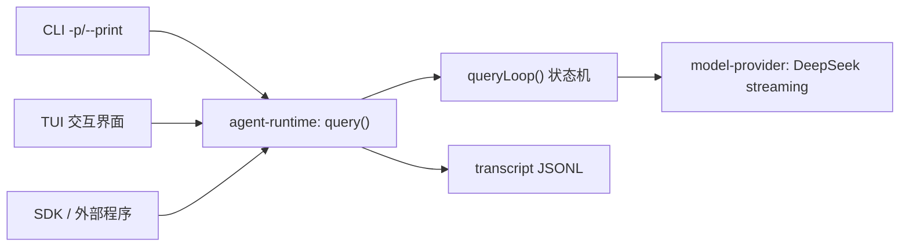
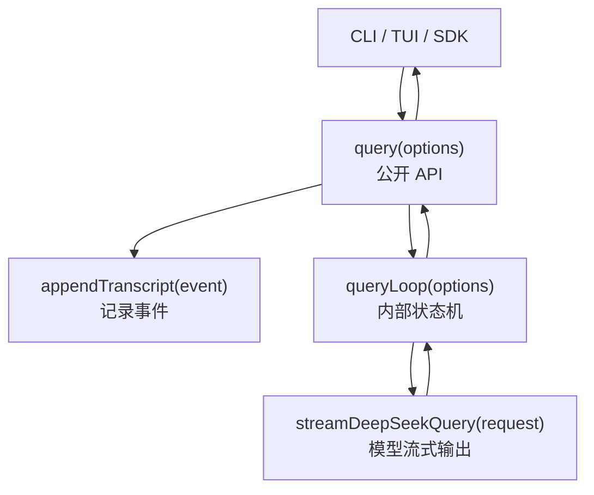

# 从 0 到 1 实现 Claude Code：V0.2 Headless Agent Loop 和 Transcript

## 这一章要做什么

V0.1 已经解决了工程骨架、内部协议和 DeepSeek streaming 兼容性。V0.2 的目标是做出第一个能真实调用模型的 headless agent：

```sh
bun run cli -- -p "解释当前目录"
```

这一版仍然不执行工具。模型如果请求 `tool_use`，我们只验证协议能解析，并用 `max_turns` terminal state 结束。真正的 Read/Edit/Bash 工具执行放到 V0.3。

## 为什么先做 Headless

Claude Code 有 TUI，但 TUI 不是 agent 的核心。先做 headless 有三个好处：

- 更容易测试：stdout/stderr/transcript 都能在单测里验证。
- 更容易定位 provider 问题：不用同时处理 React/Ink 渲染。
- 后续 TUI 可以复用同一个 query loop，而不是重新写一套模型调用逻辑。

## 先把几个概念讲清楚

### TUI 是什么，和客户端有什么区别

TUI 是 `Terminal User Interface`，也就是运行在终端里的交互界面。Claude Code 默认打开后看到的聊天区、输入框、状态栏、权限弹窗，都属于 TUI。它的职责是“展示和交互”：

- 把模型输出渲染成终端里的文本块。
- 接收用户输入。
- 展示工具执行状态。
- 展示权限确认。
- 展示错误、进度和上下文状态。

客户端是一个更大的概念。任何调用 agent runtime 的入口，都可以叫客户端：

| 客户端 | 例子 | 主要职责 |
| --- | --- | --- |
| CLI print mode | `claude -p "解释当前目录"` | 一次性发起请求，把结果打印到终端 |
| TUI | `claude` 打开交互界面 | 提供持续交互、状态展示、权限确认 |
| SDK | `query({ prompt })` | 让外部程序直接调用 agent |
| future remote client | Web/remote service | 把 agent runtime 包装成远程服务 |

所以关系是：



V0.2 先做 CLI print mode，不做 TUI。原因是：先把 agent 的核心链路跑通，后面 TUI 只需要消费同一批事件，不需要重新实现模型调用。

### stdout、stderr、transcript 是什么

一个命令行程序通常有三类输出：

| 名称 | 中文理解 | 用途 |
| --- | --- | --- |
| `stdout` | 标准输出 | 程序的正常结果，比如 assistant 回复 |
| `stderr` | 标准错误 | 错误、失败原因、诊断信息 |
| `transcript` | 会话记录文件 | 记录 agent 运行过程中的事件，供恢复、调试、测试使用 |

例子：

```sh
bun run cli -- -p "用一句话介绍 TypeScript" > answer.txt
```

这里的 `>` 只会重定向 `stdout`。如果模型正常返回：

```text
TypeScript 是给 JavaScript 增加类型系统的开发语言。
```

这段 assistant 正常文本会进入 `answer.txt`。

如果 provider 报错，错误信息应该写到 `stderr`，不要污染 `answer.txt`。这样脚本集成才稳定：

```sh
bun run cli -- -p "生成摘要" > summary.txt
```

`summary.txt` 只应该包含模型生成的摘要，不应该混入 “API key missing” 之类的错误。

transcript 和 stdout/stderr 不同。它不是给用户直接看的终端输出，而是 agent 的运行日志。例如同一次请求里，stdout 可能只显示：

```text
你好，我可以帮助你阅读当前项目。
```

transcript 会记录更完整的事件：

```json
{"event":{"type":"message_start","message":{"role":"assistant"}}}
{"event":{"type":"content_block_delta","delta":{"type":"text_delta","text":"你好"}}}
{"event":{"type":"content_block_delta","delta":{"type":"text_delta","text":"，我可以帮助你阅读当前项目。"}}}
{"event":{"type":"message_delta","delta":{"stop_reason":"end_turn"}}}
{"event":{"type":"terminal","status":"completed","exitCode":0}}
```

这就是为什么 V0.2 同时要实现 stdout 和 transcript：stdout 解决“用户看到什么”，transcript 解决“系统发生过什么”。

### query() 和 queryLoop() 的区别

`queryLoop()` 是内部状态机，负责“怎么跑一轮或多轮 agent”：

- 组装发给模型的 messages。
- 调用 provider。
- 接收 provider streaming events。
- 观察模型为什么停下来。
- 决定是否继续下一轮，或者产出 terminal event。

`query()` 是对外公开的 runtime API，负责“把 queryLoop 包装成客户端能用的接口”：

- 调用 `queryLoop()`。
- 把每个事件继续 `yield` 给 CLI/TUI/SDK。
- 同时把事件追加到 transcript。
- 统一处理 session id、transcript path 等运行时细节。

可以粗略理解成：

```text
queryLoop = agent 大脑里的状态机
query     = 给 CLI/TUI/SDK 使用的门面 API
```

对应架构：



V0.2 的关键是让下面这条链路跑通：

```text
CLI -p
  -> query()
  -> queryLoop()
  -> DeepSeek provider streaming
  -> QueryEvent
  -> stdout text delta
  -> transcript JSONL
  -> terminal state
```

换成时序图是：

```mermaid
sequenceDiagram
  participant User as 用户
  participant CLI as CLI -p
  participant Query as query()
  participant Loop as queryLoop()
  participant Provider as DeepSeek provider
  participant File as transcript JSONL

  User->>CLI: claude -p "解释当前目录"
  CLI->>Query: query({ prompt })
  Query->>Loop: start queryLoop
  Loop->>Provider: streamDeepSeekQuery(messages)
  Provider-->>Loop: content_block_delta(text_delta)
  Loop-->>Query: yield QueryEvent
  Query->>File: append event as one JSONL line
  Query-->>CLI: yield QueryEvent
  CLI->>CLI: stdout.write(text)
  Provider-->>Loop: message_delta(stop_reason)
  Loop-->>Query: yield terminal
  Query->>File: append terminal event
  Query-->>CLI: done
```

## 新增目录

V0.2 新增一个包：

```text
packages/agent-runtime
├── package.json
└── src
    ├── index.ts
    ├── query.ts
    ├── query.test.ts
    ├── render.ts
    └── transcript.ts
```

| 文件 | 作用 |
| --- | --- |
| `query.ts` | `query()` 和 `queryLoop()` 状态机雏形 |
| `transcript.ts` | JSONL transcript append/read |
| `render.ts` | 从 `QueryEvent` 中提取 stdout 文本 delta |
| `query.test.ts` | 覆盖 streaming、terminal、transcript、tool-use contract |

为什么不把这些放在 `packages/cli`？因为 CLI 只是产品入口。未来 TUI、SDK、remote 都应该复用 `agent-runtime`，而不是依赖 CLI。

## AI Prompt：实现 V0.2

```text
请在 V0.1 基础上实现 V0.2 headless agent loop。

目标：
1. 新增 packages/agent-runtime。
2. 实现 query(options) async generator：消费 provider streaming QueryEvent，追加 transcript，并继续 yield 事件。
3. 实现 queryLoop(options)：支持 completed、model_error、aborted_streaming、max_turns terminal state。
4. model-provider 暴露 streamDeepSeekQuery(request)，真实读取 DeepSeek SSE streaming 并逐个 yield QueryEvent。
5. CLI 新增 -p/--print [prompt]，把 text_delta 实时写到 stdout。
6. CLI 新增 --model、--max-turns、--permission-mode 占位、--transcript-path。
7. 每次 -p 请求都写 transcript JSONL。
8. V0.2 不执行真实工具；如果模型 stop_reason=tool_use，则证明 tool-use contract 能解析，但以 max_turns 结束。

约束：
- 不打印 API key。
- DeepSeek key 只从 .env 或系统环境变量读取。
- test/lint 不扫描 claude-code/ 参考源码。
- 单测必须用 mock provider/mock fetch，不依赖真实 DeepSeek。

验收：
- bun run typecheck/test/lint/build 通过。
- bun run cli -- --help 能看到 -p/--print。
- 有 key 时，bun run cli -- -p "解释当前目录" 能流式输出。
- transcript 文件是 JSONL，每行能用 TranscriptRecordSchema 校验。
```

## Step 1：让 Provider 暴露 Streaming Generator

V0.1 的 live spike 可以收集完整事件，但 V0.2 需要边接收边输出，所以 provider 不能只返回数组，必须返回 async generator。

目标接口：

```ts
export async function* streamDeepSeekQuery(
  request: ProviderRequest,
  options?: DeepSeekStreamOptions,
): AsyncGenerator<QueryEvent, void>
```

为什么是 generator？

如果 provider 等完整响应结束再返回：

```text
用户等待 10 秒
一次性看到完整答案
```

这不符合 Claude Code 的体验。正确方式是：

```text
模型每返回一个 text_delta
CLI 就立即写 stdout
transcript 也立即追加事件
```

这里的“立即”不是抽象说法，而是指同一个 `for await` 循环里，一收到事件就处理，不等完整答案结束。

假设模型最终要回答：

```text
当前目录是一个 TypeScript monorepo。
```

DeepSeek streaming 可能分三段返回：

```text
chunk 1: "当前目录"
chunk 2: "是一个 TypeScript"
chunk 3: " monorepo。"
```

provider 会把这三段转成三个 `content_block_delta`：

```json
{"type":"content_block_delta","index":0,"delta":{"type":"text_delta","text":"当前目录"}}
{"type":"content_block_delta","index":0,"delta":{"type":"text_delta","text":"是一个 TypeScript"}}
{"type":"content_block_delta","index":0,"delta":{"type":"text_delta","text":" monorepo。"}}
```

CLI 不会等三个都到齐再输出，而是这样处理：

```ts
for await (const event of query({ prompt })) {
  if (event.type === 'content_block_delta' && event.delta.type === 'text_delta') {
    stdout.write(event.delta.text)
  }
}
```

用户看到的效果是文字逐段出现。为了看清楚，下面用“累计状态”展示；真实终端里通常是在同一行持续增长：

```text
当前目录
当前目录是一个 TypeScript
当前目录是一个 TypeScript monorepo。
```

同一批事件也会被 `query()` 追加到 transcript。也就是说，每来一个事件，就写一行 JSONL：

```json
{"event":{"type":"content_block_delta","delta":{"type":"text_delta","text":"当前目录"}}}
{"event":{"type":"content_block_delta","delta":{"type":"text_delta","text":"是一个 TypeScript"}}}
{"event":{"type":"content_block_delta","delta":{"type":"text_delta","text":" monorepo。"}}}
```

这就是“CLI 立即写 stdout，transcript 也立即追加事件”的真实含义。

## Step 2：实现 Query Loop

V0.2 的 `queryLoop()` 是状态机雏形。它现在只做一轮模型请求：

```text
build messages
  -> call provider
  -> yield QueryEvent
  -> observe stop_reason
  -> yield terminal
```

逐个拆开看：

### build messages 是什么

模型 API 不接受“裸 prompt”，它接受一组 messages。`build messages` 就是把运行时信息整理成模型能理解的对话数组。

用户输入是：

```text
解释当前目录
```

agent runtime 会构造成类似：

```json
[
  {
    "role": "system",
    "content": "You are my-claude-code, a Claude Code-like coding agent..."
  },
  {
    "role": "user",
    "content": "Current working directory: /Users/bin.ke/my-compony/my-claude-code"
  },
  {
    "role": "user",
    "content": "解释当前目录"
  }
]
```

这一步很关键。因为 agent 不是只把用户输入原样丢给模型，还要带上：

- system prompt：告诉模型自己是什么 agent、怎么回答。
- user context：比如当前工作目录、未来还会有 git 状态、可用工具、权限模式。
- user prompt：用户真正输入的问题。

### call provider 是什么

`queryLoop()` 不直接调用 DeepSeek HTTP API，而是调用 provider 抽象：

```ts
for await (const event of provider(request)) {
  yield event
}
```

provider 的职责是把 DeepSeek 的 OpenAI-compatible SSE chunk 转换成内部统一的 `QueryEvent`。这样以后即使底层换模型，CLI/TUI/queryLoop 也不用跟着改。

### yield QueryEvent 是什么

`yield` 的意思是“把一个事件交给外层消费者，但函数自己还没有结束”。

比如 provider 流式返回三个文本片段，`queryLoop()` 会逐个 `yield`：

```text
yield content_block_delta("当前目录")
yield content_block_delta("是一个 TypeScript")
yield content_block_delta(" monorepo。")
```

外层的 `query()` 收到后，会一边写 transcript，一边继续把事件交给 CLI。CLI 收到后写 stdout。

### observe stop_reason 是什么

模型流式输出结束前，会告诉我们“这次为什么停下”。这个原因叫 `stop_reason`。

常见情况：

| stop_reason | 含义 | V0.2 怎么处理 |
| --- | --- | --- |
| `end_turn` | 模型自然回答完了 | terminal = `completed` |
| `stop_sequence` | 命中停止序列 | terminal = `completed` |
| `tool_use` | 模型想调用工具 | V0.2 不执行工具，terminal = `max_turns` |
| unknown/error | provider 异常或无法识别 | terminal = `model_error` |

所以 `observe stop_reason` 的意思是：query loop 不能只看文本，还要看模型的停止原因，再决定下一步。

### yield terminal 是什么

`message_stop` 只表示“模型这条消息流结束了”，但客户端还需要知道“整个 agent 任务结束了吗，退出码是多少”。所以 query loop 会额外产出一个 terminal event。

正常结束：

```json
{"type":"terminal","status":"completed","exitCode":0}
```

模型请求工具，但 V0.2 还不能执行：

```json
{"type":"terminal","status":"max_turns","exitCode":1,"reason":"model requested tool use, but V0.2 does not execute tools"}
```

CLI 收到 terminal 后，就知道这次命令应该用什么 exit code 结束。

terminal state 用来告诉 CLI 这次运行如何结束：

| Terminal | 含义 | exit code |
| --- | --- | --- |
| `completed` | 正常结束 | 0 |
| `model_error` | provider 抛错 | 1 |
| `aborted_streaming` | abort signal 中断 | 130 |
| `max_turns` | 需要继续但超过 turn 限制 | 1 |

为什么要 terminal event？

因为 CLI/TUI/SDK 都需要知道“这轮结束了没有、为什么结束”。如果只靠 `message_stop`，无法区分正常结束、模型错误、abort、超过最大轮数。

## Step 3：实现 Transcript JSONL

Transcript 是 agent 的事件流水账。它记录的不是“最终答案字符串”，而是模型和 runtime 在运行过程中发生过的事件。

它至少有四个用途：

- 会话恢复：未来实现 `resume` 时，可以从 transcript replay 历史事件。
- 调试：出问题时能看到模型是否请求了工具、在哪个事件后停止。
- 测试：单测可以断言某次运行有没有写入 terminal event。
- 审计：未来工具执行后，可以知道何时请求工具、何时批准、何时返回 tool_result。

V0.2 先实现最小 JSONL：

```json
{"id":"...","session_id":"...","created_at":"...","event":{"type":"message_start",...}}
{"id":"...","session_id":"...","created_at":"...","event":{"type":"content_block_delta",...}}
{"id":"...","session_id":"...","created_at":"...","event":{"type":"terminal","status":"completed","exitCode":0}}
```

为什么用 JSONL？

- 适合 streaming append。
- 每行都是独立 JSON，崩溃时不容易损坏整个文件。
- 后续 resume 可以逐行 replay。
- 方便测试。

默认 transcript 路径：

```text
.my-claude-code/transcripts/<sessionId>.jsonl
```

`.my-claude-code/` 必须加入 `.gitignore`。

一次请求的简化 transcript 可能长这样：

```json
{"session_id":"s1","event":{"type":"message_start","message":{"role":"assistant"}}}
{"session_id":"s1","event":{"type":"content_block_start","index":0,"content_block":{"type":"text","text":""}}}
{"session_id":"s1","event":{"type":"content_block_delta","index":0,"delta":{"type":"text_delta","text":"当前目录"}}}
{"session_id":"s1","event":{"type":"message_delta","delta":{"stop_reason":"end_turn"}}}
{"session_id":"s1","event":{"type":"message_stop"}}
{"session_id":"s1","event":{"type":"terminal","status":"completed","exitCode":0}}
```

注意：stdout 里可能只看到“当前目录”，但 transcript 会保留更多结构化信息。

## Step 4：实现 CLI `-p/--print`

CLI 做三件事：

1. 解析 `-p/--print` 的 prompt。
2. 调用 `query()`。
3. 遇到 `text_delta` 就立即写 stdout。

伪代码：

```ts
for await (const event of query({ prompt })) {
  if (event.type === 'content_block_delta' && event.delta.type === 'text_delta') {
    stdout.write(event.delta.text)
  }

  if (event.type === 'terminal' && event.exitCode !== 0) {
    stderr.write(event.reason)
  }
}
```

stdout/stderr 要分离：

- assistant 正常文本写 stdout。
- 错误、terminal failure 写 stderr。

这对后续脚本集成很重要，例如：

```sh
claude -p "生成摘要" > summary.txt
```

再看一个更具体的例子。假设模型分两次输出：

```text
delta 1: "项目是"
delta 2: "一个 CLI agent。"
```

CLI 运行时做的是：

```text
收到 delta 1 -> stdout.write("项目是")
收到 delta 2 -> stdout.write("一个 CLI agent。")
收到 terminal(completed) -> 进程 exit 0
```

屏幕上看起来像连续输出：

```text
项目是一个 CLI agent。
```

如果出错：

```text
收到 terminal(model_error, exitCode=1, reason="DEEPSEEK_API_KEY is required")
```

CLI 应该把 reason 写到 stderr，然后用非 0 exit code 退出。这样外部脚本能根据退出码判断成功/失败。

## Step 5：Tool-Call Contract 只解析不执行

V0.2 必须证明模型能输出工具调用，但不能执行工具。

如果 provider 输出：

```text
content_block_start: tool_use(Bash)
input_json_delta: {"command":"pwd"}
message_delta: stop_reason="tool_use"
```

这三行的含义分别是：

| 事件 | 含义 |
| --- | --- |
| `content_block_start: tool_use(Bash)` | 模型开始输出一个工具调用块，工具名是 `Bash` |
| `input_json_delta: {"command":"pwd"}` | 模型正在流式输出工具参数，这里参数是 `command=pwd` |
| `message_delta: stop_reason="tool_use"` | 模型这轮不再继续写文本，而是停下来等待工具执行结果 |

为什么工具参数也要 streaming？因为模型输出 JSON 参数时，也可能像文本一样分片：

```text
input_json_delta: {"command":
input_json_delta: "pwd"
input_json_delta: }
```

provider/parser 需要把这些碎片拼成完整 JSON：

```json
{"command":"pwd"}
```

然后 query loop 才能知道模型真正想调用：

```json
{
  "type": "tool_use",
  "name": "Bash",
  "input": {
    "command": "pwd"
  }
}
```

完整时序是：

```mermaid
sequenceDiagram
  participant Model as DeepSeek
  participant Provider as provider parser
  participant Loop as queryLoop
  participant CLI as CLI

  Model-->>Provider: content_block_start tool_use(Bash)
  Provider-->>Loop: QueryEvent content_block_start
  Model-->>Provider: input_json_delta {"command":"pwd"}
  Provider-->>Loop: QueryEvent content_block_delta
  Model-->>Provider: message_delta stop_reason=tool_use
  Provider-->>Loop: QueryEvent message_delta
  Loop-->>CLI: terminal max_turns
```

query loop 应该能识别它，但终止为：

```json
{
  "type": "terminal",
  "status": "max_turns",
  "exitCode": 1,
  "reason": "model requested tool use, but V0.2 does not execute tools"
}
```

这说明协议和 parser 已经准备好，真正执行 Bash/Read/Edit 是 V0.3 的范围。

## Step 6：验证

基础验证：

```sh
bun run typecheck
bun run test
bun run lint
bun run build
```

CLI smoke：

```sh
node dist/cli.js --version
node dist/cli.js --help
```

真实 headless：

```sh
bun run cli -- -p "解释当前目录"
```

如果没有 `DEEPSEEK_API_KEY`，`-p` 会报错，这是正确行为。开发环境把 key 写入 `.env`，生产环境配置系统环境变量。

## 本次 V0.2 完成内容

- `packages/model-provider/src/deepseek.ts` 暴露 `streamDeepSeekQuery()`。
- `packages/agent-runtime/src/query.ts` 实现 `query()` / `queryLoop()`。
- `packages/agent-runtime/src/transcript.ts` 实现 JSONL transcript。
- `packages/cli/src/program.ts` 支持 `-p/--print`、`--model`、`--max-turns`、`--permission-mode`、`--transcript-path`。
- 单测覆盖 headless print、streaming provider fixture、transcript append、terminal states、tool-use contract。

## V0.2 到 V0.3 的衔接

V0.3 要做真实工具执行。它会接管 V0.2 里已经能识别但还不能执行的 `tool_use`：

```text
tool_use block
  -> parse input JSON
  -> validate with Zod
  -> permission check
  -> execute tool
  -> append tool_result
  -> continue query loop
```

所以 V0.2 的核心价值是：真实模型 streaming、stdout、transcript、terminal state 已经跑通，V0.3 可以专注工具和权限。
