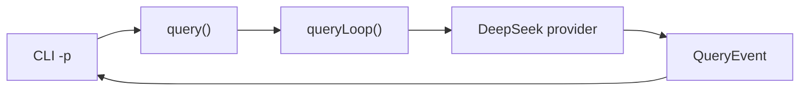
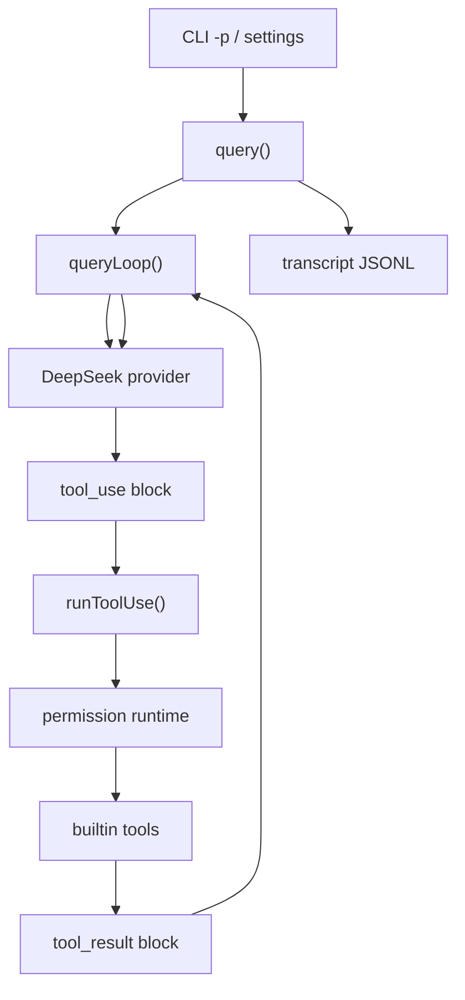
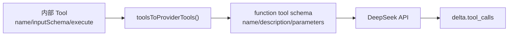
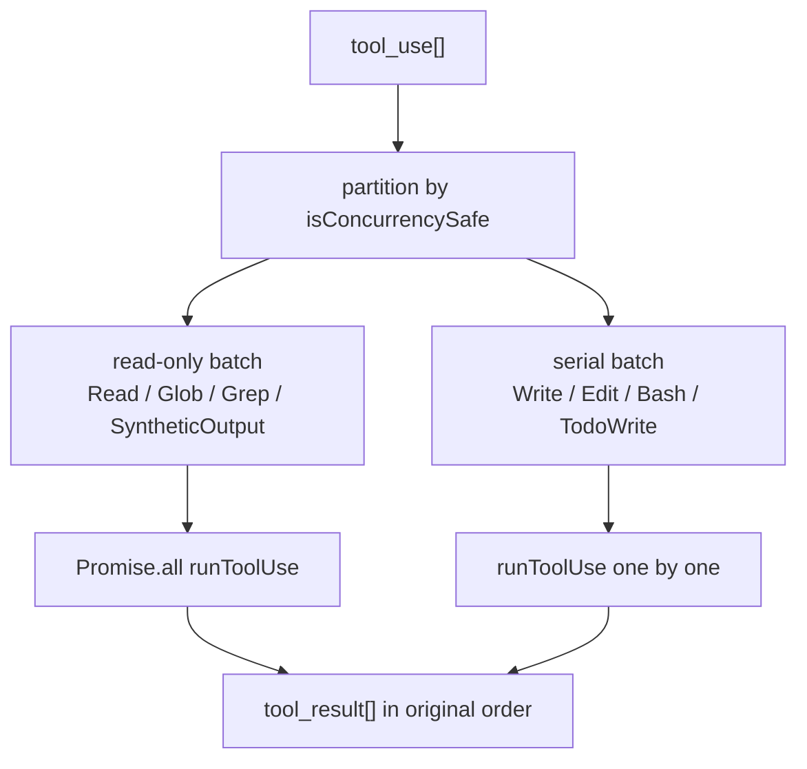
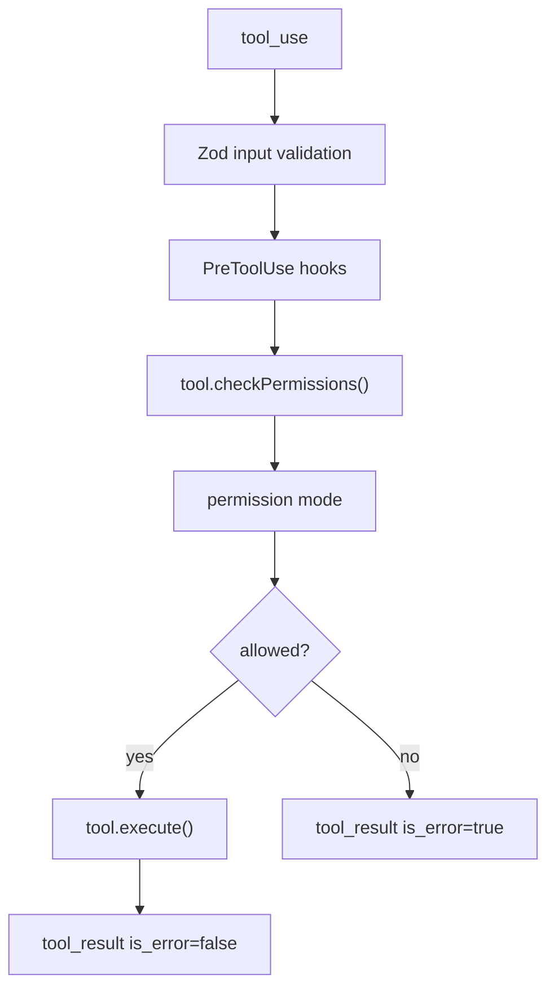
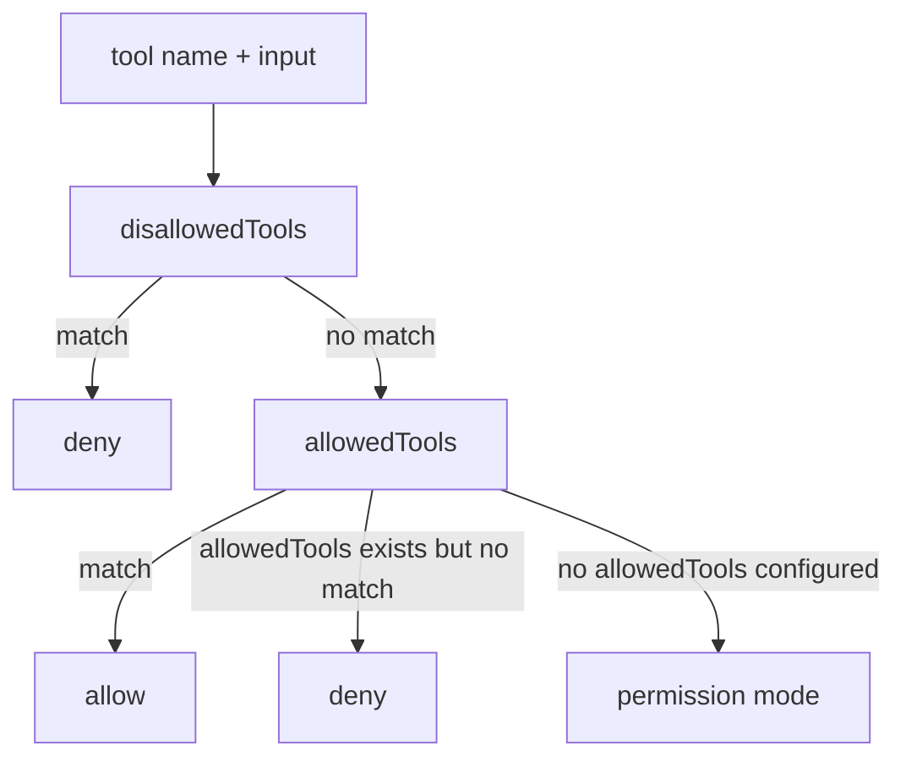
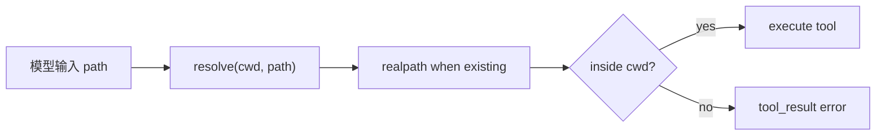
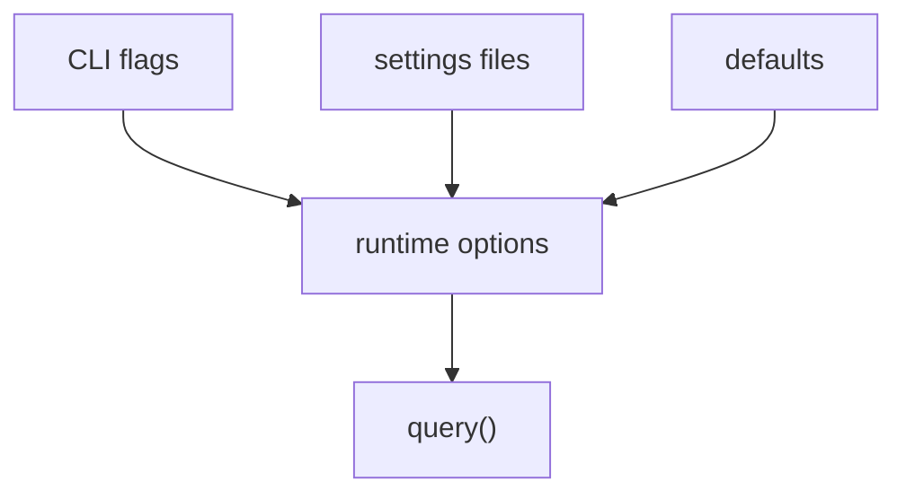
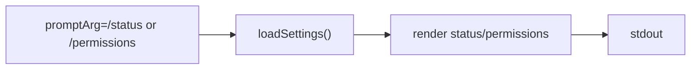

# 从 0 到 1 实现 Claude Code：V0.3 工具执行、权限和 Settings MVP

## 这一章要做什么

V0.2 已经能让模型流式输出文本，也能识别 `tool_use`，但还不能执行工具。V0.3 的目标是把 agent loop 从“模型回答器”推进到“能安全做工程任务的 agent”：

```text
模型请求 Read/Glob/Grep/Bash/Edit/Write/TodoWrite
  -> runtime 校验参数
  -> 权限系统判断能不能执行
  -> 执行工具
  -> 生成 tool_result
  -> 把 tool_result 回传给模型
  -> 模型继续回答
```

本章完成的是 headless 工具执行 MVP，不做完整 TUI 权限弹窗。默认模式下：

- `Read`、`Glob`、`Grep` 可以直接执行。
- `TodoWrite` 可以写入内部 `.my-claude-code/todos/latest.json` 状态。
- `Edit`、`Write` 默认拒绝，`--permission-mode acceptEdits` 才允许。
- 危险 `Bash` 默认拒绝，只有 `bypassPermissions` 才会跳过确认。

## V0.3 的架构变化

V0.2 的链路是：



V0.3 多了工具层和 settings 层：



这张图的关键点是：工具不是 CLI 调的，而是 `queryLoop()` 调的。CLI/TUI/SDK 都只是消费事件；真正决定“模型请求工具后下一步怎么走”的是 agent runtime。

## 新增目录

```text
packages/settings
└── src
    ├── index.ts
    ├── settings.ts
    └── settings.test.ts

packages/tools
└── src
    ├── builtin.ts
    ├── permissions.ts
    ├── runner.ts
    ├── types.ts
    ├── pathSafety.ts
    └── tools
        ├── bash.ts
        ├── edit.ts
        ├── glob.ts
        ├── grep.ts
        ├── read.ts
        ├── todoWrite.ts
        └── write.ts
```

| 文件 | 作用 |
| --- | --- |
| `packages/tools/src/types.ts` | 定义 `Tool`、`ToolResult`、权限上下文、hook 类型 |
| `packages/tools/src/builtin.ts` | 注册内置工具并转换成 provider tool schema |
| `packages/tools/src/permissions.ts` | 实现 `default/plan/acceptEdits/bypassPermissions/dontAsk` 权限模式 |
| `packages/tools/src/runner.ts` | 实现 `runToolUse()`：找工具、校验、权限、执行、映射结果 |
| `packages/settings/src/settings.ts` | 读取 `.claude/settings.json` 和 `.my-claude-code/settings.json` |

## Step 1：定义 Tool 接口

工具不能只是一个函数。Claude Code 里的工具需要同时回答这些问题：

- 给模型看的名字和描述是什么？
- 输入参数 schema 是什么？
- 这个工具是否只读？
- 这个工具是否破坏性？
- 当前权限模式下能不能执行？
- 执行结果如何变成 `tool_result`？

V0.3 的最小接口是：

```ts
export type Tool<TInput> = {
  name: string
  description: string
  inputSchema: z.ZodType<TInput>
  inputJSONSchema: JsonSchema
  isReadOnly(input: TInput): boolean
  isDestructive(input: TInput): boolean
  checkPermissions(input: TInput, context: ToolExecutionContext): PermissionCheck
  execute(input: TInput, context: ToolExecutionContext): Promise<string>
}
```

这里有两个 schema：

| schema | 给谁用 | 用途 |
| --- | --- | --- |
| `inputJSONSchema` | 模型 provider | 告诉模型这个工具能接收什么参数 |
| `inputSchema` | runtime | 模型真的请求工具时，用 Zod 校验输入 |

如果没有 runtime Zod 校验，模型传错参数就可能直接进入文件系统或 shell 执行。这是工具系统必须先做 schema 的原因。

## Step 2：把工具注册给模型

模型只有看到 tools 列表，才知道可以请求调用工具。`packages/tools/src/builtin.ts` 做两件事：

```text
getBuiltinTools()
  -> Read / Glob / Grep / TodoWrite / Edit / Write / Bash

toolsToProviderTools()
  -> 转成 DeepSeek/OpenAI-compatible function tool schema
```

### Glob、Grep、TodoWrite 分别做什么

这三个工具容易混淆，先分开讲：

| 工具 | 做什么 | 例子 | 是否改文件 |
| --- | --- | --- | --- |
| `Glob` | 按文件名/路径模式找文件 | 找出所有 `**/*.ts` 文件 | 否 |
| `Grep` | 在文件内容里搜索文本或正则 | 找出包含 `queryLoop` 的行 | 否 |
| `TodoWrite` | 写入 agent 当前任务清单 | 记录“读取文件、修改实现、跑测试”的状态 | 只写 `.my-claude-code/todos/latest.json` |

`Glob` 看的是“文件名”：

```json
{"pattern":"packages/**/*.ts"}
```

可能返回：

```text
packages/agent-runtime/src/query.ts
packages/tools/src/runner.ts
```

`Grep` 看的是“文件内容”：

```json
{"pattern":"queryLoop","path":"packages"}
```

可能返回：

```text
packages/agent-runtime/src/query.ts:55:export async function* queryLoop(
```

`TodoWrite` 不是给用户创建业务文件的工具，而是 agent 自己维护任务进度的工具。它类似 Claude Code 里的 todo list，用来让长任务有明确状态：

```json
{
  "todos": [
    {"id":"1","content":"实现工具权限","status":"completed"},
    {"id":"2","content":"补文档","status":"in_progress"}
  ]
}
```

注册链路：


注意：工具注册只是“告诉模型可以用哪些工具”，不会执行任何东西。执行发生在模型真的返回 `tool_use` 之后。

### DeepSeek/OpenAI-compatible function tool schema 是什么

我们内部的工具接口长这样：

```ts
{
  name: 'Write',
  description: 'Write a UTF-8 text file...',
  inputSchema: z.object({ file_path: z.string(), content: z.string() }),
  execute: async input => ...
}
```

但 DeepSeek 的 chat completions API 不认识 `inputSchema`、`execute` 这些 TypeScript/runtime 字段。它只认识 OpenAI-compatible 的 function tool 描述：

```json
{
  "type": "function",
  "function": {
    "name": "Write",
    "description": "Write a UTF-8 text file...",
    "parameters": {
      "type": "object",
      "properties": {
        "file_path": {"type":"string"},
        "content": {"type":"string"}
      },
      "required": ["file_path", "content"]
    }
  }
}
```

所以 `toolsToProviderTools()` 的作用是“把内部 Tool 转成模型 API 能看懂的工具说明”。



为什么必须转？

- 内部 `Tool` 包含真实执行函数，不能发给模型。
- 模型只需要知道工具名字、描述、参数格式。
- runtime 需要保留 Zod schema 和 execute 函数，用于收到 `tool_use` 后真正执行。
- 这样 provider 可以换，内部工具实现不需要重写。

## Step 3：queryLoop 如何执行工具

V0.2 遇到 `stop_reason=tool_use` 就直接 `max_turns`。V0.3 改成：

```mermaid
sequenceDiagram
  participant Provider as DeepSeek provider
  participant Loop as queryLoop
  participant Runner as runToolUse
  participant Tool as Builtin tool

  Provider-->>Loop: content_block_start tool_use(Read)
  Provider-->>Loop: input_json_delta {"file_path":"README.md"}
  Provider-->>Loop: message_delta stop_reason=tool_use
  Loop->>Runner: runToolUse(Read, input)
  Runner->>Tool: execute()
  Tool-->>Runner: file content
  Runner-->>Loop: tool_result
  Loop->>Provider: next model turn with tool_result
  Provider-->>Loop: final assistant text
```

对应的消息变化：

```text
Turn 1 request:
  user: "读取 README 并总结"

Turn 1 response:
  assistant: tool_use Read({"file_path":"README.md"})

Runtime:
  执行 Read
  得到 tool_result("README 内容...")

Turn 2 request:
  user: "读取 README 并总结"
  assistant: tool_use Read(...)
  user: tool_result(...)

Turn 2 response:
  assistant: "这个项目是..."
```

这就是 agent loop 的核心：模型不是一次请求完成所有事，而是“请求工具 -> runtime 执行 -> 回传结果 -> 模型继续”。

### runTools() 和并发调度

`runToolUse()` 只执行一个工具。模型同一轮可能一次请求多个工具，所以 V0.3 增加 `runTools()`：



这样 `Read/Grep/Glob` 可以一起跑，`Write/Edit/Bash` 仍然串行。串行是为了避免两个写工具同时改上下文或文件，导致结果不可预测。

### 为什么权限拒绝要立即终止

如果工具因为权限被拒绝，不能再让模型自由生成“我已完成”的文本。否则会出现这种错误链路：

```mermaid
sequenceDiagram
  participant Model as Model
  participant Loop as queryLoop
  participant Tool as Write
  participant CLI as CLI stdout

  Model-->>Loop: tool_use Write({"file_path":"hello1.txt"})
  Loop->>Tool: permission check
  Tool-->>Loop: denied
  Loop-->>Model: tool_result is_error=true
  Model-->>CLI: "已成功创建 hello1.txt"
```

这个文本是假的，因为文件没有创建。V0.3 修正为：

```mermaid
sequenceDiagram
  participant Model as Model
  participant Loop as queryLoop
  participant Tool as Write
  participant CLI as CLI stderr

  Model-->>Loop: tool_use Write({"file_path":"hello1.txt"})
  Loop->>Tool: permission check
  Tool-->>Loop: denied
  Loop-->>CLI: terminal tool_error
```

也就是：权限拒绝是阻断式错误。`queryLoop()` 会输出 `tool_error` terminal，CLI 用非 0 exit code 退出，不再进入下一轮模型请求。

## Step 4：tool_result 是什么

`tool_result` 是工具执行结果的 Claude-compatible content block：

```json
{
  "type": "tool_result",
  "tool_use_id": "toolu_read",
  "content": "1\t# my-claude-code\n2\t...",
  "is_error": false
}
```

如果工具失败，也不要让进程直接崩溃，而是把失败变成 error tool result：

```json
{
  "type": "tool_result",
  "tool_use_id": "toolu_write",
  "content": "Write wants to modify src/index.ts",
  "is_error": true
}
```

这样模型还能在下一轮解释失败原因，或者换一种方案继续。

## Step 5：权限模式怎么工作

V0.3 支持五种权限模式：

| mode | 行为 |
| --- | --- |
| `default` | 允许只读工具；编辑和危险命令在 headless 下拒绝 |
| `plan` | 阻止非只读工具 |
| `acceptEdits` | 自动允许 `Edit` 和 `Write`，其他仍走默认判断 |
| `bypassPermissions` | 跳过普通确认，但仍保留 schema/path safety |
| `dontAsk` | 非交互倾向，不能确认时拒绝 |

权限链路：



### Tool(pattern) 规则

除了按工具名授权，V0.3 也支持最小 `Tool(pattern)` 规则：

```json
{
  "allowedTools": ["Read", "Write(README.md)"],
  "disallowedTools": ["Bash(rm -rf)"]
}
```

规则含义：

| 规则 | 含义 |
| --- | --- |
| `Read` | 允许所有 `Read` 调用 |
| `Write(README.md)` | 只允许输入里包含 `README.md` 的 `Write` |
| `Bash(rm -rf)` | 拒绝输入里包含 `rm -rf` 的 `Bash` |

匹配链路：



例子：模型请求写文件。

```json
{"name":"Write","input":{"file_path":"a.txt","content":"hello"}}
```

在默认模式：

```text
Write.checkPermissions -> ask
headless default 不能弹窗确认
permission runtime -> deny
tool_result.is_error = true
```

在 `acceptEdits`：

```text
Write.checkPermissions -> ask
permissionMode=acceptEdits
permission runtime -> allow
Write.execute()
tool_result.is_error = false
```

## Step 6：文件路径安全

`Read/Edit/Write/Glob/Grep` 都要限制在当前工作区内。否则模型可能请求：

```json
{"file_path":"../../.ssh/id_rsa"}
```

V0.3 通过 `resolvePathInsideCwd()` 和 `resolveExistingPathInsideCwd()` 做最小路径约束：



这还不是完整 sandbox，但它先建立了工具执行前必须过路径安全检查的边界。

## Step 7：Settings MVP

V0.3 增加 settings loader，读取：

```text
.claude/settings.json
.my-claude-code/settings.json
```

支持字段：

```json
{
  "model": "deepseek-v4-flash",
  "permissionMode": "acceptEdits",
  "allowedTools": ["Read", "Edit", "Write"],
  "disallowedTools": ["Bash"]
}
```

CLI 优先级：



目前 CLI flag 优先于 settings。例如：

```sh
bun run cli -- -p "读取 README" --permission-mode default
```

会覆盖 settings 里的 `permissionMode`。

## Step 8：Hooks MVP

V0.3 实现三类最小 hook：

| Hook | 触发时机 | 能做什么 |
| --- | --- | --- |
| `UserPromptSubmit` | 用户 prompt 进入模型前 | 修改 prompt，例如注入额外上下文 |
| `PreToolUse` | 工具权限判断前 | 阻止工具、返回权限决定 |
| `PostToolUse` | 工具执行成功后 | 修改工具结果 |
| `Stop` | 模型自然停止后 | 阻止本次 completion，例如做策略检查 |

串联关系：

```mermaid
sequenceDiagram
  participant CLI as CLI
  participant Loop as queryLoop
  participant Hooks as hooks
  participant Tools as runTools
  participant Model as Model

  CLI->>Loop: prompt
  Loop->>Hooks: UserPromptSubmit
  Loop->>Model: messages
  Model-->>Loop: tool_use
  Loop->>Hooks: PreToolUse
  Loop->>Tools: execute
  Tools->>Hooks: PostToolUse
  Tools-->>Loop: tool_result
  Loop->>Model: next turn
  Model-->>Loop: end_turn
  Loop->>Hooks: Stop
```

这不是完整 Claude Code hook 系统，但已经建立了四个关键插入点，后续可以扩展到配置文件、MCP、TUI 和 remote。

## Step 9：CLI 简版 `/status` 和 `/permissions`

V0.3 还没有完整 TUI，但提供了两个 headless slash fast path：

```sh
bun run cli -- /status
bun run cli -- /permissions
```

`/status` 输出版本、模型、权限模式和注册工具数量。`/permissions` 输出当前权限模式、allowed/disallowed 规则和注册工具列表。

命令链路：



这两个命令不调用模型，不消耗 token，适合调试本地配置。

## Step 10：如何验证

基础验证：

```sh
bun run typecheck
bun run test
bun run lint
bun run build
```

只读工具场景：

```sh
bun run cli -- -p "读取 README.md 并总结"
```

允许编辑场景：

```sh
bun run cli -- -p "创建一个 hello.txt，内容是 hello" --permission-mode acceptEdits
```

默认拒绝编辑场景：

```sh
bun run cli -- -p "创建一个 hello1.txt，内容是 hello"
```

预期行为：

```text
error: Write was denied: Write wants to modify hello1.txt
```

并且 `hello1.txt` 不会被创建。

状态和权限：

```sh
bun run cli -- /status
bun run cli -- /permissions --allowed-tools "Read,Write(README.md)" --disallowed-tools "Bash"
```

限制工具场景：

```json
{
  "allowedTools": ["Read", "Grep"],
  "disallowedTools": ["Bash"]
}
```

放到 `.claude/settings.json` 后，模型只能看到允许的工具集合。

## 本次 V0.3 完成内容

- 新增 `packages/tools`。
- 实现 `Read`、`Glob`、`Grep`、`TodoWrite`、`Edit`、`Write`、`Bash`。
- 实现 `runToolUse()` 的 unknown tool、Zod validation、permission、execute、tool_result mapping。
- `queryLoop()` 支持 `tool_use -> tool_result -> next model turn`。
- 新增 `tool_execution_start` / `tool_execution_result` transcript event。
- 新增 `packages/settings`，支持 model、permissionMode、allowedTools、disallowedTools。
- CLI 接入 settings 和真实 `--permission-mode`。
- 实现 `runTools()` 批量工具执行和只读工具并发调度。
- 实现 `Tool(pattern)` 权限规则。
- 实现 `UserPromptSubmit`、`PreToolUse`、`PostToolUse`、`Stop` Hooks MVP。
- 实现简版 `/status` 和 `/permissions`。

## V0.3 的边界

V0.3 还不是完整 Claude Code 工具系统。以下内容后续版本继续补：

- TUI 权限弹窗。
- StreamingToolExecutor，也就是模型工具参数刚流完就提前执行的 speculative 工具执行器。
- 完整 hooks 配置来源、hook command runner、permission denied hooks。
- 完整 slash command/TUI 权限管理界面。
- 全量内置工具的深度 parity，例如 notebook、MCP、subagent、browser 等后续版本工具。

但 V0.3 已经把最关键的 agent 能力跑通：模型可以请求工具，runtime 可以安全执行，并把结果回传给模型继续推理。
