# V0.4 CLI/TUI、Session 和 Resume

本章目标：把 V0.3 的 headless agent loop 变成一个“可以连续使用”的本地终端产品雏形。

V0.3 已经能做到：

- `claude -p "..."` 发起一次请求。
- 模型可以调用工具。
- 工具结果能回到下一轮模型请求。
- transcript 会把事件逐行写入 JSONL。

但它还不像 Claude Code。主要缺口是：用户每次调用都是孤立的；CLI 不知道“最近一次会话是谁”；中断后不能恢复；没有交互入口；slash commands 也没有形成 command surface。

V0.4 先解决这些底座问题。

## 本章实现范围

本章实现：

- `packages/session`：session index、latest session、transcript replay、context stats。
- `query()` 写 transcript 前先登记 session 元数据。
- CLI 支持 `--continue`、`--resume`、`--session-id`、`--add-dir`、`--system-prompt`、`--system-prompt-file`、`--append-system-prompt`、`--append-system-prompt-file`、`--vim/--no-vim`、`--output-format text|json|stream-json`、`--input-format text|stream-json`、`--json-schema`、`--include-partial-messages`、`--include-hook-events`。
- slash commands 支持 `/add-dir`、`/help`、`/clear`、`/compact`、`/config`、`/context`、`/cost`、`/diff`、`/doctor`、`/env`、`/keybindings`、`/memory`、`/model`、`/output-style`、`/resume`、`/status`、`/statusline`、`/theme`、`/usage`、`/permissions`、`/vim`、`/version`、`/exit`。
- `packages/commands` 把 slash command handler 从 CLI 中抽出，供 CLI 和 TUI 共用。
- `packages/tui` 提供 React/Ink TTY App 和 line-oriented non-TTY fallback。

Claude Code 源码里的 TUI 包含 React component tree、PromptInput、状态栏、权限弹窗、消息虚拟列表、快捷键、Ctrl+C/Ctrl+D 等细节。V0.4 当前已经接入 React/Ink App shell，并把 TUI imports 切到本仓库的 `@anthropic/ink` workspace 兼容包。这个包当前包装上游 `ink@6`，并承载已复刻的 renderer option normalization、screen buffer diff helper、typed core Screen cell/noSelect/softWrap/wide-char/blit/shift 底座、renderer DOM registry/overlay paint order/rect clearing/hit-test bubbling、component-level `NoSelect`、ScrollBox `scrollToElement`、ScrollBox/keybinding、DOM/Yoga rect normalization、overlay-aware hit-test/mouse bubbling、theme palette/auto resolve/ThemeProvider 能力，后续可以逐步搬入源码 renderer internals。现有实现已补上 cursor-aware 输入、基础 footer、权限一次/会话/持久化决策、路径级规则、MCP 权限规则桥、文本选择/剪贴板基础、ThemePicker 结构化 preview、Resume filter/fork/rewind/restorePlan/provider hydration preview、文本/二进制/目录/symlink/mode-aware snapshot rewind 底座和窗口滚动底座。TUI windowing 已从固定条数推进到 Ink stdout rows/columns + `measureElement()` 真实 computed height + CJK display width fallback，并新增 terminal control-sequence input filtering、raw DEL/Ctrl+H backspace handling、message measurement commit guard、按终端 columns 预折行 message rows 防止 terminal auto-wrap repaint 残留、`@anthropic/ink` 同形 ScrollBoxHandle 兼容层、DOM scroll container snapshot、NoSelect 装饰区过滤和内部段 drain、screen-level selection hit-test/高亮/复制接线、ScrollBox overscan/pendingDelta/sticky scroll/tick-drain 语义、PromptInput Ctrl+R history search/cycling、Vim insert/normal MVP、readline 快捷键、运行中 prompt queue/edit/drain，以及带描述的 slash/file/live-MCP-resource/agent/queued-command/prompt suggestion/platform completion；完整 `@anthropic/ink` React reconciler/Yoga renderer internals 仍按源码台账继续关闭。

## 为什么 V0.4 要先做 Session

Claude Code 不是一次性命令工具，而是一个长期会话型 agent。一次真实开发任务通常是：

1. 先读项目结构。
2. 再定位代码。
3. 再编辑文件。
4. 再运行测试。
5. 如果中断，需要从上一次上下文继续。

如果没有 session，agent 会遇到三个问题：

| 问题 | 结果 |
| --- | --- |
| 只有 transcript，没有 session index | CLI 不知道 latest session 是哪个，`--continue` 无法实现 |
| 只有 session id，没有 transcript replay | 恢复时不知道历史模型输出、读过哪些文件、之前用户问了什么 |
| TUI 自己维护状态，headless 自己维护状态 | interactive/headless/remote 行为分叉，后续很难 1:1 |

所以 V0.4 的核心不是“多做几个命令”，而是建立统一的 session runtime。

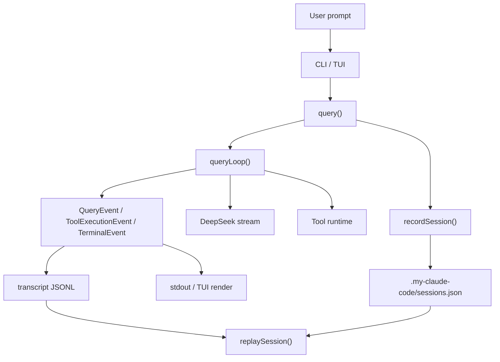

这张图表达一个关键原则：CLI/TUI 不是状态源。状态源是 session index 和 transcript。CLI/TUI 只是入口和渲染层。

## Transcript 和 Session Index 的区别

V0.2 里已经有 transcript。它记录的是事件流：

```jsonl
{"session_id":"s1","event":{"type":"message_start","message":{"role":"assistant"}}}
{"session_id":"s1","event":{"type":"content_block_delta","delta":{"type":"text_delta","text":"正在读取 README"}}}
{"session_id":"s1","event":{"type":"tool_execution_start","name":"Read","input":{"file_path":"README.md"}}}
{"session_id":"s1","event":{"type":"terminal","status":"completed","exitCode":0}}
```

transcript 适合做 replay，但不适合做索引。因为要找到最近一次会话，你不能每次都扫描所有 JSONL 文件。

所以 V0.4 增加 session index：

```json
{
  "latestSessionId": "s1",
  "sessions": [
    {
      "id": "s1",
      "cwd": "/repo",
      "transcriptPath": "/repo/.my-claude-code/transcripts/s1.jsonl",
      "createdAt": "2026-05-23T00:00:00.000Z",
      "updatedAt": "2026-05-23T00:05:00.000Z",
      "model": "deepseek-v4-flash",
      "permissionMode": "default",
      "additionalDirectories": ["../shared"],
      "promptCount": 2,
      "lastPrompt": "继续解释刚才的结果"
    }
  ]
}
```

两者分工如下：

| 文件 | 作用 | 类比 |
| --- | --- | --- |
| `.my-claude-code/sessions.json` | 快速找到 latest、列出会话、保存会话元信息 | 目录 |
| `.my-claude-code/transcripts/<id>.jsonl` | 保存事件流，恢复时逐行 replay | 账本 |

没有 index，`--continue` 找不到“继续哪一个”。没有 transcript，`--resume` 找到了 session 也不知道“怎么继续”。

## Step 1：创建 `packages/session`

新 package 的职责要很窄：

- 不调用模型。
- 不执行工具。
- 不解析 CLI 参数。
- 只读写 session index，并从 transcript 中提取恢复上下文。

目录结构：

```text
packages/session/
  package.json
  src/
    index.ts
    sessionStore.ts
    sessionStore.test.ts
```

核心类型：

```ts
export type SessionMetadata = {
  id: string
  cwd: string
  transcriptPath: string
  createdAt: string
  updatedAt: string
  model?: string
  permissionMode?: string
  additionalDirectories?: string[]
  promptCount: number
  lastPrompt?: string
}

export type ReplayContext = {
  session: SessionMetadata
  summary: string
  readFiles: string[]
  stats: {
    eventCount: number
    assistantTextChars: number
    estimatedTokens: number
    inputTokens: number
    outputTokens: number
    totalTokens: number
    cacheCreationInputTokens: number
    cacheReadInputTokens: number
    promptCache: {
      creationInputTokens: number
      readInputTokens: number
      totalInputTokens: number
      hitRate: number
    }
    tokenBudget: {
      limit: number
      used: number
      remaining: number
      percentUsed: number
      source: "provider-usage" | "estimated"
    }
    toolUseCount: number
  }
  restorePlan: {
    graphRestored: boolean
    parentSessionIds: string[]
    replayedRecordCount: number
    fileMutationCount: number
    remainingGaps: string[]
  }
}
```

为什么 replay 结果不是直接还原完整 messages？

V0.4 只做本地可验证恢复：把最近 assistant 输出、读过的文件、最后 prompt 变成一段 `userContext`，并把 compact boundary 后的 hydrated provider messages 注入下一轮请求。现在 replay 会读取 transcript 里的 provider usage，汇总 input/output/cache tokens，生成 prompt cache hit rate、token budget 和 `restorePlan`；`restorePlan` 已包含多级 lineage、missing parent、branch depth、可选 `uuid/parentUuid/logicalParentUuid` 消息图 leaf 恢复、sidechain 排除、transcript hydration 计数、结构化 compact metadata、compact boundary 之后的 provider message graph hydration、聚合 tool result blocks、tool_result pairing diagnostics、prompt-state/cache-read cache break detection、compact state restoration、file snapshot coverage、additional directories 是否恢复；如果 transcript 没有 usage，则退回文本长度估算。完整 Claude Code 级别的 session restore 仍需要远端 session/复杂分支冲突和 provider 原生 prompt cache API 的完整语义，后续版本继续补齐。

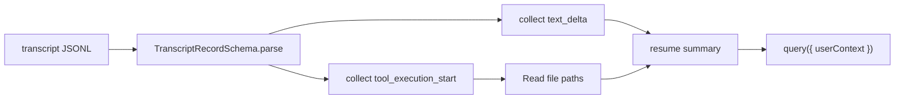

## Step 2：让 `query()` 登记 Session

V0.2 里 `query()` 做两件事：

1. 调用 `queryLoop()`。
2. 把每个事件 append 到 transcript。

V0.4 增加第三件事：在请求开始时登记 session。

```ts
const sessionId = options.sessionId ?? randomUUID()
const cwd = options.cwd ?? process.cwd()
const transcriptPath =
  options.transcriptPath ?? defaultTranscriptPath(cwd, sessionId)

await recordSession({
  cwd,
  sessionId,
  transcriptPath,
  prompt: options.prompt,
  model: options.model,
  permissionMode: options.permissionMode,
  additionalDirectories: options.additionalDirectories,
})
```

这里要注意顺序：先 `recordSession()`，再进入 `queryLoop()`。

原因是一次请求可能在 provider 调用前就失败。如果 session 没登记，用户执行 `--continue` 时会找不到刚刚发起过的会话。

## Step 3：`--continue` 和 `--resume` 如何工作

这两个参数很像，但语义不同：

| 参数 | 意义 |
| --- | --- |
| `--continue` | 继续 latest session |
| `--resume` | 不传 id 时恢复 latest；传 id 时恢复指定 session |
| `--session-id` | 给本次请求指定 session id，不等于自动恢复 |

用户命令：

```sh
bun run cli -- -p "读取 README.md"
bun run cli -- -p "继续刚才的解释" --continue
bun run cli -- -p "继续指定会话" --resume session_123
```

内部流程：

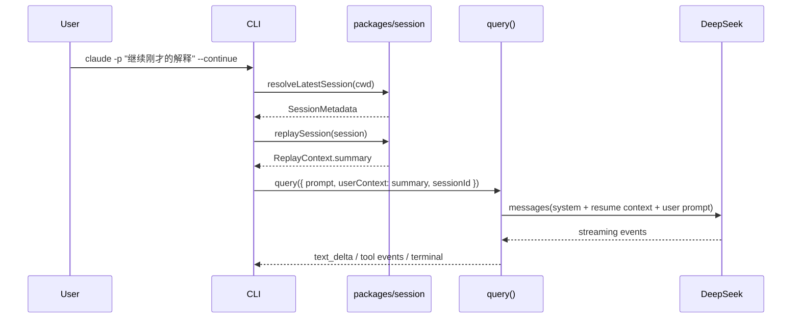

这里最容易误解的是 `--session-id`。它只是“使用这个 id 记录本次请求”，不是“恢复这个 id 的历史”。如果要恢复历史，必须用 `--resume <id>`。

## Step 4：`--add-dir` 是什么

Claude Code 支持把额外目录加入可工作上下文。V0.4 先做最小版本：CLI 解析 `--add-dir`，把目录列表放入 system prompt。

```sh
bun run cli -- -p "读取共享库里的类型定义" --add-dir "../shared,/tmp/work"
```

最终传给模型的 system content 会包含：

```text
Additional directories:
../shared
/tmp/work
```

这还不是完整安全沙箱。完整实现需要：

- 文件工具按 workspace roots 做路径校验。
- TUI 显示当前 roots。
- `/add-dir` slash command 可以动态更新 session state。
- resume 后保留 additional directories。

V0.4 先把参数、session metadata、模型上下文链路打通。

## Step 5：Slash Commands 的共享路由

V0.3 已有 `/status` 和 `/permissions` 两个 fast path。V0.4 增加通用 `runSlashCommand()`。

一开始最容易写错的方式是：CLI 里实现一套 slash commands，TUI 里再实现一套 slash commands。这样很快会产生偏差。例如 `/permissions` 在 CLI 里能看到 `allowedTools`，但 TUI 里忘了读取 settings；或者 `/context` 在 headless 能看 session stats，interactive 只能输出固定文案。

所以 V0.4 把命令面抽成独立 package：

```text
packages/commands/
  src/
    slashCommands.ts
```

它不调用模型，也不渲染 TUI。它只做三件事：

- 接收 command name 和 options。
- 调用 settings/session/tools 等底层能力。
- 把结果写到传入的 `io.stdout` / `io.stderr`。

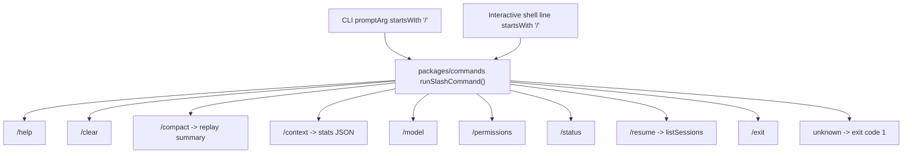

命令行为：

| 命令 | V0.4 行为 |
| --- | --- |
| `/help` | 输出当前支持的命令列表 |
| `/clear` | 输出清屏语义提示，不删除 transcript |
| `/compact` | 输出 session replay summary |
| `/context` | 输出 event count、估算 token、tool use、read files |
| `/model` | 输出当前模型 |
| `/resume` | 列出 sessions |
| `/status` | 输出版本、模型、权限模式、工具数量 |
| `/permissions` | 输出权限模式、allowed/disallowed tools、工具列表 |
| `/exit` | 退出语义 |

为什么 `/clear` 不删除 transcript？

因为 Claude Code 里的“清屏”和“清除会话历史”不是一回事。清屏只是 UI 显示层行为；session transcript 是恢复能力的一部分，不能因为用户清理屏幕就丢失。

## Step 6：React/Ink TUI 和 Line Shell Fallback

TUI 是 Terminal User Interface。完整 Claude Code 默认打开后的聊天界面、输入框、状态栏、权限弹窗、快捷键都属于 TUI。

### 为什么选择 React/Ink

Claude Code 源码不是用“普通 readline + console.log”拼出来的，而是一个长期运行的终端应用：消息流持续追加、工具进度会更新、权限弹窗会抢焦点、Resume/Doctor/Theme 是 screen，输入框要支持补全、选择、多行和快捷键。这个形态更接近“终端里的 React app”，所以源码选择了 React + 自定义 `@anthropic/ink`。

可选技术栈大致有几类：

| 方案 | 代表框架 | 优点 | 不适合 1:1 复刻的原因 |
| --- | --- | --- | --- |
| 原生 readline | Node `readline`、Bun stdin | 实现快、依赖少、适合简单问答 | 很难做多 pane、权限弹窗、虚拟列表、鼠标选择、动态布局 |
| 命令式 TUI | `blessed`、`neo-blessed` | 有窗口、列表、键盘事件，适合传统终端面板 | 组件模型和 Claude Code 源码差异大，React screen/context 不能自然复用 |
| React TUI | `ink`、`@anthropic/ink` | React component tree、hooks/context、声明式 screen、测试方式接近源码 | 需要补足上游 Ink 没有的 fullscreen selection、ScrollBox、hit-test、Yoga 细节 |
| 跨语言 TUI | Go Bubble Tea、Rust ratatui | 性能好、终端控制强 | 技术栈偏离 TypeScript/React，无法复刻源码里的 React 组件和 hook 结构 |
| 纯文本 fallback | line shell | 适合管道、CI smoke、非 TTY | 只能作为 fallback，不能承载 Claude Code 的交互体验 |

因此本项目 V0.4 选择 React/Ink 的原因不是“React 流行”，而是三点：

1. 源码结构对齐：Claude Code 的 PromptInput、MessageList、PermissionPanel、Resume/Doctor/Theme 都是 React 组件/上下文/hook 思路。
2. 行为可演进：先用上游 `ink@6` 建立 TUI，再逐步补齐或迁移到源码同类 `@anthropic/ink` 能力，例如 ScrollBox、`measureElement()`、selection、hit-test。
3. 测试和教程一致：每个 V0.4 子能力都可以拆成组件测试、helper 测试、TTY smoke，而不是把所有终端状态塞进一个命令式大循环。

架构关系如下：

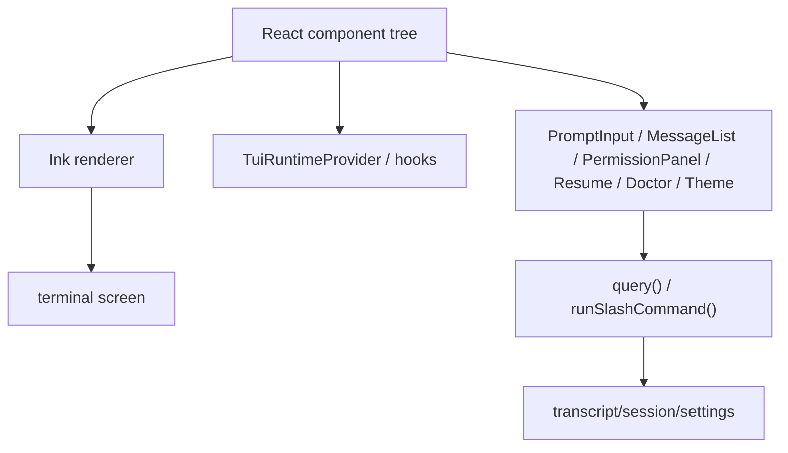

V0.4 现在有两个交互入口：

| 入口 | 触发条件 | 作用 |
| --- | --- | --- |
| React/Ink TUI | stdin/stdout 都是 TTY | 真实交互体验：PromptInput、状态栏、消息列表、工具进度、权限提示；TUI imports 统一走本仓库 `@anthropic/ink` 兼容包 |
| line shell fallback | 管道输入、测试、非 TTY | 可脚本化 smoke，不加载终端 React 渲染 |

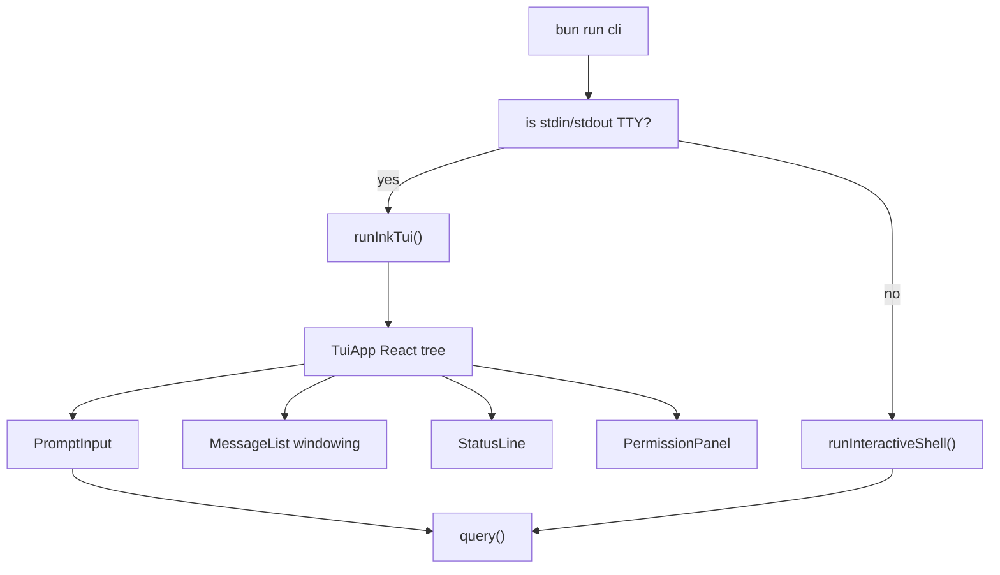

非 TTY fallback 的输出类似：

```text
my-claude-code interactive shell
Type /help for commands, /exit to quit.
> 解释当前目录
...
> /exit
bye
```

React/Ink App 的组件边界：

| 组件 | 当前职责 |
| --- | --- |
| `TuiApp` | session id、消息状态、history、abort controller、query event 消费 |
| `PromptInput` | cursor-aware 输入、左右/Home/End/Delete、Ctrl+R history search 并可再次 Ctrl+R 循环匹配、Ctrl+A/E/B/F/P/N/U/K/W readline 快捷键、Vim insert/normal prompt mode MVP、Enter 提交、Shift+Enter 多行、粘贴换行归一化、Tab slash/file/live MCP resource/agent/queued command/prompt suggestion 补全、slash argument 补全、可选择 completion menu 和命令描述、Backspace、上下历史、Shift+方向键选择文本、SGR mouse prompt selection MVP、运行中输入 prompt 会进入 queue，Up/Esc 可把 editable queued prompt 合并回输入框，当前请求结束后 FIFO drain、prompt 内选中或 screen-level 选中后 Ctrl+C 复制到系统剪贴板并反馈成功/失败、无选择时 Ctrl+C abort、Ctrl+D exit、Esc 关闭权限提示/清除选择、基础 footer |
| `MessageList` | 只渲染当前窗口，PageUp/PageDown 通过 ScrollBoxHandle 改变 scroll offset；TUI 已接入基于 Ink stdout rows/columns 的 `measureMessageViewport()`、`measureElement()` computed height cache 和 row-based windowing；长行会按终端 columns 和 CJK display width 预折成物理 Text rows，避免终端自动折行后下一帧短行覆盖时残留旧内容；另有 scroll anchor restore helper |
| `ScrollBox` | 兼容 `@anthropic/ink` `ScrollBoxHandle` 的本地边界：`scrollTo`、`scrollBy`、`scrollToBottom`、`getScrollTop`、`getPendingDelta`、`getScrollHeight`、`getFreshScrollHeight`、`getViewportHeight`、`getViewportTop`、`isSticky`、`subscribe`、`setClampBounds`；已补 overscan mounted window、pendingDelta drain、renderer tick drain、per-tick drain budget 和 sticky bottom helper；当前基于上游 Ink + row windowing 实现，不是源码 renderer 的 DOM scroll container |
| `packages/anthropic-ink` | 本地 `@anthropic/ink` workspace；当前 re-export 上游 `ink@6` 的 Box/Text/hooks/measureElement，并提供 render option normalization，避免 undefined stdout/stdin 覆盖 Ink 默认流；同时承载 screen buffer diff、typed core Screen cell/noSelect/softWrap/wide-char/blit/shift、renderer DOM registry/frame commit/overlay paint order/rect clearing/hit-test bubbling、ScrollBox/keybinding parser/matcher、rect hit-test/mouse bubbling、theme palette/auto resolve/ThemeProvider 兼容 API；这是后续迁移源码 renderer internals 的唯一入口 |
| `screenSelection` | screen-level selection 数据模型，把 status/messages/overlay/prompt 统一成可选择行，支持跨 pane 抽取 copy text；已支持 NoSelect ranges、row hit-test、点击装饰区时 clamp 到可选择内容、TUI SGR mouse rows、message/prompt 高亮和 Ctrl+C 复制；后续仍需接源码级 fullscreen screen buffer |
| `StatusLine` | session/model/permission/status |
| `PermissionPanel` | ask 类工具权限确认，支持一次 allow/deny、当前 TUI session allow/deny、写入 `.my-claude-code/settings.json` 的持久 allow/deny；支持 queued permission 的批量 session/persist 决策；也展示权限拒绝提示 |
| `InfoScreen` | V0.4 screen model 渲染层，用于 Doctor 这类不应只作为纯文本 append 的屏幕；Doctor 已有 cwd、runtime、installation type、invoked binary、package manager、ripgrep、settings source validation、permission rule coverage、context files、MCP config、provider env、git/session root、session graph、file snapshot store、API key、tool registry 基础检查 |
| `ResumePicker` | 本地 filter、selected preview、restorePlan lineage/snapshot coverage/provider hydration/cache-break preview、Enter resume、`f` fork、`r` rewind 到前一个 transcript checkpoint |
| `CheckpointPicker` | Resume rewind checkpoint 选择器；Enter 以 checkpoint fork 新 session，`w` 用文件 snapshot 恢复工作区文件 |
| `ThemePicker` | `/theme` 下可用上下键选择主题、Enter 持久写入 `.my-claude-code/settings.json`、Esc 取消；支持 `default`、`dark`、`light`、`auto`、`COLORFGBG`/terminal hint auto resolve、全局 ThemeProvider preview state、结构化 palette preview，并把 preview palette 应用到 StatusLine/MessageList/InfoScreen/ResumePicker/CheckpointPicker/PermissionPanel |
| `TuiRuntimeProvider` | 预留 React context，避免后续 screen/component 层层传参 |

这里的关键架构价值：React/Ink TUI、line shell、headless print mode 都复用同一个 `query()`。

当前 shell 已经接入共享 slash command handler，因此 `/status`、`/permissions`、`/context`、`/compact`、`/doctor`、`/model`、`/resume`、`/statusline`、`/theme`、`/usage`、`/clear`、`/help`、`/exit` 在 headless 和 interactive 中走同一套逻辑。

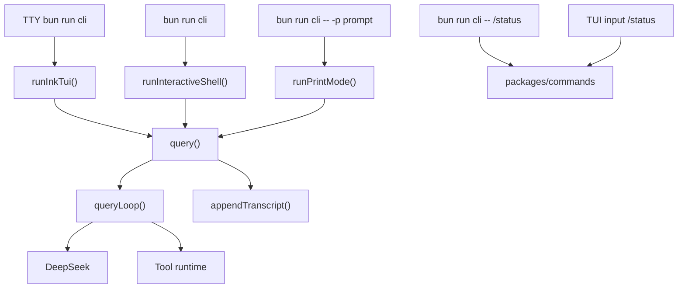

如果 TUI 自己调用 provider，后续会出现两个 agent：

- headless agent 有工具和权限。
- interactive agent 另一套逻辑。

这会直接破坏 1:1 复刻。正确做法是：TUI 只负责输入和渲染，agent 行为必须来自 runtime；slash commands 也必须来自共享 command runtime。

V0.4 还做了一个小但重要的改进：interactive shell 会在启动时确定一个 `sessionId`，同一个 shell 里的多轮输入复用这个 session id。每一轮 query 后，shell 会从 transcript replay 最新 summary，作为下一轮的 `userContext`。

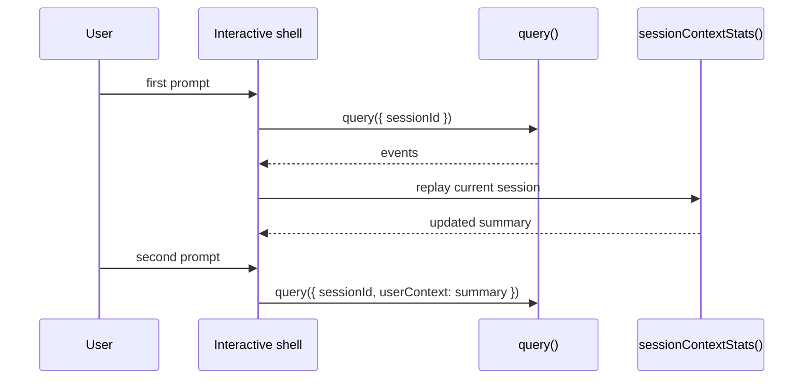

权限确认链路也要从一开始就和 runtime 打通，而不是做成纯 UI 弹窗：

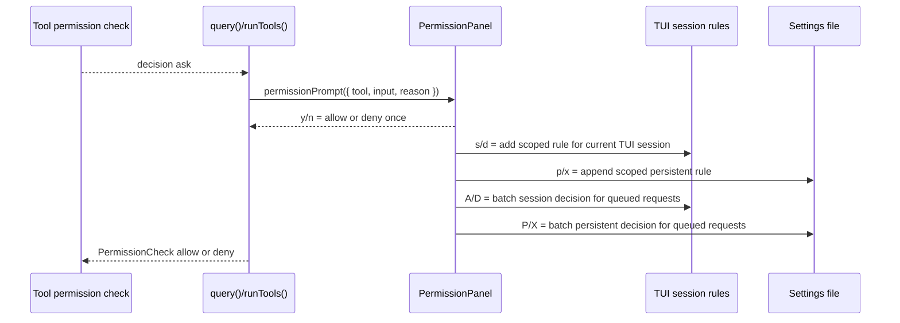

这里的“scoped rule”不是随手拼一个工具名，而是从 tool input 中提取稳定范围：

| 工具请求 | 生成规则 | 含义 |
| --- | --- | --- |
| `Write` with `{ "file_path": "docs/gap.md" }` | `Write(docs/gap.md)` | 只授权包含这个路径的 Write 请求 |
| `Edit` with `{ "file_path": "src/a.ts" }` | `Edit(src/a.ts)` | 只授权这个文件的 Edit 请求 |
| `Bash` with `{ "command": "bun test" }` | `Bash(bun test)` | 只授权包含这条命令的 Bash 请求 |
| `mcp__github__search` | `mcp__github__search` | MCP 权限遵循源码规则，不支持括号 pattern |
| 无稳定字段 | `ToolName` | 退化为工具级规则，后续要继续细化 |

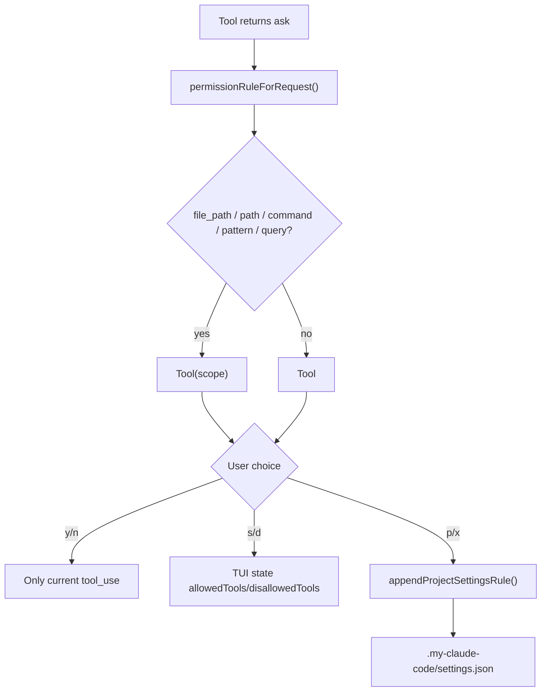

另一个容易踩坑的点是 `allowedTools` 的语义。裸规则如 `Read` 可以作为严格 allowlist，用来限制 provider 暴露哪些工具；但带括号的 `Write(docs/gap.md)` 是“范围授权”，不能把其它工具都隐藏。否则用户在 TUI 里允许一次 `Write(docs/gap.md)` 后，下一轮 `Read`、`Glob`、`Grep` 都会被误伤。V0.4 因此把 `Tool(pattern)` 作为 scoped grant 处理，只有裸工具名才触发严格 tool allowlist。

MCP 规则是单独分支。Claude Code 源码中 MCP permission 支持 `mcp__server`、`mcp__server__*`、`mcp__server__tool`，但不支持 `mcp__server__tool(pattern)`。因此 V0.4 的 `permissionRuleForRequest()` 遇到 MCP tool 时直接返回 tool name，避免生成源码不接受的括号规则。

Permission queue 的原因是：未来并发工具、远程 worker、MCP bridge 都可能同时发起多个 permission request。如果 TUI 只保存一个 `permissionRequest`，后来的 request 会覆盖前一个 promise，runtime 就可能永久等待。V0.4 改成 queue：

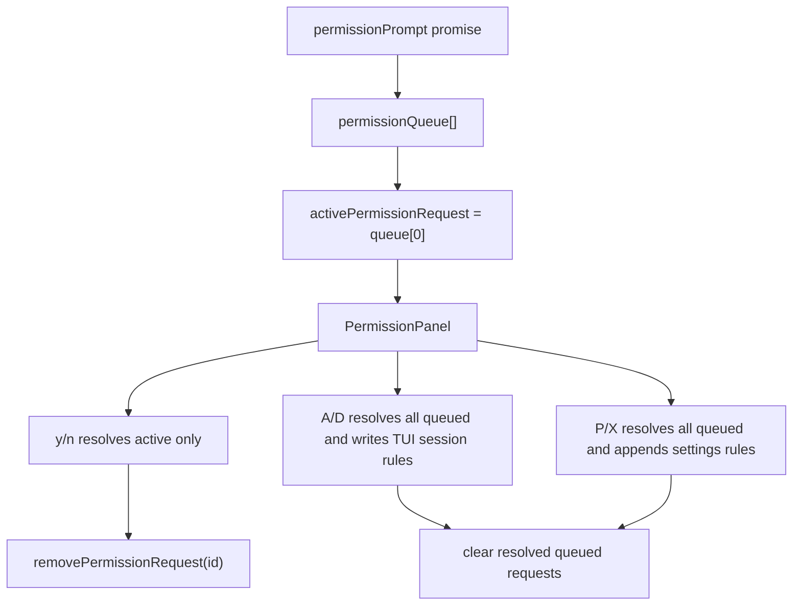

这仍不是完整 Claude Code 权限系统。完整 parity 还需要 worker/MCP 的真实请求来源、settings 多来源策略、managed policy、UI 批量编辑和完整审计输出。但最关键的 UI-runtime 边界已经建立起来：工具运行时可以等待 TUI 决策，而不是 headless 一律拒绝。

Screen 也不能长期停留在“slash command 输出一段文本”。V0.4 先抽出 `CommandScreen` model，让 CLI 和 TUI 共用 Doctor/Theme/Resume 的结构：

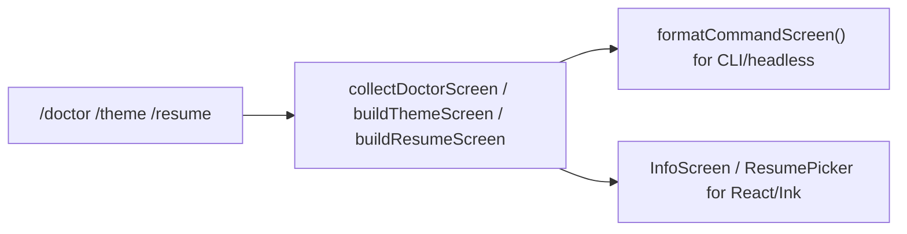

这样做的价值是后续补完整 screen 交互时，不需要重新定义 Doctor/Theme/Resume 展示数据，只需要增强组件的选择、编辑和持久化行为。当前 Doctor 已经开始做真实检查，覆盖 cwd 可读写、Node/Bun runtime、installation type、invoked binary、exec path、auto update 状态、package manager、ripgrep、PATH alias、shell、session root、session graph、file snapshot store、project/local/managed/settings source validation、permission rule coverage、context files、MCP config、`.claude/settings.json`、git worktree/git HEAD、package manifest、dist cli、provider endpoint、provider env、settings 解析、API key 是否配置、NODE_ENV、tool registry 数量；还不是 Claude Code 的完整 doctor。

Theme 持久切换不是 TUI 组件自己写文件，而是 slash command handler 统一负责：

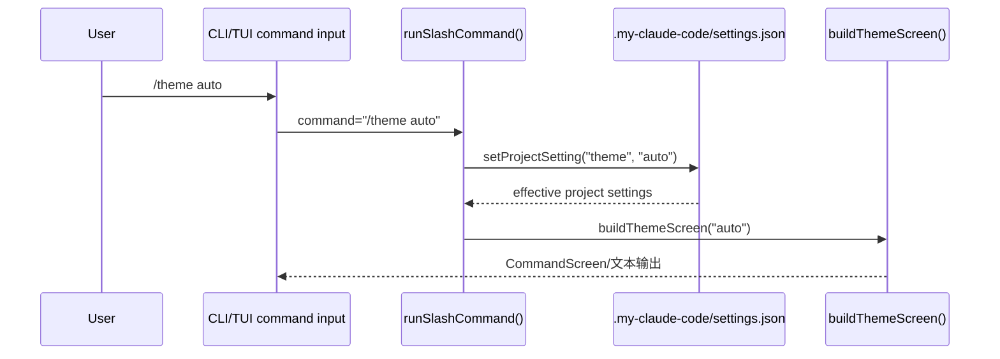

Resume 搜索/filter/fork/rewind 也先做成可测试的数据层，再接到 React 组件，而不是把恢复逻辑写死在 UI 里：

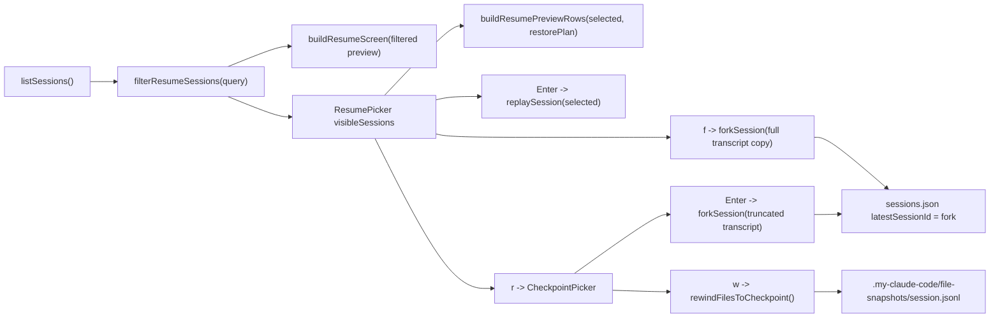

文件 rewind 的关键不是从模型回答里“猜”文件内容，而是在 destructive tool 执行前保存 before snapshot。V0.4 的 snapshot record 现在区分三类：

- `missing`：工具执行前目标不存在，rewind 时删除当前目标。
- `file`：工具执行前目标是文件，按 UTF-8 可逆检测保存 `content`，同时保存 `contentBase64`，二进制文件只依赖 base64 恢复。
- `directory`：工具执行前目标是目录，递归保存目录内普通文件、空目录、symlink、mode 和相对路径，rewind 时先清空目录再恢复 entries。

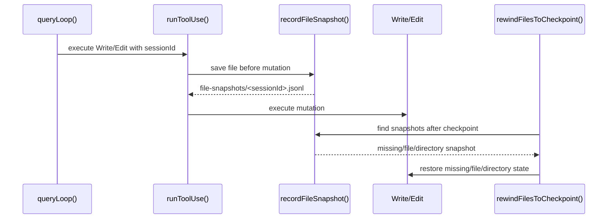

## Step 7：测试应该覆盖什么

V0.4 增加三类测试。

第一类：session store。

```ts
expect(session.promptCount).toBe(1)
expect(index.latestSessionId).toBe('session_1')
expect(replay.summary).toContain('Recent assistant output')
```

它保证 session index 和 transcript replay 可用。

第二类：CLI 参数和 slash commands。

```ts
expect(options.sessionId).toBe('session_custom')
expect(options.additionalDirectories).toEqual(['../shared', '/tmp/work'])
expect(io.stdout.value).toContain('/compact')
```

它保证 Commander 参数真的进入 runtime，而不是只出现在 help 文案里。

第三类：interactive shell 和 TUI helpers。

```ts
input.write('/help\n')
input.write('/exit\n')
await runInteractiveShell({ input, output })
```

它保证无模型调用时，TUI shell 的基础命令可退出，不会卡住。现在还需要覆盖：

```ts
input.write('/status\n')
input.write('/permissions\n')
input.write('/exit\n')
await runInteractiveShell({ input, output, sessionId: 'session_tui' })
```

这保证 interactive shell 不再只有 `/help` 和 `/exit`，而是接入了同一套 V0.4 command surface。

这一类还要覆盖权限规则和窗口行为：

```ts
expect(permissionRuleForRequest(writeRequest)).toBe('Write(docs/gap.md)')
expect(permissionRuleForRequest(mcpRequest)).toBe('mcp__github__search')
expect(permissionRulesForQueue(queue)).toEqual([
  'Write(a.txt)',
  'mcp__github__search',
])
expect(windowMessagesByRows(messages, 3).visible.map(m => m.id)).toEqual([
  'm2',
  'm3',
])
expect(messageRowCount(longAssistantMessage, 80)).toBeGreaterThan(1)
expect(measureMessageViewport({ rows: 40, columns: 100 })).toEqual({
  rows: 32,
  columns: 100,
})
expect(messageRowCount({ id: 'cjk', role: 'system', text: '你好世界你好' }, 10)).toBe(2)
expect(restoreMessageScroll(nextMessages, 3, snapshot)).toBe(3)
expect(await loadSettings(cwd)).toEqual({
  allowedTools: ['Read', 'Write(hello.txt)'],
})
expect(await loadSettings(cwd)).toEqual({ theme: 'dark' })
expect(await forkSession({ cwd, sourceSessionId: 's1' })).toMatchObject({
  parentSessionId: 's1',
  forkReason: 'fork',
})
expect(await rewindFilesToCheckpoint({ cwd, session, checkpointRecordId })).toEqual({
  checkpointRecordId,
  restoredFiles: ['hello.txt'],
  missingSnapshots: [],
})
```

这些测试分别防止三类回归：

- TUI 权限面板只展示 UI，却没有把 tool input 转成可复用规则。
- 多个 permission prompt 互相覆盖，导致 runtime promise 悬挂。
- MCP tool 被错误转换成源码不支持的括号规则。
- 长消息按“消息条数”窗口化，遇到多行内容时滚动位置失真。
- 长行没有按终端 columns 估算折行高度，窄终端滚动窗口失真。
- TUI 没有统一读取 terminal rows/columns，导致行数估算和渲染窗口不一致。
- 新消息追加时无法根据 anchor 恢复滚动位置。
- 持久授权把 API key 或未知字段写进 settings。
- `/theme <name>` 只改 UI 文案，没有写入项目 settings。
- Resume fork/rewind 只改当前内存状态，没有复制 transcript 或登记新 session。
- 文件 rewind 没有在工具真正改文件前保存 before snapshot，导致恢复只能靠不可靠的推断。

## 本章可以直接使用的 AI Prompt

如果你从空工程按 V0.4 实现，可以把下面 prompt 交给 AI：

```text
你正在实现一个 Claude Code-like agent 的 V0.4。
已有 V0.3：Bun/TypeScript monorepo、core protocol、DeepSeek provider、query/queryLoop、transcript JSONL、tools、permissions、settings、CLI -p。

请实现：
1. 新增 packages/session，提供 session index、recordSession、resolveLatestSession、resolveSession、listSessions、buildSessionGraph、replaySession、sessionContextStats。
2. session index 存在 .my-claude-code/sessions.json，transcript 仍为 .my-claude-code/transcripts/<sessionId>.jsonl。
3. query() 在进入 queryLoop 前调用 recordSession，并继续 appendTranscript。
4. CLI 增加 --continue、--resume [sessionId]、--session-id、--add-dir、--system-prompt、--system-prompt-file、--append-system-prompt、--append-system-prompt-file、--vim/--no-vim、--output-format text|json|stream-json、--input-format text|stream-json、--json-schema、--include-partial-messages、--include-hook-events。
5. --continue / --resume 通过 replaySession 生成 userContext 注入 query。
6. 增加 slash commands：/add-dir、/help、/clear、/compact、/config、/context、/cost、/diff、/doctor、/env、/keybindings、/memory、/model、/output-style、/resume、/statusline、/theme、/usage、/vim、/version、/exit，并保留 /status、/permissions。
7. 新增 packages/commands，把 slash command handler 从 CLI 抽出来，CLI 和 TUI 都调用它。
8. 新增 packages/tui：TTY 下用 React/Ink App，非 TTY 下用 line-oriented fallback；两者都复用 query()，并接入 packages/commands。
9. interactive shell 同一个进程内复用一个 sessionId，多轮输入后从 transcript replay 最新 summary 作为下一轮 userContext。
10. React/Ink App imports 必须统一走本地 `@anthropic/ink` workspace，不能再直接 import 上游 `ink`；App 至少包含 renderer option normalization、message measurement commit guard、cursor-aware PromptInput、基础 footer、Ctrl+R history search/cycling、可选择 slash/file/live MCP resource/agent/queued command/prompt suggestion completion menu 和命令描述、readline 快捷键、Vim insert/normal mode MVP、queued prompt editing/drain、Shift+方向键文本选择、screen-level mouse selection hit-test/NoSelect/高亮/复制、选中后 Ctrl+C 系统剪贴板复制和失败提示、基于 Ink stdout rows/columns 的 scrollable MessageList windowing、ScrollBoxHandle 兼容边界、overscan/pendingDelta/sticky scroll 语义、StatusLine、PermissionPanel、ResumePicker、ThemePicker、TuiRuntimeProvider。
11. PermissionPanel 必须用 queue 承载多个 permission request，区分 y/n 一次决策、s/d 当前 TUI session 规则、p/x 持久写入 .my-claude-code/settings.json，并支持 A/D/P/X 对当前 queue 批量授权或拒绝。
12. 规则优先生成 Write(path)、Edit(path)、Bash(command)；MCP 规则必须保持 mcp__server / mcp__server__tool 形态，不生成括号 pattern。
13. Tool(pattern) 是 scoped grant，不是严格 allowlist；只有裸工具名 allowedTools 才限制 provider tool schema。
14. Doctor/Theme/Resume 先抽成 CommandScreen model，CLI 用 format 输出，TUI 用 screen component 或 picker 渲染；`/theme <name>` 必须持久写入项目 settings 并支持 `auto`，`/theme` 在 TUI 下必须进入 ThemePicker 并展示 preview；Resume picker 必须支持本地搜索/filter、selected preview、fork、CheckpointPicker rewind、文本/二进制/目录 file snapshot rewind。
15. 增加测试：session store、session graph、session fork/rewind、file snapshot rewind、binary/directory snapshot rewind、shared commands、screen model、CLI 参数传递、slash commands、interactive shell、terminal app fallback smoke、真实 Ink TUI smoke、renderer option normalization、message measurement guard、settings 持久写入、theme/vim 持久切换、permission rule、permission queue、MCP permission matching、MCP stdio resources/list tools/list tools/call live discovery、queued prompt editing helpers、message windowing、row-based windowing、ScrollBoxHandle offset 映射、overscan mounted window、pendingDelta drain、sticky bottom、terminal viewport measurement、终端 columns/CJK 折行估算、scroll anchor restore、screen-level selection row slices、NoSelect copy filtering、hit-test clamping、rect hit-test/mouse bubbling、PromptInput selection/readline/vim/history/completion helpers、clipboard command helpers、stream-json/json-schema/system-prompt-file print mode。
16. 不要把 V0.4 的 React/Ink shell 误判为完整 Claude Code TUI；必须在文档中登记剩余差距。
17. 运行 bun run typecheck、bun run test、bun run lint、bun run build。
```

## 验证命令

```sh
bun run typecheck
bun run test
bun run lint
bun run build

bun run cli -- --version
bun run cli -- /help
bun run cli -- /status
bun run cli -- /doctor
bun run cli -- /resume
printf '/status\n/permissions\n/exit\n' | bun run cli
bun run cli -- -p "解释 README.md"
bun run cli -- -p "继续刚才的解释" --continue
```

## V0.4 当前边界

已完成：

- session metadata 持久化。
- latest session resolve。
- transcript replay 到 compact summary。
- session fork 会复制 transcript 并登记新 session；session rewind 会按 transcript record id 截断复制，并登记为新 session。
- destructive file tools 执行前会记录 before snapshot；`rewindFilesToCheckpoint()` 能按 checkpoint 恢复被 Write/Edit 改动过的文本文件、二进制文件、目录普通文件、空目录、symlink 和 mode，并在恢复前返回将被覆盖的 Git worktree 未提交路径。
- `--continue` / `--resume` 注入 `userContext`，并把 compact boundary 之后的 hydrated provider messages 一并传给下一轮 provider request。
- `/context` 输出上下文统计。
- `packages/commands` 让 CLI/TUI 共用 slash command handler。
- TTY 下 React/Ink App shell。
- PromptInput cursor-aware 编辑、左右/Home/End/Delete、Ctrl+R history search 并可继续 Ctrl+R 循环到更早/回绕匹配、Ctrl+A/E/B/F/P/N/U/K/W readline 快捷键、Vim insert/normal prompt mode MVP、粘贴换行归一化、多行输入、Tab slash/file/live MCP resource/agent/queued command/prompt suggestion/Slack channel/IDE mention/image attachment/voice action 补全、slash argument 补全、可选择 completion menu 和命令描述、completion payload 归一化、基础 footer/source hint、历史、运行中 prompt queue/edit/drain、Ctrl+C abort、Ctrl+D exit、Esc dismiss。
- PromptInput 会剥离裸 SGR mouse/CSI terminal control sequences，并保留同一 input chunk 里的可打印文本，避免 `[<65;...M` 这类序列进入用户 prompt 或被提交给模型；同时显式处理 raw DEL/Ctrl+H Backspace 和同 chunk backspace，避免某些终端里回退键没有 `key.backspace` 标记时失效。
- PromptInput Shift+方向键文本选择和 SGR mouse prompt selection MVP，选中文本后 Ctrl+C 复制到系统剪贴板并反馈成功/失败；无选择时 Ctrl+C 仍然 abort。
- screen-level selection helper 能把 status/messages/overlay/prompt 统一成可复制行，已覆盖跨 pane copy text 抽取；TUI 已接 SGR mouse row selection、MessageList/PromptInput 高亮和 Ctrl+C 复制；NoSelect ranges 会过滤 role/prompt 装饰区，hit-test 点击装饰区会 clamp 到可复制内容。
- MessageList windowing、PageUp/PageDown 滚动 offset、TUI 接入 row-based windowing、单条长消息按可见 row range 裁剪、短回答时 ScrollBox 高度随内容收缩、流式 assistant delta 追加时清理旧 `measureElement()` 高度缓存，避免回答增长后仍按首屏 1 行裁剪、`measureElement()` 真实 computed height cache、按 Ink stdout columns 和 CJK display width 估算并预折 message rows、`measureMessageViewport()` 读取 rows/columns、stdout resize 后触发 viewport 重算、row-based helper、scroll anchor restore helper；新增 `ScrollBoxHandle` 兼容层，PageUp/PageDown 通过该边界调用 `scrollBy`；补 overscan mounted window、pendingDelta drain、per-tick drain budget、sticky bottom helper，并在 ScrollBox 外层设置 overflow hidden，避免消息内容绘制到 PromptInput 区域。
- StatusLine 显示 session/model/permission/status，并在存在 transcript stats 时展示 token budget 和 prompt cache hit rate。
- PermissionPanel 支持工具权限 queue，一次 allow/deny、当前 TUI session allow/deny、持久 settings allow/deny，以及 queued requests 的批量 session/persist allow/deny；规则支持 `Write(path)`、`Edit(path)`、`Bash(command)` 这类范围授权。
- MCP permission bridge MVP：`mcp__server`、`mcp__server__*`、`mcp__server__tool` 规则匹配，不生成源码不支持的括号 pattern。
- MCP live discovery MVP：从当前目录向上读取 `.mcp.json`，也支持测试态 plugin server 注入；对 stdio server 执行 JSON-RPC `initialize` + `resources/list`、`tools/list`、`tools/call`，把返回 resource `uri` 合并到 `@mcp:` 补全来源，并建立 tool descriptor/callTool 底座；补上 server approval gate、managed policy deny、signature 去重、redacted config hash、OAuth-required 状态、SSE/HTTP/WS/SDK/claudeai-proxy transport classification 和 stdio timeout/server/invalid-response 错误分类。真实 SSE/HTTP/OAuth token flow 仍待 V0.6+。
- settings loader 支持 user、`.claude/settings.json`、`.my-claude-code/settings.json`、`.my-claude-code/settings.local.json` 和 `MY_CLAUDE_CODE_MANAGED_SETTINGS_PATH` 多来源合并；权限数组去重累加，标量按高优先级覆盖；写入仍只落 `.my-claude-code/settings.json`，且不写入 schema 外字段或 secret。
- `.my-claude-code/settings.json` 支持 `vimMode`；`/vim on|off|toggle` 和 `--vim/--no-vim` 已接入共享命令/CLI flags。
- `/keybindings` 已输出当前 Prompt/Vim/TUI 快捷键清单，用于 command module 和 PromptInput 行为对齐。
- `/config` 输出非 secret 的有效配置；`/version` 通过共享 command module 输出当前版本。
- `/add-dir <path>[,<path>...]` 可在当前 TUI session 动态合并 additional directories，后续 query 会把这些目录注入 system context；CLI/headless 下同一 command handler 会输出合并后的目录列表。
- `/cost`、`/diff`、`/env`、`/memory`、`/output-style` 已接入共享 command module；`/output-style default|Explanatory|Learning` 会持久写入 project settings，其它涉及外部状态的命令先输出安全摘要或占位。
- `--system-prompt`、`--system-prompt-file`、`--append-system-prompt`、`--append-system-prompt-file` 已透传到 print/TUI/line shell runtime；`--output-format json` 和 `--output-format stream-json` 已接入 print mode，支持 `--include-partial-messages`；`--json-schema` 已能对结构化 result 做 V0.4 subset validation；默认 `text` 行为保持流式输出。
- `@anthropic/ink` renderer wrapper 会过滤 undefined stdin/stdout/stderr，避免 TTY 启动时覆盖 Ink 默认 process streams。
- `Tool(pattern)` scoped grant 不会误把其它 provider tool schemas 隐藏。
- Doctor/Resume 的 `CommandScreen` model；TUI 下 `/doctor` 进入可滚动 `InfoScreen`，CLI/headless 使用同一 model 格式化输出；Doctor 已有基础环境检查并覆盖 installation/runtime/package manager/ripgrep/PATH/settings source validation/local settings/managed policy/permission rule coverage/context files/MCP config/session graph/file snapshot store/git HEAD/package/dist/provider endpoint/provider env；`doctor` 顶层命令 alias 和 `/doctor` 使用同一 handler；`/theme <name>` 已能持久写入 `.my-claude-code/settings.json`。
- ThemePicker 支持 `/theme` 后上下/Home/End 选择、Enter 保存、Esc 取消；支持 `auto`、terminal hint resolve 和结构化 palette preview。
- ResumePicker 基础列表、本地搜索/filter、选中会话 preview、restorePlan lineage/snapshot coverage preview、上下/j-k/PageUp/PageDown 选择、Enter resume、`f` fork、`r` 打开 CheckpointPicker、Esc 清空 filter/取消。
- CheckpointPicker 支持 Enter 以 checkpoint fork 新 session，`w` 恢复 checkpoint 后的文件变更。
- `runTerminalApp()` 非 TTY fallback smoke，验证脚本化环境不会误进 Ink；另有伪 TTY `forceInk` smoke，验证 React/Ink 路径可启动并响应 Ctrl+D。
- 非 TTY line shell fallback 复用 `query()`，并支持 V0.4 slash commands。

未完成，不能误判为 1:1：

- 完整 Claude Code React/Ink TUI parity。
- PromptInput 的全部 Claude Code footer/补全来源还未闭合；当前已补命令描述、readline 核心快捷键、Ctrl+R history cycling、Vim insert/normal MVP、slash argument、project file mention、MCP resource file discovery、stdio MCP resources/list live discovery、agent file discovery、queued command/prompt queue editing、prompt suggestion、Slack/channel、IDE mention、image attachment、voice action 补全底座、completion payload 归一化和 footer source hint，以及 screen-level selection UI；真实 Slack/IDE/image/voice 平台服务接入和更细 footer 选择仍未完整。
- MCP 主线仍未 1:1：当前覆盖 `.mcp.json` 和测试态 plugin MCP 注入、stdio resources/list、tools/list、tools/call、approval gate 和 SSE/OAuth/HTTP 状态分类；真实 SSE/HTTP transport、浏览器 OAuth flow/token refresh、server approval dialog UI、MCP commands/prompts、真实 plugin lifecycle 注入、动态 reconnect/status 仍未闭合。
- worker/MCP 的真实 permission request 来源、远端 managed policy sync/cache/签名校验、权限规则编辑 screen。当前只有本地 `MY_CLAUDE_CODE_MANAGED_SETTINGS_PATH` managed policy 文件入口，真实 Claude Code remote managed settings 细节未确认。
- Claude Code 源码级 `@anthropic/ink` renderer 仍未完整；当前已把 TUI imports 迁到本地 `@anthropic/ink` workspace，并建立 screen buffer diff helper、typed core Screen cell/noSelect/softWrap/wide-char/blit/shift、renderer DOM registry/frame commit/overlay rect clearing/hit-test bubbling、rect hit-test/mouse bubbling helper、同形 `ScrollBoxHandle` 边界和可测的 NoSelect/hit-test/overscan/pendingDelta/per-tick drain/sticky 语义层，后续 renderer internals 必须继续收口到该 workspace。
- Doctor 的完整环境诊断、Theme 的完整实时预览/全局 theme provider、StatusLine 的完整细节 screen。
- 完整 session graph restore 语义；当前已能构建 graph、replay 输出含 lineage/missing parent/transcript hydration/provider message graph/tool result hydration/compact state/provider cache break/file snapshot coverage 的 `restorePlan` 并在 Doctor/Resume 里展示，resume 会注入 compact summary 和 compact boundary 之后的 hydrated provider messages；复杂分支冲突和 provider cache break 完整语义尚未恢复。
- 文件快照 rewind 仍未覆盖跨工具复杂 patch graph；Git worktree 未提交路径提示已接入。
- `/add-dir` 已有当前 session 动态命令；remaining gap 是 workspace root 强约束、resume 后目录恢复和越权路径审计。
- token budget 和 prompt cache 统计已能从 transcript provider usage 汇总；remaining gap 是真实 provider context window、cache break detection 和跨模型价格/限额映射未确认。

这就是 V0.4 的定位：先建立 session-aware runtime 和 interactive/headless 共用链路，再在后续版本把 UI、恢复精度、上下文预算和命令清单逐步打满。
