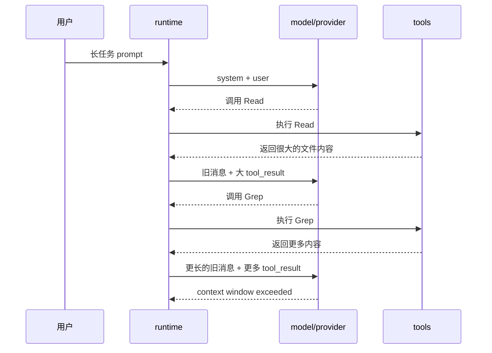
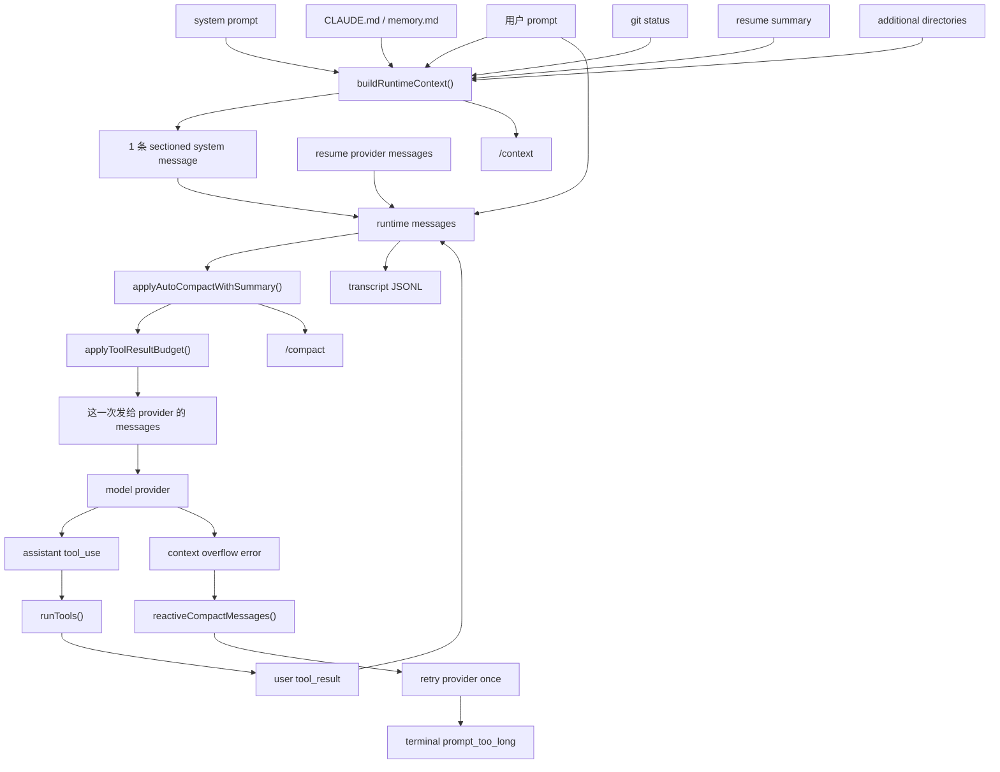
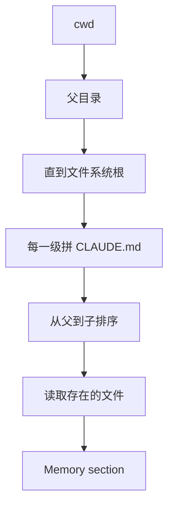
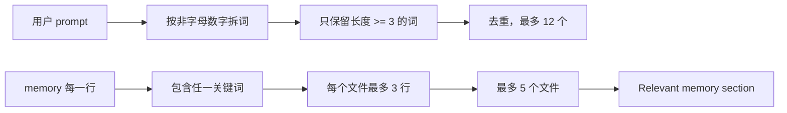
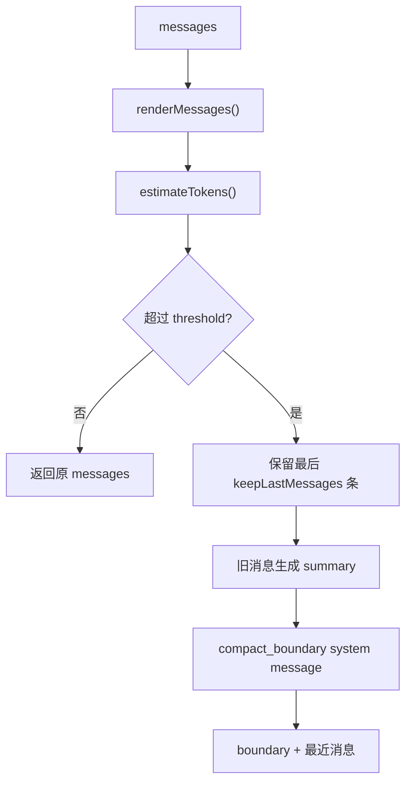
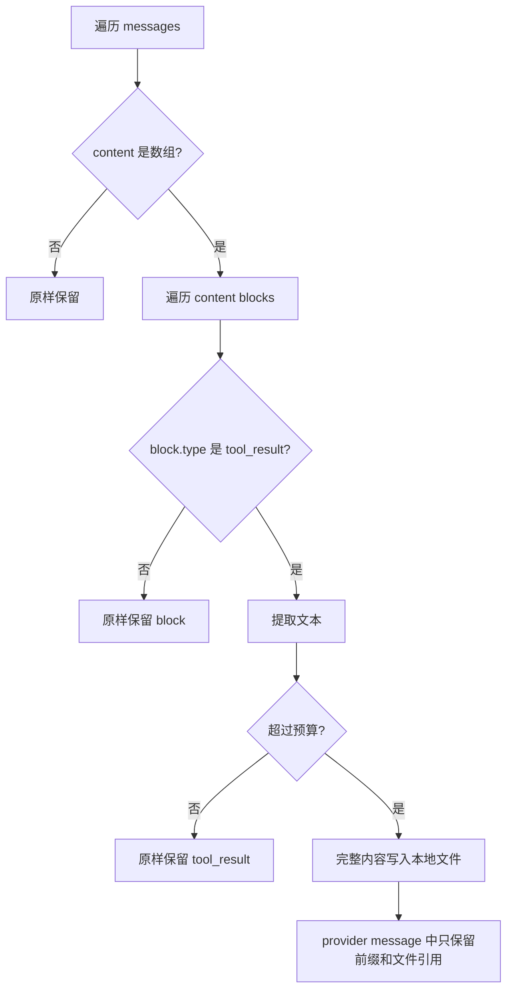
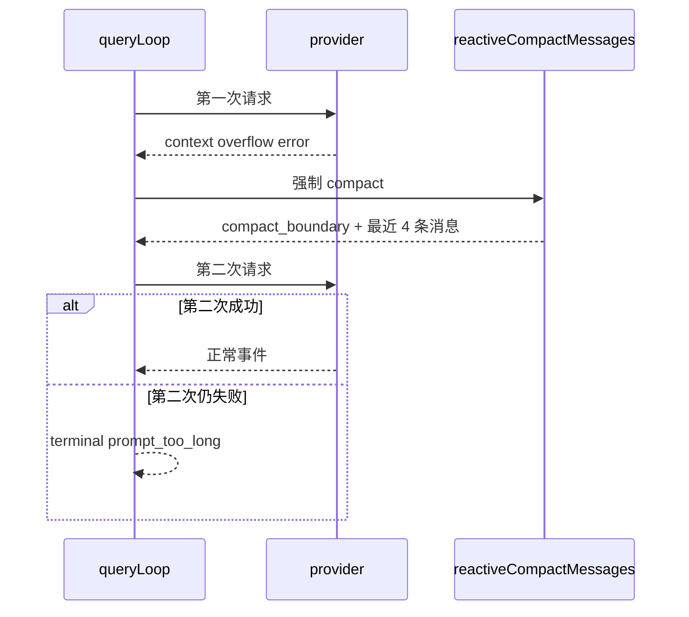
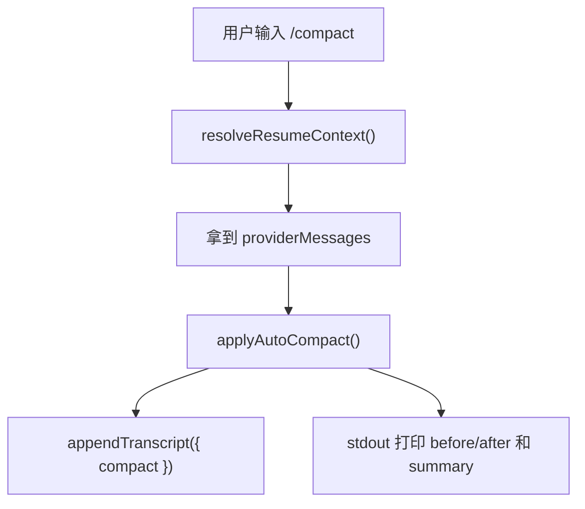

# 从 0 到 1 实现 Claude Code：V0.5 Context、Compact、Memory 和长任务

## 这不是实现总结，而是一份实现教程

读这章时，不要求你已经懂 AI agent 的底层实现。你只需要知道一件事：

```text
Claude Code 这类工具，本质上是一个循环：

用户提出任务
  -> 程序把任务和必要上下文发给模型
  -> 模型决定要不要调用工具
  -> 程序执行工具
  -> 程序把工具结果再发给模型
  -> 模型继续推理或给出最终回答
```

V0.5 要解决的是这个循环跑久之后一定会遇到的问题：上下文越来越大，模型看不完，任务就会断。

这一章会从最基础概念讲起，然后一步一步实现：

- 如何把系统规则、项目记忆、git 状态、resume 摘要组装成模型能看的上下文。
- 如何判断上下文太长。
- 如何把旧消息压缩成摘要。
- 如何处理超大的工具结果。
- 如何在 CLI 里通过 `/context` 和 `/compact` 看清当前状态。

读完这章，你应该能不依赖当前代码，从 0 实现一个可工作的 V0.5 context/compact/memory MVP。

## 先理解 12 个基础概念

如果下面这些词不先讲清楚，后面的实现会很难读。

### 1. Model

Model 就是大语言模型，例如 DeepSeek、Claude、GPT。它接收一组 messages，返回文本或工具调用请求。

你可以把它理解成一个函数：

```ts
const response = await model.generate(messages)
```

### 2. Provider

Provider 是模型 API 的适配层。

不同模型 API 的请求格式不同，但我们的 agent runtime 不应该关心这些差异。所以 runtime 只调用一个统一接口：

```text
runtime -> provider -> DeepSeek/Claude/OpenAI
```

在本文里，“发给 provider”就是“准备好 messages，交给模型适配层发送给真实模型”。

### 3. Message

Message 是发给模型的一条对话记录。最常见有三种 role：

| role | 谁说的 | 例子 |
| --- | --- | --- |
| `system` | 程序给模型的规则 | “你是一个 coding agent，不能假装写文件成功” |
| `user` | 用户输入，或者 runtime 回传工具结果 | “请读取 README 并总结” |
| `assistant` | 模型回答，或者模型请求调用工具 | “我需要调用 Read 工具” |

一个最小请求长这样：

```json
[
  {"role":"system","content":"你是一个 coding agent"},
  {"role":"user","content":"读取 README.md 并总结"}
]
```

### 4. System prompt

System prompt 是最高优先级规则。它告诉模型应该怎么工作，例如：

- 你是 coding agent。
- 不要编造文件操作结果。
- 需要修改文件时必须使用工具。
- 回答要简洁。

它通常放在第一条 `system` message。

### 5. Runtime

Runtime 是我们自己的程序逻辑，不是模型。

它负责：

- 组装 messages。
- 调 provider。
- 执行工具。
- 写 transcript。
- 判断是否要 compact。
- 把结果输出给 CLI/TUI。

如果 model 是“大脑”，runtime 就是“身体和工作流控制器”。

### 6. Runtime history

Runtime history 指当前 query loop 内存里维护的完整消息历史。它包含：

- 最开始的 system message。
- 用户 prompt。
- 模型产生的 assistant message。
- 工具执行后的 tool result。
- 后续多轮对话。

重要：runtime history 是程序当前知道的完整历史，不一定每次都原样发给模型。

为什么？因为它可能太大，模型收不下。

### 7. Provider request

Provider request 是“这一次真正要发给模型的请求”。

它通常来自 runtime history，但可能经过处理：

```text
runtime history
  -> compact 删除旧细节，保留摘要
  -> tool result budget 截短大工具结果
  -> provider request messages
```

所以这句话的意思：

> compact 和 tool result budget 默认只改变“这次发给 provider 的消息”

翻译成白话就是：

> 我们不会立刻把程序内存里的完整历史删掉，只是在发送给模型前临时做一份更短的 messages。

这样做的好处是：模型看到的是短版本，程序和 transcript 仍然保留完整信息，方便后续调试和恢复。

### 8. Transcript

Transcript 是写到磁盘上的 JSONL 日志。它记录 session 里发生过什么。

例如：

```json
{"event":{"type":"message_start","message":{"role":"assistant"}}}
{"event":{"type":"tool_execution_result","tool":"Read","result":"..."}}
{"event":{"type":"terminal","status":"completed"}}
```

它的作用是：

- `/resume` 时恢复会话。
- 调试 agent 为什么做了某个动作。
- 记录 compact boundary。
- 统计 token 和工具使用情况。

Runtime history 是内存里的当前状态；transcript 是磁盘上的历史记录。

### 9. Context

Context 是“模型完成当前任务需要知道的信息”。

它不只是用户 prompt，还包括：

- system prompt。
- 当前日期。
- git 状态。
- 项目规则 `CLAUDE.md`。
- 项目 memory。
- resume 摘要。
- 额外目录。

V0.5 的核心之一，就是把这些信息统一整理成一个 runtime context。

### 10. Memory

Memory 是项目或用户长期规则。

例如 `CLAUDE.md` 里可能写：

```text
修改代码前必须先看测试。
不要提交 secrets。
默认用 bun test 验证。
```

这些不是当前用户 prompt 的一部分，但 agent 每次工作都应该知道。

### 11. Compact

Compact 是“把很长的历史压缩成短摘要”。

例如原始历史是：

```text
用户：实现 V0.5
助手：读了 roadmap
助手：修改 context.ts
助手：修改 compact.ts
工具结果：一大段测试输出
用户：继续完善
...
```

compact 后发给模型的是：

```text
system:
compact_boundary
summary:
用户正在实现 V0.5 context/compact/memory。
已经修改 context.ts 和 compact.ts。
测试目前通过。

user:
继续完善文档
```

模型不再看到所有旧细节，但能知道任务进展。

### 12. Tool result budget

Tool result 是工具执行结果，比如 `Read` 读出来的文件内容、`Grep` 搜索结果、`Bash` 输出。

工具结果可能非常大。比如读取一个 200KB 文件，如果直接塞给模型，就会吃掉大量 context。

Tool result budget 的意思是：

```text
每个工具结果最多保留多少字符
所有工具结果总共最多保留多少字符
超过的部分写入本地文件，发给模型时只保留前面一段和文件引用
```

这不是为了隐藏信息，而是为了不让一次工具结果撑爆模型窗口。

## V0.5 到底要解决什么问题

假设用户让 agent 做一个长任务：

```text
阅读 roadmap
实现 V0.5
修改代码
跑测试
修 bug
更新文档
继续补 parity 缺口
```

如果没有 V0.5，会发生什么？



模型有 context window，也就是它一次最多能看的 token 数。历史越长，越容易超过。

V0.5 的解决办法是：

```text
1. 统一构造上下文，避免上下文散落在各处。
2. 发送给模型前，先判断是否需要 compact。
3. 发送给模型前，限制大工具结果。
4. provider 仍然报太长时，强制 compact 后重试一次。
5. 用 /context 和 /compact 让用户看到发生了什么。
```

## 最终数据流先看懂

这张图是 V0.5 的完整链路。先不用纠结每个函数，先看数据如何移动。



这里有一个初学者最容易混淆的点：

```text
runtime messages     = 程序当前保存的消息历史
provider request     = 这一次准备发给模型的消息
transcript JSONL     = 磁盘上记录这次 session 发生了什么
```

它们不是同一个东西。

举例：

```text
runtime messages:
  100 条，包含完整工具结果

provider request:
  12 条，旧历史被 compact，大工具结果被截断

transcript:
  磁盘 JSONL，记录完整事件和 compact metadata
```

如果你只记住一句话，就是：

> Runtime 保存事实，provider request 控制本次模型能看到多少，transcript 负责可恢复和可审计。

## 要新增哪些文件

V0.5 不需要把所有逻辑塞进 `query.ts`。我们按职责拆开。

```text
packages/agent-runtime/src/context.ts
  负责收集和渲染上下文

packages/agent-runtime/src/compact.ts
  负责 compact 和 tool result budget

packages/agent-runtime/src/query.ts
  负责把 context/compact/budget 接入 agent loop

packages/agent-runtime/src/transcript.ts
  负责把 compact metadata 写进 transcript

packages/commands/src/slashCommands.ts
  负责 /context 和 /compact 命令

packages/core/src/protocol.ts
  负责声明 prompt_too_long 这种 terminal status
```

为什么要这样拆？

| 如果这样写 | 问题 |
| --- | --- |
| 全塞进 `query.ts` | 后续 `/context` 无法复用同一套 context 构造逻辑 |
| compact 写在 provider 里 | 换 provider 时 compact 逻辑会重复 |
| memory 读取写在 CLI 里 | TUI/SDK/queryLoop 无法共享 |
| `/compact` 自己拼 summary | transcript 和 runtime compact 语义会分裂 |

正确边界是：

```text
context.ts 只回答：上下文是什么？
compact.ts 只回答：消息太长怎么办？
query.ts 只回答：什么时候调用这些能力？
slashCommands.ts 只回答：用户如何查看或触发这些能力？
```

## Step 1：实现最小 Message 组装

先不要急着做 memory 和 compact。第一步只做最简单的消息构造。

目标：

```text
输入：
  systemPrompt = "你是 coding agent"
  prompt = "读取 README"

输出：
  [
    { role: "system", content: "你是 coding agent" },
    { role: "user", content: "读取 README" }
  ]
```

代码形状：

```ts
export async function buildRuntimeMessages(options: QueryOptions): Promise<Message[]> {
  return [
    {
      role: 'system',
      content: options.systemPrompt ?? DEFAULT_SYSTEM_PROMPT,
    },
    {
      role: 'user',
      content: options.prompt,
    },
  ]
}
```

这一步能跑，但不够，因为它没有项目规则、日期、git 状态、resume 信息。

## Step 2：引入 ContextSection

如果直接把所有东西拼成一个大字符串，后续会不知道每段上下文来自哪里。

不推荐：

```ts
const systemContent = [
  systemPrompt,
  date,
  gitStatus,
  memory,
  resumeSummary,
].join('\n\n')
```

问题是：

- `/context` 没法告诉用户当前有哪些 section。
- 测试只能断言一个大字符串，很脆。
- 后续某个 section 太大时，不好单独截断。
- memory、git、resume 的来源边界不清晰。

推荐先定义结构：

```ts
export type ContextSection = {
  title: string
  content: string
}
```

然后所有上下文先进入 `sections`：

```ts
const sections: ContextSection[] = [
  { title: 'Base instructions', content: systemPrompt },
  { title: 'Current date', content: '2026-05-23' },
]
```

最后再统一渲染：

```ts
export function renderContextSections(sections: ContextSection[]): string {
  return sections
    .filter(section => section.content.trim().length > 0)
    .map(section => `## ${section.title}\n${section.content}`)
    .join('\n\n')
}
```

这就是“sectioned runtime context”的意思：

```text
sectioned = 分段
runtime context = runtime 在本次请求中准备给模型看的上下文
```

## Step 3：为什么只生成一条 sectioned system message

你提到这句话很难懂：

> 不要在 provider request 前散落多个 system message。V0.5 的默认策略是生成一个 sectioned system message，后面再接 resume provider messages 和当前 user prompt。

先看什么叫“散落多个 system message”。

不推荐：

```json
[
  {"role":"system","content":"Base instructions..."},
  {"role":"system","content":"Current date..."},
  {"role":"system","content":"Git status..."},
  {"role":"system","content":"Memory..."},
  {"role":"user","content":"继续实现 V0.5"}
]
```

推荐：

```json
[
  {
    "role": "system",
    "content": "## Base instructions\n...\n\n## Current date\n...\n\n## Git status\n...\n\n## Memory\n..."
  },
  {"role":"user","content":"继续实现 V0.5"}
]
```

为什么推荐一条？

### 原因 1：更容易复用和诊断

一条 system message 里有清晰标题：

```text
## Base instructions
...

## Memory
...
```

`/context` 可以直接告诉你 section 列表。测试也可以断言：

```ts
expect(systemContent).toContain('## Memory')
```

### 原因 2：减少 provider 差异

不同 provider 对多条 system message 的处理不一定完全一样。有些会合并，有些会只接受一条，有些会改变权重。

我们自己先合并成一条，可以让 provider adapter 更简单。

### 原因 3：顺序更可控

一条 sectioned system message 可以明确：

```text
Base instructions
Current date
Git status
Memory
Session context
```

如果散落多条，后续插入 resume 或 compact boundary 时更容易乱。

所以这句话可以翻译成：

> 把所有系统级上下文先整理进一个带标题的大 system message。不要让 memory、日期、git 状态各自变成独立 system message。

## Step 4：定义 RuntimeContextSnapshot

现在可以定义完整返回值：

```ts
export type RuntimeContextSnapshot = {
  sections: ContextSection[]
  systemContent: string
  memoryFiles: Array<{
    path: string
    chars: number
  }>
  relevantMemory: Array<{
    path: string
    snippet: string
  }>
  gitStatus?: string
  estimatedTokens: number
}
```

每个字段为什么需要？

| 字段 | 给谁用 | 为什么需要 |
| --- | --- | --- |
| `sections` | `/context`、测试、调试 | 知道上下文由哪些部分组成 |
| `systemContent` | provider request | 真正发给模型的 system message 内容 |
| `memoryFiles` | `/context` | 告诉用户读到了哪些 memory 文件，不直接暴露全部内容 |
| `relevantMemory` | provider request、测试 | 当前 prompt 命中的 memory 片段 |
| `gitStatus` | provider request、诊断 | 告诉模型 worktree 当前状态 |
| `estimatedTokens` | `/context`、compact 判断 | 粗略估算上下文大小 |

`estimatedTokens` 当前可以先用简单估算：

```ts
export function estimateTokens(value: string): number {
  return Math.ceil(value.length / 4)
}
```

这不是精确 tokenizer。它只是一个启发式数字，用来做预算和测试。真正 provider 仍可能报 context overflow，所以后面还要做 reactive compact。

## Step 5：按顺序构造 context

推荐顺序：

```text
1. Base instructions
2. Appended instructions
3. Current date
4. Git status
5. Memory
6. Relevant memory
7. Session context
8. Additional directories
```

为什么这个顺序重要？

| section | 放这里的原因 |
| --- | --- |
| `Base instructions` | 最高优先级规则，必须最先出现 |
| `Appended instructions` | 用户显式追加，紧跟基础规则 |
| `Current date` | 基础环境信息 |
| `Git status` | 当前工作区状态 |
| `Memory` | 项目长期规则 |
| `Relevant memory` | 从长期规则中摘出的当前相关片段 |
| `Session context` | resume 后的会话摘要，是当前任务状态 |
| `Additional directories` | 额外参考范围，放最后避免像规则一样压过前面内容 |

最小实现：

```ts
export async function buildRuntimeContext(options: RuntimeContextOptions) {
  const sections: ContextSection[] = []

  sections.push({
    title: 'Base instructions',
    content: options.systemPrompt,
  })

  if (options.appendSystemPrompt) {
    sections.push({
      title: 'Appended instructions',
      content: options.appendSystemPrompt,
    })
  }

  sections.push({
    title: 'Current date',
    content: (options.now ?? new Date()).toISOString().slice(0, 10),
  })

  // 后面再继续加 git、memory、resume
}
```

## Step 6：加入 Git status

为什么模型需要 git status？

因为 coding agent 修改文件前后都需要知道工作区是否已经有用户改动。例如：

```text
 M README.md
?? packages/new-file.ts
```

这能提醒模型：

- 不要随便覆盖用户已有修改。
- 解释当前 worktree 为什么是 dirty。
- `/context` 可以显示当前任务风险。

实现：

```ts
async function readGitStatusSnapshot(cwd: string): Promise<string | undefined> {
  try {
    const { stdout } = await execFileAsync(
      'git',
      ['status', '--short', '--branch'],
      {
        cwd,
        timeout: 1_500,
        maxBuffer: 64_000,
      },
    )
    const value = stdout.trim()
    return value ? truncate(value, MAX_GIT_STATUS_CHARS) : undefined
  } catch {
    return undefined
  }
}
```

注意点：

- git 命令失败不能让 query 失败，因为当前目录可能不是 git repo。
- 需要 timeout，避免 git 卡住。
- 输出要截断，避免巨大 status 进入 context。

## Step 7：加入 Memory 文件

Memory 文件是 agent 的长期记忆。在这个项目里，V0.5 支持这些来源：

```text
从 cwd 向上查找 CLAUDE.md
cwd/.claude/CLAUDE.md
cwd/.my-claude-code/memory.md
每个 additional directory 向上查找 CLAUDE.md
```

为什么要“向上查找”？

假设目录结构：

```text
/repo/CLAUDE.md
/repo/packages/agent-runtime/CLAUDE.md
/repo/packages/agent-runtime/src/query.ts
```

你在 `/repo/packages/agent-runtime` 工作时，模型应该同时知道：

- repo 级规则。
- package 级规则。

查找流程：



实现候选路径：

```ts
function claudeMdCandidates(cwd: string): string[] {
  const paths: string[] = []
  let cursor = resolve(cwd)

  while (true) {
    paths.push(join(cursor, 'CLAUDE.md'))
    const parent = dirname(cursor)
    if (parent === cursor) {
      break
    }
    cursor = parent
  }

  return paths.reverse()
}
```

读取时要注意：

```ts
try {
  const content = truncate(await readFile(path, 'utf8'), MAX_CONTEXT_SECTION_CHARS)
  files.push({ path, content })
} catch {
  // 文件不存在或不可读，跳过
}
```

为什么读取失败要跳过？

因为 memory 是增强能力，不是必要条件。如果缺一个 `CLAUDE.md` 就导致 agent 不能运行，体验会很差。

## Step 8：加入 Additional directories

`--add-dir` 或 `/add-dir` 的意思是：当前任务除了 cwd，还需要参考其他目录。

例如：

```sh
bun run cli -- --add-dir ../shared /context
```

这时 agent 应该知道：

```text
Additional directories
../shared
```

并且也应该尝试读取该目录相关的 `CLAUDE.md`。

实现时不要直接相信输入字符串，先解析成绝对路径：

```ts
resolve(options.cwd, directory)
```

然后对这个目录调用 `claudeMdCandidates()`。

这一步的目的不是给模型文件内容，而是告诉模型“还有这些目录属于当前任务上下文”。真正读文件仍然应该通过工具权限和路径规则控制。

## Step 9：加入 Relevant memory

如果 memory 文件很长，直接全部塞给模型会浪费 context。

V0.5 先做一个简单版本：从用户 prompt 里提取关键词，到 memory 文件里找命中的行。

例子：

```text
用户 prompt:
  继续修复 compact overflow

memory 文件:
  10: compact 只重试一次
  20: overflow 要返回 prompt_too_long
  30: theme picker 用结构化 preview

relevant memory:
  10: compact 只重试一次
  20: overflow 要返回 prompt_too_long
```

流程图：



这不是智能 ranking，只是可测试的 MVP。

为什么还要做？

- 它建立了接口位置。
- 后续可以替换成 embedding 或模型 ranking。
- 当前版本已经能让用户 prompt 相关的规则更靠近模型注意力。

## Step 10：把 context 接回 queryLoop

现在 `buildRuntimeContext()` 能返回 `systemContent`，query loop 需要使用它构造 messages。

最终顺序：

```text
1. system: sectioned runtime context
2. resume provider messages，来自之前 session
3. user: 当前 prompt
```

代码：

```ts
export async function buildRuntimeMessages(options: QueryOptions): Promise<Message[]> {
  const context = await buildRuntimeContext({
    cwd: options.cwd ?? process.cwd(),
    systemPrompt: options.systemPrompt ?? DEFAULT_SYSTEM_PROMPT,
    appendSystemPrompt: options.appendSystemPrompt,
    userContext: options.userContext,
    additionalDirectories: options.additionalDirectories,
    prompt: options.prompt,
  })

  const messages: Message[] = []

  if (context.systemContent) {
    messages.push({
      role: 'system',
      content: context.systemContent,
    })
  }

  messages.push(...(options.messages ?? []))
  messages.push({
    role: 'user',
    content: options.prompt,
  })

  return messages
}
```

为什么 resume messages 放在当前 prompt 前面？

因为它们是历史。模型应该先看到历史，再看到用户现在要求它做什么。

如果反过来：

```text
system
current user prompt
old resume messages
```

模型最后看到的是旧历史，当前用户意图会被冲淡。

## Step 11：先理解 compact 为什么需要

模型不能无限看历史。假设 context window 是 200k tokens，当 messages 估算达到 210k，就可能失败。

最简单粗暴的做法是删除旧消息：

```text
删掉前 90 条，只保留最后 10 条
```

这会丢失任务目标。模型可能不知道：

- 已经改了哪些文件。
- 为什么这样改。
- 用户之前要求过什么。
- 哪些测试已经跑过。

Compact 的正确目标是：

```text
旧消息不是直接消失，而是变成一段摘要。
```

也就是：

```text
旧历史 100 条
  -> summary 1 条
  -> 保留最近 N 条原始消息
```

## Step 12：实现 compact boundary

Compact 后需要告诉模型：“前面的历史被压缩过，这是摘要。”

所以生成一条 system message：

```text
compact_boundary
compactedMessages: 24
summary:
用户正在实现 V0.5 context/compact/memory。
已经新增 context.ts 和 compact.ts。
当前测试通过。
```

为什么叫 boundary？

Boundary 是边界。它告诉后面的阅读者：

```text
这里之前有一段完整历史，但现在被摘要替代了。
```

代码形状：

```ts
function compactBoundaryMessage(compactedCount: number, summary: string): Message {
  return {
    role: 'system',
    content: [
      'compact_boundary',
      `compactedMessages: ${compactedCount}`,
      summary ? `summary:\n${summary}` : undefined,
    ].filter(Boolean).join('\n'),
  }
}
```

为什么用 system role？

- 它不是用户说的话。
- 它不是 assistant 原始回答。
- 它是 runtime 给模型的上下文说明。

如果把 summary 伪装成 assistant message，会让 transcript 和 provider message graph 混淆：模型可能以为 assistant 真的说过这段话。

## Step 13：实现 applyAutoCompact

`applyAutoCompact()` 做四件事：

```text
1. 估算当前 messages 大小。
2. 如果没超过阈值，原样返回。
3. 如果超过阈值，把旧消息摘要化。
4. 返回 compact 后的 messages 和 before/after token 估算。
```

流程：



代码骨架：

```ts
export function applyAutoCompact(
  messages: Message[],
  options: CompactOptions = {},
): CompactResult {
  const estimatedTokensBefore = estimateTokens(renderMessages(messages))
  const thresholdTokens = options.thresholdTokens ?? DEFAULT_AUTO_COMPACT_THRESHOLD_TOKENS

  if (!thresholdTokens || estimatedTokensBefore <= thresholdTokens) {
    return {
      messages,
      compacted: false,
      estimatedTokensBefore,
      estimatedTokensAfter: estimatedTokensBefore,
    }
  }

  const keepLastMessages = Math.max(1, options.keepLastMessages ?? 8)
  const preserved = messages.slice(-keepLastMessages)
  const compacted = messages.slice(0, messages.length - keepLastMessages)
  const summary = summarizeMessages(compacted)

  const compactedMessages = [
    compactBoundaryMessage(compacted.length, summary),
    ...preserved,
  ]

  return {
    messages: compactedMessages,
    compacted: true,
    estimatedTokensBefore,
    estimatedTokensAfter: estimateTokens(renderMessages(compactedMessages)),
    summary,
  }
}
```

当前默认阈值：

```ts
export const DEFAULT_AUTO_COMPACT_THRESHOLD_TOKENS = 160_000
```

为什么阈值这么高？

因为 V0.5 不希望短任务也频繁 compact。compact 会改变模型看到的历史，只有接近长上下文风险时才应该触发。

## Step 14：支持 CompactSummarizer

上一步的 `summarizeMessages()` 可以先做很简单的截断摘要。但真实产品里，compact summary 应该由模型生成。

问题是：单元测试不能依赖真实模型 API。

所以 V0.5 定义可注入接口：

```ts
export type CompactSummarizer = (request: {
  messages: Message[]
  fallbackSummary: string
}) => string | Promise<string>
```

含义：

| 字段 | 意思 |
| --- | --- |
| `messages` | 准备被压缩掉的旧消息 |
| `fallbackSummary` | 本地生成的兜底摘要 |

测试可以传 fake：

```ts
const summarizer: CompactSummarizer = async () => 'summarized by test'
```

生产环境以后可以传真实模型调用：

```ts
const summarizer: CompactSummarizer = async ({ messages, fallbackSummary }) => {
  return provider.summarize(messages) ?? fallbackSummary
}
```

这样 `compact.ts` 不需要知道真实 provider 是谁。

## Step 15：理解 tool_result 为什么危险

普通聊天消息通常不算太大，但工具结果可能非常大。

例子：

```text
用户：读一下 src/big-file.ts
模型：调用 Read
工具：返回 150000 字符
runtime：把 150000 字符塞回模型
provider：context window exceeded
```

更糟的是，模型下一轮可能继续调用工具，新的工具结果又叠加上去。

所以 V0.5 做 tool result budget。

## Step 16：实现 tool result budget

先定义两个限制：

```ts
const DEFAULT_MAX_TOOL_RESULT_CHARS = 8_000
const DEFAULT_MAX_TOTAL_TOOL_RESULT_CHARS = 16_000
```

含义：

- 单个工具结果最多保留 8000 字符。
- 当前 provider request 里所有工具结果合计最多保留 16000 字符。

处理前：

```json
{
  "type": "tool_result",
  "tool_use_id": "toolu_read",
  "content": "非常长的文件内容......"
}
```

处理后：

```json
{
  "type": "tool_result",
  "tool_use_id": "toolu_read",
  "content": "前 8000 字符...\n[tool result truncated: 54000 chars persisted at .my-claude-code/tool-results/session-toolu_read-a1b2.txt]"
}
```

完整内容写到：

```text
.my-claude-code/tool-results/
```

流程：



为什么不直接丢掉超出部分？

因为用户或后续恢复可能需要查看完整工具结果。写入本地文件后，provider context 变短，但信息没有完全消失。

## Step 17：为什么 compact 和 budget 不改 runtime history

这是你指出的难懂句子。我们用具体例子解释。

假设 runtime 当前内存里有：

```text
messages in memory:
  1. system: rules
  2. user: 读取 big.ts
  3. assistant: tool_use Read(big.ts)
  4. user: tool_result(150000 chars)
  5. assistant: 我读完了
  6. user: 继续修改
```

如果直接修改 runtime history，把第 4 条替换成截断版本：

```text
4. user: tool_result(8000 chars + truncated)
```

那程序以后就真的丢掉完整工具结果了。调试、resume、审计都会受影响。

V0.5 默认做法是：

```text
runtime history:
  仍保留完整 150000 chars

provider request:
  临时复制一份 messages
  第 4 条变成 8000 chars + 本地文件引用

transcript:
  继续记录真实事件和 compact metadata
```

所以原句可以改成更清楚的说法：

> Compact 和 tool result budget 是“发送前处理”。它们生成一份更短的 provider request，不等于把 runtime 记住的真实历史全部删除或改写。

这样做的代价是：内存里仍可能有大对象。V0.5 先解决 provider context 爆掉的问题；更高级的内存释放和 rehydration 可以后续再做。

## Step 18：provider request 前的处理顺序

每次调 provider 前，都执行：

```text
runtime messages
  -> applyAutoCompactWithSummary()
  -> applyToolResultBudget()
  -> provider request
```

代码：

```ts
async function prepareMessagesForProvider(
  options: QueryOptions,
  messages: Message[],
): Promise<Message[]> {
  const compacted = await applyAutoCompactWithSummary(messages, {
    thresholdTokens: options.autoCompactTokenThreshold,
    summarizer: options.compactSummarizer,
  })

  const budgeted = await applyToolResultBudget(compacted.messages, {
    cwd: options.cwd ?? process.cwd(),
    sessionId: options.sessionId,
    maxToolResultChars: options.maxToolResultChars,
    maxTotalToolResultChars: options.maxTotalToolResultChars,
  })

  return budgeted.messages
}
```

为什么先 compact，再 budget？

假设旧历史里有 10 个巨大 tool_result，但 compact 后只保留最近 2 条消息。

如果先 budget：

```text
10 个巨大 tool_result 全部写入磁盘
然后 compact 又把其中 8 个折叠掉
```

这会做很多无用 IO。

如果先 compact：

```text
先折叠旧历史
只对保留下来的 tool_result 做预算
```

更符合“只处理这次要发给 provider 的消息”的目标。

## Step 19：处理 provider context overflow

即使我们做了估算，provider 仍可能报错：

```text
prompt too long
context window exceeded
model_context_window_exceeded
413
```

原因：

- 本地 token 估算不精确。
- provider 实际窗口比我们以为的小。
- 用户这次 prompt 本身很大。
- 最近几条必须保留的消息太大。

所以 query loop 要兜底：



代码思想：

```ts
try {
  yield* provider({ messages: preparedMessages })
} catch (error) {
  if (isContextTooLongError(error) && !retriedAfterCompact) {
    messages = reactiveCompactMessages(messages)
    retriedAfterCompact = true
    continue
  }

  if (isContextTooLongError(error)) {
    yield terminal(
      'prompt_too_long',
      1,
      'context window exceeded after compact retry',
    )
    return
  }
}
```

为什么只重试一次？

因为第二次还是太长，说明自动策略已经救不了。继续重试只会形成循环。应该明确告诉用户输入太长，让用户手动缩小任务或清理 session。

## Step 20：把 compact 写入 transcript

手动 `/compact` 或后续更高级 compact，需要在 transcript 里留下结构化记录。

不要只写一段普通文本：

```text
assistant: 我已经压缩上下文
```

这不利于机器恢复。

推荐写 metadata：

```json
{
  "event": {
    "type": "terminal",
    "status": "completed",
    "exitCode": 0,
    "reason": "manual compact",
    "stdout": "summary..."
  },
  "compact": {
    "boundary": true,
    "summary": "summary...",
    "trigger": "manual"
  }
}
```

这样 resume 逻辑能直接判断：

```text
这里发生过一次 manual compact
compact summary 是什么
它是 boundary，不是普通 assistant 文本
```

类型入口：

```ts
export type AppendTranscriptOptions = {
  transcriptPath: string
  sessionId: string
  event: TranscriptEvent
  now?: Date
  compact?: CompactMetadata
  promptStateHash?: string
}
```

## Step 21：实现 `/context`

`/context` 的作用是让用户看清当前上下文预算，而不是调用模型。

它应该回答：

- 当前 session 估算用了多少 token？
- 剩余多少？
- runtime context 有哪些 section？
- 读到了多少 memory 文件？
- git status 有多大？

示例输出：

```json
{
  "estimatedTokens": 1676,
  "tokenBudget": {
    "limit": 200000,
    "used": 1676,
    "remaining": 198324,
    "percentUsed": 0.84,
    "source": "provider-usage"
  },
  "runtimeContext": {
    "estimatedTokens": 519,
    "sections": [
      "Base instructions",
      "Current date",
      "Git status",
      "Session context",
      "Additional directories"
    ],
    "memoryFiles": [],
    "gitStatusChars": 210
  }
}
```

实现原则：

- `/context` 必须复用 `buildRuntimeContext()`。
- 不要复制一套 context 拼接逻辑。
- 默认不要把完整 memory 内容全打印出来，避免输出过大或泄漏项目细节。

## Step 22：实现 `/compact`

`/compact` 是用户手动触发 compact 的命令。

它做三件事：

```text
1. 找到当前 session 的 provider messages。
2. 调 applyAutoCompact() 生成 compact candidate。
3. 把 compact boundary metadata 写入 transcript，并把摘要打印给用户。
```

流程：



输出示例：

```text
Compact:
sessionId: session_xxx
estimatedTokensBefore: 42000
estimatedTokensAfter: 3100
compacted: true
contextSections: Base instructions, Current date, Git status, Session context
memoryFiles: 2

Summary:
...
```

注意：当前 `/compact` 不会重写整个 transcript 文件。它追加一条 compact metadata 记录。这样更安全，也更容易审计。

## Step 23：从 0 实现的推荐顺序

如果你真的要从空项目实现 V0.5，不要一口气写完。按这个顺序最稳：

```text
1. 实现 ContextSection 和 renderContextSections()
2. 实现 buildRuntimeContext()，先只包含 system prompt 和日期
3. 接入 buildRuntimeMessages()
4. 加 git status section
5. 加 CLAUDE.md / memory.md 读取
6. 加 relevant memory 简版
7. 实现 estimateTokens()
8. 实现 applyAutoCompact()
9. 实现 CompactSummarizer 注入
10. 实现 applyToolResultBudget()
11. provider request 前接入 compact + budget
12. catch context overflow，reactive compact 后重试一次
13. transcript record 增加 compact metadata
14. 实现 /context
15. 实现 /compact
16. 补测试和本地验证
```

每一步都应该能单独测试。不要等全部写完再跑。

## Step 24：测试应该覆盖什么

### context 测试

文件：`packages/agent-runtime/src/context.test.ts`

要验证：

- section 顺序正确。
- current date 可注入，测试不依赖真实日期。
- git status 可以关闭或 mock。
- 能读取 cwd 向上的 `CLAUDE.md`。
- 能读取 `.claude/CLAUDE.md` 和 `.my-claude-code/memory.md`。
- additional directory 的 `CLAUDE.md` 会进入 memory。
- relevant memory 能按 prompt 关键词命中。

### compact 测试

文件：`packages/agent-runtime/src/compact.test.ts`

要验证：

- 未超过阈值时不 compact。
- 超过阈值时生成 `compact_boundary`。
- 保留最近 N 条消息。
- 注入 summarizer 后使用 summarizer 返回值。
- 大 tool_result 会被截断。
- 完整 tool_result 会写入 `.my-claude-code/tool-results`。

### query 测试

文件：`packages/agent-runtime/src/query.test.ts`

要验证：

- query loop 使用 `buildRuntimeMessages()`。
- provider 收到的 system message 包含 context sections。
- provider request 前会触发 compact。
- provider request 前会触发 tool result budget。
- 第一次 context overflow 会 retry。
- 第二次 overflow 返回 `prompt_too_long`。

### slash command 测试

文件：`packages/commands/src/slashCommands.test.ts`

要验证：

- `/context` 输出 runtimeContext 字段。
- `/compact` 调用 appendTranscript。
- compact metadata 包含 `boundary`、`summary`、`trigger`。

## Step 25：本地验证命令

完整验证：

```sh
bun run test
bun run typecheck
bun run lint
bun run build
```

只跑 V0.5 相关测试：

```sh
bun test ./packages/agent-runtime/src/context.test.ts \
  ./packages/agent-runtime/src/compact.test.ts \
  ./packages/agent-runtime/src/query.test.ts \
  ./packages/commands/src/slashCommands.test.ts
```

验证 `/context`：

```sh
tmp=$(mktemp -d)
printf 'Extra dir memory: compact overflow policy\n' > "$tmp/CLAUDE.md"
bun run cli -- --add-dir "$tmp" /context
```

你应该能看到：

```text
"runtimeContext"
"sections"
"Additional directories"
```

验证 project memory：

```sh
mkdir -p .my-claude-code
printf 'compact memory local verification\n' > .my-claude-code/memory.md
bun run cli -- /context
```

你应该能看到 `memoryFiles` 数量变化。

验证 `/compact`：

```sh
bun run cli -- /compact
```

你应该能看到：

```text
Compact:
sessionId:
estimatedTokensBefore:
estimatedTokensAfter:
Summary:
```

验证 tool result budget 和 reactive overflow：

```sh
bun test ./packages/agent-runtime/src/compact.test.ts \
  ./packages/agent-runtime/src/query.test.ts
```

这两个行为很难用真实 CLI 稳定触发，因为需要 fake provider 和特定大小的 tool result，所以优先用单元测试验证。

## 常见误区

### 误区 1：把 context 当成 user prompt

错误做法：

```text
user:
  系统规则...
  memory...
  用户真正的问题...
```

问题：模型会把规则当成用户普通文本，优先级不清晰。

正确做法：

```text
system:
  Base instructions + Memory + Git status

user:
  用户真正的问题
```

### 误区 2：compact 后直接删除 transcript 历史

不要这么做。transcript 是审计和恢复来源。V0.5 只追加 compact metadata，不重写旧 JSONL。

### 误区 3：以为 token 估算是准确值

`chars / 4` 只是近似。真实 provider 的 tokenizer 不同，最终仍要处理 provider overflow。

### 误区 4：把 tool result 截断当成工具失败

截断不是失败。工具已经成功执行，只是 provider request 里不携带完整结果。完整结果在本地文件里。

### 误区 5：无限 retry context overflow

不要无限 retry。自动策略最多救一次。再次失败时返回 `prompt_too_long`，让用户或上层流程决定下一步。

## 你是否已经掌握这章

如果你能回答下面问题，就说明可以独立实现 V0.5：

- `runtime history`、`provider request`、`transcript` 分别是什么？
- 为什么 context 要先进入 `ContextSection[]`，再渲染成一条 system message？
- `CLAUDE.md` 应该从哪些路径发现？
- relevant memory 简版如何从 prompt 命中 memory 行？
- compact boundary 为什么用 system role？
- `applyAutoCompact()` 为什么保留最近 N 条消息？
- `CompactSummarizer` 为什么要做成可注入接口？
- tool result budget 为什么要把完整结果写入本地文件？
- 为什么 provider request 前先 compact，再做 tool result budget？
- context overflow 为什么只重试一次？
- `/context` 和 `/compact` 分别解决什么调试问题？

## V0.5 完成范围

本章实现的是 V0.5 本地可验证 MVP：

- sectioned runtime context。
- current date、git status、memory、resume、additional directories 注入。
- relevant memory 简版。
- auto compact 和 compact boundary。
- 可注入 compact summarizer。
- tool result budget 和本地持久化引用。
- provider context overflow 后 reactive compact retry once。
- `prompt_too_long` terminal status。
- transcript compact metadata。
- `/context` 和 `/compact` 诊断命令。

## V0.5 不做什么

这些属于后续版本，不要在 V0.5 里混进来：

- 高级 context collapse。
- 完整 memdir/local vault。
- embedding 或模型驱动的 memory ranking。
- 默认调用真实外部 compact model。
- 跨 provider 精确 tokenizer。
- 自动 rehydrate `.my-claude-code/tool-results`。
- 复杂 session 分支冲突下的 compact merge policy。

V0.5 的重点不是一次做完所有 Claude Code parity，而是把长任务的基础闭环搭起来：

```text
上下文有统一入口
发送前有 compact
大工具结果有预算
provider overflow 有兜底
用户有命令能诊断当前状态
```
