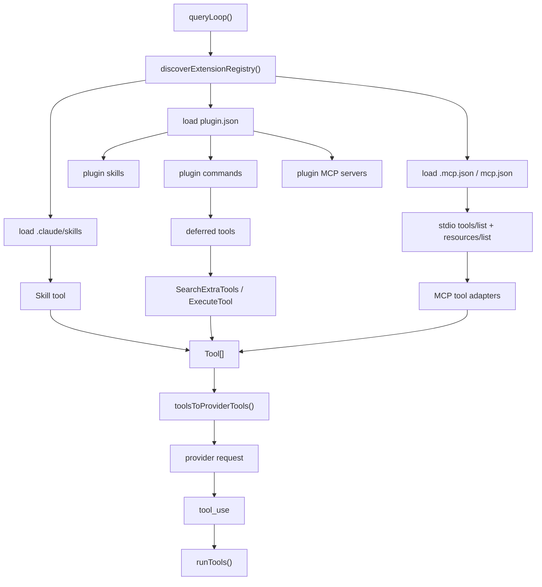
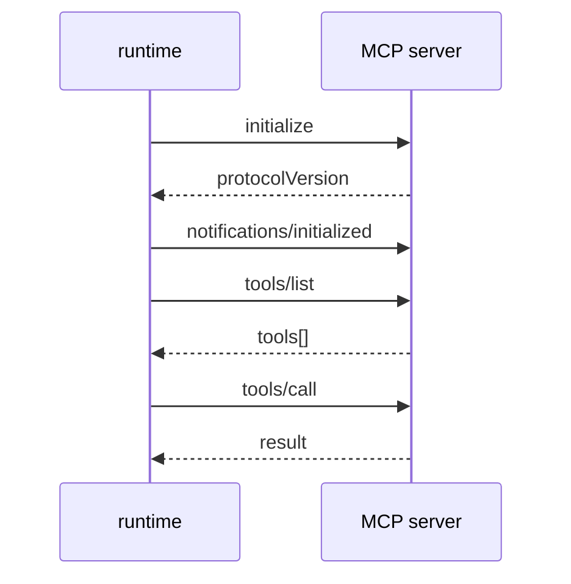

# 从 0 到 1 实现 Claude Code：V0.6 MCP、Skills、Plugins 和 Deferred Tools

## 这章先讲清楚扩展系统是什么

V0.3 以后，agent 已经能调用内置工具，例如 `Read`、`Grep`、`Write`、`Bash`。但真实 Claude Code 不能只靠内置工具。它还需要接入外部能力：

```text
MCP server 提供工具和资源
本地 skill 提供任务说明
plugin 提供 command、skill、MCP server
deferred tools 让长尾工具按需发现
```

V0.6 的目标是把 runtime 从“只会用内置工具”推进到“可以加载本地扩展能力”。

这一章仍然按教程写，不假设你已经懂 MCP、plugin、skill。每个概念会先解释它是什么，再解释为什么需要它，最后落到代码实现。

## 先理解 8 个基础概念

### 1. Builtin tool

Builtin tool 是项目代码里直接写死的工具，例如：

```text
Read
Grep
Write
Bash
TodoWrite
```

它们启动时就注册给模型。

### 2. External tool

External tool 是不在核心代码里的工具。它可能来自：

- MCP server。
- plugin。
- 将来 marketplace。

V0.6 要做的事，就是把外部工具包装成和 builtin tool 一样的 `Tool` 接口。

### 3. MCP

MCP 是 Model Context Protocol。你可以先把它理解成一种“工具服务器协议”：

```text
agent runtime 通过 JSON-RPC 问 MCP server：
  你有哪些工具？tools/list
  调用某个工具。tools/call
  你有哪些资源？resources/list
  读取某个资源。resources/read
```

V0.6 只实现 stdio transport。也就是 MCP server 是一个本地子进程，runtime 通过 stdin/stdout 和它通信。

### 4. Skill

Skill 是一份给模型看的任务说明，通常是 Markdown。

例如 `.claude/skills/reviewer.md`：

```md
---
name: reviewer
description: Review code changes
---

When reviewing code, focus on bugs, regressions, and missing tests.
```

Skill 本身不直接修改文件。它把“怎么做某类任务”的说明注入给模型。

### 5. Plugin

Plugin 是更大的扩展包。一个 plugin 可以提供：

- commands
- skills
- MCP servers

V0.6 的最小 manifest 是 `plugin.json`：

```json
{
  "name": "demo",
  "commands": [
    {
      "name": "hello",
      "content": "hello from plugin"
    }
  ],
  "skills": [
    {
      "name": "reviewer",
      "content": "Review code and tests."
    }
  ],
  "mcpServers": {
    "tools": {
      "type": "stdio",
      "command": "node",
      "args": ["server.mjs"]
    }
  }
}
```

### 6. Deferred tool

如果所有工具一启动就全部发给模型，工具列表会很大，占用 prompt。

Deferred tool 的意思是：

```text
一部分工具先不暴露给模型。
模型需要时先调用 SearchExtraTools 搜索。
找到后再调用 ExecuteTool 执行。
```

V0.6 先把 plugin command 做成 deferred tool。

### 7. Extension registry

Extension registry 是 V0.6 的核心。它负责统一发现扩展能力：

```text
load skills
load plugins
load plugin MCP servers
load .mcp.json servers
discover MCP tools/resources
build Tool[]
build deferred Tool[]
```

不要让 query loop、slash command、TUI 各自写一套发现逻辑。

### 8. Tool adapter

Tool adapter 是把外部能力包装成本地 `Tool`。

例如 MCP tool 原始信息是：

```json
{
  "name": "echo",
  "description": "Echo text",
  "inputSchema": {
    "type": "object",
    "properties": {
      "text": { "type": "string" }
    }
  }
}
```

V0.6 包装成：

```text
name: mcp__demo__echo
description: Echo text
execute(): 调用 MCP tools/call
checkPermissions(): 走统一权限系统
```

这样 query loop 不需要知道这个工具来自 MCP。它只看到一个普通 `Tool`。

## V0.6 的整体数据流



这张图最重要的点是：

> MCP、skills、plugins 最后都要变成本地 `Tool` 或 deferred `Tool`。query loop 只关心 `Tool[]`，不关心来源。

## Step 1：先定义 extension registry 返回值

先不要急着写 MCP client。第一步是定义扩展发现的统一结果。

```ts
export type ExtensionRegistry = {
  tools: Tool[]
  deferredTools: Tool[]
  skills: SkillDescriptor[]
  plugins: PluginDescriptor[]
  mcpServers: Array<[string, McpServerConfig]>
  mcpTools: McpToolDescriptor[]
  mcpResources: McpResourceDescriptor[]
}
```

字段含义：

| 字段 | 含义 |
| --- | --- |
| `tools` | 启动时直接暴露给模型的工具 |
| `deferredTools` | 先不暴露，通过 `SearchExtraTools` 和 `ExecuteTool` 使用 |
| `skills` | 本地和 plugin skill 列表 |
| `plugins` | 本地 plugin manifest 解析结果 |
| `mcpServers` | MCP server 配置 |
| `mcpTools` | MCP `tools/list` 发现到的工具描述 |
| `mcpResources` | MCP `resources/list` 发现到的资源 |

为什么要返回诊断字段？

因为 `/mcp`、`/skills`、`/plugin` 这些命令需要展示发现结果。如果只返回 `Tool[]`，用户无法知道工具从哪里来。

## Step 2：加载 skills

V0.6 支持两个目录：

```text
.claude/skills
.my-claude-code/skills
```

每个 skill 是一个 Markdown 文件，可以带 frontmatter：

```md
---
name: reviewer
description: Review code changes
---

Check behavior regressions and missing tests.
```

解析逻辑：

```text
如果文件以 --- 开头：
  读取 frontmatter key: value
  剩余内容作为 skill body
否则：
  文件名作为 skill name
  整个文件作为 skill body
```

实现时要注意：

- skill 缺失不能报错。
- frontmatter 先支持简单 `key: value`，不要一开始引入 YAML 依赖。
- skill name 要可作为模型工具输入，不要带奇怪字符。

## Step 3：实现 Skill tool

Skill tool 是一个普通工具：

```ts
{
  name: 'Skill',
  input: { name: string }
}
```

模型调用：

```json
{
  "name": "Skill",
  "input": {
    "name": "reviewer"
  }
}
```

runtime 返回：

```text
# Skill: reviewer
Description: Review code changes

Check behavior regressions and missing tests.
```

为什么用一个 `Skill` tool，而不是每个 skill 生成一个工具？

- skill 数量可能很多。
- 一个 `Skill` tool 的 schema 稳定。
- `/skills` 可以负责发现，模型需要时再按 name 加载。

## Step 4：加载 plugin manifest

V0.6 支持这些 plugin 目录：

```text
.claude/plugins/<plugin>/plugin.json
.my-claude-code/plugins/<plugin>/plugin.json
--plugin-dir <dir>
```

manifest 先支持三个字段：

```json
{
  "name": "demo",
  "commands": [],
  "skills": [],
  "mcpServers": {}
}
```

实现原则：

- manifest 无效时跳过，不阻断 query。
- plugin name、command name 要 normalize。
- plugin skills 合并进 skill 列表。
- plugin MCP servers 合并进 MCP server 列表。
- plugin commands 先放到 deferred tools。

## Step 5：plugin command 为什么做成 deferred tool

Plugin command 可能很多。如果每个 command 都直接暴露给模型，provider tools 会膨胀。

V0.6 做法：

```text
plugin command
  -> plugin__<plugin>__<command> deferred Tool
  -> SearchExtraTools 可以搜索到
  -> ExecuteTool 可以执行
```

举例：

```json
{
  "name": "demo",
  "commands": [
    { "name": "hello", "content": "hello from plugin" }
  ]
}
```

生成 deferred tool：

```text
plugin__demo__hello
```

模型先调用：

```json
SearchExtraTools({"query":"hello"})
```

再调用：

```json
ExecuteTool({"name":"plugin__demo__hello","input":{}})
```

## Step 6：加载 MCP server config

V0.6 支持这些来源：

```text
.mcp.json
.my-claude-code/mcp.json
.my-claude-code/mcp.local.json
~/.my-claude-code/mcp.json
plugin manifest 的 mcpServers
```

项目 `.mcp.json` 格式：

```json
{
  "mcpServers": {
    "demo": {
      "type": "stdio",
      "command": "node",
      "args": ["server.mjs"]
    }
  }
}
```

当前只实现 stdio：

```text
runtime spawn(command, args)
runtime 写 JSON-RPC 到 stdin
server 写 JSON-RPC 到 stdout
```

SSE、HTTP、OAuth、MCPB 不在 V0.6 范围。

## Step 7：实现 stdio MCP JSON-RPC

最小交互：



每条消息是一行 JSON：

```json
{"jsonrpc":"2.0","id":1,"method":"initialize","params":{...}}
```

实现要点：

- stdout 要按 `\n` 拆行。
- 每个 request 用递增 id。
- 超时要 kill 子进程。
- initialize 失败要报错。
- 子进程退出要结束 promise。

## Step 8：把 MCP tool 适配成本地 Tool

MCP `tools/list` 返回：

```json
{
  "tools": [
    {
      "name": "echo",
      "description": "Echo text",
      "inputSchema": {
        "type": "object",
        "properties": {
          "text": { "type": "string" }
        }
      },
      "annotations": {
        "readOnlyHint": true
      }
    }
  ]
}
```

V0.6 适配成：

```text
name: mcp__demo__echo
inputJSONSchema: 来自 MCP inputSchema
execute: 调用 tools/call
isReadOnly: 来自 readOnlyHint
checkPermissions: 只读直接 allow，非只读 ask
```

为什么工具名要加前缀？

如果两个 server 都有 `search` 工具，直接叫 `search` 会冲突。规范化为：

```text
mcp__<server>__<tool>
```

权限规则也可以按这个名字匹配：

```text
mcp__demo__echo
mcp__demo
mcp__demo__*
```

## Step 9：实现 MCP resources

MCP 不只提供工具，也提供资源。

资源可以理解为“server 暴露出来的可读取内容”，例如：

```text
demo://readme
github://repo/issues
```

V0.6 提供两个工具：

```text
ListMcpResources
ReadMcpResource
```

`ListMcpResources` 使用 registry 启动时发现到的资源列表。

`ReadMcpResource` 调 MCP `resources/read`：

```json
{
  "serverName": "demo",
  "uri": "demo://readme"
}
```

## Step 10：实现 SearchExtraTools 和 ExecuteTool

这两个工具解决“工具太多”的问题。

`SearchExtraTools`：

```json
{
  "query": "hello"
}
```

返回 deferred tools：

```json
[
  {
    "name": "plugin__demo__hello",
    "description": "Say hello"
  }
]
```

`ExecuteTool`：

```json
{
  "name": "plugin__demo__hello",
  "input": {}
}
```

执行时仍然要走被执行工具自己的权限检查。不要因为它是 deferred，就绕过权限系统。

## Step 11：接入 queryLoop

query loop 原来只加载 builtin tools：

```ts
const toolRegistry = getBuiltinTools()
```

V0.6 改成：

```text
getBuiltinTools()
  + extensionRegistry.tools
```

同时把 deferred tools 放进 tool execution context：

```ts
context: {
  cwd,
  permissionMode,
  allowedTools,
  disallowedTools,
  deferredTools,
}
```

这样模型看到：

```text
Read
Grep
Skill
ListMcpResources
ReadMcpResource
SearchExtraTools
ExecuteTool
mcp__demo__echo
```

而 plugin command 这类 deferred tool 不直接出现在初始 provider tools 里。

## Step 12：实现 slash 诊断面

V0.6 新增三个命令：

```text
/mcp
/skills
/plugin
```

它们不调用模型，只展示 extension registry。

`/mcp` 输出：

```json
{
  "servers": [],
  "tools": [],
  "resources": []
}
```

`/skills` 输出：

```json
{
  "skills": [
    {
      "name": "reviewer",
      "source": "project"
    }
  ]
}
```

`/plugin` 输出 plugin 列表，`/plugin run <plugin> <command>` 执行 plugin command，适合本地 smoke test。

## Step 13：从 0 实现的推荐顺序

按这个顺序实现最稳：

```text
1. 定义 SkillDescriptor、PluginDescriptor、McpServerConfig、ExtensionRegistry。
2. 实现 markdown/frontmatter skill loader。
3. 实现 Skill tool。
4. 实现 plugin.json loader。
5. 把 plugin skills 合并到 skills。
6. 把 plugin commands 做成 deferred tools。
7. 实现 SearchExtraTools。
8. 实现 ExecuteTool。
9. 实现 .mcp.json loader。
10. 实现 stdio MCP initialize/tools-list/resources-list/tools-call/resources-read。
11. 把 MCP tool 适配成本地 Tool。
12. queryLoop 合并 builtin tools 和 extension tools。
13. tool execution context 注入 deferredTools。
14. 实现 /mcp、/skills、/plugin。
15. 补 MCP fixture、skill fixture、plugin fixture、deferred tools 测试。
```

不要一开始做 marketplace、OAuth、HTTP transport。那些会把 MVP 复杂度拉爆。

## Step 14：测试应该覆盖什么

### extension registry 测试

文件：`packages/tools/src/extensions.test.ts`

覆盖：

- 本地 markdown skill 能加载。
- `Skill` tool 能返回 skill instructions。
- plugin manifest 能加载 commands 和 skills。
- `SearchExtraTools` 能发现 deferred plugin command。
- `ExecuteTool` 能执行 deferred plugin command。
- stdio MCP fixture 能完成 initialize、tools/list、resources/list、tools/call。
- MCP tool adapter 能走 `runToolUse()` 并返回 `tool_result` 内容。

### query loop 测试

文件：`packages/agent-runtime/src/query.test.ts`

覆盖：

- query loop 自动发现 MCP tool。
- provider tools 里能看到 `mcp__server__tool`。
- 模型请求 MCP tool 时，runtime 能执行并把结果作为 `tool_result` 回传。

### slash command 测试

文件：`packages/commands/src/slashCommands.test.ts`

覆盖：

- `/skills` 输出 skill 列表。
- `/mcp` 输出 MCP server/resource/tool 诊断。
- `/plugin` 输出 plugin manifest。
- `/plugin run <plugin> <command>` 可执行 plugin command。

## Step 15：本地验证命令

完整验证：

```sh
bun run test
bun run typecheck
bun run lint
bun run build
```

只跑 V0.6 相关测试：

```sh
bun test ./packages/tools/src/extensions.test.ts \
  ./packages/agent-runtime/src/query.test.ts \
  ./packages/commands/src/slashCommands.test.ts
```

验证 skill：

```sh
mkdir -p .claude/skills
cat > .claude/skills/reviewer.md <<'EOF'
---
name: reviewer
description: Review code changes
---

Focus on bugs, regressions, and missing tests.
EOF

bun run cli -- /skills
```

验证 plugin command：

```sh
mkdir -p .my-claude-code/plugins/demo
cat > .my-claude-code/plugins/demo/plugin.json <<'EOF'
{
  "name": "demo",
  "commands": [
    {
      "name": "hello",
      "content": "hello from plugin"
    }
  ]
}
EOF

bun run cli -- /plugin
bun run cli -- /plugin run demo hello
```

验证 MCP 状态：

```sh
bun run cli -- /mcp
```

如果要验证真实 stdio MCP tool，建议先看 `packages/tools/src/extensions.test.ts` 里的 fixture server。它是最小可工作的 MCP server 模板。

## 常见误区

### 误区 1：让 query loop 直接理解 MCP

不要让 query loop 写 `tools/list`、`tools/call`。query loop 应该只处理本地 `Tool[]`。MCP 细节属于 adapter。

### 误区 2：plugin command 全部直接暴露给模型

plugin command 数量可能很多。V0.6 先把它们放到 deferred tools，通过 `SearchExtraTools` 和 `ExecuteTool` 使用。

### 误区 3：Skill 直接当 system prompt 永久注入

Skill 应该按需加载。否则所有 skill 都会占用 context，也会让模型混淆当前任务到底需要哪个 skill。

### 误区 4：MCP 非只读工具默认直接允许

外部工具可能有副作用。只读 MCP tool 可以直接 allow，非只读应该走 ask/permission rules。

### 误区 5：把 marketplace 和 OAuth 混进 V0.6

V0.6 的目标是本地扩展闭环。marketplace、OAuth、MCPB、HTTP/SSE transport 是后续版本。

## 你是否已经掌握这章

如果你能回答这些问题，就说明可以独立实现 V0.6：

- MCP server 和 provider 是同一个东西吗？
- 为什么 MCP tool 要适配成本地 `Tool`？
- 为什么 MCP tool 名称要叫 `mcp__server__tool`？
- Skill 和 plugin 的关系是什么？
- 为什么 plugin command 适合先做成 deferred tool？
- `SearchExtraTools` 和 `ExecuteTool` 各自负责什么？
- extension registry 为什么要返回诊断字段，而不只是 `Tool[]`？
- query loop 为什么不应该直接调用 MCP JSON-RPC？
- `/mcp`、`/skills`、`/plugin` 分别解决什么调试问题？

## V0.6 完成范围

本章实现的是 V0.6 本地可验证 MVP：

- stdio MCP config discovery。
- MCP `tools/list`、`tools/call`、`resources/list`、`resources/read`。
- MCP tool 到本地 `Tool` adapter。
- MCP tool 权限接入统一规则。
- `.claude/skills` 和 `.my-claude-code/skills` markdown/frontmatter loader。
- `Skill` tool。
- local plugin manifest。
- plugin commands、plugin skills、plugin MCP servers。
- `SearchExtraTools` 和 `ExecuteTool`。
- query loop 默认加载 extension registry。
- `/mcp`、`/skills`、`/plugin` 命令面。

## V0.6 不做什么

- MCP OAuth。
- MCPB package。
- SSE/HTTP/WebSocket MCP transport。
- marketplace。
- plugin install/update/enable/disable lifecycle。
- bundled skills。
- MCP-provided `skill://` resources。
- 完整 skill search ranking/cache。

V0.6 的重点是搭出扩展系统的基础闭环：

```text
发现扩展
  -> 转成本地 Tool
  -> 交给 provider
  -> runTools 执行
  -> tool_result 回传
  -> slash command 可诊断
```
