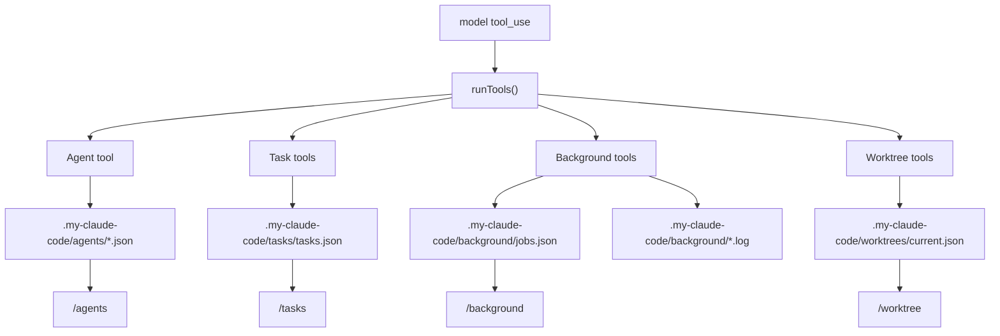

# 从 0 到 1 实现 Claude Code：V0.7 Subagent、Task、Background 和 Worktree

## 这一章解决什么问题

V0.6 以后，agent 能加载外部工具、skills 和 plugins。但真实工程任务还有另一类问题：任务会变长、会分支、会后台运行，也可能需要在不同 worktree 里隔离工作。

V0.7 的目标是建立高级工作流底座：

```text
主 agent 可以委派子任务
长任务可以持久化成 Task
后台进程可以启动、看日志、停止
当前 session 可以记录 active worktree
```

这一章仍然是教程，不是实现清单。我们先讲概念，再讲设计边界，最后讲怎么实现和测试。

## 先理解 8 个基础概念

### 1. 主 agent

主 agent 是用户当前正在对话的 agent。它拥有当前 session 的 prompt、权限、工具列表和 transcript。

### 2. Subagent

Subagent 是被主 agent 委派的小任务执行者。

你可以先把它理解成：

```text
主 agent：请你 review 这几个文件
subagent：我只拿到 review prompt 和允许的工具，完成后返回摘要
```

V0.7 MVP 先创建隔离的 subagent record 和 summary，不实现完整 swarm/coordinator。

### 3. Context isolation

Context isolation 的意思是：subagent 不应该直接拿到主 agent 的所有上下文。

它应该只拿到：

- 子任务描述。
- 子任务 prompt。
- 被允许的工具。
- 父 session 允许它继承的权限边界。

这样可以避免子任务污染主 session，也避免越权。

### 4. Tool filtering

Tool filtering 是控制 subagent 能用哪些工具。

如果主 session 只允许 `Read`，subagent 不能要求 `Write`：

```text
parent allowedTools: Read
subagent requested: Write
结果：拒绝
```

### 5. Task

Task 是持久化的工作项。它不是模型消息，而是 runtime 的任务状态：

```json
{
  "id": "task_xxx",
  "title": "实现 V0.7",
  "status": "in_progress",
  "output": []
}
```

Task 要跨 turn 保存，所以写到 `.my-claude-code/tasks/tasks.json`。

### 6. Background job

Background job 是脱离当前 prompt 的本地进程。比如启动一个 dev server 或长时间脚本。

V0.7 MVP 用本地 detached process：

```text
spawn(command, args, detached=true)
stdout/stderr 写入 log file
job metadata 写入 jobs.json
```

### 7. Worktree state

Worktree state 是当前 session 记录的工作目录/分支上下文。

V0.7 不创建真实 git worktree，只记录：

```json
{
  "active": {
    "path": "/repo-feature",
    "branch": "feature/v07"
  }
}
```

真实 worktree 创建、切换和 remote 结合可以在后续版本增强。

### 8. Workflow tools

Workflow tools 是 V0.7 新增的一组工具：

```text
Agent
TaskCreate / TaskUpdate / TaskList / TaskGet / TaskOutput / TaskStop
BackgroundStart / BackgroundList / BackgroundOutput / BackgroundStop
EnterWorktree / ExitWorktree / WorktreeStatus
```

它们和 `Read`、`Write` 一样，都走统一 `Tool` 接口和 `runTools()`。

## V0.7 数据流



关键点：

> V0.7 不是新增另一套 runtime。Subagent、Task、Background、Worktree 都是普通 Tool，只是它们维护的是 workflow state。

## Step 1：定义持久化数据结构

先定义 Task：

```ts
export type TaskRecord = {
  id: string
  title: string
  prompt?: string
  status: 'pending' | 'in_progress' | 'completed' | 'failed' | 'stopped'
  summary?: string
  output: string[]
  createdAt: string
  updatedAt: string
}
```

再定义 Background job：

```ts
export type BackgroundJobRecord = {
  id: string
  name: string
  command: string
  args: string[]
  pid?: number
  status: 'running' | 'stopped' | 'unknown'
  logPath: string
  createdAt: string
  updatedAt: string
}
```

再定义 Agent record：

```ts
export type AgentRecord = {
  id: string
  description: string
  prompt: string
  allowedTools?: string[]
  disallowedTools?: string[]
  transcriptPath: string
  summary: string
  createdAt: string
}
```

最后定义 Worktree state：

```ts
export type WorktreeState = {
  active?: {
    path: string
    branch?: string
    enteredAt: string
  }
  history: Array<...>
}
```

为什么都写 JSON？

- 本地可验证。
- 容易被 `/tasks`、`/background`、`/agents`、`/worktree` 读取。
- 后续要迁移到更复杂 store 时，接口可以保持不变。

## Step 2：实现 Task tools

Task tools 只操作 `.my-claude-code/tasks/tasks.json`。

最小操作：

```text
TaskCreate  创建任务
TaskUpdate  更新 title/status/summary
TaskList    列任务
TaskGet     查单个任务
TaskOutput  追加输出
TaskStop    标记 stopped
```

TaskCreate 输入：

```json
{
  "title": "实现 V0.7",
  "prompt": "实现 workflow tools"
}
```

返回：

```json
{
  "id": "task_xxx",
  "title": "实现 V0.7",
  "status": "pending"
}
```

为什么不用 TodoWrite？

`TodoWrite` 是 agent 当前 turn 的 todo list。Task 是跨 turn、可查询、可停止的工作项。两者职责不同。

## Step 3：实现 Agent tool

Agent tool 输入：

```json
{
  "description": "review docs",
  "prompt": "review V0.7 docs",
  "allowedTools": ["Read"]
}
```

V0.7 MVP 做三件事：

```text
1. 校验 subagent allowedTools 不能超过 parent allowedTools。
2. 写入 .my-claude-code/agents/<id>.json。
3. 返回 result summary。
```

越权校验例子：

```text
parent allowedTools: ["Read"]
subagent allowedTools: ["Write"]
结果：subagent tool Write exceeds parent allowedTools
```

为什么 V0.7 不直接启动一个完整模型子循环？

完整 subagent loop 需要独立 provider、tool filter、transcript、streaming progress、取消和错误恢复。V0.7 先建立隔离记录、权限边界和结果摘要，后续版本再增强执行深度。

## Step 4：实现 Background tools

BackgroundStart 用 `spawn()` 启动 detached process：

```ts
const child = spawn(command, args, {
  cwd,
  detached: true,
  stdio: ['ignore', logFd, logFd],
})
child.unref()
```

同时写入：

```text
.my-claude-code/background/jobs.json
.my-claude-code/background/<jobId>.log
```

Background tools：

```text
BackgroundStart   启动进程
BackgroundList    列 job metadata
BackgroundOutput  读 log
BackgroundStop    kill pid 并标记 stopped
```

安全边界：

- `BackgroundStart` 默认需要 permission。
- 测试或明确绕过场景可以用 `permissionMode=bypassPermissions`。
- slash `/background start` 是用户显式命令，直接启动本地命令。

## Step 5：实现 Worktree tools

V0.7 Worktree 是 session metadata，不是真实 git worktree 管理器。

EnterWorktree：

```json
{
  "path": "../feature-worktree",
  "branch": "feature/v07"
}
```

写入：

```text
.my-claude-code/worktrees/current.json
```

ExitWorktree 清空 active，并在 history 里记录 `exitedAt`。

这样 TUI/CLI 可以知道当前 session 正在围绕哪个 worktree 工作。

## Step 6：接入 builtin tools

V0.7 workflow tools 应该和其它 builtin tools 一起注册：

```ts
export function getBuiltinTools(): Tool[] {
  return [
    readTool,
    grepTool,
    ...
    ...getWorkflowTools(),
  ]
}
```

这样 query loop 不需要特殊处理。模型请求 `TaskCreate` 或 `Agent` 时，仍然走：

```text
tool_use -> runTools() -> tool_result -> provider next turn
```

## Step 7：实现 slash 命令面

V0.7 新增：

```text
/agents
/tasks
/background
/worktree
```

最小行为：

```text
/agents                         列 subagent records
/tasks                          列 task records
/tasks create <title>            创建 task
/tasks stop <id>                 停止 task
/background                      列 background jobs
/background start <name> <cmd>   启动 background job
/background output <id>          读 log
/background stop <id>            停止 job
/worktree                        看 worktree state
/worktree enter <path> [branch]  记录 active worktree
/worktree exit                   清空 active worktree
```

这些命令不调用模型，只读写本地 workflow state，适合 smoke test。

## Step 8：测试应该覆盖什么

### workflow tools 测试

文件：`packages/tools/src/workflows.test.ts`

覆盖：

- task create/output/stop/list 持久化。
- Agent record 写入独立文件。
- subagent tool escalation 会被拒绝。
- background start/log/stop。
- worktree enter/status。
- workflow tools 能被 `runToolUse()` 执行。

### slash commands 测试

文件：`packages/commands/src/slashCommands.test.ts`

覆盖：

- `/tasks create` 和 `/tasks stop`。
- `/background` 列表。
- `/worktree enter`。
- `/agents` 列表。

## Step 9：本地验证

完整验证：

```sh
bun run test
bun run typecheck
bun run lint
bun run build
```

只跑 V0.7：

```sh
bun test ./packages/tools/src/workflows.test.ts \
  ./packages/commands/src/slashCommands.test.ts \
  ./packages/agent-runtime/src/query.test.ts
```

手工验证 task：

```sh
bun run cli -- /tasks
bun run cli -- /tasks create "write V0.7 docs"
```

手工验证 background：

```sh
bun run cli -- /background
bun run cli -- /background start demo node -e "console.log('hello')"
```

手工验证 worktree：

```sh
bun run cli -- /worktree
bun run cli -- /worktree enter ../feature-worktree feature/v07
```

## 常见误区

### 误区 1：subagent 可以越过主 session 权限

不可以。子 agent 权限必须是父 session 权限的子集。

### 误区 2：Task 等同 Todo

Todo 是当前任务内的步骤。Task 是跨 turn 的持久工作项。

### 误区 3：Background job 不需要日志

没有日志就无法 attach/inspect。V0.7 至少要把 stdout/stderr 写入 log file。

### 误区 4：Worktree tool 必须一开始就操作 git

不需要。V0.7 先记录 session metadata，真实 git worktree 创建/remote 结合可以后续增强。

## V0.7 完成范围

- `Agent` tool。
- subagent record、独立 transcript 文件、result summary。
- subagent allowedTools 不超过 parent allowedTools。
- `TaskCreate`、`TaskUpdate`、`TaskList`、`TaskGet`、`TaskOutput`、`TaskStop`。
- `BackgroundStart`、`BackgroundList`、`BackgroundOutput`、`BackgroundStop`。
- `EnterWorktree`、`ExitWorktree`、`WorktreeStatus`。
- `/agents`、`/tasks`、`/background`、`/worktree`。

## V0.7 不做什么

- 完整 swarm/coordinator。
- proactive/Kairos。
- monitor/schedule。
- job templates。
- verification agent。
- brief flows。
- remote SSH 真实连接。

这些不是永久偏差：remote SSH 在 V0.8 收口；proactive/coordinator/monitor/templates 的默认态和开启态在 V0.9/V0.11/V1.0 继续关闭。
