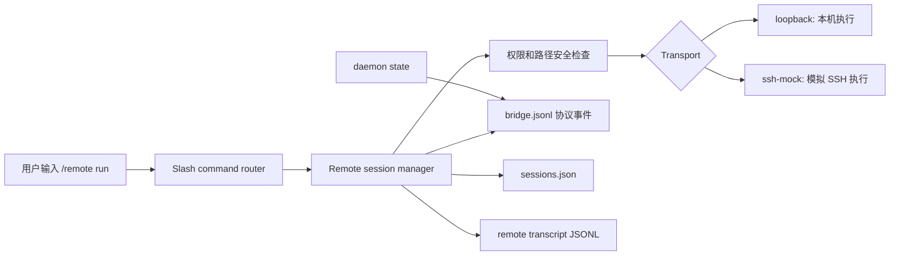
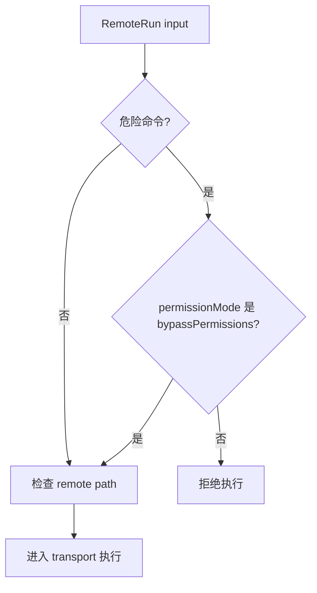

# V0.8 Remote、Bridge、Daemon 和 SSH 最小闭环教程

本文不是实现总结，而是一份从 0 到 1 实现 V0.8 remote 能力的教程。读完后，你应该能理解为什么 Claude Code 需要 daemon、bridge、remote session、SSH transport，以及如何在不依赖真实远端机器的情况下先实现可测试的最小闭环。

## 先理解问题

本地 AI agent 只能在当前机器、当前工作区里运行命令和读写文件。Claude Code 的完整体验还需要一种能力：用户可以连接到另一个执行环境，把任务交给那个环境跑，断开后还能恢复，并且本地 transcript 不泄漏远端连接凭据。

这里有几个容易混淆的词：

- **daemon**：常驻的后台控制入口。它负责代表当前工作区接收 remote-control 请求，维护一个可发现的状态。
- **bridge**：本地进程和 remote-control 之间的消息协议。V0.8 先用 JSONL 文件表达协议事件，后续可以替换成 socket、WebSocket、ACP 或真实 remote-control server。
- **remote session**：一次远端连接的状态记录。它包含 session id、连接方式、远端根目录、attach/detach 状态、transcript 路径等。
- **transport**：真正执行命令的通道。V0.8 支持 `loopback` 和 `ssh-mock`。`loopback` 在本机指定目录执行命令，用来测试真实命令执行语义；`ssh-mock` 不连真实 SSH，用来测试 SSH 形状和错误边界。
- **transcript**：可恢复、可诊断的事件日志。remote transcript 只记录可审计信息，不能记录 raw session token。

把它们串起来看：



## 为什么 V0.8 先做 MVP

真实 Claude Code 的 remote 能力牵涉很多外部系统：daemon 进程、远端部署、认证、URL handler、WebSocket/ACP、SSH proxy、商业 remote UI。直接一次性实现会有两个问题：

- 没有稳定测试环境，CI 很难验证真实 SSH、真实 remote server。
- 安全边界很容易被 UI 或 transport 细节淹没，导致 token、路径隔离、危险命令确认这些核心要求漏掉。

所以 V0.8 的策略是：先实现本地可测的协议层和状态层，再把 transport 替换成真实外部集成。

V0.8 关闭的是这些能力：

- daemon 可以 start/status/stop。
- bridge 有事件协议 fixture。
- remote session 可以 connect/run/detach/resume。
- SSH 形状存在，但使用 `ssh-mock`，不要求真实 SSH 主机。
- remote 命令有危险命令防线。
- remote path 不能逃出 session root。
- session token 不进入 transcript 或 bridge。

V0.8 不关闭这些能力：

- 真实 remote-control server。
- 真实 SSH 部署、认证代理、端口转发。
- ACP/WebSocket remote bridge。
- URL handler、`claude open <cc-url>` 的完整交互。
- 商业化 remote fleet 和 UI。

这些剩余项已经在 `docs/08-version-roadmap.md` 后续版本里登记：V0.10 做 platform/package smoke，V0.11 做 command/subcommand inventory closure，V1.0 做真实场景 hardening。

## 数据模型设计

V0.8 的核心实现位于 `packages/tools/src/remote.ts`。

### DaemonState

daemon 不是一开始就做成真实后台进程，而是先做成可持久化状态：

```ts
type DaemonState = {
  status: 'running' | 'stopped'
  pid?: number
  endpoint?: string
  bridgePath: string
  startedAt?: string
  stoppedAt?: string
  updatedAt: string
}
```

这样做的原因是：V0.8 要验证 lifecycle 和 bridge 语义，不需要先引入进程管理、端口监听、崩溃恢复。后续真实 daemon 只要继续写同一个状态和 bridge 事件，上层命令不需要改。

### BridgeEvent

bridge 是 remote-control 的协议层。V0.8 用 JSONL 表示，每一行是一条事件：

```ts
type BridgeEvent = {
  id: string
  type:
    | 'daemon.start'
    | 'daemon.stop'
    | 'remote.connect'
    | 'remote.run'
    | 'remote.detach'
    | 'remote.resume'
    | 'remote.trigger'
    | 'terminal.capture'
  sessionId?: string
  createdAt: string
  payload: Record<string, unknown>
}
```

为什么用 JSONL：

- 追加写简单，适合事件日志。
- 测试可以直接读文件断言事件顺序。
- 后续替换成 socket/WebSocket 时，事件结构可以复用。

### RemoteSession

remote session 是恢复 remote 操作的关键：

```ts
type RemoteSession = {
  id: string
  name: string
  transport: 'loopback' | 'ssh-mock'
  host?: string
  root: string
  status: 'connected' | 'detached' | 'closed'
  tokenHash: string
  transcriptPath: string
  createdAt: string
  updatedAt: string
  attachedAt?: string
  detachedAt?: string
  lastCommand?: {
    command: string
    args: string[]
    exitCode: number
    ranAt: string
  }
}
```

这里最重要的是三个字段：

- `root`：remote 命令只能在这个目录内运行。
- `status`：`detached` 后不能继续 run，必须 resume/attach。
- `tokenHash`：只保存 hash，不保存 raw token。transcript 和 bridge 里连 hash 也会 redacted，避免日志复制时泄漏关联信息。

## 文件布局

V0.8 的状态都写在当前工作区的 `.my-claude-code/remote/` 下：

```text
.my-claude-code/
  remote/
    daemon.json
    bridge.jsonl
    sessions.json
    transcripts/
      remote_<uuid>.jsonl
```

这些文件职责不同：

- `daemon.json`：当前 daemon 是否 running。
- `bridge.jsonl`：协议事件流。
- `sessions.json`：所有 remote session 的最新状态。
- `transcripts/*.jsonl`：某个 remote session 的审计和恢复日志。

## 安全边界

remote 功能最容易出问题的地方不是命令能不能跑，而是边界有没有守住。

### 1. 危险命令默认拦截

V0.8 默认拦截明显危险的 remote 命令：

- `rm -rf`
- `sudo`
- `curl ... | sh`
- `wget ... | bash`
- `chmod -R 777`
- `mkfs`
- `dd if=`
- fork bomb 形态
- `shutdown` / `reboot`

工具层的 `RemoteRun` 在 headless 默认模式下会返回 permission error。直接调用 `runRemoteCommand()` 时也会再次检查，避免绕过工具权限层。



### 2. remote path 不能逃出 root

用户可以指定 remote run 的 `path`，但这个 path 只能在 session root 里面。实现方式是把 root 和目标 path 都 `resolve()` 成绝对路径，然后检查目标路径是否等于 root 或以 `root + path separator` 开头。

这能拦住这样的输入：

```text
path: ..
path: ../../outside
```

### 3. session token 不进 transcript

`connectRemote()` 可以接收 token，但只保存 hash，并且写 bridge/transcript 时会 redacted：

```text
tokenRedacted: true
tokenHash: "<redacted>"
```

这样做是为了避免本地诊断日志、bug report、远端 transcript 在流转时携带凭据。

## Tool 层实现

V0.8 新增这些工具：

- `DaemonStart`
- `DaemonStatus`
- `DaemonStop`
- `RemoteConnect`
- `RemoteRun`
- `RemoteDetach`
- `RemoteResume`
- `RemoteTriggerTool`
- `ListPeersTool`
- `TerminalCaptureTool`

它们统一通过 `getRemoteTools()` 导出，并接入 `getBuiltinTools()`：

```ts
export function getBuiltinTools(): Tool[] {
  return [
    readTool,
    // ...
    ...getWorkflowTools(),
    ...getRemoteTools(),
  ]
}
```

Tool 层负责四件事：

- 定义 input schema 和 provider JSON schema。
- 声明是否 read-only、destructive、concurrency-safe。
- 做 permission check。
- 调用 remote core 函数并返回 JSON 字符串。

`RemoteRun` 是最关键的工具，因为它会执行命令：

- safe command 默认允许。
- dangerous command 默认 `ask`。
- headless 没有 prompt 时，`ask` 会变成 deny。
- `plan` mode 会因为不是 read-only 而拒绝。

## Slash command 层实现

命令层位于 `packages/commands/src/slashCommands.ts`。V0.8 新增：

- `/daemon start|status|stop`
- `/remote`
- `/remote connect [name] [root]`
- `/remote ssh <host> [root]`
- `/remote run <sessionId> <command> [args...]`
- `/remote detach <sessionId>`
- `/remote resume <sessionId>`
- `/remote trigger <sessionId> <name>`
- `/remote capture [sessionId] [lines]`
- `/attach <sessionId>`
- `/detach <sessionId>`
- `/peers`

命令层不直接操作文件，只调用 tools package 的函数。这一点很重要：否则同一套状态逻辑会在 tool runtime 和 slash runtime 里分叉。

## 本地怎么测

先跑自动化测试：

```sh
bun test packages/tools/src/remote.test.ts
bun test packages/commands/src/slashCommands.test.ts
bun run typecheck
```

再手动跑 daemon lifecycle：

```sh
bun run cli -- /daemon start
bun run cli -- /daemon status
bun run cli -- /daemon stop
```

测试 loopback remote：

```sh
bun run cli -- /remote connect local .
bun run cli -- /peers
```

把上一条输出里的 `id` 记为 `remoteSessionId`，然后执行：

```sh
bun run cli -- /remote run <remoteSessionId> node -e 'console.log("remote-ready")'
bun run cli -- /remote detach <remoteSessionId>
bun run cli -- /attach <remoteSessionId>
bun run cli -- /remote capture <remoteSessionId> 20
```

测试 SSH mock：

```sh
bun run cli -- /remote ssh fixture.example .
bun run cli -- /remote run <remoteSessionId> uname -a
```

测试危险命令拦截：

```sh
bun run cli -- /remote run <remoteSessionId> rm -rf .
```

预期输出包含：

```text
Remote error: dangerous remote command requires confirmation
```

测试路径隔离需要走工具或单元测试，因为 slash command 当前没有暴露 `path` 参数：

```sh
bun test packages/tools/src/remote.test.ts
```

## 如何判断 V0.8 是否完成

V0.8 的验收标准是最小闭环，不是真实 remote 平台：

- 可以启动 daemon、查看状态、停止 daemon。
- 可以创建 remote session。
- 可以通过 loopback 执行命令。
- 可以通过 ssh-mock 验证 SSH 形状。
- 可以 detach，再 attach/resume。
- 可以捕获 remote transcript。
- 危险 remote 命令默认被拦截。
- remote path 不能逃出 session root。
- raw session token 不出现在 transcript 或 bridge。
- remote 命令失败只返回 remote error，不破坏本地 session。

当前实现满足这些 V0.8 验收标准。真实 server/open/url handler、真实 SSH auth/deploy、ACP/WebSocket、商业 remote UI 不属于 V0.8 完成定义，已登记到后续版本。
