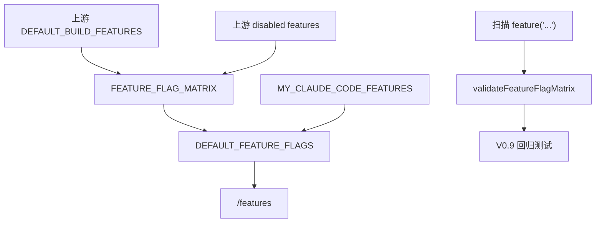

# V0.9 Feature Flag Closure 教程

本文是一份从 0 到 1 实现 feature flag closure 的教程。目标不是把所有隐藏功能都打开，而是让每一个隐藏分支都有登记、有默认态、有测试、有用户可见的解释。

## 先理解 feature flag

feature flag 是一个开关。源码里常见写法是：

```ts
if (feature('VOICE_MODE')) {
  // voice input UI
}
```

这段代码表达两个事实：

- `VOICE_MODE` 打开时，程序会走语音输入分支。
- `VOICE_MODE` 关闭时，程序必须有一个清楚、安全、可测试的默认行为。

如果一个项目里到处都有 `feature('...')`，但没人登记这些开关，就会出现几个问题：

- 你不知道某个能力是没实现、默认关闭、还是忘记接入。
- 用户看到 help 或命令时，可能不知道功能为什么不存在。
- telemetry/debug/tracing 类开关如果默认开，可能泄漏敏感上下文。
- 后续版本会反复“发现”旧缺口，路线图永远收不完。

V0.9 要解决的就是这些隐藏分支问题。

## V0.9 的完成定义

V0.9 不要求把所有 Claude Code gated 功能都做完。它要求做到：

- 上游 `DEFAULT_BUILD_FEATURES` 全部登记。
- 上游默认 disabled/non-default feature 全部登记。
- 当前 `claude-code` 源码树里所有 `feature('...')` 调用全部登记。
- 每个 feature 都有目标版本和状态：
  - `Covered`：当前实现已经覆盖。
  - `Disabled-Parity`：当前实现默认关闭，并且关闭态是有意设计。
  - `Planned`：明确后续版本处理。
- 运行时默认开启的 feature 必须已经 `Covered`。
- 默认开启的 feature 必须 `secretSafeDefault: true`。
- 用户能通过 `/features` 看到 feature gate 状态，不能静默缺失。

## 整体设计

V0.9 的核心实现放在 `packages/core/src/featureFlags.ts`。



### 为什么 matrix 放在 core

feature flag 会影响 CLI、TUI、tools、provider、session、build。它不属于某一个 UI 或命令模块，所以放在 core：

- 其他 package 可以复用同一份 registry。
- 测试可以直接验证默认态。
- `/features` 可以只读 core，不需要重新定义状态。

## 数据结构

每个 feature 记录为 `FeatureFlagRecord`：

```ts
type FeatureFlagRecord = {
  name: string
  group: 'default-build' | 'disabled' | 'conditional'
  targetVersion: string
  parityState: 'Covered' | 'Disabled-Parity' | 'Planned'
  runtimeDefault: boolean
  userVisible: boolean
  secretSafeDefault: boolean
  notes: string
}
```

字段含义：

- `name`：feature 名称，例如 `VOICE_MODE`。
- `group`：来源。`default-build` 来自上游默认 build features；`disabled` 来自上游注释关闭的功能；`conditional` 来自源码条件分支。
- `targetVersion`：计划在哪个版本关闭该能力。
- `parityState`：当前复刻状态。
- `runtimeDefault`：本项目运行时默认是否开启。
- `userVisible`：用户是否可能看到这个功能入口。
- `secretSafeDefault`：默认态是否不会泄漏 token、prompt、路径、环境变量等敏感信息。
- `notes`：人读得懂的解释。

## 默认开启策略

最关键的规则是：

```text
runtimeDefault = true 只能用于 Covered + secretSafeDefault = true
```

原因是：默认开启意味着用户不需要额外配置就会走这个分支。如果这个分支还没实现完整，或者会写文件、发网络请求、输出调试信息，就不能默认打开。

V0.9 用测试强制这条规则：

```ts
const enabledByDefault = FEATURE_FLAG_MATRIX.filter(record => record.runtimeDefault)

expect(enabledByDefault.every(record => record.parityState === 'Covered')).toBe(true)
expect(enabledByDefault.every(record => record.secretSafeDefault)).toBe(true)
```

## 环境变量打开策略

运行时支持：

```sh
MY_CLAUDE_CODE_FEATURES=BUDDY,VOICE_MODE bun run cli -- /features
```

环境变量只影响本次运行的 enablement，不改变 matrix 的 parity state。也就是说，`BUDDY` 可以显示为 `enabledBy: "env"`，但仍然是 `Disabled-Parity`。这样可以测试开关形状，同时不假装功能已经完整实现。

## 源码扫描

V0.9 提供 `scanFeatureCallsFromText()`：

```ts
scanFeatureCallsFromText("feature('BUDDY')")
// ["BUDDY"]
```

测试会递归扫描当前仓库的 `claude-code` 目录，读取 `.ts/.tsx/.js/.jsx/.mjs/.cjs` 文件，抽取所有 `feature('...')`，然后调用：

```ts
validateFeatureFlagMatrix([...discovered])
```

如果上游新增了：

```ts
feature('NEW_REMOTE_MODE')
```

但我们没有登记，测试会失败，`missing` 里会出现 `NEW_REMOTE_MODE`。

## `/features` 命令

V0.9 增加 `/features`，输出 JSON：

```json
{
  "features": [
    {
      "name": "BUDDY",
      "group": "default-build",
      "targetVersion": "V0.9",
      "parityState": "Disabled-Parity",
      "enabled": false,
      "enabledBy": "off",
      "userVisible": true,
      "secretSafeDefault": true,
      "notes": "Buddy UI is user-visible and remains disabled until V0.11 command audit."
    }
  ],
  "summary": {
    "total": 92,
    "enabled": 21,
    "covered": 34,
    "disabledParity": 40,
    "planned": 18
  }
}
```

用户看到这个输出后能判断：

- 功能有没有登记。
- 当前是否启用。
- 是默认启用、环境变量启用，还是关闭。
- 为什么关闭。
- 后续哪个版本处理。

## 新增 feature 的流程

以后新增任何 `feature('XXX')`，必须按这个顺序：

1. 在 `FEATURE_FLAG_MATRIX` 中登记 `XXX`。
2. 决定 `targetVersion`。
3. 决定 `parityState`。
4. 如果 `runtimeDefault: true`，必须已有测试证明它 `Covered` 且 secret-safe。
5. 如果是用户可见能力，确保 `/features` 能解释它。
6. 补对应测试。

不要先在业务代码里写 `feature('XXX')`。真实源码扫描测试会拦住这种做法。

## 本地怎么测

只测 V0.9：

```sh
bun test packages/core/src/protocol.test.ts
bun test packages/commands/src/slashCommands.test.ts
bun run cli -- /features
```

全量校验：

```sh
bun run test
bun run lint
bun run typecheck
bun run build
```

环境变量 opt-in 测试：

```sh
MY_CLAUDE_CODE_FEATURES=BUDDY,VOICE_MODE bun run cli -- /features
```

预期：

- `BUDDY` 和 `VOICE_MODE` 的 `enabled` 为 `true`。
- `enabledBy` 为 `env`。
- 它们的 `parityState` 不会被环境变量改写。

## 如何判断 V0.9 是否完成

V0.9 完成需要满足：

- `validateFeatureFlagMatrix()` 没有 missing feature。
- 当前 `claude-code` 源码树扫描没有未登记 `feature('...')`。
- 上游 default build features 全部登记。
- disabled/non-default features 全部登记。
- 默认开启 feature 全部是 `Covered`。
- 默认开启 feature 全部 `secretSafeDefault: true`。
- `/features` 可查看状态。
- docs coverage ledger 已说明 V0.9 当前状态和后续版本归属。

当前实现满足这些 V0.9 验收标准。未启用的 gated 产品能力不是漏项，而是 `Disabled-Parity` 或 `Planned` 状态，继续在 V0.10、V0.11、V1.0 收口。
