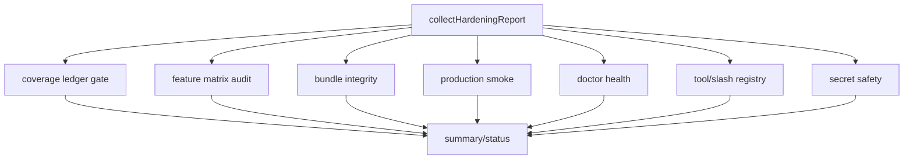

# V1.0 Parity Hardening 教程

本文是一份从 0 到 1 实现 V1.0 发布门禁的教程。它不是“V1.0 已经全量完成”的宣言，而是说明如何把是否可发布、是否达到 1:1 parity 的判断变成机器可执行的检查。

## 先理解 V1.0 hardening

前面的版本更关注“把能力做出来”：

- V0.3 做工具和权限。
- V0.4 做 CLI/TUI/session。
- V0.5 做 context/compact/memory。
- V0.6 做 MCP/skills/plugins。
- V0.7 做 subagent/task/background/worktree。
- V0.8 做 remote/bridge/daemon/SSH MVP。
- V0.9 做 feature flag closure。

V1.0 的重点不同。它要回答：

```text
这个项目现在能不能作为可替代 Claude Code 的版本发布？
```

这个问题不能靠人工读文档回答，因为文档可能漏、测试可能没跑、构建产物可能不存在、doctor 可能有 error、secret 可能被输出。V1.0 hardening 的目标就是把这些风险变成一份报告。

## V1.0 当前策略

当前实现新增了两个命令：

```sh
bun run cli -- /health
bun run cli -- /parity
```

它们输出同一份 JSON report。区别只在语义：

- `/health`：偏发布健康检查。
- `/parity`：偏 1:1 parity 门禁检查。

报告由 `packages/commands/src/hardening.ts` 生成。

## 报告长什么样

核心结构：

```ts
type HardeningReport = {
  status: 'pass' | 'warning' | 'fail'
  version: string
  cwd: string
  generatedAt: string
  summary: {
    pass: number
    warning: number
    fail: number
  }
  checks: HardeningCheck[]
}
```

每个 check：

```ts
type HardeningCheck = {
  label: string
  status: 'pass' | 'warning' | 'fail'
  detail: string
}
```

整体状态计算规则：

- 任意 check 为 `fail`，整体就是 `fail`。
- 没有 `fail` 但有 `warning`，整体是 `warning`。
- 全部 `pass`，整体是 `pass`。



## Gate 1：coverage ledger release gate

V1.0 的硬规则是：`docs/10-source-coverage-ledger.md` 中不能还有这些状态：

- `Planned`
- `In Progress`
- `RED`

因为它们分别表示：

- `Planned`：还没实现。
- `In Progress`：还没完成。
- `RED`：还没分析或没分配版本。

实现方式是读取 ledger，扫描状态列：

```ts
const blockers = [...content.matchAll(
  /\|\s*`?[^|\n]+`?\s*\|\s*[^|\n]+\|\s*[^|\n]+\|\s*(Planned|In Progress|RED)\s*\|/g,
)]
```

如果发现 blocker，报告会返回类似：

```text
V1.0 blockers remain: In Progress=12, Planned=4
```

这意味着当时不能宣称 V1.0 完成；当前仓库已经把这些 blocker 清零，`/health` 和 `/parity` 会继续把它作为发布门禁守住。

## Gate 2：feature matrix audit

V0.9 已经建立了 feature matrix。V1.0 复用它，继续检查：

- 当前 `claude-code` 源码里是否有未登记的 `feature('...')`。
- 上游默认 feature 是否都登记。
- 是否存在未 `Covered` 却默认开启的 feature。
- 是否存在非 secret-safe 却默认开启的 feature。

这一步能防止 V1.0 前又新增隐藏分支。

## Gate 3：bundle integrity

只跑源码测试不等于可发布。用户最终拿到的是构建产物。

V1.0 检查：

```text
dist/cli.js 是否存在
dist/cli.js 体积是否合理
```

如果没有构建，返回 warning：

```text
dist/cli.js not built yet; run bun run build
```

如果体积异常小，返回 fail。这通常说明 build 产物坏了、entrypoint 不对，或者构建只输出了空壳。

## Gate 4：production smoke

production smoke 直接用当前 Node 执行构建产物：

```sh
node dist/cli.js --version
```

预期输出必须等于当前版本号。

这能证明：

- artifact 可以脱离 TypeScript 源码运行。
- CLI entrypoint 没坏。
- 基础 node runtime 可执行。

## Gate 5：doctor health

V1.0 不重新写一套环境检查，而是复用已有 `/doctor`：

```ts
const doctor = await collectDoctorScreen({ cwd, version, env })
```

然后把 doctor checks 聚合成：

- 有 error：hardening check fail。
- 无 error 但有 warning：hardening check pass，并把 warning 作为非阻塞诊断 detail。
- 全部 ok：hardening check pass。

这样 `/doctor` 和 `/health` 不会分叉。

## Gate 6：registry smoke

V1.0 检查两个注册表：

- builtin tool registry
- slash command registry

如果工具数或命令数为 0，说明入口层坏了，必须 fail。

当前 `/health` 调用时会把 `SLASH_COMMAND_NAMES.length` 传入 report，避免 `hardening.ts` 反向 import `slashCommands.ts` 造成循环依赖。

## Gate 7：secret safety

V1.0 报告不能泄漏 secret。

实现策略：

- 只看 env var 名称，例如 `DEEPSEEK_API_KEY`。
- 只输出“检测到几个 secret env var”。
- 不输出任何 env var 值。

测试会传入：

```ts
env: {
  DEEPSEEK_API_KEY: 'secret-value'
}
```

然后断言 report JSON 不包含 `secret-value`。

## 本地怎么测

先构建 artifact：

```sh
bun run build
```

运行 V1.0 gate：

```sh
bun run cli -- /health
bun run cli -- /parity
```

运行 V1.1 full ecosystem gate：

```sh
bun run cli -- /parity --full
```

区别是：普通 `/parity` 证明当前本地 release gate 是否可发布；`/parity --full` 会把 V1.0 中以 MVP、`Disabled-Parity` 或 full-parity follow-up 收口的能力重新拉出来，作为 V1.1 的真实 1:1 完美复刻工作队列。只要 full gate 仍是 `fail`，就不能宣称 Claude Code 全量生态 parity 完成。

只跑相关测试：

```sh
bun test packages/commands/src/hardening.test.ts
bun test packages/commands/src/slashCommands.test.ts
```

全量校验：

```sh
bun run test
bun run lint
bun run typecheck
bun run build
```

## 如何判断 V1.0 是否完成

V1.0 最终完成必须满足：

- `/health` 整体 `status` 为 `pass`。
- `/parity` 整体 `status` 为 `pass`。
- coverage ledger 没有 `Planned`、`In Progress`、`RED`。
- production smoke 通过。
- doctor 没有 error；warning 只表示可选环境项缺失，不阻塞发布。
- feature matrix audit 没有 missing feature。
- secret safety 通过。
- 全量 test/lint/typecheck/build 通过。

当前仓库已经满足这组 V1.0 本地发布门禁：`/health` 和 `/parity` 都返回 `status: pass`。后续如果新增功能或改变覆盖台账，只要 gate 重新出现 `fail`，就应该把 `/health` 输出当作工作队列，逐个收到 pass。
