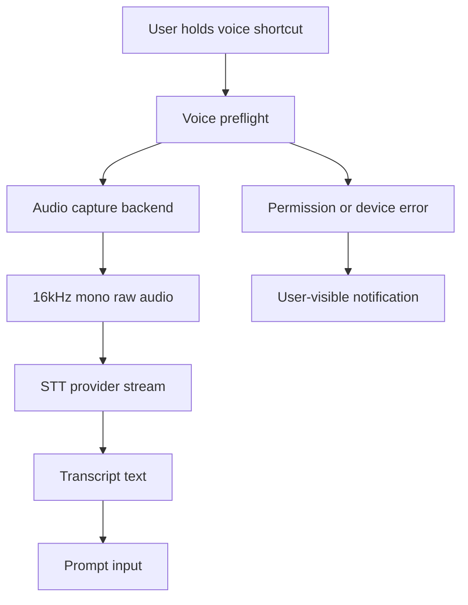
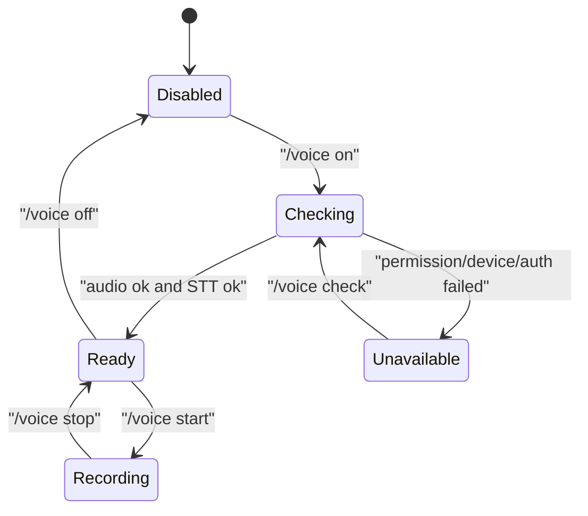
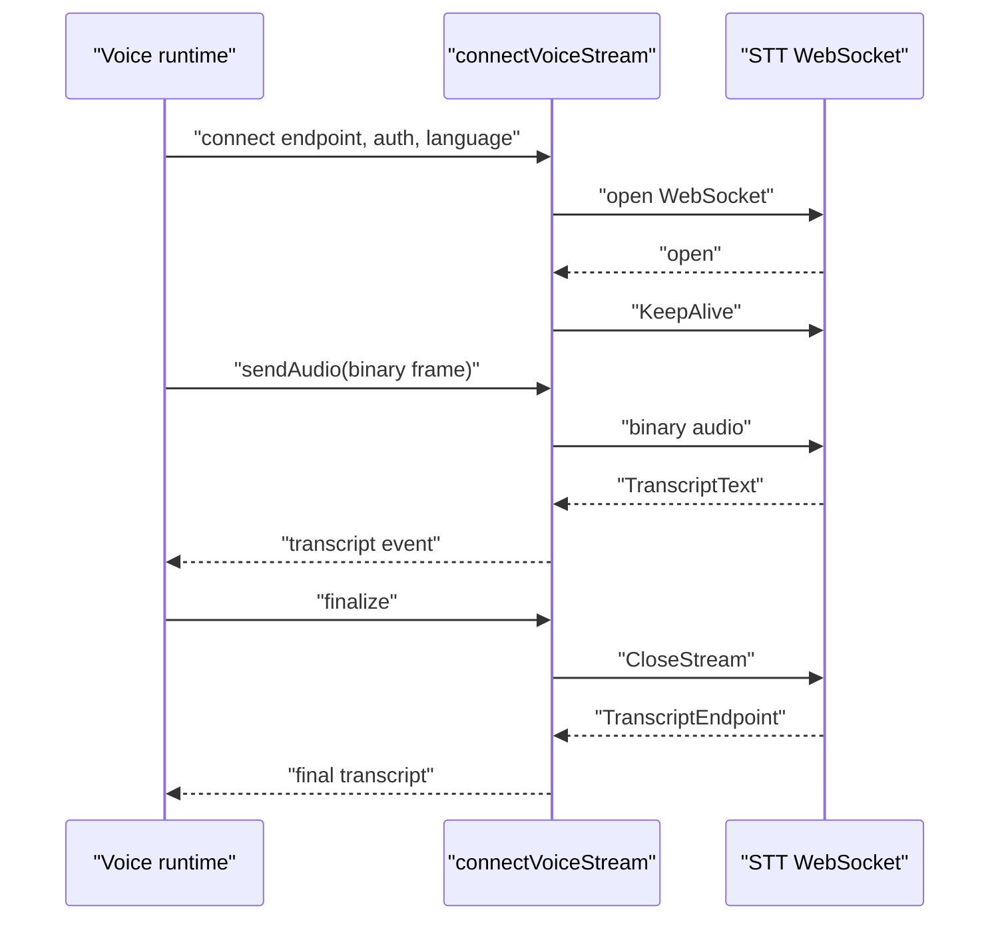
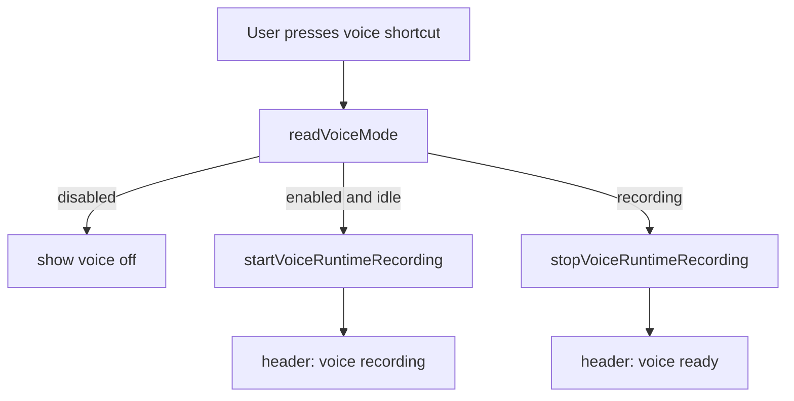
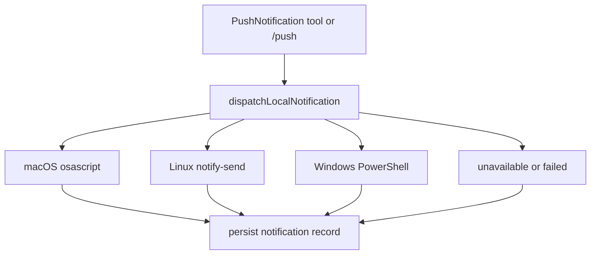
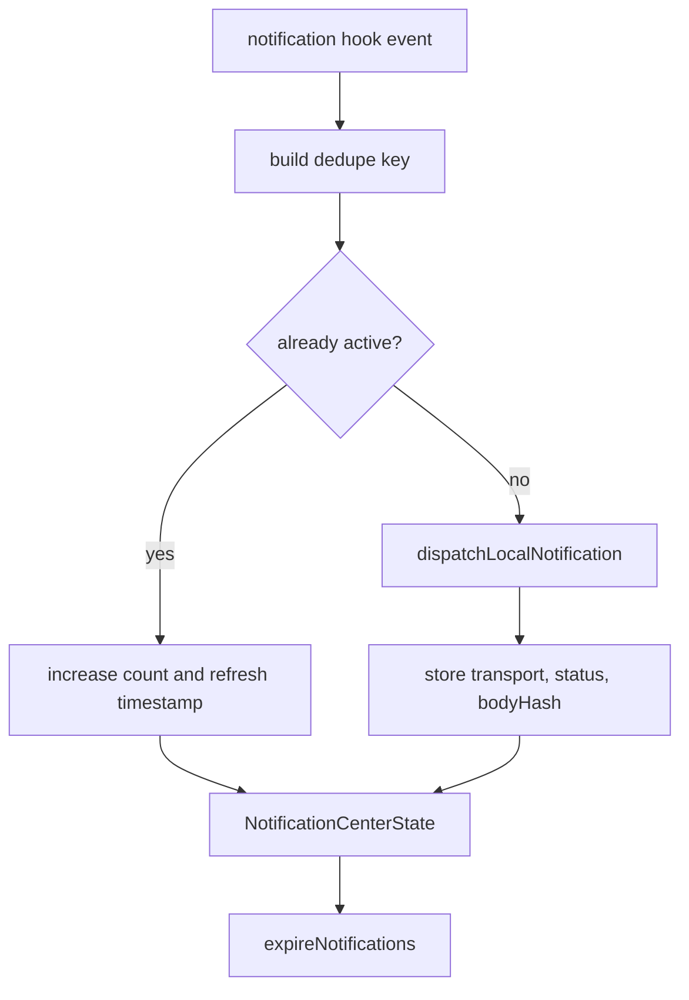

# V1.8 Voice, Audio, Notifications 教程

本文说明如何从 0 到 1 实现 Claude Code 风格的 voice/audio/notification 能力。它不是实现总结，而是解释这些功能为什么要拆成 native audio、voice mode、STT、push-to-talk 和 notification lifecycle 五层。

## 1. 先理解功能边界

Voice mode 不是一个“开关”。用户按住快捷键说话时，系统至少要完成这些事：

1. 检查当前平台是否有录音后端。
2. 检查麦克风权限是否允许。
3. 开始 push-to-talk 录音，把音频写成 provider 能消费的格式。
4. 把音频流交给 STT 服务。
5. 把转写文本放回 prompt 输入框。
6. 把错误显示成用户能理解的提示。
7. 在后台状态变化时，通过 notification 提醒用户。

Mermaid 视角如下：



## 2. Native audio package

Claude Code 的源码有 `audio-capture-napi`。这类包的责任不是“业务逻辑”，而是把 Node/Bun 进程连接到系统音频 API：

- macOS：CoreAudio / AudioUnit。
- Linux：ALSA / PulseAudio backend。
- Windows：系统音频输入。

实现时要把 native addon 加载做成懒加载。原因是 `.node` 的 `dlopen` 可能很慢，启动 CLI 时不应该因为还没用 voice 就卡住。

本仓库的最小实现是 `packages/audio-capture-napi/src/index.ts`：

- 优先加载 `AUDIO_CAPTURE_NODE_PATH`。
- 再找 `vendor/audio-capture/<arch-platform>/audio-capture.node`。
- 开发模式下也会找 `claude-code/vendor/audio-capture/...`，方便源码对照。
- 找不到时返回 `false`，由上层输出明确错误，不崩溃。

## 3. Voice preflight

Voice 开启前不能只写一个 `enabled: true`。必须先检查两类问题：

| 检查项 | 目的 | 失败时怎么处理 |
| --- | --- | --- |
| microphone permission | 判断 OS 是否拒绝麦克风 | 返回系统设置指引 |
| audio backend | 判断 native、arecord、SoX 是否可用 | 返回安装命令或设备错误 |
| STT auth | 判断 provider 是否能转写 | 提示 `/login` 或缺少 env key |
| STT endpoint | 判断使用 Anthropic 还是 Doubao | 写入 provider 状态 |

状态流：



## 4. Push-to-talk recording

Push-to-talk 是一个短生命周期 session：

1. 创建 session id。
2. 创建 `.my-claude-code/voice/<session>.s16le`。
3. 用 native backend 或系统命令写入 raw audio。
4. stop 时关闭 backend，返回文件路径、采样率、声道数、字节数。

这里不要直接把音频内容写进 transcript。原因是音频属于大二进制 payload，transcript 只应该保存引用、hash、状态和错误，避免污染上下文。

本地测试命令：

```bash
bun run cli -- /voice check
bun run cli -- /voice on
bun run cli -- /voice start demo
bun run cli -- /voice stop demo
```

如果机器没有麦克风或没有 STT 凭据，`/voice on` 应该给出 `unavailable`，这是正确行为，不应该伪装 ready。

## 5. STT provider

Claude Code 的 Anthropic voice stream 使用 WebSocket，把控制消息和 binary audio frame 发给服务端。复刻时要把 provider 分成两层：

- 本地录音层：只负责采集音频。
- STT 层：只负责认证、endpoint、协议和转写结果。

当前实现先用 `getVoiceStreamStatus()` 做 preflight，检查：

- Anthropic：`CLAUDE_CODE_OAUTH_TOKEN`、`ANTHROPIC_OAUTH_TOKEN` 或 `ANTHROPIC_API_KEY`。
- Doubao：`DOUBAO_API_KEY`。
- DeepSeek：`DEEPSEEK_API_KEY` 只代表 chat model 可用，不代表 STT 可用。DeepSeek 官方 API 当前没有 speech-to-text/audio transcription endpoint，所以 voice preflight 会返回 `available: false` 和明确原因。
- endpoint：`VOICE_STREAM_BASE_URL` 或 provider 默认地址。

preflight 通过后，`connectVoiceStream()` 负责真实 WebSocket 协议。它的职责不是录音，而是把已经采集好的 raw audio frame 发给 STT provider，并把 provider 返回的转写事件转成本地统一事件：



实现时要注意四个细节：

- `sendAudio()` 只能在 WebSocket open 后发送，避免把音频写进未连接的 socket。
- `finalize()` 要发送 `CloseStream`，然后等待 `TranscriptEndpoint`、socket close 或 timeout。
- 错误事件里不能带 auth token。测试要断言 event payload 不包含 secret。
- 浏览器风格 `globalThis.WebSocket` 不能设置 header；真实带 header 的 Node transport 要通过 `webSocketFactory` 注入，不能把 token 拼进 URL。

这层现在可以通过 fake WebSocket 做无网络测试；有真实凭据时再接真实 provider endpoint。

## 5.1 TUI voice indicator

Claude Code 的 voice 不只是 slash command。用户在 TUI 中需要知道当前是否可录音、是否正在录音、用的是哪个 provider。因此 TUI 至少要接三处：

- header status：展示 `voice ready:<provider>`、`voice recording:<provider>` 或 `voice off`。
- prompt footer：展示 voice shortcut 提示。
- shortcut handler：触发 `VoiceRecordingStart` / `VoiceRecordingStop`，并刷新 voice mode。



注意：TUI 不应该在 header/footer 自己重新实现 voice 规则。它只读 `tools` 层暴露的 voice runtime 状态，否则 CLI 和 TUI 会出现状态不一致。

## 6. Notifications

Notification 不能只写 JSON queue。Claude Code 的通知 hook 是用户可见行为，例如 rate limit、plugin install、LSP error、teammate shutdown。最低要求是：

- 尝试走系统 notification transport。
- transport 不可用时返回 `unavailable`，而不是静默成功。
- 持久化时不保存 secret。
- body 可以保存给本地 UI，但跨边界记录要保存 hash。

当前实现的 dispatch：



`emitNotificationHook()` 在 dispatch 外再补一层 lifecycle。它解决的是 “同一类通知不断刷屏” 和 “过期通知还留在 UI” 两个问题：



V1.8 覆盖的 upstream hook 类型包括 startup、settings errors、MCP connectivity、plugin install/autoupdate、rate limit、model migration、npm deprecation、update、teammate shutdown、IDE/LSP initialization、fast mode、subscription switch、Chrome extension 和 official marketplace recommendation。

本地测试命令：

```bash
bun run cli -- /push send Build -- Checks passed
bun run cli -- /push list
MY_CLAUDE_CODE_DISABLE_OS_NOTIFICATIONS=1 bun run cli -- /push send Test -- No popup
```

## 7. Strict gate

V1.8 新增专项 gate：

```bash
bun run cli -- /parity --strict --voice
```

它检查：

- `audio-capture-napi` package surface。
- voice runtime service。
- STT WebSocket stream adapter。
- `/voice` command surface。
- TUI voice shortcut 和 footer/header indicator。
- notification dispatch runtime。
- notification hook lifecycle。
- voice 相关测试存在。

这类 gate 的意义是防止以后把 `enabled: true` 或 `queued: true` 当成 voice/audio parity。

## 8. 本地验收顺序

推荐按这个顺序验收：

```bash
bun test packages/tools/src/services/voice/stream.test.ts packages/tools/src/services/notifications.test.ts packages/tui/src/components/StatusLine.test.ts packages/tools/src/ecosystem.test.ts packages/tools/src/workflows.test.ts packages/commands/src/slashCommands.test.ts packages/cli/src/program.test.ts
bun run typecheck
bun run cli -- /parity --strict --voice
```

有真实麦克风和凭据时，再额外测：

```bash
bun run cli -- /voice check
bun run cli -- /voice on deepseek
bun run cli -- /voice on anthropic
bun run cli -- /voice start manual
bun run cli -- /voice stop manual
```

## 9. 常见坑

- 不要在 CLI 启动时加载 native addon。要在首次 voice check 或 recording 时加载。
- 不要把没有麦克风当成测试失败。正确行为是明确返回 unavailable。
- 不要把 STT auth token 写进状态文件、transcript 或日志。
- 不要把 notification dispatch 失败吞掉。用户需要知道系统通知不可用。
- 不要让测试弹出系统通知。测试里设置 `MY_CLAUDE_CODE_DISABLE_OS_NOTIFICATIONS=1`。
