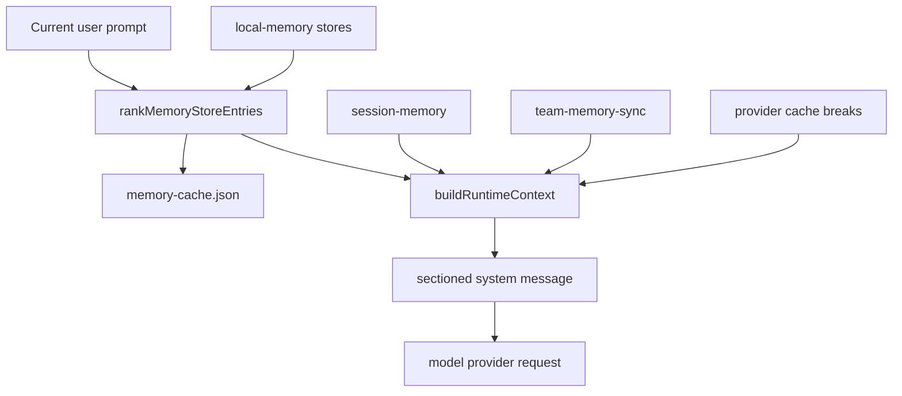
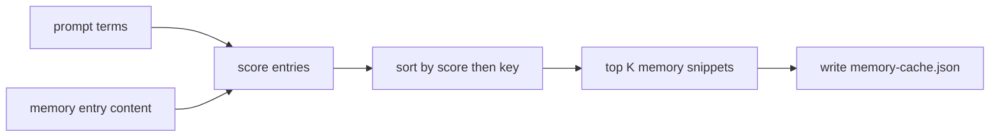
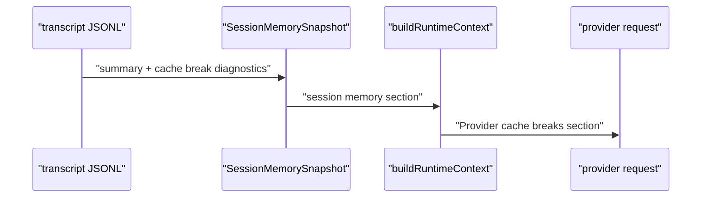

# V1.9 Memory, Context, Vault, Team 教程

本文说明如何从 0 到 1 实现 Claude Code 风格的高级记忆和上下文系统。V0.5 已经有 `CLAUDE.md`、compact 和基础 runtime context；V1.9 解决的是更完整的问题：长期 memory 怎么排名，session memory 怎么恢复，team memory 怎么同步，vault secret 怎么安全用于工具，provider cache break 怎么进入上下文诊断。

## 1. 先区分四类信息

Memory 系统容易混乱，因为很多东西都叫“上下文”。实现前先分清：

| 名称 | 存在哪里 | 作用 |
| --- | --- | --- |
| project memory | `CLAUDE.md`、`.my-claude-code/memory.md` | 项目长期规则 |
| local memory store | `.my-claude-code/local-memory/<store>/<key>.md` | 跨 session 的事实和偏好 |
| session memory | `.my-claude-code/session-memory/<session>.json` | 某个 session 的压缩摘要 |
| team memory | `.my-claude-code/local-memory/team/<team>.md` | 多 agent 协作状态 |

核心原则：runtime context 是“这次发给 provider 的短上下文”；本地文件才是可恢复的事实来源。

## 2. 数据流



V1.9 的关键不是把所有文件都塞进模型，而是做一个可解释的 ranking/cache，然后只把当前 prompt 相关的片段注入 provider request。

## 3. Local memory store

Local memory 目录结构：

```text
.my-claude-code/local-memory/
  work/
    billing-migration.md
  agents/
    Explore-Agent.md
  sessions/
    session_123.md
  team/
    parity.md
```

每条 memory 都是普通 Markdown。实现时不要把 raw memory 当成可信指令，注入 provider 前要保留来源和边界，例如：

```text
work/billing-migration score=24 matches=billing,migration
source: text
createdAt: 2026-05-24T00:00:00.000Z

Billing migrations must stay reversible.
```

## 4. Ranking 和 cache

最小可用 ranking 需要三部分：

- 从 prompt 提取关键词。
- 扫描 store entry 的 content hash、mtime、长度。
- 按 match、长度、稳定 key 排序，并写入 `memory-cache.json`。



Cache 的意义不是替代源文件，而是让 `/context`、TUI 和诊断可以解释“为什么这条 memory 被选中”。

## 5. Extract memories

Extract memories 是把 transcript 或用户明确给出的文本变成长期 memory。实现时要保守：

- 只从明确文本里抽取。
- 忽略太短的行和代码块。
- 写入 `.my-claude-code/local-memory/<store>/...`。
- 不做隐藏后台写入。

本地命令：

```bash
bun run cli -- /memory extract "Billing migrations must stay reversible."
bun run cli -- /memory rank billing migration
```

## 6. Session memory 和 provider cache break

Session memory 保存的是“这个 session 以后恢复时有用的摘要”。Provider cache break 保存的是“为什么 prompt cache 断了”。



实现重点：cache break 不是错误，它是诊断信号。它应该进入 `/context` 和 strict gate，帮助判断 resume/compact 后 provider cache 是否仍可复用。

## 7. Team memory

Team memory 来自 team events 和 mailbox，不等于把所有 team 文件完整塞给模型。V1.9 的默认策略是同步一个 compact team memory 文件：

```bash
bun run cli -- /memory sync-team parity
```

它会写入：

```text
.my-claude-code/local-memory/team/parity.md
.my-claude-code/team-memory-sync.json
```

然后 `buildRuntimeContext()` 读 `team-memory-sync.json`，把 team name、memory path、event count 注入 `Team context` section。

## 8. Vault

Vault 的边界很严格：命令可以列出 key name，但不能打印 secret value。工具真正需要 secret 时，通过 `VaultHttpFetch` 从环境变量读取：

```bash
export MY_CLAUDE_CODE_VAULT_GITHUB_TOKEN=...
bun run cli -- /vault list
```

`/vault list` 只显示 `github-token` 这种 key name。真实请求由 `VaultHttpFetch` 执行，输出会 scrub `Authorization`、`X-Api-Key`、cookie、secret 本体和 base64 派生值。

## 9. Strict gate

V1.9 专项 gate：

```bash
bun run cli -- /parity --strict --memory
```

它检查：

- memory runtime 文件和关键 symbol。
- `/memory`、`/vault`、`/local-vault`、`--memory` command surface。
- `MemoryRank`、`ExtractMemories`、`AgentMemorySnapshot`、`SessionMemorySnapshot`、`TeamMemorySync`、`VaultHttpFetch`、`Team*` tools。
- memory/context/session/command 测试文件。

## 10. 本地验收

推荐顺序：

```bash
bun test packages/tools/src/services/memory.test.ts packages/agent-runtime/src/context.test.ts packages/tools/src/runner.test.ts packages/commands/src/slashCommands.test.ts packages/session/src/sessionStore.test.ts
bun run typecheck
bun run lint
bun run build
bun run cli -- /parity --strict --memory
```

功能 smoke：

```bash
bun run cli -- /memory extract "Billing migrations must stay reversible."
bun run cli -- /memory rank billing migration
bun run cli -- /memory sync-team parity
bun run cli -- /vault list
```

## 11. 常见坑

- 不要只读 `CLAUDE.md`，V1.9 必须覆盖 local memory、session memory 和 team memory。
- 不要用隐藏后台写入制造“智能记忆”。默认只处理显式输入或明确 runtime record。
- 不要把 vault secret 写进 JSON、transcript、memory 或测试快照。
- 不要把 compact 当成删除历史。Transcript、session memory 和 provider request 是三个不同层级。
- 不要让 cache break 沉默。它要进入 `/context` 和 strict gate，可诊断才可恢复。
