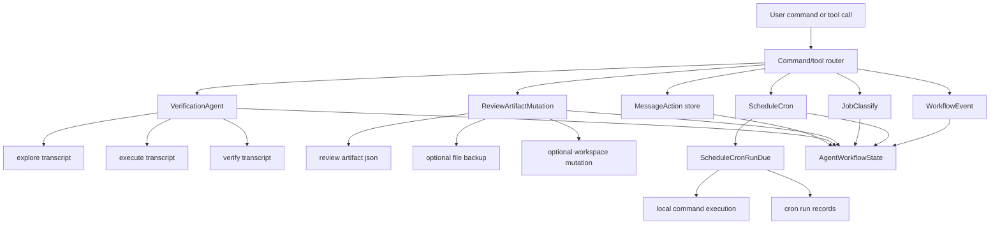
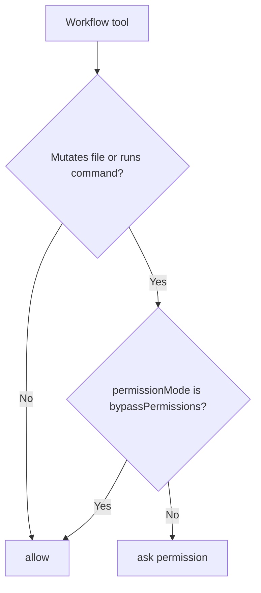

# 从 0 到 1 实现 Claude Code：V2.0 Agent Workflow、Review 和 Automation

## 这一章解决什么问题

前面的版本已经有工具、TUI、remote、memory 和平台集成。V2.0 解决的是更高一层的问题：当用户不是问一个单轮问题，而是让 agent 持续推进任务、验证计划、回看历史、做 review、订阅 PR、调度后续检查时，系统应该把这些行为变成可恢复、可审计、可权限控制的 workflow runtime。

这不是“把一段文字保存成 plan”。一个可用的 workflow runtime 至少要有：

- 用户可见动作：message retry、edit、delete、pin、rate。
- agent 工作流：verification agent、coordinator worker、task、monitor、brief。
- review 工作流：review artifact、security review、issue、PR comments、autofix PR mutation。
- automation：cron schedule、proactive tick、background PR suggestion、PR subscription。
- diagnostics：thinkback、bughunter、perf issue、heapdump、ant trace、context visualization。

## 先理解核心概念

### Message action

Message action 是用户对某条历史消息做的操作。比如“重试这条回答”“编辑这条用户输入”“删除这条消息”“固定这条结论”。它不是普通聊天内容，而是对 transcript 的元操作。

实现时不要直接改掉原始 transcript。更稳的方式是追加一条 action record：

```json
{
  "messageId": "msg_1",
  "action": "retry",
  "reason": "provider timeout",
  "createdAt": "..."
}
```

这样后续恢复 session 时，可以先加载原始 transcript，再按 action record 生成当前视图。

### Verification agent

Verification agent 是专门检查“计划是否真的完成”的子流程。它通常不是继续写代码，而是做三件事：

1. 探索证据：有哪些文件、测试、命令可以证明任务完成。
2. 执行检查：运行或复核测试、lint、typecheck、build。
3. 给出结论：完成、未完成、需要人工确认。

V2.0 的本地实现会为每个 verification run 生成三个 worker transcript，方便后续恢复和审计。

### Review artifact

Review artifact 是可被注释的对象。它可能是代码片段、diff、PR 内容、设计文档、日志，也可能是 security review 的发现。它需要支持：

- annotations：行级或整体注释。
- summary：总体结论。
- mutation：如果允许，可以把 replacement 写回目标文件。
- backup：发生 mutation 前保留原内容。

### Scheduler

Scheduler 负责把“稍后做”变成可执行状态。它不是聊天队列，而是有明确 trigger 的记录：

```json
{
  "name": "nightly",
  "cron": "*/5 * * * *",
  "command": "bun",
  "args": ["run", "test"],
  "nextRunAt": "..."
}
```

V2.0 提供 `ScheduleCron` 和 `ScheduleCronRunDue`，一个负责登记计划，一个负责执行到期计划。

## 数据流



## 文件布局

V2.0 的状态统一放在当前工作区：

```text
.my-claude-code/agent-workflows/
  message-actions.json
  verification-agents.json
  verification/<run-id>/<phase>.json
  review-artifacts.json
  review-artifacts/<artifact-id>.json
  job-classifications.json
  cron-schedules.json
  cron-runs.json
  events.json
  events/<event-id>.json
```

这样做有两个好处：

- 所有 workflow 副作用都在 workspace 内，可删除、可 review、可恢复。
- secret 不会混入 workflow state；需要记录输入时只保存 hash 或结构化元数据。

## 实现步骤

### Step 1：实现 service 层

service 层不要知道 TUI，也不要知道 provider。它只处理状态和副作用：

- `recordMessageAction`
- `runVerificationAgent`
- `recordReviewArtifactMutation`
- `classifyWorkflowJob`
- `scheduleCronWorkflow`
- `runDueCronWorkflows`
- `recordWorkflowEvent`
- `readAgentWorkflowState`

这层的关键是显式副作用。例如 review mutation 写文件时必须：

1. 校验目标路径在 workspace 内。
2. 写 backup。
3. 再写 replacement。
4. 在 record 里保存 `mutationApplied` 和 `backupPath`。

### Step 2：实现 tool 层

tool 层把 service 暴露给 agent loop，并负责权限：

- `MessageAction`
- `VerificationAgent`
- `ReviewArtifactMutation`
- `JobClassify`
- `ScheduleCron`
- `ScheduleCronRunDue`
- `ScheduleCronList`
- `WorkflowEvent`
- `AgentWorkflowState`

会写文件或执行命令的工具必须在 `default` 权限下 ask，在 `bypassPermissions` 下 allow。

### Step 3：接入 command 层

V2.0 需要用户能直接从 slash command 验证：

```bash
run /message-action msg_1 pin useful
run /job review this PR
run /review inspect current diff
run /schedule add nightly
run /schedule run
```

同时，原来只是 V1.3 surface 的命令要变成真实 local runtime event：

- `/review`
- `/security-review`
- `/issue`
- `/pr-comments`
- `/think-back`
- `/thinkback-play`
- `/bughunter`
- `/good-claude`
- `/perf-issue`
- `/release-notes`
- `/tag`
- `/share`
- `/stickers`
- `/feedback`
- `/ant-trace`
- `/heapdump`
- `/ctx_viz`
- `/debug-tool-call`

## 权限边界

V2.0 的权限策略可以用这张图理解：



不要让 review mutation、cron run、background process 在默认权限下静默执行。

## 本地验证

```bash
bun test packages/tools/src/services/agentWorkflows.test.ts
bun test packages/tools/src/runner.test.ts packages/commands/src/slashCommands.test.ts
bun run cli -- /parity --strict --agent-workflows
```

手动命令：

```bash
bun run cli -- /message-action msg_1 pin useful
bun run cli -- /job review this PR
bun run cli -- /review inspect current diff
bun run cli -- /schedule add nightly
bun run cli -- /schedule run
```

## 常见误区

### 误区 1：verification agent 只是一个 summary

不够。必须有 worker phase、transcript path 和可恢复记录，否则后续无法解释“为什么说已经验证”。

### 误区 2：review artifact 只返回 JSON

不够。review 结果需要持久化，并且 mutation 必须有 backup。

### 误区 3：cron schedule 只是 proactive prompt

不够。schedule 需要独立记录 trigger、next run、command、args 和 run result。

### 误区 4：诊断命令只打印 placeholder

不够。`bughunter`、`ant-trace`、`ctx_viz` 这类命令至少要落到 workflow event store，形成可审计 artifact。
