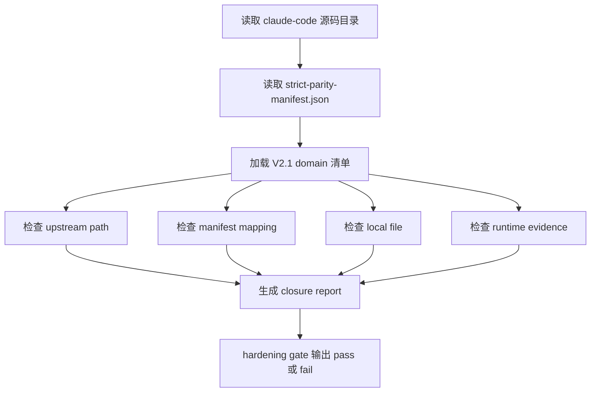
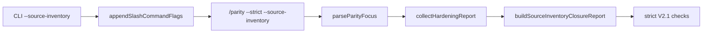

# V2.1 Source Inventory Closure

V2.1 的目标是把“源码对照”变成可执行的验收，而不是靠人工读文档判断。完成后，`/parity --strict --source-inventory` 会逐项确认 Claude Code 源码里的支撑层、服务层、native 包和可复用测试 fixture 都有本地落点。

## 要先理解的概念

**source inventory** 是 Claude Code 源码清单。比如 `claude-code/src/services/langfuse/`、`claude-code/src/keybindings/`、`claude-code/packages/audio-capture-napi` 都是 inventory item。

**manifest mapping** 是映射表。它写在 `docs/strict-parity-manifest.json`，说明“上游这个源码项由本仓库哪个文件承接”。例如：

```json
{
  "sourceMappings": {
    "claude-code/src/services/langfuse/": "packages/core/src/observability.ts"
  }
}
```

**runtime evidence** 是本地实现文件里必须存在的关键符号。只写映射不够，因为映射可能指向一个无关文件。V2.1 会继续检查文件内容，比如 `packages/core/src/observability.ts` 必须包含 `buildObservabilityEvents`、`redactAttributes` 等符号。

**closure** 表示一个源码域同时满足四件事：上游路径存在、manifest 有映射、本地文件存在、本地文件有关键实现证据。

## 整体流程



## 为什么不能只靠旧的 strict source inventory

旧 gate 的职责是确认 `claude-code/src` 的每个 item 至少有映射，适合发现“完全没登记”的缺口。

V2.1 解决的是更细的问题：

- 映射是否指向真正承担该能力的本地文件；
- 服务类源码是否有可运行实现，而不是只被父目录兜住；
- native 包是否有对应 package mapping 和本地 smoke 入口；
- 上游测试 fixture 是否被转成本地 parity test。

所以 V2.1 新增了 `packages/core/src/sourceInventory.ts`，把这些要求写成 domain。

## Domain 如何设计

每个 domain 包含四类字段：

```ts
type SourceInventoryDomain = {
  id: string
  category: 'support' | 'service' | 'native' | 'fixture'
  upstreamPath: string
  localPath: string
  evidence: string[]
  packageName?: string
}
```

字段含义：

`id` 是稳定名称，用于报错。

`category` 是验收分类。V2.1 当前分成 support、service、native、fixture。

`upstreamPath` 是 Claude Code 源码路径。

`localPath` 是本仓库的实现文件。

`evidence` 是实现证据，通常是函数名、类型名、常量名或测试名。

`packageName` 只用于 native 包，用来同时校验 `packageMappings`。

## 四类 Inventory

### Support

Support 覆盖基础支撑源码：

- constants、types、schemas；
- bootstrap、setup；
- project onboarding；
- dialog launcher、interactive helper、REPL launcher；
- migrations、output styles、keybindings、utils。

这些文件通常不是一个独立用户功能，但会影响 CLI/TUI 如何启动、如何解析协议、如何处理设置和按键。

### Service

Service 覆盖 runtime 服务：

- analytics；
- diagnostic tracking；
- internal logging；
- langfuse；
- Perfetto tracing；
- tool execution service。

这些服务不能只在 manifest 里用 `claude-code/src/services/` 父目录兜底。V2.1 要求它们有显式 domain，因为它们会影响观测、隐私脱敏、tool hook、trace 和调试能力。

### Native

Native 覆盖上游 native package surface：

- audio capture；
- color diff；
- image processing；
- keyboard modifiers；
- URL handler。

本仓库不需要把所有能力都拆成同名 package，但必须有真实本地落点。例如 `audio-capture-napi` 落到 `packages/audio-capture-napi/src/index.ts`，并提供 native module candidate path、recording、playback、permission status 等入口。

### Fixture

Fixture 覆盖上游可复用测试：

- tool execution；
- command bridge safety；
- context baseline；
- prompt submit；
- history；
- provider boundary；
- tools。

这些 fixture 的作用是防止“源码映射 pass，但行为没测”。V2.1 把它们映射到本地测试文件，例如 `claude-code/src/__tests__/Tool.test.ts` 对应 `packages/tools/src/runner.test.ts`。

## Gate 接入方式

`/parity --strict --source-inventory` 的路径如下：



实现文件：

- `packages/cli/src/program.ts`：声明 `--source-inventory`，并透传给 `/parity`。
- `packages/commands/src/slashCommands.ts`：把 flag 解析成 focus。
- `packages/commands/src/hardening.ts`：按 focus 追加 V2.1 gate。
- `packages/core/src/sourceInventory.ts`：生成 closure report。

## 报错如何读

失败详情类似：

```text
3 inventory domain(s) incomplete: analytics(manifest), audio-capture-napi(local), tool-test(evidence:runTools)
```

含义：

`manifest` 表示 `docs/strict-parity-manifest.json` 缺映射，或映射目标不符合 domain。

`local` 表示本地实现文件不存在。

`upstream` 表示 `claude-code/` 中对应源码路径不存在，通常是源码目录不完整。

`evidence:xxx` 表示本地文件存在，但缺少关键实现符号。

## 从 0 到 1 实现步骤

1. 列出上游目录。

```bash
rg --files claude-code/src claude-code/packages
```

2. 把不属于已完成版本的源码项分组。

优先分为 support、service、native、fixture。不要把 service 全部合并成一个父目录，否则后续无法定位具体缺口。

3. 在 `docs/strict-parity-manifest.json` 增加映射。

如果一个上游目录有明确服务语义，优先写显式映射：

```json
{
  "sourceMappings": {
    "claude-code/src/services/tools/": "packages/tools/src/runner.ts"
  }
}
```

4. 在 `packages/core/src/sourceInventory.ts` 增加 domain。

```ts
{
  id: 'tool-execution-service',
  category: 'service',
  upstreamPath: 'claude-code/src/services/tools/',
  localPath: 'packages/tools/src/runner.ts',
  evidence: ['runToolUse', 'runPostToolUseHooks']
}
```

5. 跑专项 gate。

```bash
bun run cli -- /parity --strict --source-inventory
```

6. 补测试。

至少覆盖：

- 当前 workspace 全部 domain pass；
- 可以按 category 列出 domain；
- 缺失 workspace 会返回 fail result；
- slash command 能输出 V2.1 gate。

## 本地验证命令

```bash
bun test packages/core/src/sourceInventory.test.ts packages/commands/src/slashCommands.test.ts
bun run cli -- /parity --strict --source-inventory
bun run typecheck
bun run build
bun run test
```
